# AWS 基础概念图解

这篇笔记专门放“理解型图片”。它不是服务大全，而是把 AWS 里最容易绕的关系画出来：谁包含谁，谁调用谁，谁负责入口、网络、计算、数据、安全、日志和成本。

使用方法：

- 先看“按问题找图”，遇到概念卡住时直接跳到对应图。
- 如果只想快速建立整体感觉，按本文顺序看。
- 图片文件都在 `assets/` 下；文件名历史上按生成顺序编号，不强求和本文章节号一致。

## 按问题找图

| 我卡住的问题 | 先看 |
| --- | --- |
| AWS 整体到底有哪些层 | 1. AWS 基础大地图 |
| Account、Region、AZ、VPC、Subnet 是什么关系 | 2. 资源空间层级 |
| 一个公司为什么要多个 AWS 账号 | 3. 多账号治理 |
| Public subnet / private subnet / NAT 是什么 | 4. VPC 公有和私有子网 |
| Route 53、CloudFront、Cloudflare 怎么分工 | 6、7 |
| HTTPS 证书放在哪里 | 8. ACM、HTTPS、证书 |
| 一次 Web 请求怎么进 AWS | 9、10 |
| 租 EC2 到底租了什么 | 11. EC2 组成 |
| EC2、ECS、Fargate 怎么选 | 12、13、14 |
| git push 后网站怎么自动更新 | 15A. TopicFollow 自动部署 |
| 新 topic 怎么从 subagent 写入 RDS | 15B. TopicFollow topic 写库 |
| hero 图片怎么上传 S3 并更新数据库 | 15C. TopicFollow hero 图片 |
| Lambda、SQS、SNS、EventBridge、Step Functions 怎么分 | 16、17 |
| S3、EBS、EFS、RDS、DynamoDB、ElastiCache 怎么分 | 17、19、20、21 |
| 数据湖到底是什么 | 22、23 |
| IAM、Security Group、KMS、Secrets 怎么分 | 24、25 |
| Cognito、IAM、IAM Identity Center 怎么分 | 26 |
| WAF、Shield、GuardDuty、Inspector、Security Hub 怎么分 | 28 |
| CloudWatch、CloudTrail、Config 怎么分 | 29 |
| AWS 钱花在哪里 | 30 |
| 备份、灾备、RTO/RPO 是什么 | 31 |
| Bedrock、SageMaker、Amazon Q 怎么分 | 32 |

## 一、总览和账号

### 1. AWS 基础大地图

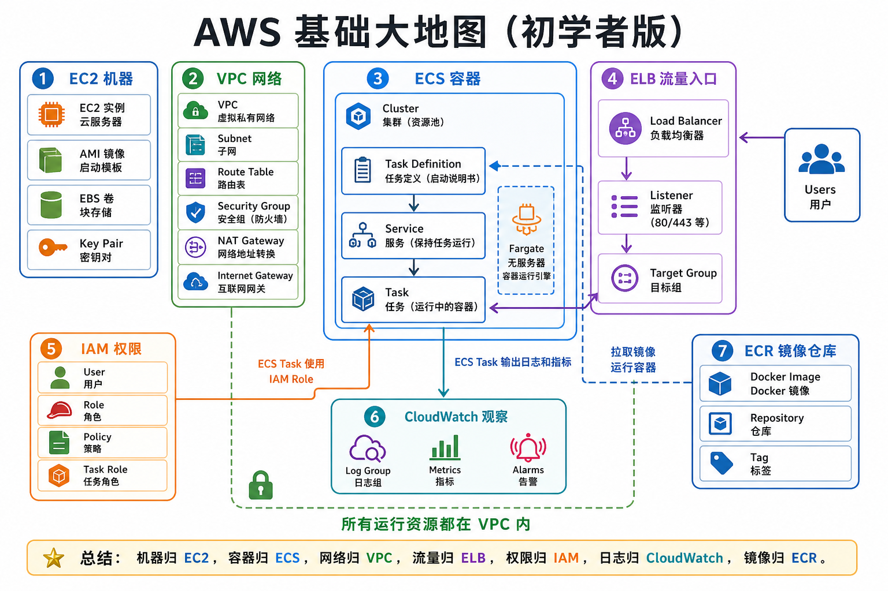

核心理解：

- `EC2` 管机器和算力。
- `ECS` 管容器怎么运行。
- `VPC` 管网络边界、子网、路由和安全组。
- `ELB/ALB` 管用户流量怎么进入后端。
- `IAM` 管谁能访问哪些 AWS 资源。
- `CloudWatch` 管日志、指标和告警。
- `ECR` 管 Docker/container image 镜像。

容易混的点：

- AWS Console 里很多入口放在 EC2 菜单下，但它们不一定属于“EC2 机器本身”。
- `Security Group`、`Target Group`、`Log Group` 都叫 group，但分别属于网络防火墙、负载均衡、日志。

### 2. AWS 资源的空间层级

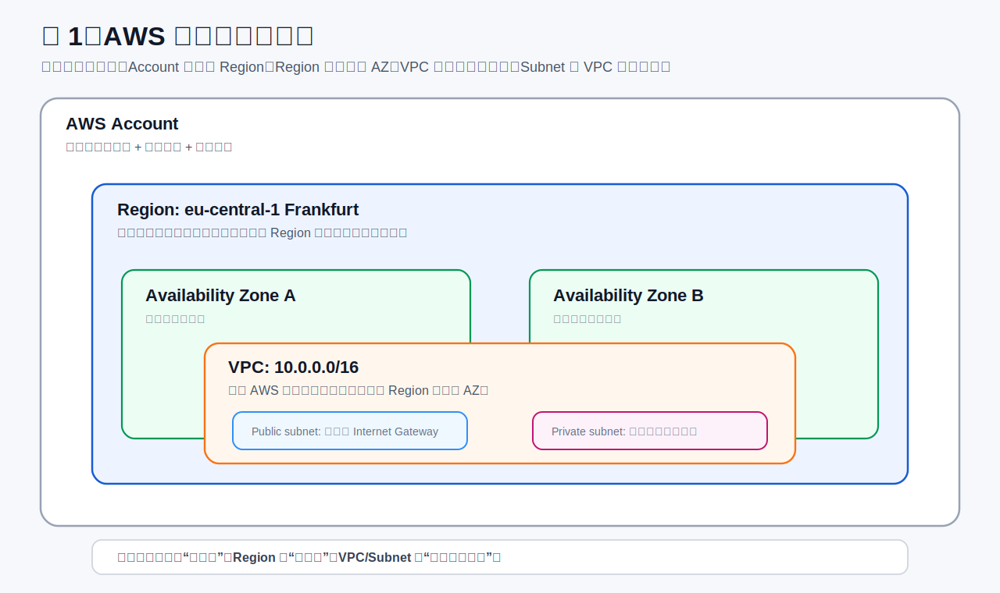

核心理解：

- `AWS Account` 是权限和账单的容器。
- `Region` 是资源所在的大地理区域，例如 Frankfurt。
- `Availability Zone` 是同一个 Region 里的独立机房组。
- `VPC` 是你自己的私有网络。
- `Subnet` 是 VPC 里更小的网段，通常分 public/private。

容易混的点：

- VPC 不是服务器，VPC 是网络边界。
- Subnet 不是单台机器，Subnet 是一段 IP 地址空间。
- Region 选错时，经常会出现“我明明创建了，怎么找不到”的错觉。

### 3. 多账号治理，Organizations、SSO、Control Tower

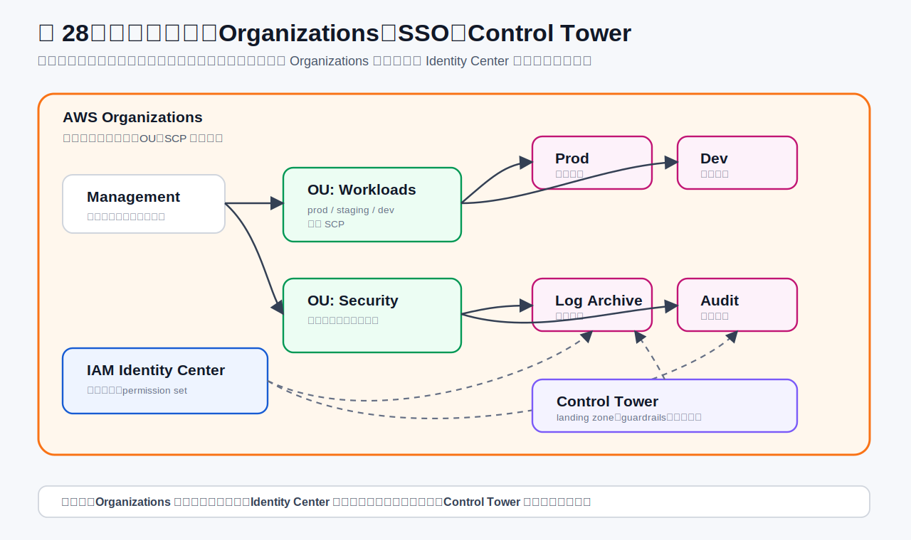

核心理解：

- `AWS Organizations` 管多账号结构、统一账单、OU 和 SCP。
- `IAM Identity Center` 管用户、组、permission set，让人进入不同账号。
- `Control Tower` 帮企业快速搭 landing zone、guardrails 和账号工厂。
- 生产环境通常会拆出 dev、staging、prod、security、log archive 等账号。

容易混的点：

- IAM Identity Center 管“人怎么进账号”，Organizations 管“账号怎么组织和限制”。
- Control Tower 不是必学第一天服务，但理解它有助于看懂企业 AWS 架构。

## 二、网络、域名和入口

### 4. VPC 里的公有子网和私有子网

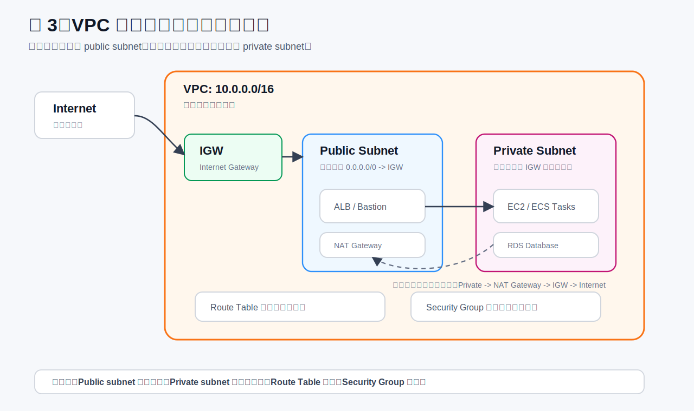

补充图：

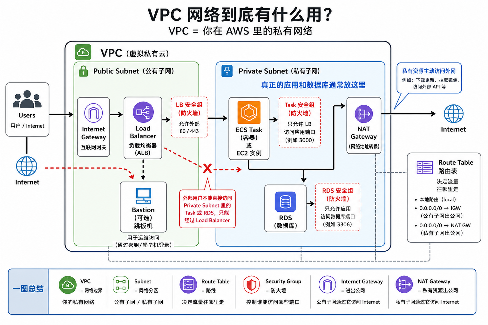

核心理解：

- `Public subnet` 通常放公网入口，例如 ALB、Bastion、NAT Gateway。
- `Private subnet` 通常放应用服务和数据库。
- `Internet Gateway` 让 VPC 连接公网。
- `NAT Gateway` 让私有子网里的资源“主动出网”，但不让公网直接进来。
- `Route Table` 决定流量走哪里。
- `Security Group` 决定哪些端口能进出。

容易混的点：

- Public/private 不是看资源名字，而是看 route table 有没有通向 Internet Gateway 的默认路由。
- Security Group 管端口，Route Table 管路线。

### 5. VPC Endpoint、PrivateLink、NAT Gateway

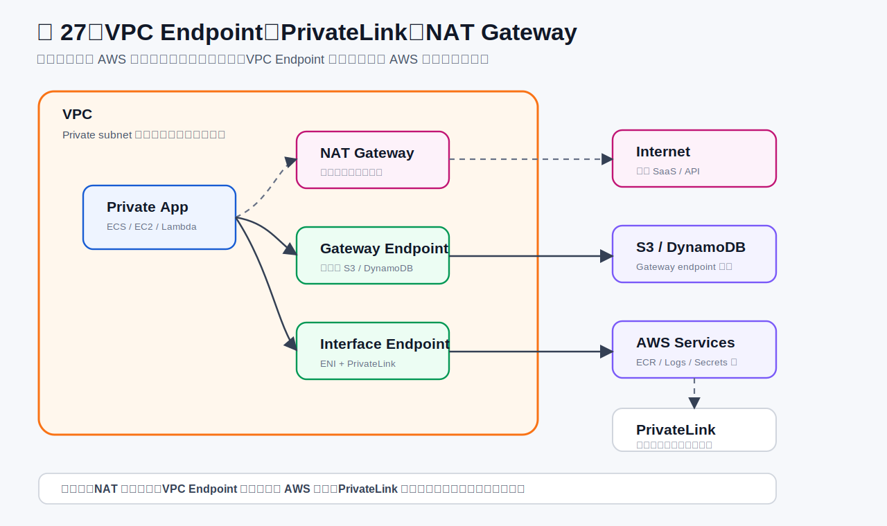

核心理解：

- `NAT Gateway` 让私有子网里的资源主动访问公网。
- `Gateway Endpoint` 常用于私有访问 S3 和 DynamoDB。
- `Interface Endpoint` 通过 VPC 里的网卡访问 AWS 服务。
- `PrivateLink` 是 Interface Endpoint 背后的私有连接能力，也可以把自己的服务私有暴露给别的 VPC/账号。

容易混的点：

- NAT 是“出公网”，VPC Endpoint 是“私有访问 AWS 服务”。
- 私有子网访问 ECR、CloudWatch、Secrets Manager 等服务时，经常会碰到是否需要 Interface Endpoint 的问题。

### 6. Route 53、CloudFront、Cloudflare 分层对比

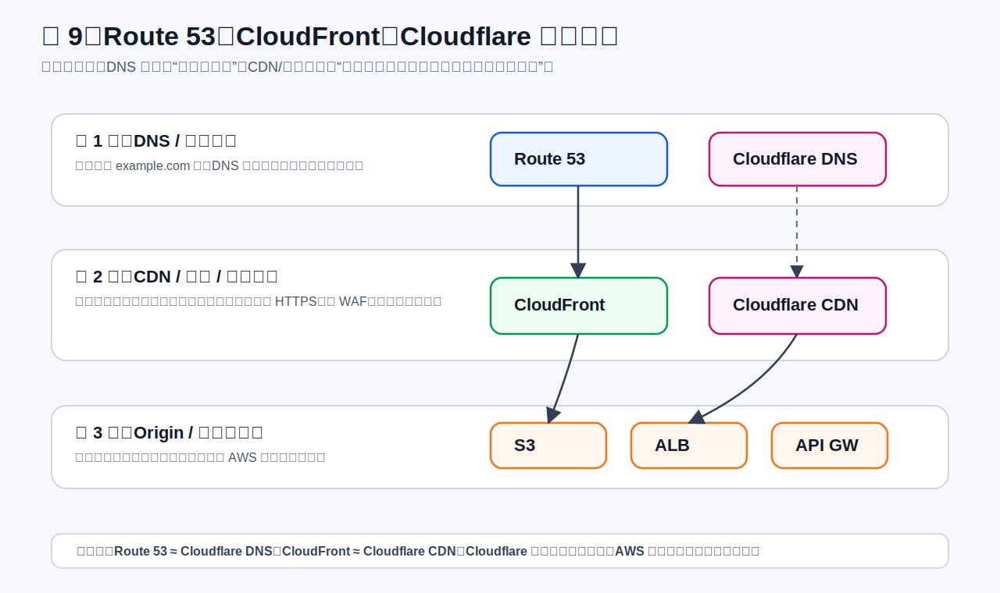

核心理解：

- `Route 53` 主要是 DNS，回答“这个域名应该去哪里”。
- `CloudFront` 是 AWS 的 CDN，负责缓存、全球加速、HTTPS 边缘入口。
- `Cloudflare` 是一整套边缘平台，里面既有 DNS，也有 CDN、WAF、DDoS 防护、Workers 等能力。
- 所以不能简单说 Route 53 等于 Cloudflare，只能说 Route 53 大致对应 Cloudflare 的 DNS 部分。

容易混的点：

- DNS 解析不是内容缓存。
- CDN 不是你的后端应用。
- AWS 里这些能力通常拆成多个服务；Cloudflare 更像把它们打包成一个统一入口。

### 7. 自己的域名接到 AWS 的几种入口

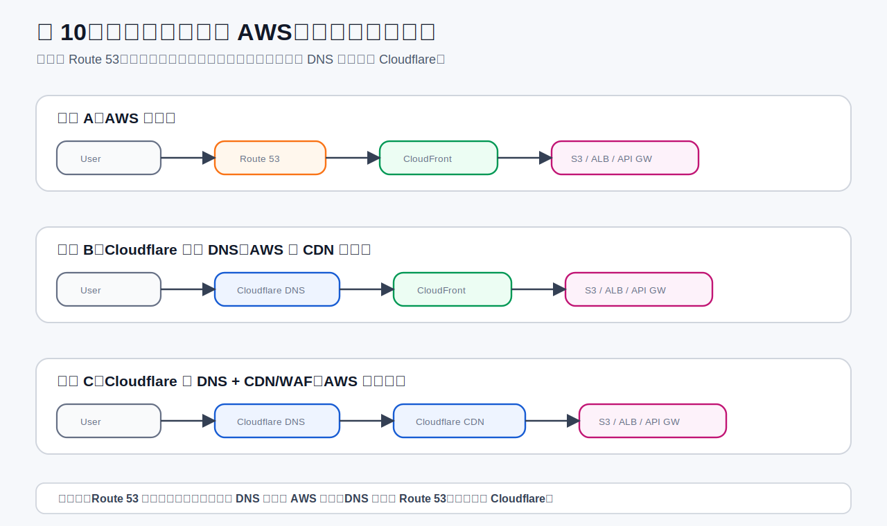

核心理解：

- 如果用 AWS 全家桶，常见链路是 `Route 53 -> CloudFront -> S3/ALB/API Gateway`。
- 如果域名已经放在 Cloudflare，可以用 `Cloudflare DNS -> CloudFront -> AWS origin`。
- 也可以让 Cloudflare 同时做 DNS 和 CDN，然后回源到 AWS 的 ALB、S3 或 API Gateway。

容易混的点：

- Route 53 不是必须用；关键是你的 DNS 记录最后能指到正确入口。
- CloudFront 也不是必须用；只有需要缓存、全球加速、统一 HTTPS 边缘入口时才明显有用。

### 8. ACM、HTTPS、证书放在哪里


核心理解：

- `ACM` 管 SSL/TLS 证书的申请、验证和续期。
- 证书通常挂在 `CloudFront`、`ALB`、`API Gateway` 这类入口服务上。
- `Route 53` 或 Cloudflare 这类 DNS 服务常用于 DNS validation。
- 源站是 S3、ECS、EC2、Lambda 等真正提供内容或 API 的地方。

容易混的点：

- HTTPS 证书通常不放在应用代码里。
- CloudFront 证书和 Regional 服务证书的 Region 要求不同，遇到找不到证书时先检查 Region。

### 9. 一个网站请求在 AWS 里的常见路径

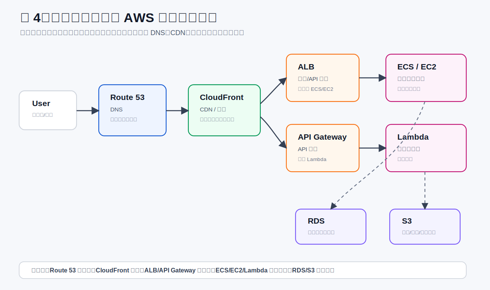

补充图：

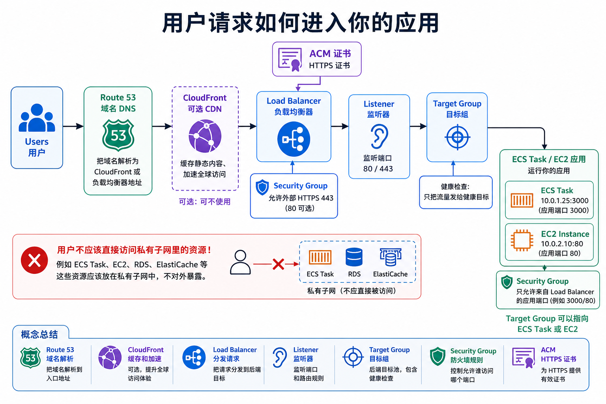

核心理解：

- `Route 53` 管域名解析：用户输入域名后去哪里。
- `CloudFront` 管 CDN：缓存和全球加速。
- `ALB` 或 `API Gateway` 管请求入口。
- `ECS/EC2/Lambda` 执行代码。
- `RDS/S3` 保存数据或文件。

容易混的点：

- CloudFront 不是后端服务器，它通常站在入口前面做缓存和加速。
- API Gateway 更偏 API 管理；ALB 更偏把 HTTP 请求转发给后端服务。

### 10. ALB、Target Group、Health Check、Auto Scaling

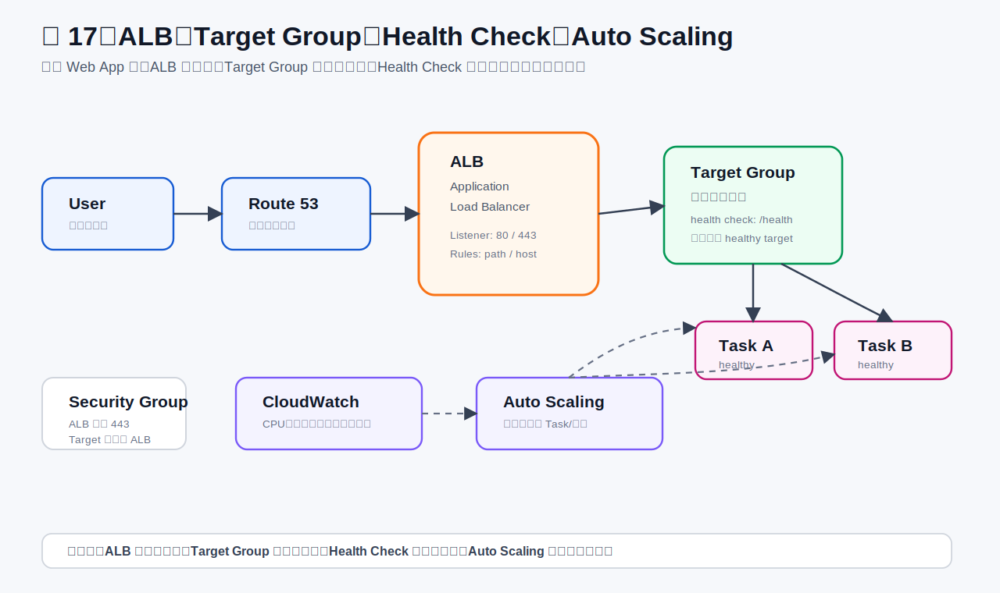

核心理解：

- `ALB` 是应用层负载均衡入口。
- `Listener` 监听 80/443 端口。
- `Rule` 按域名或路径转发。
- `Target Group` 是后端目标名单。
- `Health Check` 决定哪个后端可以接流量。
- `Auto Scaling` 根据指标自动增减 ECS tasks 或 EC2 instances。

容易混的点：

- ALB 不运行你的代码，它只负责接请求和分发请求。
- Target Group 不是服务本身，它是 ALB 认识后端的名单。

### 11. CloudFront、ALB、API Gateway、AppSync 入口区别

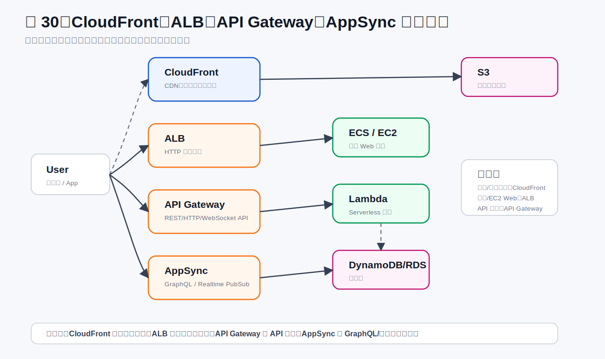

核心理解：

- `CloudFront` 是 CDN 和边缘缓存层。
- `ALB` 是 VPC 里的 HTTP/HTTPS 负载均衡入口。
- `API Gateway` 是 REST、HTTP、WebSocket API 的门面。
- `AppSync` 是 GraphQL 和实时 Pub/Sub 入口。

容易混的点：

- 它们都能站在用户请求前面，但不在同一层。
- 静态资源/全球加速优先想 CloudFront；容器或 EC2 Web 服务优先想 ALB；API 管理优先想 API Gateway；GraphQL/实时数据优先想 AppSync。

## 三、计算、容器和部署

### 12. 租一台 EC2，到底租了什么

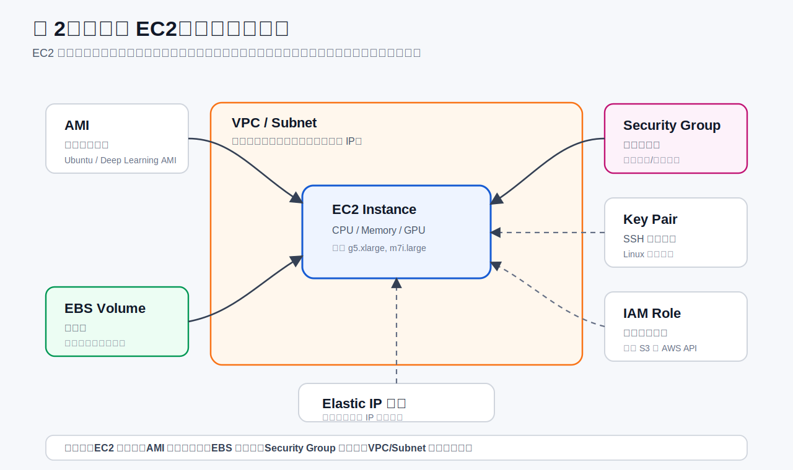

核心理解：

- `EC2 Instance` 是算力：CPU、内存、GPU。
- `AMI` 是启动模板：操作系统和预装软件。
- `EBS` 是云硬盘：实例停止后通常还在。
- `Security Group` 是门禁：控制端口和来源。
- `Key Pair` 是 SSH 登录钥匙。
- `IAM Role` 是实例访问其他 AWS 服务的临时权限。

容易混的点：

- 租 GPU 不是找 4090 按钮，而是选 GPU instance type，例如 `g5`、`g6`、`p4d`、`p5`。
- 删除 EC2 instance 不一定等于删除 EBS volume，要看终止保护和磁盘删除设置。

### 13. EC2、ECS 和 Fargate 的边界

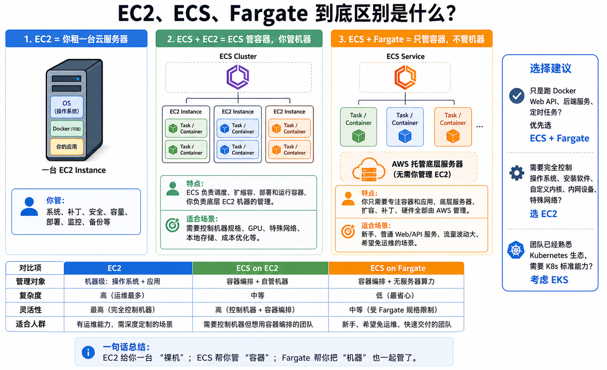

核心理解：

- `EC2` 是机器级别：你租云服务器，自己管操作系统和部署方式。
- `ECS on EC2` 是容器编排加自管机器：ECS 管容器，EC2 机器还是你负责。
- `ECS on Fargate` 是容器编排加托管算力：你主要管 task/service，不直接管机器。

容易混的点：

- ECS 不是 EC2 的子功能；ECS 是容器服务，只是可以把容器跑在 EC2 上。
- Fargate 不是容器镜像仓库，也不是 Kubernetes；它是运行容器的无服务器算力。

### 14. ECS 容器模型

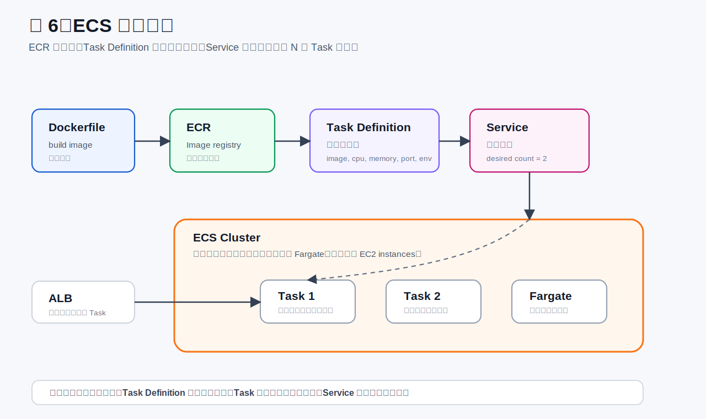

补充图：

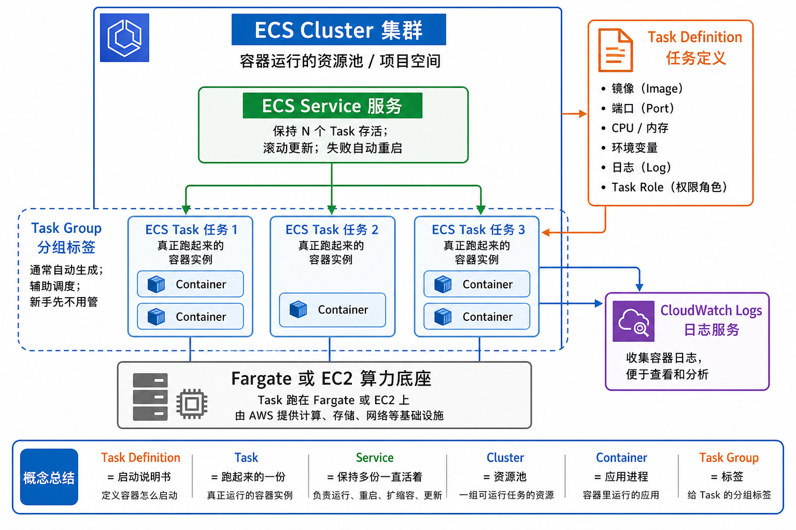

核心理解：

- `Docker image` 是应用打包结果。
- `ECR` 是镜像仓库。
- `Task Definition` 是容器运行说明书。
- `Task` 是真正跑起来的容器实例。
- `Service` 负责长期维持指定数量的 Task。
- `Cluster` 是 ECS 的运行逻辑空间。
- `Fargate` 是不用管理服务器的容器运行方式。

容易混的点：

- Task 不是手写定义的，定义的是 Task Definition。
- Service 不是容器镜像，Service 是“维持任务长期运行”的控制器。

### 15. 从代码到 ECS 上线

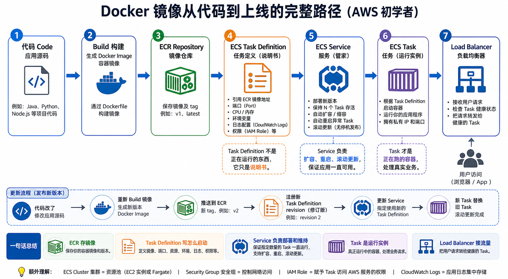

核心理解：

- 代码先被构建成 `Docker image`。
- 镜像推送到 `ECR Repository`。
- `Task Definition` 引用镜像地址，并定义端口、CPU、内存、环境变量、日志和权限。
- `ECS Service` 使用新的 task definition revision 部署新版本。
- `ECS Task` 才是真正跑起来的容器实例。

容易混的点：

- `ECR` 只是存镜像，不负责运行应用。
- `Task Definition` 只是说明书，不是正在运行的容器。
- 更新代码后通常要重新 build 镜像、推送 ECR、注册新 revision、更新 service。

### 15A. TopicFollow：GitHub Actions 自动部署到 ECS


这张图记录 TopicFollow 现在的生产网站自动部署线：

```text
本地 git push main
  -> GitHub Actions
  -> AWS OIDC 临时部署 role
  -> lint / build
  -> Docker Buildx + QEMU 构建匹配 ECS 架构的 image
  -> ECR 保存 web-<commit> image
  -> 注册新的 ECS task definition revision
  -> ECS service rolling update
  -> ALB health check
  -> www.topicfollow.com
```

核心理解：

- `GitHub` 只保存代码并触发 workflow，不直接运行网站。
- `GitHub Actions` 是自动化工人，负责测试、构建、推镜像、更新 ECS。
- `OIDC role` 让 GitHub 临时获得 AWS 部署权限，不需要长期 AWS access key。
- `ECR` 保存新镜像，ECS 从 ECR 拉镜像运行。
- `Task definition` 每次部署会产生新 revision，通常只替换 container image。
- `ECS service` 负责滚动替换 task；旧 task 在新 task 健康前继续接流量。
- `ALB / Target Group` 只把请求转发给 health check 通过的 task。

这条自动线只管“网站代码上线”。
Topic 写库和 hero 图片上传不跟随普通 `git push` 自动执行，仍然用专门的 ECS one-off helper，避免一次代码提交误写生产数据。

### 15B. TopicFollow：新 topic 写入 RDS


这张图记录新 topic 从 subagent 阶段到生产 RDS 的写库线：

```text
本地 topic pipeline / subagents
  -> tmp/topicfollow-*.json
  -> finalized aggregation JSON
  -> 上传到私有 S3 topic-ingestion-plans/
  -> ECS one-off task 执行 write-plan
  -> applyTopicIngestionPlan()
  -> 写入 RDS PostgreSQL
  -> 网站从 DB 读取 topic/search/page 数据
```

核心理解：

- collector、cleaner、summarizer、structure、aggregation 阶段只产出 JSON 文件。
- `tmp/topicfollow-aggregation_*.json` 是“写库计划”，不是数据库本身。
- 真正写生产库的是 ECS one-off task 里的 `write-plan`。
- Mac 本地不放生产 `DATABASE_URL`，避免本地脚本误写生产 RDS。
- 写库后要看 ECS task exit code 和 CloudWatch JSON confirmation。

写入 RDS 的内容包括：

- `topics`
- `articles`
- `sources`
- `topic_events`
- `event_signals`
- `article_topics`
- `topic_search_state`
- `topic_research_state`

### 15C. TopicFollow：hero 图片上传 S3 并更新数据库


这张图记录 hero 图片的生产线：

```text
本地生成或选择 hero 图片
  -> run-ecs-topic-hero-image.sh
  -> 源图上传到 S3 staging
  -> ECS one-off task 读取源图
  -> 压缩/标准化为最终 WebP
  -> 写入 S3 final object
  -> 更新 RDS topics.hero_image 和 metadata
  -> 网站 topic 页面和 OG metadata 使用新图
  -> 清理 staging 源图
```

最终公开路径固定为：

```text
/uploads/topics/topic-<topic-slug>/hero.webp
```

真实 S3 object key 是：

```text
uploads/topics/topic-<topic-slug>/hero.webp
```

核心理解：

- 图片文件在 S3，图片路径在 RDS。
- 只上传 S3 不够，DB 不更新时网站不知道用哪张图。
- 只更新 DB 不够，S3 没有对象时页面会引用不存在的文件。
- 生产流程不再使用 SSH、sudo、chmod 或服务器本地 uploads 目录。
- `topics.hero_image`、`hero_image_source`、`hero_image_download_url`、`hero_image_downloaded_at` 等 metadata 要一起保持一致。

### 16. Serverless 事件驱动模型

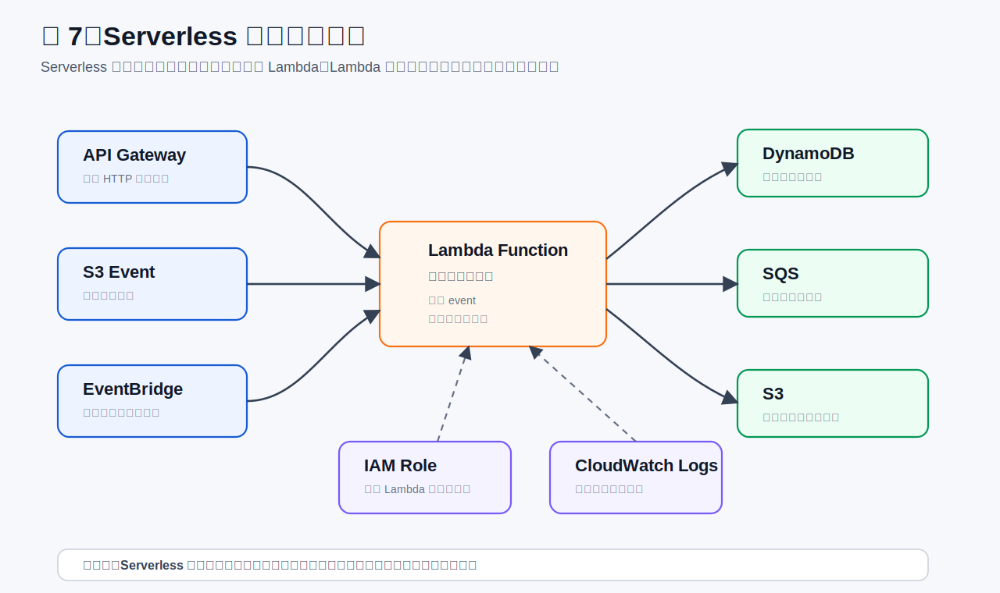

核心理解：

- `API Gateway`、`S3 Event`、`EventBridge` 都可以触发 Lambda。
- `Lambda` 处理短任务。
- `DynamoDB`、`SQS`、`S3` 经常作为 Lambda 的下游。
- `IAM Role` 决定 Lambda 能访问什么。
- `CloudWatch Logs` 看 Lambda 运行日志。

容易混的点：

- Serverless 不是没有服务器，而是你不用管理服务器。
- Lambda 不适合一直常驻运行的进程。

### 17. SQS、SNS、EventBridge、Step Functions 异步架构

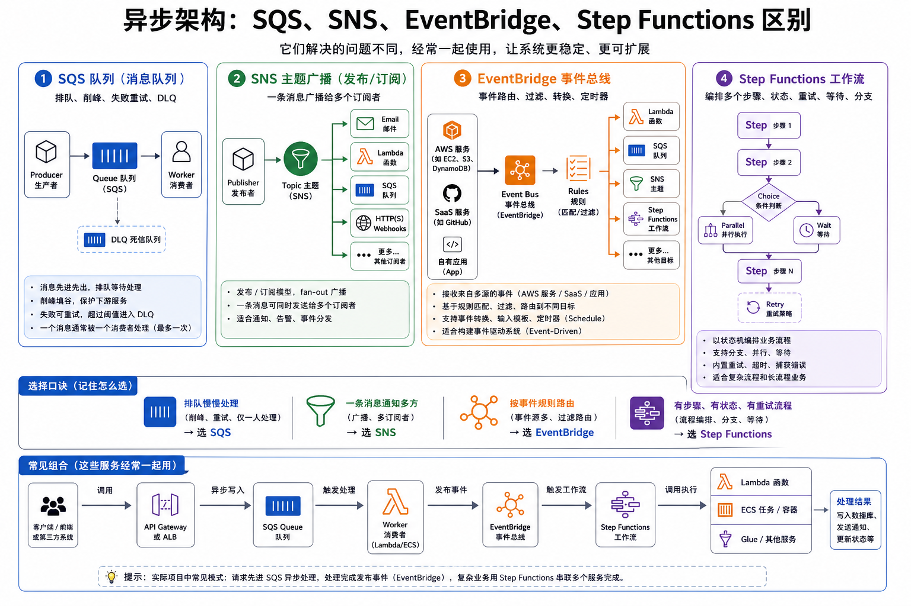

核心理解：

- `SQS` 是队列，用来排队、削峰、重试，让消费者慢慢处理。
- `SNS` 是发布订阅，一条消息可以广播给多个订阅者。
- `EventBridge` 是事件总线，按规则过滤、转换和路由事件。
- `Step Functions` 是工作流，把多个步骤串起来，支持分支、等待、重试和状态。

容易混的点：

- SQS 更像“排队等处理”。
- SNS 更像“通知很多人”。
- EventBridge 更像“事件路由中心”。
- Step Functions 更像“有状态的流程编排器”。

### 18. IaC，用代码创建 AWS 资源

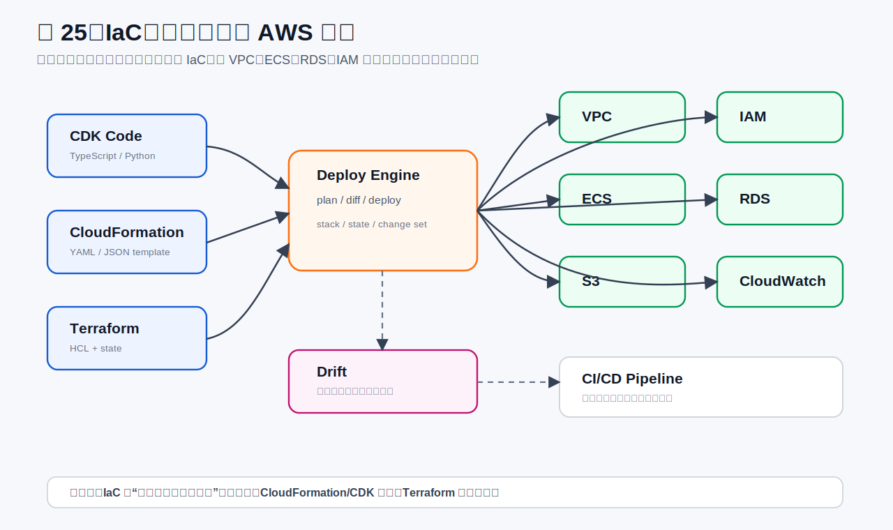

核心理解：

- `IaC` 是 Infrastructure as Code，把云资源写成代码。
- `CloudFormation` 是 AWS 原生模板和 stack 引擎。
- `CDK` 用编程语言生成 CloudFormation。
- `Terraform` 是常见跨云 IaC 工具，依赖 state 管理资源状态。
- `Drift` 是控制台手动改了资源，但代码不知道。

容易混的点：

- IaC 不是应用代码本身，它是创建 VPC、IAM、ECS、RDS、S3 等基础设施的代码。
- 学习阶段可以点控制台，生产阶段更应该让关键资源可复现、可审查。

## 四、存储、数据库和数据分析

### 19. S3、EBS、EFS 存储区别

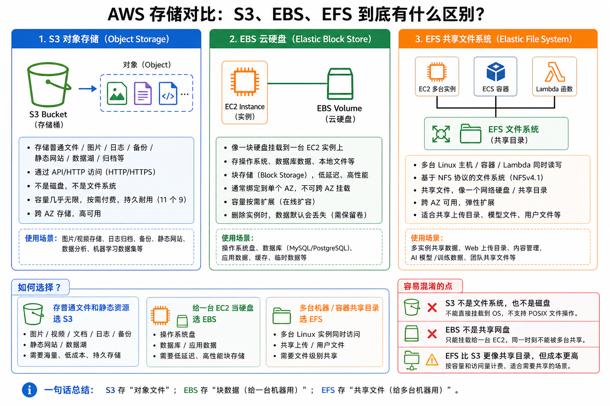

核心理解：

- `S3` 是对象存储，适合普通文件、图片、日志、备份、静态网站和数据湖。
- `EBS` 是云硬盘，通常挂到一台 EC2 上，像服务器自己的磁盘。
- `EFS` 是共享文件系统，多台 EC2、ECS task 或 Lambda 可以同时挂载读写。

容易混的点：

- S3 不是磁盘，不能像本地文件系统那样随便挂载和改文件。
- EBS 不适合多台机器随便共享。
- EFS 更像共享目录，但成本和延迟模型跟 S3 不一样。

### 20. S3 权限和生命周期

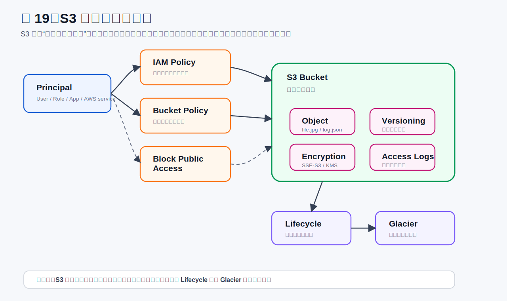

核心理解：

- `IAM Policy` 管身份能做什么。
- `Bucket Policy` 管桶允许谁访问。
- `Block Public Access` 是防止误公开的总闸。
- `Versioning` 防止误删和覆盖带来不可恢复损失。
- `Encryption` 保护静态数据。
- `Lifecycle` 可以把旧对象转到 Glacier 或自动删除。

容易混的点：

- S3 链接能不能打开，不只看 URL，还要看权限。
- Bucket public 不等于安全，生产里公开访问要非常小心，常用 CloudFront 做入口。

### 21. RDS、DynamoDB、ElastiCache 数据层选择

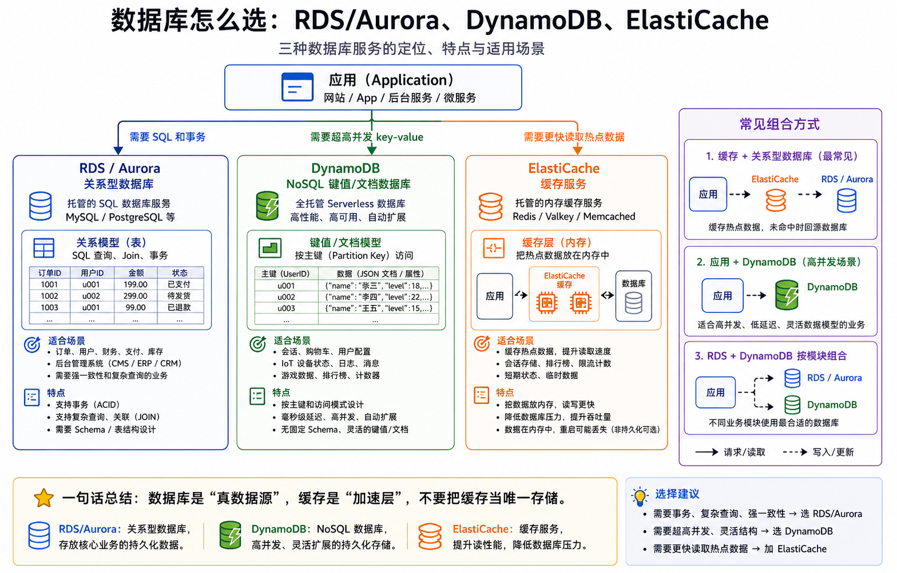

核心理解：

- `RDS/Aurora` 适合 SQL、事务、表关系、后台管理、订单和财务类数据。
- `DynamoDB` 适合高并发 key-value/document 访问，需要按访问模式设计主键。
- `ElastiCache` 是缓存层，用内存加速热点数据，降低数据库压力。

容易混的点：

- 缓存不是唯一真数据源，重要数据仍要落到数据库或持久化存储。
- DynamoDB 不是“更简单的 RDS”，它的设计方式不同，先想查询模式再设计表。
- RDS 更像传统数据库；DynamoDB 更像超大规模键值/文档表；ElastiCache 更像加速器。

### 22. RDS 应该放在 VPC 里的哪里

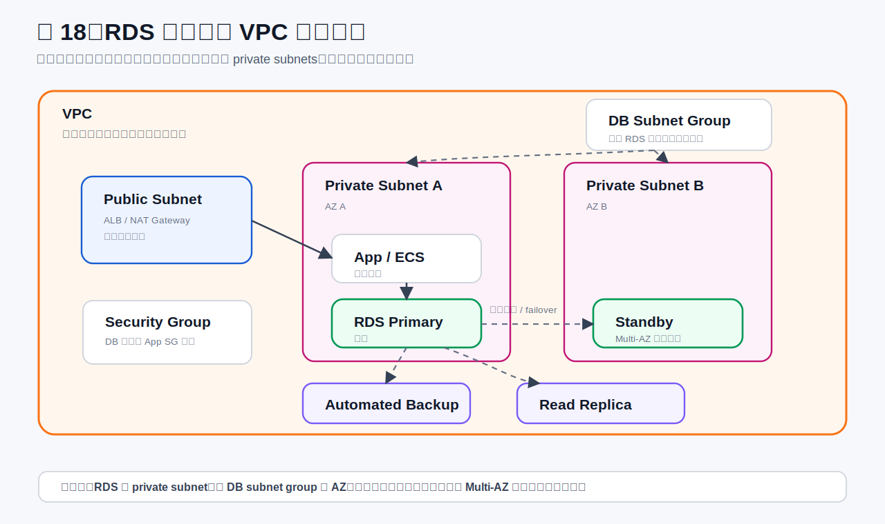

核心理解：

- RDS 通常放在 `private subnet`，不要直接暴露公网。
- `DB Subnet Group` 告诉 RDS 可以放在哪些子网。
- 数据库安全组通常只允许应用层安全组访问。
- `Multi-AZ` 是高可用，主库故障时切到备用库。
- `Automated Backup` 和 snapshot 负责恢复。
- `Read Replica` 主要解决读扩展，不等于备份。

容易混的点：

- Multi-AZ 不是读副本，主要用于故障切换。
- Read Replica 可以分担读，但要考虑复制延迟。

### 23. 数据湖到底是什么

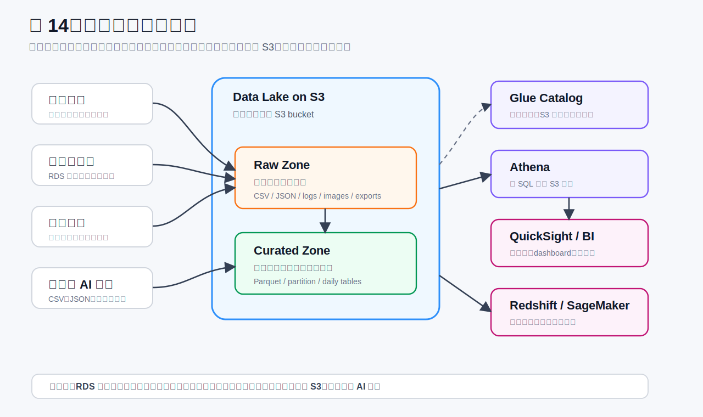

核心理解：

- 数据湖不是一个单独按钮，而是一种组织数据的架构。
- AWS 上最常见的数据湖底座是 `S3 bucket`。
- `Raw Zone` 保存原始数据，先不要急着改。
- `Curated Zone` 保存清洗、转换、分区后的数据。
- `Glue Catalog` 像地图，记录 S3 文件的表结构。
- `Athena` 像查询器，用 SQL 查 S3 文件。
- `QuickSight`、`Redshift`、`SageMaker` 在上层做报表、数仓分析或 AI。

容易混的点：

- RDS 是业务运行数据库，数据湖是分析和 AI 用的数据集中地。
- S3 只是存文件；加上目录规划、Catalog、查询和治理以后，才像一个真正的数据湖。

### 24. 数据湖最小心智模型

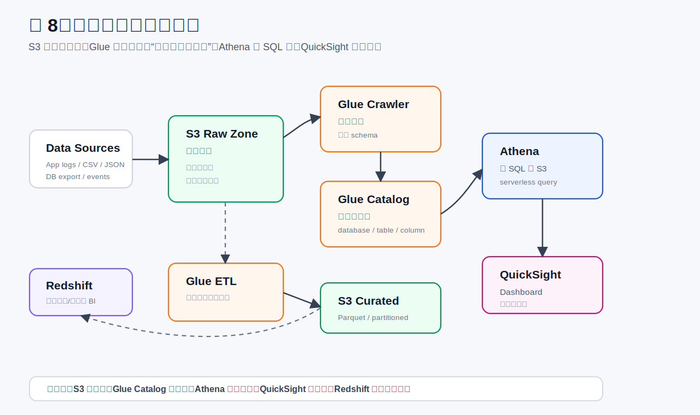

核心理解：

- `S3` 是数据湖底座。
- `Glue Crawler` 扫描文件并推断表结构。
- `Glue Data Catalog` 保存 metadata，让文件像表一样可查询。
- `Athena` 用 SQL 查询 S3 数据。
- `QuickSight` 做 dashboard。
- `Glue ETL` 清洗转换数据。
- `Redshift` 是更正式、更高性能的云数仓。

容易混的点：

- S3 只负责存文件，不自动知道 CSV/Parquet 里有哪些列。
- Glue Catalog 是“目录和表结构”，不是数据库本身。
- Athena 是查询器，不是长期运行的数据库服务器。

## 五、安全、权限和配置

### 25. IAM、Security Group 和 CloudWatch 分工

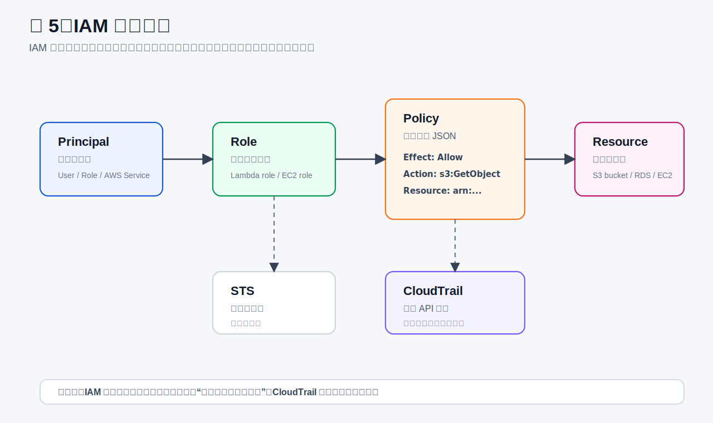

补充图：

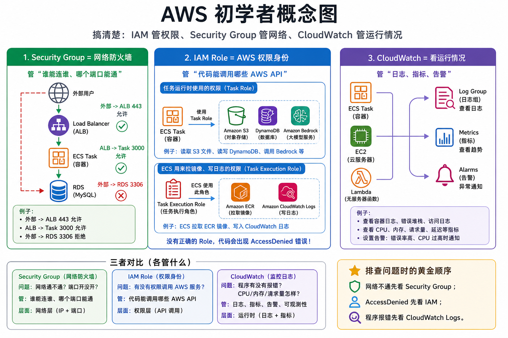

核心理解：

- `Principal` 是谁发起请求。
- `Role` 是可以被临时扮演的身份。
- `Policy` 是权限规则。
- `Action` 是要做什么操作。
- `Resource` 是要操作哪个资源。
- `CloudTrail` 记录谁在什么时候做了什么 API 操作。

容易混的点：

- IAM 不运行应用，只判断请求有没有权限。
- Security Group 管网络端口和来源。
- CloudWatch 看运行状态和日志，CloudTrail 看账号 API 审计。

### 26. Cognito、IAM、IAM Identity Center 区别

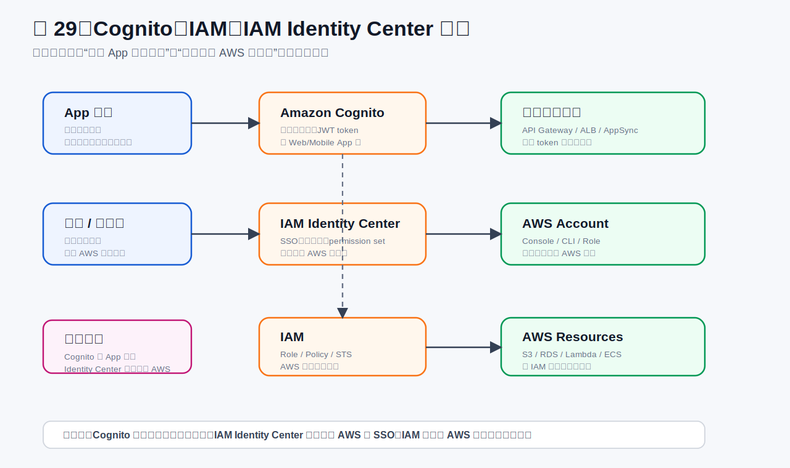

核心理解：

- `Cognito` 管你自己 App 的终端用户登录。
- `IAM Identity Center` 管员工或开发者怎么登录 AWS 账号。
- `IAM` 是 AWS 资源权限底座，负责 role、policy、STS 等权限判断。

容易混的点：

- App 用户登录和员工登录 AWS 控制台不是一回事。
- Cognito 给应用发 token；Identity Center 给员工进入 AWS account 的临时身份。

### 27. KMS、Secrets Manager、Parameter Store 分工

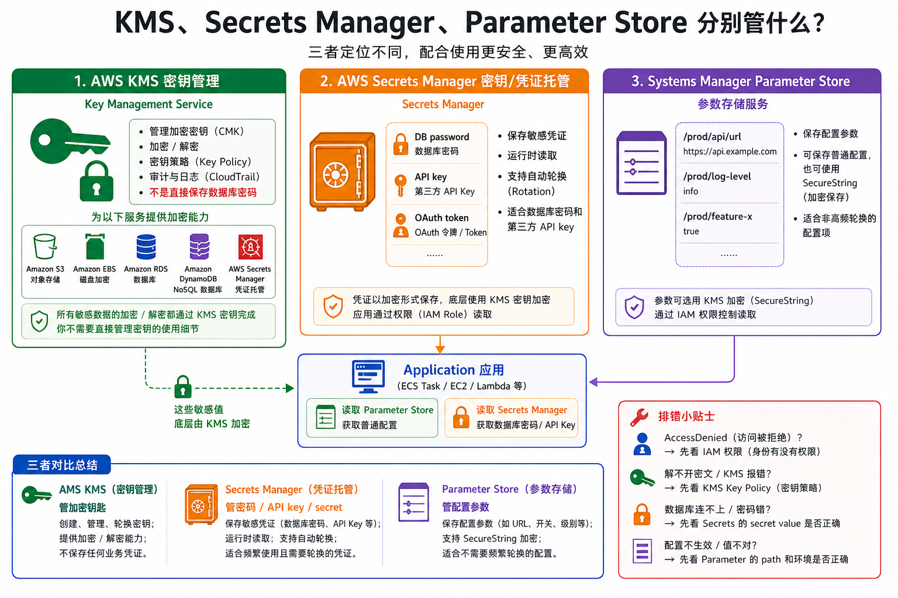

核心理解：

- `KMS` 管加密密钥，很多 AWS 服务用它加密数据。
- `Secrets Manager` 管数据库密码、API key、OAuth token 这类敏感 secret。
- `Parameter Store` 管配置参数，也可以用 `SecureString` 存加密配置。

容易混的点：

- KMS 不是用来直接存数据库密码的，它管“加密钥匙”。
- Secrets Manager 更适合需要轮换和审计的敏感凭证。
- Parameter Store 更适合配置路径，例如 `/prod/api/url`、`/prod/log-level`。

### 28. AWS 安全服务分工

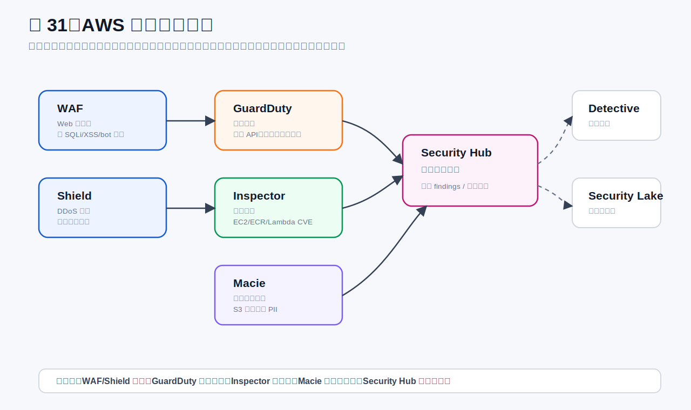

核心理解：

- `WAF` 是 Web 防火墙，保护 HTTP/HTTPS 入口。
- `Shield` 是 DDoS 防护。
- `GuardDuty` 是威胁检测，看可疑账号、网络和 workload 行为。
- `Inspector` 是漏洞扫描，看 EC2、ECR、Lambda 的 CVE 和暴露面。
- `Macie` 发现 S3 里的敏感数据。
- `Security Hub` 聚合安全 findings 和合规视图。

容易混的点：

- WAF/Shield 偏入口防护。
- GuardDuty 偏威胁行为检测。
- Inspector 偏漏洞和暴露面扫描。
- Security Hub 偏统一视图，不是单个检测源。

## 六、运维、成本和可靠性

### 29. CloudWatch、CloudTrail、Config 不要混

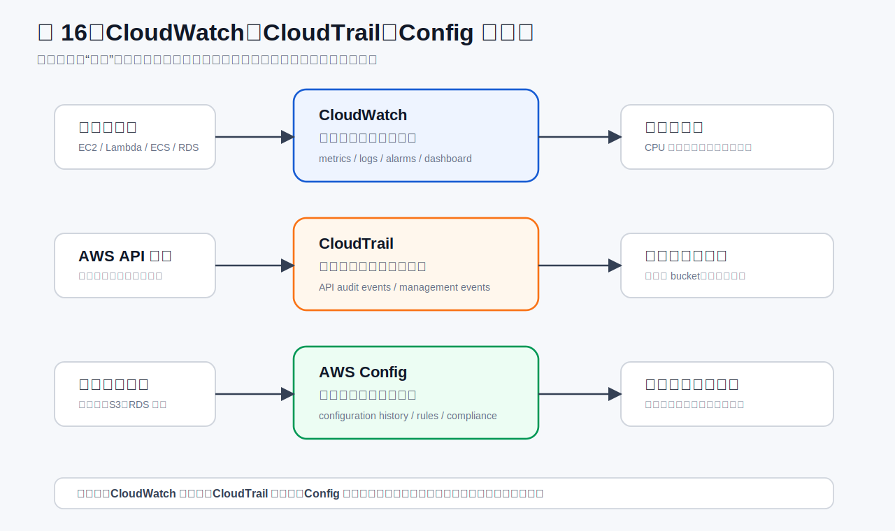

核心理解：

- `CloudWatch` 看运行：指标、日志、告警、dashboard。
- `CloudTrail` 看操作：谁在什么时候调用了什么 AWS API。
- `AWS Config` 看配置：资源以前是什么配置，现在是否合规。

容易混的点：

- Lambda 报错看 CloudWatch Logs。
- 谁删了资源看 CloudTrail。
- 安全组配置什么时候变了看 Config。

### 30. AWS 成本从哪里来，怎么控制

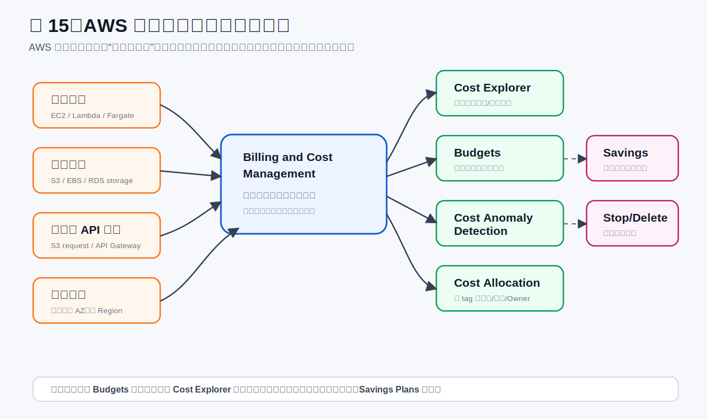

补充图：

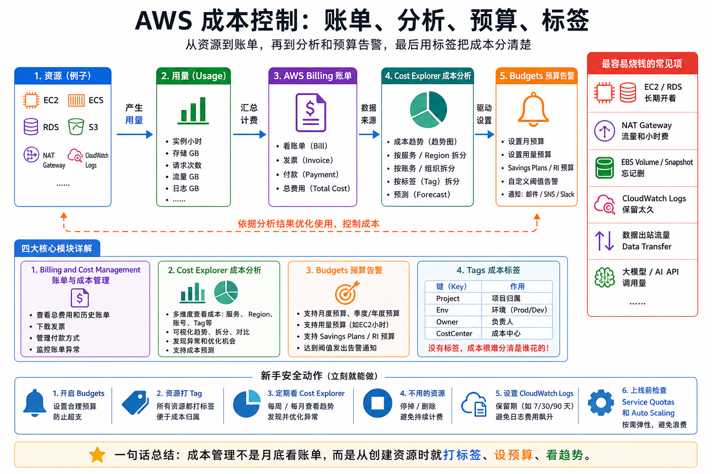

核心理解：

- 成本来源不只有 EC2，还包括计算时间、存储容量、请求次数、数据传输和托管服务。
- `Billing and Cost Management` 是查账和控费总入口。
- `Cost Explorer` 看钱花在哪些服务和时间段。
- `Budgets` 在超预算前提醒你。
- `Cost Anomaly Detection` 发现异常上涨。
- `Tags` 用来按项目、环境、Owner 分摊成本。

容易混的点：

- 关掉 EC2 不一定等于没有费用，EBS、Elastic IP、快照、NAT Gateway、RDS、日志和存储都可能继续收费。
- 新项目先设预算，再开始实验。

### 31. 备份、灾备、RTO/RPO

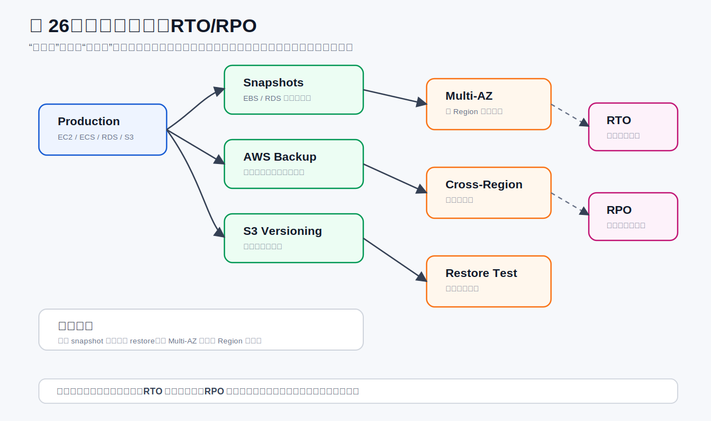

核心理解：

- `Snapshot` 是某个时间点的副本。
- `AWS Backup` 可以集中管理多个服务的备份策略和保留周期。
- `Multi-AZ` 解决同 Region 内的高可用和故障切换。
- `Cross-Region` 才开始接近区域级灾备。
- `RTO` 问多久恢复服务。
- `RPO` 问最多能接受丢多少数据。

容易混的点：

- 有备份不等于高可用。
- 没演练过 restore 的备份，只能算“心理安慰”，不能算真的可靠。

## 七、AI 和机器学习

### 32. Bedrock、SageMaker、Amazon Q 区别

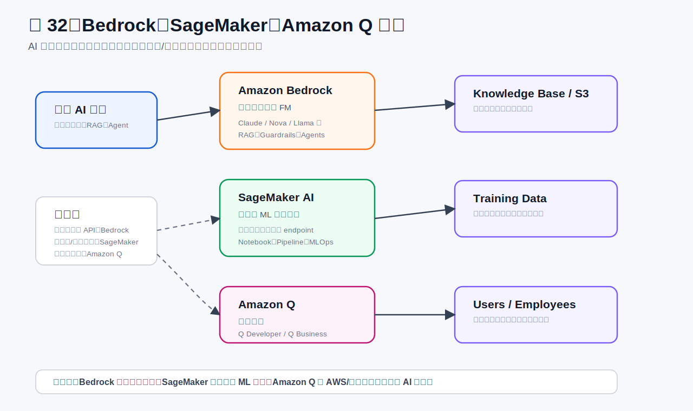

核心理解：

- `Amazon Bedrock` 是大模型平台，适合调用基础模型、做 RAG、agent、guardrails。
- `SageMaker AI` 是自定义 ML 平台，适合训练、调参、部署模型和 MLOps。
- `Amazon Q` 是成品 AI 助手，分开发者、企业知识、控制台等场景。

容易混的点：

- 要调用大模型 API，优先看 Bedrock。
- 要训练和部署自己的模型，优先看 SageMaker AI。
- 要直接给人用的助手，优先看 Amazon Q。
