# AWS 概念心智模型图册

这篇是重做版：不再按服务名一张张背，而是把 AWS 先压成几张“责任分层图”。以后看到一个服务，先判断它属于哪一层，再去理解细节。

如果你想看 TopicFollow 当前生产环境，请看 [TopicFollow AWS 生产架构](topicfollow-aws-architecture.md)。这篇只讲通用 AWS 心智模型。

## 先按问题找图

| 我卡住的问题 | 先看 |
| --- | --- |
| AWS 服务太多，不知道怎么归类 | [1. AWS 服务分层地图](#1-aws-服务分层地图) |
| Account、Region、AZ、VPC、Subnet 到底谁包含谁 | [2. 资源空间和网络边界](#2-资源空间和网络边界) |
| Public subnet、Private subnet、NAT、VPC Endpoint 怎么分 | [2. 资源空间和网络边界](#2-资源空间和网络边界) |
| 用户请求怎么进 AWS，代码到底跑在哪里 | [3. 入口、计算和部署](#3-入口计算和部署) |
| EC2、ECS、Fargate、Lambda、ECR、Task Definition 怎么分 | [3. 入口、计算和部署](#3-入口计算和部署) |
| S3、EBS、EFS、RDS、DynamoDB、ElastiCache 怎么选 | [4. 存储、数据库和数据湖](#4-存储数据库和数据湖) |
| IAM、Security Group、KMS、Secrets、WAF、CloudWatch 怎么分 | [5. 安全、权限和观测](#5-安全权限和观测) |
| CloudWatch、CloudTrail、Config、成本、备份、AI 怎么放进全局 | [6. 运维、成本、可靠性和 AI](#6-运维成本可靠性和-ai) |
| 一次 Web 请求到底经过哪些 AWS 层 | [7. 一次 Web 请求生命周期](#7-一次-web-请求生命周期) |
| AWS 为什么明明有权限还是 AccessDenied | [8. IAM 权限判定流程](#8-iam-权限判定流程) |
| SQS、EventBridge、Lambda、Step Functions 怎么串 | [9. Serverless 异步流程](#9-serverless-异步流程) |
| CI/CD 和 IaC 分别负责什么 | [10. CI/CD 和 IaC 流程](#10-cicd-和-iac-流程) |
| 高可用、备份、RTO/RPO 怎么一起理解 | [11. 可靠性和恢复流程](#11-可靠性和恢复流程) |

## 1. AWS 服务分层地图

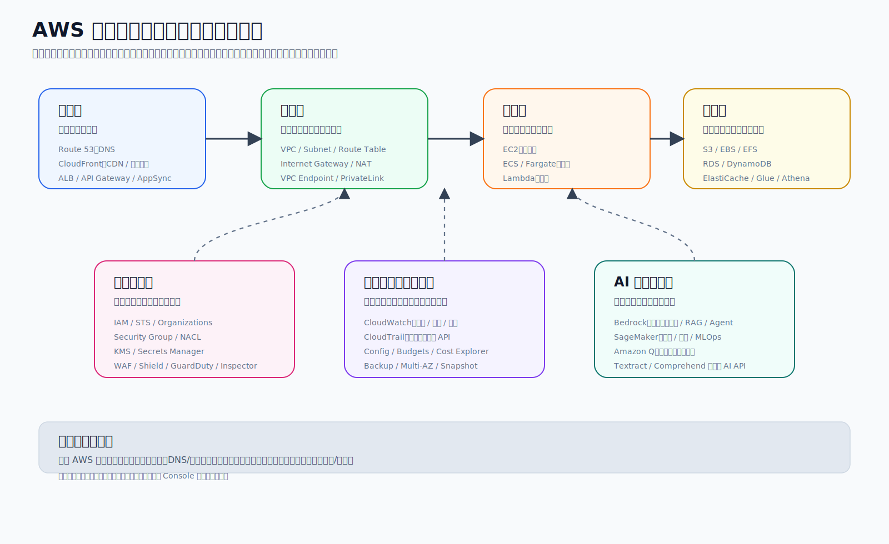

先记这一条主线：

```text
入口层 -> 网络层 -> 计算层 -> 数据层
          安全 / 权限 / 观测 / 成本 横切所有层
```

每层先问的问题：

| 层 | 先问什么 | 常见服务 |
| --- | --- | --- |
| 入口层 | 用户或外部系统从哪里进来 | Route 53, CloudFront, ALB, API Gateway, AppSync |
| 网络层 | 资源放在哪个网络里，路怎么走 | VPC, Subnet, Route Table, IGW, NAT, VPC Endpoint |
| 计算层 | 代码真正在哪里运行 | EC2, ECS, Fargate, Lambda |
| 数据层 | 状态、文件、缓存、分析数据放哪里 | S3, EBS, EFS, RDS, DynamoDB, ElastiCache, Glue, Athena |
| 安全层 | 谁能访问，端口能不能进，密钥怎么管 | IAM, Security Group, KMS, Secrets Manager, WAF |
| 观测层 | 怎么知道运行是否正常、谁改了什么 | CloudWatch, CloudTrail, Config |
| 成本和可靠性 | 怎么控费，坏了怎么恢复 | Budgets, Cost Explorer, Backup, Snapshot, Multi-AZ |
| AI 层 | 大模型、训练平台、AI 助手怎么选 | Bedrock, SageMaker AI, Amazon Q |

最容易乱的地方：

- `ALB` 接请求，但不运行代码。
- `ECR` 存 Docker image，但不运行容器。
- `Task Definition` 是说明书，`ECS Task` 才是运行中的容器。
- `IAM` 管能不能调用 AWS API，`Security Group` 管网络端口能不能通。
- `S3` 是对象存储，不是普通服务器磁盘。

## 2. 资源空间和网络边界

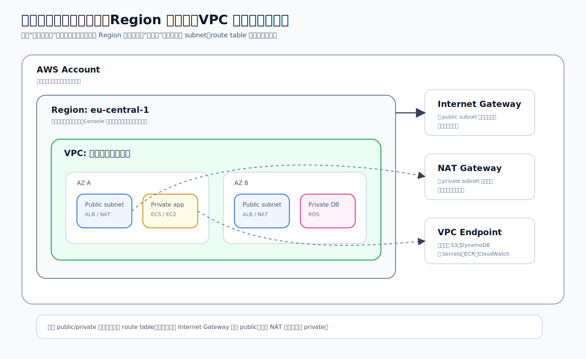

空间层级从大到小：

```text
AWS Account
  -> Region
    -> Availability Zone
      -> VPC
        -> Subnet
          -> EC2 / ECS Task / RDS / ALB 等资源
```

核心理解：

- `AWS Account` 是账单、权限、资源归属的容器。
- `Region` 是地理区域；资源在哪个 Region 创建，就要去哪个 Region 找。
- `AZ` 是同一 Region 里的独立机房组，用来做高可用。
- `VPC` 是你的私有网络边界。
- `Subnet` 是 VPC 里的 IP 地址段，通常按 public、private app、private database 拆。

判断 public / private 的标准：

- `Public subnet`：route table 有默认路由去 `Internet Gateway`。
- `Private subnet`：没有公网入口，通常通过 `NAT Gateway` 主动出网。
- `Database subnet`：更严格的 private subnet，通常只让应用安全组访问数据库端口。

NAT 和 VPC Endpoint 不要混：

| 组件 | 解决什么问题 |
| --- | --- |
| Internet Gateway | 让 public subnet 和公网互通 |
| NAT Gateway | 让 private subnet 主动访问公网，但公网不能主动连进来 |
| Gateway Endpoint | 让 private subnet 私有访问 S3 / DynamoDB |
| Interface Endpoint | 让 private subnet 通过 VPC 内网访问 Secrets Manager、ECR、CloudWatch 等 AWS 服务 |
| PrivateLink | 把某个服务私有暴露给其它 VPC 或账号 |

排查网络时按这个顺序看：

1. Region / Account 有没有看错。
2. 资源在哪个 VPC / subnet。
3. Route table 有没有路。
4. Security Group 有没有放行来源和端口。
5. 应用自己有没有监听正确端口。

## 3. 入口、计算和部署

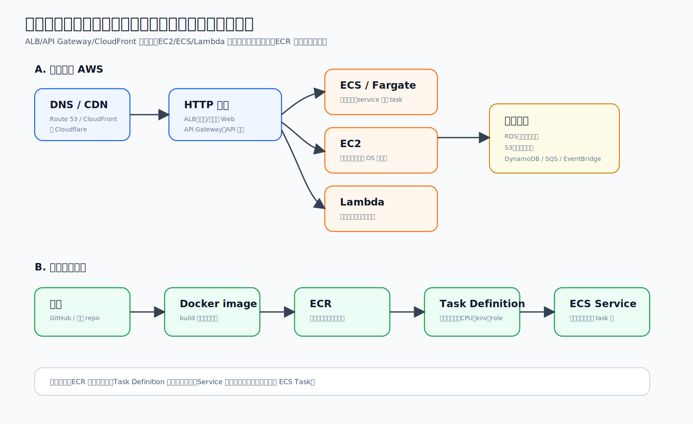

请求进入 AWS 时，先分清“入口”和“运行代码”：

| 类型 | 负责什么 | 常见服务 |
| --- | --- | --- |
| DNS / CDN | 域名解析、缓存、边缘加速 | Route 53, CloudFront |
| HTTP 入口 | 接 HTTP/HTTPS 请求，再转给后端 | ALB, API Gateway, AppSync |
| 计算资源 | 真正运行代码 | EC2, ECS/Fargate, Lambda |
| 下游数据 | 保存状态或异步解耦 | RDS, S3, DynamoDB, SQS, EventBridge |

EC2、ECS、Fargate、Lambda 的边界：

| 服务 | 心智模型 | 你主要管理什么 |
| --- | --- | --- |
| EC2 | 租虚拟机 | OS、补丁、磁盘、进程、部署方式 |
| ECS on EC2 | ECS 管容器，但机器还是你的 | EC2 capacity + ECS service/task |
| ECS on Fargate | ECS 管容器，AWS 管机器 | image、task definition、service |
| Lambda | 事件触发的短任务函数 | 函数代码、触发器、权限、超时 |

容器部署链路：

```text
Code
  -> Docker image
  -> ECR repository
  -> Task Definition revision
  -> ECS Service rolling update
  -> ECS Task running container
```

别混：

- `Docker image` 是打包结果。
- `ECR` 是镜像仓库。
- `Task Definition` 是运行说明书。
- `ECS Task` 是真正跑起来的容器。
- `ECS Service` 是长期维持 task 数量和滚动替换的控制器。

入口怎么选：

| 需求 | 优先想到 |
| --- | --- |
| 静态文件缓存、全球加速 | CloudFront |
| 容器或 EC2 Web 服务入口 | ALB |
| REST / HTTP / WebSocket API 管理 | API Gateway |
| GraphQL 和实时订阅 | AppSync |
| 短任务事件处理 | Lambda |
| 异步排队削峰 | SQS |
| 广播通知多个订阅者 | SNS |
| 事件路由和 SaaS/AWS 事件集成 | EventBridge |
| 多步骤状态机、重试、等待、分支 | Step Functions |

## 4. 存储、数据库和数据湖

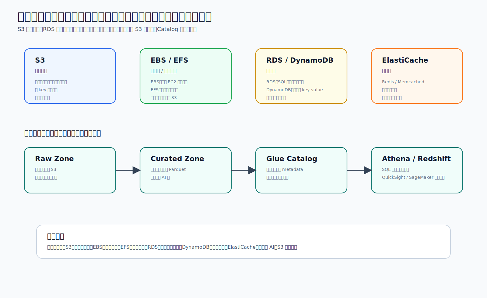

先问：你要存的是什么？

| 你要存什么 | 先看哪个服务 | 直觉类比 |
| --- | --- | --- |
| 图片、上传文件、日志、备份、静态资源 | S3 | 对象仓库 |
| 单台 EC2 的磁盘 | EBS | 云硬盘 |
| 多台机器共享目录 | EFS | 共享文件系统 |
| SQL、事务、表关系、后台管理数据 | RDS / Aurora | 传统关系数据库 |
| 超高并发 key-value/document 访问 | DynamoDB | 托管 NoSQL 表 |
| 热点数据加速 | ElastiCache | Redis / Memcached 缓存 |
| 分析和 AI 用的大量文件数据 | S3 + Glue + Athena/Redshift | 数据湖 / 数仓 |

几个关键边界：

- `S3` 不是磁盘。你不能像改本地文件一样在对象内部随便局部修改。
- `EBS` 通常挂给一台 EC2；不要把它当共享盘。
- `EFS` 可以共享，但延迟和成本模型跟 S3 不一样。
- `RDS` 适合关系和事务，不适合存大量图片二进制。
- `DynamoDB` 不是“更简单的 RDS”，它要先按访问模式设计主键。
- `ElastiCache` 是加速器，不是唯一真数据源。

数据湖心智模型：

```text
S3 Raw Zone
  -> S3 Curated Zone
  -> Glue Catalog
  -> Athena / Redshift / QuickSight / SageMaker
```

数据湖不是一个单独按钮。S3 只是底座；加上目录规划、Catalog、查询和治理后，才像一个真正的数据湖。

## 5. 安全、权限和观测

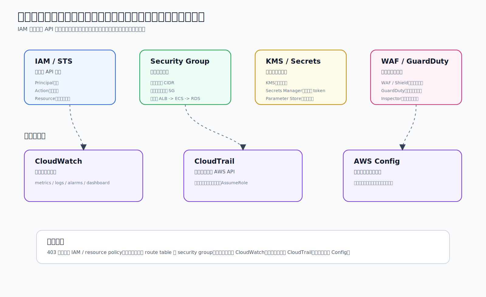

最常见误解：

```text
IAM 允许 API 调用 != 网络端口能通
Security Group 放行端口 != 你有数据库密码
CloudWatch 看到错误 != CloudWatch 负责授权
```

分工表：

| 组件 | 管什么 | 常见问题 |
| --- | --- | --- |
| IAM / STS | 谁能调用哪个 AWS API | 403 AccessDenied、AssumeRole 失败 |
| Security Group | 哪个来源能访问哪个端口 | 连接超时、ALB 连不到 ECS、ECS 连不到 RDS |
| KMS | 加密密钥 | 没有 decrypt 权限 |
| Secrets Manager | 数据库密码、API key、token | secret 读不到、rotation、审计 |
| Parameter Store | 普通配置和 SecureString | 配置路径、环境差异 |
| WAF / Shield | HTTP 入口防护和 DDoS | Web 攻击、流量异常 |
| GuardDuty | 威胁行为检测 | 可疑登录、异常网络行为 |
| Inspector | 漏洞和暴露面扫描 | EC2/ECR/Lambda CVE |
| Security Hub | 汇总安全 findings | 统一安全视图 |

观测三件套：

| 服务 | 看什么 |
| --- | --- |
| CloudWatch | 应用日志、指标、告警、dashboard |
| CloudTrail | 谁在什么时候调用了什么 AWS API |
| AWS Config | 资源配置以前是什么、现在是否合规 |

排查口诀：

- 应用报错：先看 `CloudWatch Logs`。
- 谁删了或改了资源：看 `CloudTrail`。
- 安全组/加密/公开访问是否漂移：看 `AWS Config`。
- 403：先看 IAM、resource policy、SCP、permission boundary。
- 连接超时：先看 route table、security group、监听端口。

## 6. 运维、成本、可靠性和 AI

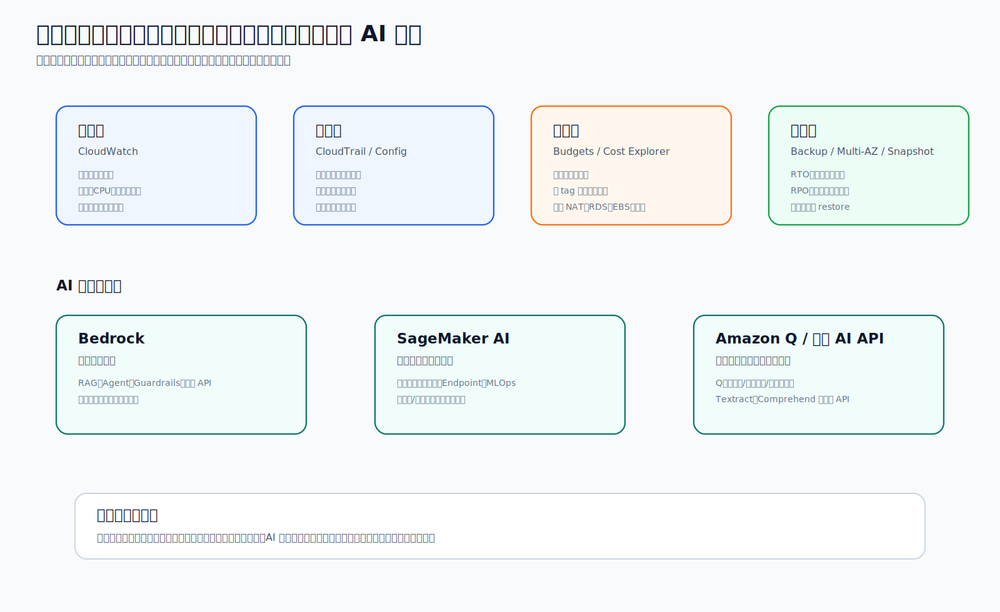

上线后最小清单：

| 目标 | AWS 里看什么 |
| --- | --- |
| 看运行是否正常 | CloudWatch metrics / logs / alarms |
| 看谁改了资源 | CloudTrail |
| 看配置是否合规 | AWS Config |
| 防止账单失控 | Budgets, Cost Explorer, Cost Anomaly Detection, tags |
| 数据能恢复 | Snapshot, AWS Backup, restore drill |
| 服务更高可用 | Multi-AZ, health check, auto scaling |
| 区域级灾备 | Cross-Region backup / replication |

成本容易漏的地方：

- NAT Gateway 即使只是出网也可能很贵。
- RDS、EBS、snapshot、日志、数据传输都会持续计费。
- 关掉 EC2 instance 不等于所有相关费用都没了。
- 新实验先设预算，再开资源。

可靠性关键词：

| 词 | 问题 |
| --- | --- |
| Backup | 我有没有备份 |
| Restore | 我真的演练过恢复吗 |
| Multi-AZ | 单个 AZ 坏了能不能切换 |
| RTO | 多久恢复服务 |
| RPO | 最多能接受丢多少数据 |
| Read Replica | 分担读请求，不等于备份 |

AI 服务选择：

| 需求 | 优先看 |
| --- | --- |
| 调用大模型 API、做 RAG、agent、guardrails | Bedrock |
| 训练、调参、部署自己的 ML 模型 | SageMaker AI |
| 给开发者或企业知识库直接用的助手 | Amazon Q |
| OCR、实体识别、翻译、语音等单点 AI 能力 | Textract、Comprehend、Translate、Transcribe 等专用 API |

最后记一句：AWS 学习不是背 200 个服务名，而是先判断问题在哪一层，再找那一层的服务。

## 7. 一次 Web 请求生命周期

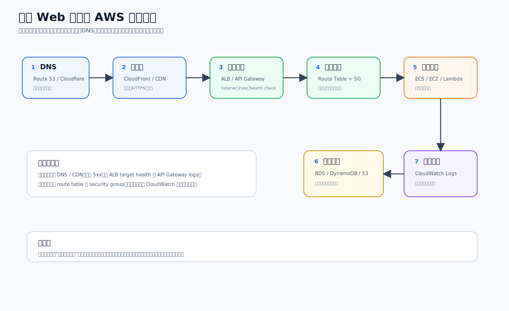

这张图用来练习“逐层排查”。

一次典型 Web 请求会经历：

```text
DNS
  -> CDN / 边缘层
  -> ALB / API Gateway
  -> route table + security group
  -> ECS / EC2 / Lambda
  -> RDS / DynamoDB / S3
  -> CloudWatch logs / metrics
```

排查顺序：

| 症状 | 先看 |
| --- | --- |
| 域名打不开或指错地方 | DNS、CNAME、A/AAAA、CloudFront/Cloudflare 配置 |
| HTTPS 证书错误 | CDN/ALB/API Gateway 证书、域名、TLS 模式 |
| ALB 502/503 | Target Group health check、应用端口、ECS task 是否健康 |
| 连接超时 | Route table、Security Group、NACL、目标是否监听端口 |
| 应用 500 | CloudWatch Logs、环境变量、下游数据库/队列 |
| 页面没数据 | 数据库连接、查询、权限、fallback 状态 |

记忆句：请求不是“直接到服务器”，而是穿过入口、网络、安全、计算和数据层。

## 8. IAM 权限判定流程

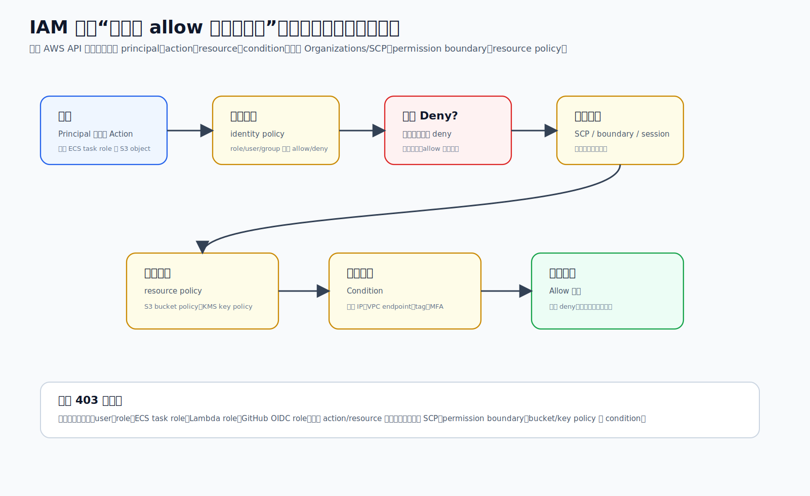

IAM 的核心不是“有没有一个 allow”，而是：

```text
没有显式 Deny
并且身份策略允许
并且 SCP / permission boundary / session policy 没挡住
并且资源策略和 condition 允许
最终才 Allow
```

几个常见卡点：

| 卡点 | 解释 |
| --- | --- |
| 显式 Deny | 任何地方出现 Deny，都会压过 Allow |
| SCP | Organizations 账号级上限，账号内 IAM allow 也越不过 |
| Permission boundary | role/user 的最大权限边界 |
| Session policy | AssumeRole 时临时缩小权限 |
| Resource policy | S3 bucket policy、KMS key policy 等资源自己的门 |
| Condition | 来源 IP、VPC endpoint、MFA、tag、组织 ID 等条件 |

排查 `AccessDenied` 时先确认“谁在请求”：

- 本地 IAM user / SSO role
- EC2 instance role
- ECS task role
- Lambda execution role
- GitHub OIDC deploy role
- 被 `AssumeRole` 后的临时 session

## 9. Serverless 异步流程

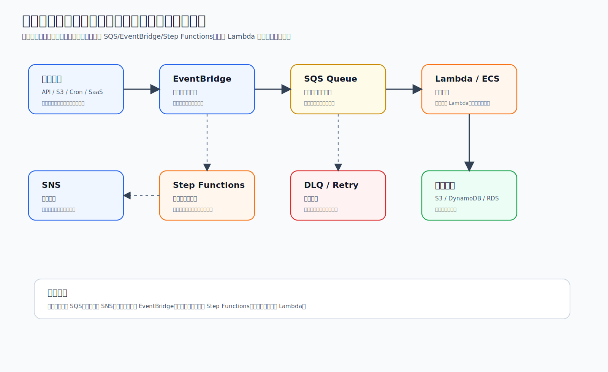

异步架构的目的：让系统不要被一个慢任务拖死。

常见模式：

```text
事件来源
  -> EventBridge 过滤和路由
  -> SQS 排队削峰
  -> Lambda / ECS 消费
  -> S3 / DynamoDB / RDS 保存结果
  -> DLQ 保存失败消息
```

服务怎么选：

| 需求 | 优先用 |
| --- | --- |
| 我要把任务排队，慢慢处理 | SQS |
| 我要一条消息通知多个订阅者 | SNS |
| 我要按事件内容过滤和路由 | EventBridge |
| 我要多个步骤、有状态、等待、重试、分支 | Step Functions |
| 我要处理短任务 | Lambda |
| 我要处理长任务或依赖复杂环境 | ECS/Fargate |
| 我要保存处理失败的消息 | DLQ |

设计异步流程时一定要想：

- 重试会不会重复写数据。
- 消息失败后放哪里。
- 消费者速度跟不上时队列会不会堆积。
- 每个步骤是否可观察，有没有 CloudWatch logs/metrics。

## 10. CI/CD 和 IaC 流程

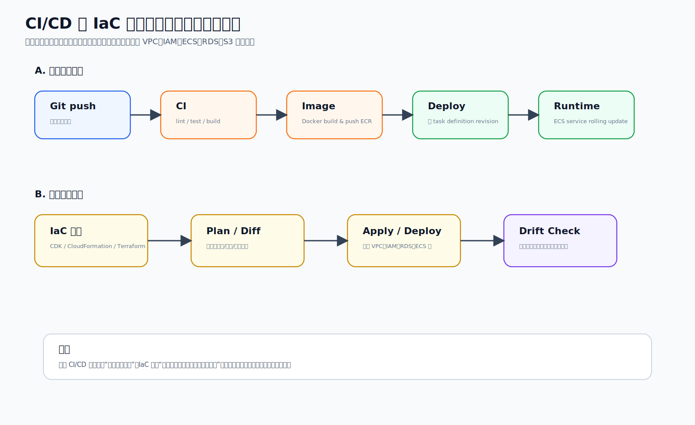

这张图把两条线分开：

| 线 | 解决什么 | 常见工具 |
| --- | --- | --- |
| CI/CD | 应用代码怎么测试、构建、上线 | GitHub Actions, CodeBuild, CodePipeline, ECR, ECS |
| IaC | 云资源怎么创建、修改、审查、复现 | CloudFormation, CDK, Terraform |

应用上线通常是：

```text
git push
  -> lint / test / build
  -> docker build
  -> push image to ECR
  -> register task definition revision
  -> update ECS service
```

基础设施变更通常是：

```text
edit IaC
  -> plan / diff
  -> review
  -> apply / deploy
  -> drift check
```

不要混：

- 应用代码部署通常改变“运行哪个版本”。
- IaC 通常改变“有哪些云资源、权限和网络连接”。
- 控制台手改资源可能造成 drift，之后代码和真实环境会不一致。

## 11. 可靠性和恢复流程

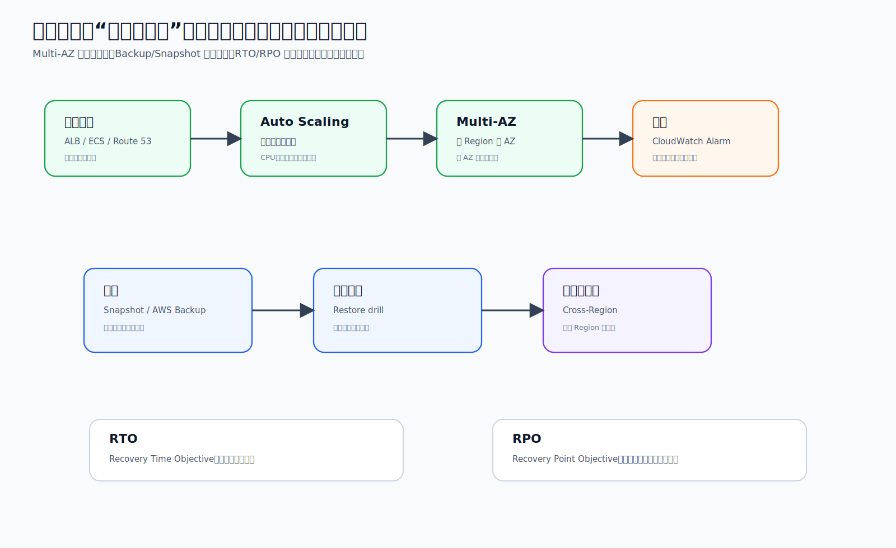

可靠性要分两类：

| 类型 | 目标 | 常见服务/机制 |
| --- | --- | --- |
| 高可用 | 故障时尽量不断服务 | Health check, Auto Scaling, Multi-AZ, rolling deployment |
| 可恢复 | 真坏了也能恢复数据和服务 | Snapshot, AWS Backup, restore drill, Cross-Region |

几个词不要混：

| 词 | 问题 |
| --- | --- |
| Health check | 这个实例/target 现在能不能接流量 |
| Auto Scaling | 容量不够或实例坏了时能不能增减 |
| Multi-AZ | 单个 AZ 坏了能不能切 |
| Snapshot / Backup | 有没有可恢复的数据副本 |
| Restore drill | 备份是否真的恢复过 |
| RTO | 允许多久恢复服务 |
| RPO | 允许最多丢多少数据 |

有备份不等于高可用；没演练过恢复的备份，也不能算真正可靠。
