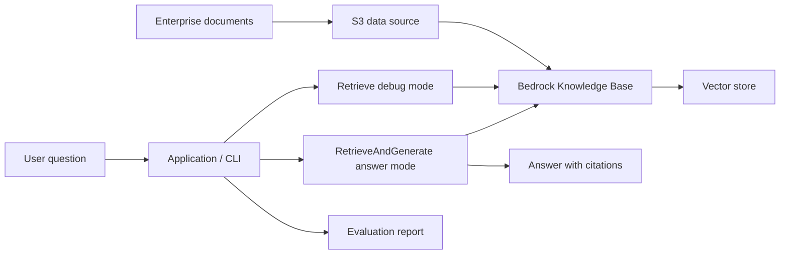

# AWS RAG 工程学习路线

目标：用项目把 AWS 上的 RAG 学起来，而不是只看概念或照着 Console 点服务。每个阶段都产出一个能解释、能验证、能复盘的工程结果，最后整合成一个可展示的企业文档问答系统。

默认设置：

- 学习目标：掌握 RAG 在 AWS 上的工程实现，不以证书备考或论文复现为主。
- 推进方式：阶段式项目驱动，一项能解释、能实验、能留下产物后再进入下一项。
- 技术栈：优先 `Python`、`boto3`、`Amazon Bedrock`、`S3`、`Lambda`、`CloudWatch`；后续按需要接入 CLI、API 或 Web 前端。
- 默认 Region：优先 `eu-central-1`，但 `Amazon Bedrock` 模型和 Knowledge Bases 的可用性按控制台实际支持 Region 为准；如果目标模型不在 Frankfurt，可临时使用 `us-east-1` 或其他支持 Region。
- 成本策略：低成本优先；每次实验前确认模型价格、调用次数、向量库成本、S3 数据量和资源清理步骤。
- 主线方案：先理解 RAG 原理，再跑通 `Bedrock Knowledge Bases` 托管 RAG，随后实现一个最小自定义 RAG pipeline 做对照。
- 最终项目：AWS 企业文档问答系统，包含文档 ingestion、检索调试、带引用问答、质量评估、成本估算和生产化 checklist。

## 学习原则

| 原则 | 具体做法 |
| --- | --- |
| 先理解 RAG 边界 | 不把 RAG 当万能问答；先弄清楚它解决知识接入和 grounding，也会引入检索错误 |
| 先托管后自建 | 先用 Bedrock Knowledge Bases 快速跑通主线，再用自定义 pipeline 理解底层链路 |
| 先检索再生成 | 调质量时先看 Retrieve 命中的 chunk，再看模型回答，避免把检索和生成错误混在一起 |
| 每项都要验收 | 不以“看过文档”为完成标准，而以“能解释、能实验、能留下证据”为完成标准 |
| 每项都要可观测 | 记录请求、延迟、错误、top-k、citation、拒答和大致成本 |
| 每项都要控成本 | 限制文档数量、调用次数、模型大小和向量库规模，实验结束后清理持续计费资源 |
| Citation 必须验证 | 有引用不代表答案可信；必须检查引用是否真的支撑回答中的关键事实 |

## 低成本规则

| 规则 | 说明 |
| --- | --- |
| 默认小数据集 | 每阶段先用 5 到 30 份小文档，不批量导入大规模资料 |
| 控制模型调用 | 限制测试问题数量、输入长度、输出长度和循环调用次数 |
| 谨慎使用向量库 | OpenSearch、Aurora、RDS、长期运行的向量数据库可能持续收费，学习时短时间开启并及时删除 |
| 优先托管实验闭环 | 先用 Knowledge Bases 验证 RAG 主线，再决定是否自建更多组件 |
| 日志短保留 | CloudWatch Logs 设置较短 retention，日志不要记录完整敏感文档 |
| 每次实验前 | 先确认预算告警、预计资源、模型价格、向量库类型和清理步骤 |
| 每次实验后 | 检查 Knowledge Base、vector store、S3 测试数据、Lambda、CloudWatch Logs、临时 IAM role 是否残留 |

### 成本决策表

| 资源 | 学习时默认策略 | 什么时候才保留 |
| --- | --- | --- |
| `Bedrock text model` | 小批量手动测试，限制输出 token | 需要稳定对比不同 prompt、top-k 或模型质量时 |
| `Bedrock embedding model` | 只对小文档集生成向量 | 需要复用同一测试集做多轮检索评估时 |
| `Bedrock Knowledge Base` | 阶段 4 和 Capstone 期间保留，实验后删除 | 正在维护最终 Demo 或需要持续演示时 |
| `Vector store` | 选择最低成本可接受方案，实验结束删除 | Capstone 需要保留演示环境或评估报告可复现时 |
| `OpenSearch` | 不作为早期默认常驻资源 | 需要学习搜索、hybrid search 或生产级向量检索选型时 |
| `RDS / pgvector` | 优先本地或短时测试，不长期空跑 | 需要和现有 PostgreSQL 应用集成或比较 pgvector 方案时 |
| `Lambda` | 只做轻量 metadata、API 或 ingestion 辅助任务 | 需要保留可运行 Demo 或自动化入口时 |
| `CloudWatch Logs` | 设置短 retention，避免记录原文 | 需要保留排障证据、评估运行记录或生产化模板时 |

## RAG 工程主线

这条路线分成三条互相支撑的主线：

| 主线 | 学什么 | 对应阶段 |
| --- | --- | --- |
| RAG 原理 | 什么时候需要 RAG、检索为什么会失败、citation 为什么要验证 | 1、5、7 |
| AWS 实现 | IAM、S3、Lambda、Bedrock、Knowledge Bases、CloudWatch 如何组成系统 | 2、3、4 |
| 工程生产化 | 自定义 pipeline、质量评估、权限隔离、成本、安全和最终项目整合 | 6、7、8、9 |

推荐推进方式：

| 阶段 | 推荐动作 | 目的 |
| --- | --- | --- |
| V1 理论和最小实验 | 手动对比纯 LLM 与 RAG，跑通 S3、IAM、Bedrock | 建立 RAG 工程直觉 |
| V2 托管 RAG | 使用 Bedrock Knowledge Bases 完成文档 ingestion、retrieve、retrieve-and-generate | 快速得到可展示的问答系统 |
| V3 自定义对照 | 实现最小 loader、splitter、embedder、retriever、prompt builder | 理解托管服务背后的责任边界 |
| V4 质量和生产化 | 建测试集，做错误分类、权限设计、成本估算、安全 checklist | 从 Demo 走向真实系统思维 |

### RAG 系统分层

| 层级 | 关注点 | 学习证据 |
| --- | --- | --- |
| 文档层 | 文档来源、格式、版本、权限、metadata | S3 prefix 规划、文档清单、权限标签 |
| Ingestion 层 | 解析、清洗、切分、embedding、写入向量库 | ingestion 记录、chunk 示例、向量库说明 |
| 检索层 | top-k、metadata filter、hybrid search、rerank、空结果 | Retrieve 调试输出、检索实验表 |
| 生成层 | prompt、模型参数、拒答、citation、答案格式 | prompt 模板、答案样例、citation 检查表 |
| 评估层 | golden set、错误分类、优化前后对比 | 测试问题集、质量评估表 |
| 生产层 | 权限隔离、审计、监控、成本、安全 | 生产化 checklist、成本估算、监控指标 |

## 路线总览

| 阶段 | 项目 | 核心 AWS / 技术 | 主要产出 | 完成标准 |
| --- | --- | --- | --- | --- |
| RAG-1 | [RAG 基础认知](notes/aws-rag/01-rag-basics.md) | RAG、grounding、retrieval、citation | RAG 原理图和纯 LLM vs RAG 对比表 | 能解释 RAG 五步链路和至少 3 种失败模式 |
| RAG-2 | [AWS 基础底座](notes/aws-rag/02-aws-foundation.md) | IAM、S3、Lambda、CloudWatch | S3 文档目录、最小权限说明、Lambda 日志记录 | 能上传文档、读取 metadata、排查一次函数日志 |
| RAG-3 | [Bedrock 入门](notes/aws-rag/03-bedrock-intro.md) | Bedrock Runtime、IAM、boto3、Embedding | 文本生成和 embedding 调用 Demo | 能解释 model id、Region、IAM、token 和成本关系 |
| RAG-4 | [Bedrock Knowledge Bases](notes/aws-rag/04-bedrock-knowledge-bases.md) | Bedrock Knowledge Bases、S3、Embeddings、Vector store | 托管式文档问答 Demo 和 citation 检查表 | 能完成 ingestion、Retrieve、RetrieveAndGenerate |
| RAG-5 | [向量检索核心](notes/aws-rag/05-vector-retrieval.md) | Embedding、top-k、metadata、OpenSearch、pgvector | chunk 策略、metadata 设计、向量库选型说明 | 能用实验说明 chunk size 和 top-k 如何影响质量 |
| RAG-6 | [自定义 RAG Pipeline](notes/aws-rag/06-custom-rag-pipeline.md) | Loader、Splitter、Embedder、Retriever、Prompt Builder | 自定义最小 RAG Demo 和托管方案对比表 | 能跑通 query -> retrieve -> generate 并打印命中 chunk |
| RAG-7 | [RAG 质量优化](notes/aws-rag/07-rag-optimization.md) | Golden set、Recall@k、Precision@k、Rerank、Hybrid Search | 至少 30 条测试问题和优化前后报告 | 能区分检索、生成、引用和拒答错误 |
| RAG-8 | [生产化能力](notes/aws-rag/08-production.md) | IAM、CloudWatch、Budgets、KMS、Secrets Manager、审计 | 权限隔离、成本估算、监控指标、安全 checklist | 能说明上线前必须补齐的安全、成本和运维能力 |
| RAG-9 | [综合项目](notes/aws-rag/09-capstone-project.md) | Bedrock Knowledge Bases、自定义 pipeline、S3、CLI/API | AWS 企业文档问答系统 | Demo 能回答问题、返回 citation，并附带评估和生产化说明 |

## RAG-1：RAG 基础认知

### 目标

建立 RAG 的工程直觉：为什么企业文档问答不能只靠大模型记忆，为什么检索可以降低幻觉，为什么“能回答”不等于“可信地回答”。

### 核心概念

- `Closed-book generation`
- `Open-book generation`
- `Grounding`
- `Retrieval`
- `Chunk`
- `Embedding`
- `Citation`
- `No-answer`

### 动手任务

- [ ] 准备 3 到 5 段熟悉的短文档，例如制度、产品说明或课程笔记。
- [ ] 针对同一组问题做纯 LLM 回答，不提供任何资料。
- [ ] 手动找出相关段落，再要求模型只根据段落回答。
- [ ] 记录哪些问题纯 LLM 会猜，哪些问题有资料后更准确。
- [ ] 标记哪些问题即使有资料也答不好。
- [ ] 写出“什么时候需要 RAG”的判断清单。

### 验收标准

- [ ] 能解释 RAG 的五步链路：query、retrieve、augment、generate、cite。
- [ ] 能说出至少 3 种 RAG 失败模式。
- [ ] 能判断一个业务问题是否适合用 RAG。
- [ ] 完成一份纯 LLM vs RAG 的对比表。

### 复盘问题

- 如果检索结果错了，模型会发生什么？
- 如果知识库没有答案，系统应该如何回应？
- Citation 为什么不能自动代表答案可信？
- 哪些业务场景更适合数据库查询，而不是 RAG？

## RAG-2：AWS 基础底座

### 目标

建立运行 AWS RAG 项目所需的云上基础。重点是理解文档放在哪里、代码在哪里运行、权限如何控制、日志如何排查。

### 核心服务

- `IAM`
- `Amazon S3`
- `AWS Lambda`
- `CloudWatch Logs`
- `AWS CLI`
- `boto3`

### 推荐资源规划

| 资源 | 建议 |
| --- | --- |
| S3 bucket | 专门用于 RAG 学习，按 `raw/`、`processed/`、`experiments/` 组织 |
| IAM role | 只授予读取指定 bucket 或 prefix 的权限 |
| Lambda | 用最小函数读取 S3 object metadata |
| CloudWatch | 查看 Lambda 执行日志和错误信息 |

### 动手任务

- [ ] 创建一个专门用于 RAG 学习的 S3 bucket。
- [ ] 上传几份测试文档，按 prefix 组织。
- [ ] 创建一个 IAM role，授予读取该 bucket 的最小权限。
- [ ] 创建一个 Lambda 测试函数，读取某个 S3 对象的 metadata。
- [ ] 在 CloudWatch Logs 中查看 Lambda 执行日志。
- [ ] 记录哪些日志字段可以保存，哪些不应该保存。

### 验收标准

- [ ] 能画出 S3、IAM、Lambda、CloudWatch 在 RAG 项目中的关系。
- [ ] 能解释 IAM policy 中 action、resource、effect 的含义。
- [ ] 能上传文档到 S3，并用 Lambda 读取对象信息。
- [ ] 能在 CloudWatch 找到一次函数执行日志。

### 清理步骤

- 删除测试 Lambda function。
- 删除临时 IAM role 或 policy。
- 清空并删除测试 S3 bucket，或至少删除测试对象。
- 删除不再需要的 CloudWatch Log Group。

### 费用提醒

- S3、Lambda 和 CloudWatch Logs 通常成本很低，但日志长期保留和大量对象会累积费用。
- 不要把包含敏感内容的完整文档写入日志。

## RAG-3：Bedrock 入门

### 目标

跑通 Amazon Bedrock 的最小调用链路。重点不是 prompt 技巧，而是模型权限、区域、请求格式、token、延迟、成本和错误处理。

### 核心服务

- `Amazon Bedrock`
- `Amazon Bedrock Runtime`
- `IAM`
- `CloudWatch`
- `boto3`

### 推荐架构

```text
Local Python / CLI
  -> boto3 session
  -> Bedrock Runtime
  -> text model / embedding model
  -> response + usage record
```

### 动手任务

- [ ] 在 Bedrock 控制台确认模型访问权限。
- [ ] 用 boto3 调用一个文本生成模型，输入一个简单问题。
- [ ] 用 boto3 调用一个 embedding 模型，输入一段短文本并查看向量维度。
- [ ] 记录不同参数对输出长度、稳定性和延迟的影响。
- [ ] 故意使用错误 model id 或缺少权限的角色，观察错误信息。
- [ ] 记录一次成功调用的 model id、Region、输入长度、输出长度、延迟和费用估算。

### 验收标准

- [ ] 能成功运行一次 Bedrock 文本生成调用。
- [ ] 能成功运行一次 embedding 调用。
- [ ] 能解释 model id、Region、IAM 权限之间的关系。
- [ ] 能说出生成模型和 embedding 模型在 RAG 中的职责边界。

### 清理步骤

- 删除临时 IAM policy 或 role。
- 删除本地临时输出文件。
- 保留学习脚本、错误记录表和 README。

### 费用提醒

- Bedrock 按模型、输入 token、输出 token 或其他模型计费方式收费。
- 学习阶段限制输入文本长度和循环调用次数。

## RAG-4：Bedrock Knowledge Bases / 托管式 RAG

### 目标

使用 Amazon Bedrock Knowledge Bases 跑通托管式 RAG。你要理解它帮你托管了哪些环节，也要知道哪些环节仍然需要你设计、测试和负责。

### 核心服务

- `Amazon Bedrock Knowledge Bases`
- `Amazon S3`
- `Embeddings model`
- Bedrock 支持的 `Vector store`
- `IAM Role`
- `CloudWatch`

### 推荐架构

```text
Documents in S3
  -> Knowledge Base data source
  -> ingestion job
  -> parser + chunking
  -> embeddings
  -> vector store
  -> Retrieve / RetrieveAndGenerate
  -> answer with citations
```

### 动手任务

- [ ] 准备一组测试文档并上传到 S3。
- [ ] 创建 Bedrock Knowledge Base，连接 S3 数据源。
- [ ] 选择 embedding 模型和向量存储方案。
- [ ] 运行 ingestion job，确认文档同步完成。
- [ ] 使用 Retrieve 测试 10 个问题，记录返回 chunk。
- [ ] 使用 RetrieveAndGenerate 测试同一批问题，记录答案和 citation。
- [ ] 检查 citation 是否真的支持答案中的关键事实。

### 验收标准

- [ ] 能完成文档 ingestion。
- [ ] 能用 Retrieve 查看命中的 chunk。
- [ ] 能用 RetrieveAndGenerate 生成带 citation 的答案。
- [ ] 能指出至少 3 个影响 Knowledge Base 答案质量的因素。

### 清理步骤

- 删除 Knowledge Base。
- 删除或清空 vector store 相关资源。
- 删除 S3 测试文档。
- 删除临时 IAM role。
- 删除不再需要的 CloudWatch Logs。

### 费用提醒

- Knowledge Base 本身、embedding、vector store、S3 和生成模型调用都可能产生费用。
- 向量库如果是长期运行资源，实验结束后优先删除。

## RAG-5：向量检索核心

### 目标

理解 RAG 检索层的核心原理：embedding、相似度、top-k、chunk size、metadata、ANN/HNSW 如何影响最终答案。

### 核心技术

- `Embedding`
- `Vector similarity`
- `Top-k`
- `Metadata filter`
- `Hybrid search`
- `OpenSearch`
- `pgvector`
- `HNSW`

### 动手任务

- [ ] 准备一批文档，按不同 chunk size 切分。
- [ ] 对同一批问题分别测试不同 top-k。
- [ ] 为文档添加 metadata，例如文档类型、部门、年份。
- [ ] 对比不使用 metadata filter 和使用 filter 的结果。
- [ ] 记录哪些问题适合向量检索，哪些更适合关键词或结构化查询。
- [ ] 写一份 OpenSearch、pgvector 和托管向量库的选型对比。

### 验收标准

- [ ] 能解释 embedding 检索和关键词检索的差异。
- [ ] 能说明 chunk size 太大或太小的后果。
- [ ] 能用实验记录证明 top-k 会影响答案质量。
- [ ] 能设计一套基础 metadata 字段。

### 复盘问题

- 为什么“语义相近”不一定代表“答案正确”？
- top-k 增大后，答案一定会更好吗？
- 哪些字段适合作为 metadata？
- 什么情况下应该用 hybrid search？

### 费用提醒

- OpenSearch、RDS、Aurora 等资源可能持续收费；学习阶段不要长期空跑。
- 能用本地小索引完成的实验，先不要直接上重型托管资源。

## RAG-6：自定义 RAG Pipeline

### 目标

从零实现一个最小可用 RAG pipeline。不是为了替代 Bedrock Knowledge Bases，而是为了理解托管服务背后发生了什么，并在需要更强可控性时知道如何设计。

### 核心组件

- `Loader`
- `Parser`
- `Splitter`
- `Embedder`
- `Vector Index`
- `Retriever`
- `Prompt Builder`
- `Answer Generator`

### 推荐架构

```text
Offline:
  documents
  -> loader / parser
  -> splitter
  -> embeddings
  -> vector index

Online:
  question
  -> retriever
  -> top-k chunks
  -> prompt builder
  -> Bedrock text model
  -> answer + citations
```

### 动手任务

- [ ] 从本地或 S3 读取 Markdown、TXT 或 PDF 文档。
- [ ] 把文档切成 chunk，并保存 source metadata。
- [ ] 调用 embedding 模型生成向量。
- [ ] 使用本地向量索引或轻量数据库做相似度检索。
- [ ] 把 top-k chunk 拼入 prompt。
- [ ] 调用 Bedrock 生成答案。
- [ ] 返回答案和引用来源。
- [ ] 与 Bedrock Knowledge Bases 在同一批问题上做对比。

### 验收标准

- [ ] 能跑通完整 query -> retrieve -> generate 流程。
- [ ] 能单独打印检索到的 chunk。
- [ ] 能比较自定义 pipeline 与 Knowledge Bases 在同一问题上的差异。
- [ ] 能说明自定义 pipeline 的新增维护责任。

### 清理步骤

- 删除临时向量索引或测试数据库。
- 删除临时 embedding 输出。
- 删除测试 S3 对象。
- 保留 pipeline 脚本、prompt 模板、chunk metadata 示例和对比表。

### 费用提醒

- 自定义 pipeline 容易重复生成 embedding；实验时缓存 embedding 结果并记录版本。
- 不要在循环测试中无限调用 Bedrock 生成模型。

## RAG-7：RAG 质量优化

### 目标

建立 RAG 质量评估和优化能力。从“感觉回答还行”升级到“能用测试集、指标和错误分类说明系统哪里好、哪里不好、为什么变好”。

### 核心指标

- `Recall@k`
- `Precision@k`
- `Answer relevance`
- `Faithfulness`
- `Citation support`
- `No-answer accuracy`
- `Latency`
- `Cost per answer`

### 测试集设计

至少准备 30 个问题，覆盖：

- 精确事实问题。
- 跨段落或跨文档问题。
- 需要引用具体来源的问题。
- 知识库没有答案的问题。
- 带误导前提的问题。
- 表格、数字、版本或日期相关问题。

### 动手任务

- [ ] 为每个问题记录期望答案。
- [ ] 为每个问题记录期望证据来源。
- [ ] 保存 Retrieve 返回的 chunk。
- [ ] 保存最终回答。
- [ ] 检查 citation 是否支持答案。
- [ ] 标记错误类型：检索错误、生成错误、引用错误、拒答错误。
- [ ] 做一次优化实验，例如调整 top-k、chunk size、metadata filter、prompt 或 rerank。
- [ ] 写出优化前后对比报告。

### 验收标准

- [ ] 有一份至少 30 条的测试问题集。
- [ ] 能把错误分成检索错误、生成错误、引用错误和拒答错误。
- [ ] 能用一次参数或策略调整证明质量变化。
- [ ] 能写出优化前后对比报告。

### 复盘问题

- 一个回答看起来正确，但 citation 不支持，应该算成功吗？
- 提高 recall 和提高 precision 哪个更重要？
- 什么问题适合用 rerank 改善？
- 无答案问题为什么必须进入测试集？

## RAG-8：生产化能力

### 目标

把 RAG 从 Demo 思维推进到生产系统思维。你不一定要马上上线完整系统，但要能说明如果进入真实企业环境，需要补哪些安全、成本、监控和运维能力。

### 核心服务和能力

- `IAM`
- `CloudWatch`
- `AWS Budgets`
- `Cost Explorer`
- `CloudTrail`
- `KMS`
- `Secrets Manager`
- `SSM Parameter Store`
- `Audit Log`
- `Prompt injection defense`

### 生产化检查表

| 类别 | 必须回答的问题 |
| --- | --- |
| 权限隔离 | 用户是否只能检索自己有权访问的文档 |
| 文档安全 | 哪些文档允许进入知识库，是否需要脱敏 |
| 检索过滤 | metadata filter 是否在服务端强制执行 |
| 日志 | 是否避免记录完整敏感文档和用户隐私 |
| 监控 | 是否观察请求量、延迟、错误率、空检索、拒答和 citation 缺失 |
| 成本 | 是否能估算 ingestion、embedding、检索和生成成本 |
| 失败兜底 | 检索为空、模型错误、权限不足时如何返回 |
| 审计 | 是否能追踪用户、问题、引用来源和关键操作 |

### 动手任务

- [ ] 为测试文档设计权限 metadata，例如 department、role、tenant。
- [ ] 设计检索时必须应用的权限 filter。
- [ ] 制定日志字段清单，区分可记录和不可记录内容。
- [ ] 估算一次问答请求的 token 成本。
- [ ] 设计无答案、检索为空、模型错误、权限不足时的返回策略。
- [ ] 写一份 prompt injection 风险样例和防护策略。

### 验收标准

- [ ] 有一份生产化 checklist。
- [ ] 能说明权限隔离方案和风险点。
- [ ] 能给出基础成本估算方法。
- [ ] 能列出关键监控指标。
- [ ] 能设计拒答和失败兜底策略。

### 清理步骤

- 删除临时 secret、测试 role 和测试 policy。
- 删除临时日志、测试文档和评估输出。
- 保留生产化 checklist、成本估算表和安全风险清单。

## RAG-9：综合项目

### 目标

把前 8 个阶段的理论和实验整合成一个可展示项目：AWS 企业文档问答系统。它不只是能回答问题，还要能展示架构、引用来源、质量评估、工程取舍和生产化思考。

### 推荐系统能力

- 文档上传或导入到 S3。
- Knowledge Base ingestion。
- 用户提问。
- Retrieve 调试模式，展示命中 chunk。
- RetrieveAndGenerate 问答模式，展示答案和 citation。
- 测试问题批量评估。
- 无答案和低置信度兜底。
- 基础成本、权限和监控设计说明。

### 项目架构



### 动手任务

- [ ] 准备 10 到 30 份示例企业文档，覆盖制度、产品、流程、FAQ、表格或版本说明。
- [ ] 上传文档到 S3，并整理 prefix 和 metadata。
- [ ] 创建 Bedrock Knowledge Base 并完成 ingestion。
- [ ] 编写一个简单 CLI 或脚本，支持提问、展示答案、打印 citation。
- [ ] 增加 Retrieve 调试模式，用于查看命中 chunk。
- [ ] 准备至少 30 个测试问题，覆盖精确事实、跨文档、无答案和误导性问题。
- [ ] 记录评估结果，区分检索错误、生成错误、引用错误和拒答错误。
- [ ] 实现或保留一个自定义最小 RAG pipeline 作为对照。
- [ ] 编写最终 README，展示架构、运行方式、评估结果和工程取舍。

### 验收标准

- [ ] 陌生人只看 README 能理解项目目标、架构和运行方式。
- [ ] Demo 能基于文档回答问题，并返回 citation。
- [ ] Retrieve 调试模式能展示检索命中的 chunk。
- [ ] 至少 30 个测试问题有评估记录。
- [ ] README 中说明托管 Knowledge Base 与自定义 pipeline 的差异。
- [ ] README 中包含权限、成本、监控、安全的生产化 checklist。

### 阶段产物

- 项目 README。
- 架构图。
- Demo 脚本或 CLI。
- 测试问题集。
- 质量评估表。
- 托管方案 vs 自定义方案对比。
- 生产化 checklist。

## 最终验收

完成整条路线后，应该拥有一个可展示的 AWS 企业文档问答系统，并能清楚解释：

- 为什么这个场景需要 RAG，而不是只调用大模型。
- 文档如何进入知识库，如何被切分、向量化、检索和引用。
- Bedrock Knowledge Bases 托管方案和自定义 RAG pipeline 的差异。
- 如何评估答案质量、引用可信度、无答案处理和检索召回。
- 如何考虑权限隔离、日志监控、成本、安全和上线风险。

每个阶段完成时，都要至少留下三类证据：

- **理论验收**：能写出核心概念、适用场景、常见失败模式。
- **实验验收**：有可运行命令、控制台操作记录、截图说明或结果表。
- **项目验收**：有阶段产物，例如架构图、CLI、评估表、checklist 或 demo。

不要只读资料。每一阶段都要把理论变成一个小的、可验证的工程结果。

## Official References

- [Amazon Bedrock Knowledge Bases](https://docs.aws.amazon.com/bedrock/latest/userguide/knowledge-base.html)
- [Retrieving information from data sources using Amazon Bedrock Knowledge Bases](https://docs.aws.amazon.com/bedrock/latest/userguide/kb-how-retrieval.html)
- [Turning data into a knowledge base](https://docs.aws.amazon.com/bedrock/latest/userguide/kb-how-data.html)
- [Boto3 Bedrock Runtime invoke_model](https://boto3.amazonaws.com/v1/documentation/api/latest/reference/services/bedrock-runtime/client/invoke_model.html)

## Assumptions

- 学习者已经具备 Python 和基本 AWS 操作经验。
- 理论方向以工程原理为主，不主攻深数学推导或论文前沿。
- 项目优先级高于考证和面试题库。
- 默认先做可解释、可展示、可复现的系统，再逐步追求生产级复杂度。
