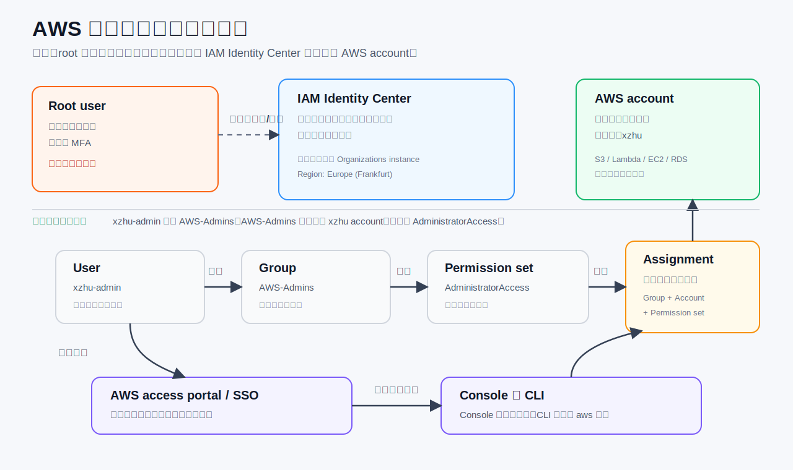

# AWS 身份与权限



## 为什么先做身份和权限

学习 AWS 的第一步不是 EC2、S3 或 Lambda，而是先搞清楚账号安全、登录方式、权限边界和费用控制。因为 AWS 里的资源大多会产生真实费用，而且权限配置错误可能带来安全风险。

这一阶段的目标是：root user 只保留为账号最高所有者，日常操作使用 IAM Identity Center 创建的管理员身份。

## Root user

Root user 是 AWS account 的最高权限身份。它拥有账号级别的最终控制权，例如管理账单、关闭账号、恢复权限、修改账号级安全设置。

Root user 不适合日常使用，因为它权限太大，一旦密码或 MFA 设备出问题，影响范围就是整个 AWS account。

当前状态：

- 已为 root user 开启 MFA。
- 以后只在必要的账号级操作中使用 root。
- 日常学习和创建资源不使用 root。

## MFA

MFA 是 Multi-Factor Authentication，多因素认证。它要求登录时除了密码，还需要第二个验证因素，例如 Authenticator App 生成的 6 位验证码。

MFA 的作用是降低密码泄露后的风险。即使别人知道密码，没有 MFA 验证码也无法直接登录。

当前 root user 使用的是虚拟 MFA 设备，也就是 Authenticator App。

## AWS account

AWS account 是资源和账单的容器。以后创建的 S3 bucket、Lambda function、EC2 instance、RDS database 都属于某个 AWS account。

当前学习账号：

- Account name: `xzhu`
- Region 默认使用：`eu-central-1` / Europe (Frankfurt)

## IAM Identity Center

IAM Identity Center 是 AWS 推荐的日常登录和身份管理入口。它负责管理：

- 谁可以登录 AWS。
- 可以进入哪个 AWS account。
- 进入后使用什么权限。
- Console 和 CLI 如何拿到临时身份。

它比直接创建长期 IAM user access key 更适合日常使用，因为登录后获得的是临时凭证，安全性更好。

## User：`xzhu-admin`

`xzhu-admin` 是日常登录 AWS 的身份。以后不使用 root 做日常操作，而是用这个用户进入 AWS access portal。

这个用户本身不直接代表“能操作所有 AWS 服务”。它需要通过 group、permission set 和 assignment 才能真正进入账号并获得权限。

## Group：`AWS-Admins`

`AWS-Admins` 是管理员用户组。当前 `xzhu-admin` 已加入这个组。

权限最好分配给 group，而不是直接分配给单个 user。这样以后如果增加新的管理员用户，只要加入 `AWS-Admins`，就能继承同样的账号访问权限。

## Permission set：`AdministratorAccess`

Permission set 是一包权限。`AdministratorAccess` 表示管理员权限，适合个人学习初期使用，因为可以创建、修改和删除大多数 AWS 资源。

后续学习最小权限原则时，可以再创建更小范围的 permission set，例如只读、账单、S3 项目专用权限等。

你设置的 12 小时属于这个 permission set 的 `Sitzungsdauer / session duration`。它控制每次通过这个权限集进入 AWS account 后，临时 role session 最长有效多久。

```text
User / Group / Permission set / Assignment = 长期配置
12 小时 session = 本次登录通行证有效期
```

## Assignment

Assignment 是把 group、AWS account 和 permission set 连接起来。

当前配置可以理解为：

```text
xzhu-admin
  -> 属于 AWS-Admins 组
  -> AWS-Admins 被分配到 xzhu AWS account
  -> 使用 AdministratorAccess 权限集
```

所以最终效果是：

```text
登录 AWS access portal
  -> 选择 xzhu account
  -> 选择 AdministratorAccess
  -> 进入 AWS Console
```

## AWS access portal / SSO

AWS access portal 是日常登录入口。它通常长得像：

```text
https://d-xxxxxxxxxx.awsapps.com/start
```

登录后可以选择 AWS account 和 role。这里的 SSO 可以理解成一次登录后，通过 AWS Identity Center 进入被授权的 AWS 账号。

## Console

Console 是 AWS 的网页控制台。浏览器里点击按钮创建资源、查看账单、配置 IAM Identity Center、查看 CloudTrail，都属于使用 Console。

适合学习概念、观察资源状态、做少量手动配置。

## IAM role 和临时凭证

当你通过 access portal 或 CLI 进入账号时，AWS 不会直接让 `xzhu-admin` 这个 user 去操作资源。

IAM Identity Center 会根据 assignment 和 permission set，在目标 AWS account 里自动创建/管理一个 IAM role，名字类似：

```text
AWSReservedSSO_AdministratorAccess_...
```

登录时，`xzhu-admin` 会临时扮演这个 role：

```text
assumed-role/AWSReservedSSO_AdministratorAccess.../xzhu-admin
```

这就是临时身份。过了 session duration 后，临时凭证失效，但 user、group、permission set 和 assignment 这些长期配置不会消失。

## IAM 与 IAM Identity Center 的关系

最短记忆：

```text
IAM Identity Center 管“谁能登录哪个账号”
IAM 管“进入账号后能对资源做什么”
```

IAM Identity Center 是上层登录入口，管理 user、group、permission set 和 assignment。

IAM 是 AWS account 内部的权限系统，管理 IAM role、policy、user、group 等底层权限实体。

连接关系：

```text
IAM Identity Center
  -> User / Group / Permission set / Assignment
  -> 自动在目标 AWS account 的 IAM 中创建 AWSReservedSSO role
  -> Console / CLI 登录时临时 assumed 这个 role
```

## 当前关系总结

```text
Root user
  -> 只做账号级管理
  -> 已开启 MFA

IAM Identity Center
  -> 管理日常登录身份

xzhu-admin
  -> 日常使用者
  -> 属于 AWS-Admins

AWS-Admins
  -> 管理员组
  -> 被分配到 xzhu AWS account

AdministratorAccess
  -> 管理员权限集
  -> 让 AWS-Admins 组在 xzhu account 中拥有管理员权限

AWSReservedSSO_AdministratorAccess role
  -> IAM Identity Center 自动创建/管理
  -> Console / CLI 登录时临时扮演
```

一句话记忆：

**root 是账号所有权，`xzhu-admin` 是日常工作身份，`AWS-Admins` 是管理员组，`AdministratorAccess` 是权限包，assignment 把组、账号和权限包连起来，IAM role 是最终被临时扮演的执行身份。**
