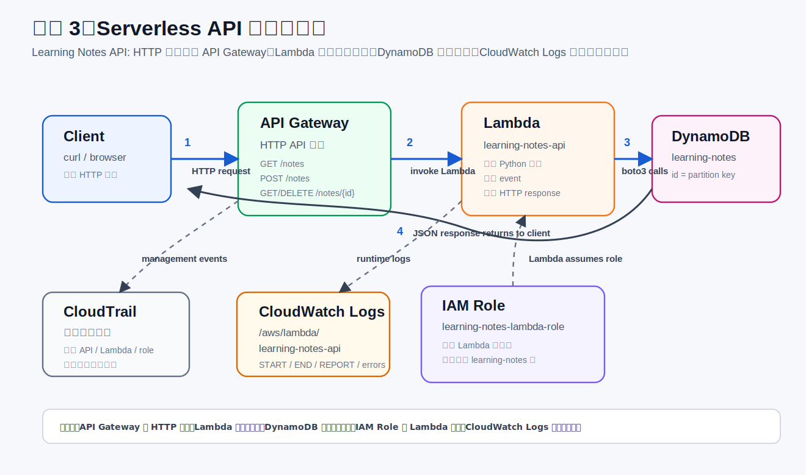

# 项目 3：Python Serverless API

项目 3 会第一次学习 AWS 后端 API。目标是做一个最小可用的 Learning Notes API，用 API Gateway、Lambda、DynamoDB、IAM Role 和 CloudWatch Logs 串起来。

目标架构：



```text
curl / browser
  -> API Gateway
  -> Lambda (Python)
  -> DynamoDB
  -> CloudWatch Logs
```

## 先建立一个整体模型

项目 3 不是“一个服务”，而是一组服务配合完成一件事：让外部 HTTP 请求可以安全地读写数据库。

可以拆成四条线看：

```text
请求线：
Client / curl
  -> API Gateway
  -> Lambda
  -> DynamoDB

权限线：
Lambda
  -> assumes execution role
  -> IAM policy allows DynamoDB actions
  -> DynamoDB accepts the request

日志线：
Lambda runtime
  -> CloudWatch Logs

管理操作线：
Console / CLI 创建和修改资源
  -> CloudTrail 记录这些管理事件
```

所以现在这套系统里，最重要的关系是：

| 你看到的东西 | 它属于哪一层 | 作用 |
| --- | --- | --- |
| API Gateway HTTP API | 入口层 | 提供公网 HTTPS URL，接收 HTTP 请求 |
| Route / 路由 | 入口层 | 把 `GET /notes`、`POST /notes` 等路径映射到 Lambda |
| Integration / 集成 | 连接层 | 告诉 API Gateway 请求要转发给哪个 Lambda |
| Lambda function | 计算层 | 执行 Python 业务代码 |
| Lambda execution role | 权限层 | Lambda 运行时用这个身份访问 DynamoDB 和 CloudWatch Logs |
| DynamoDB table | 数据层 | 持久保存 notes |
| CloudWatch Logs | 运行观察层 | 看 Lambda 每次运行的日志、报错和耗时 |
| CloudTrail | 审计层 | 看谁在 AWS 账号里创建、修改、删除了资源 |

一句话：

```text
API Gateway 负责让外部进来，
Lambda 负责处理逻辑，
DynamoDB 负责把数据留下来，
IAM Role 负责限制 Lambda 能做什么，
CloudWatch Logs 负责看代码运行情况，
CloudTrail 负责看账号里谁做了管理操作。
```

## Serverless 后端是什么

传统后端通常是：

```text
用户请求
  -> 服务器 EC2/VPS
  -> 后端程序一直运行
  -> 数据库
```

Serverless 后端是：

```text
用户请求
  -> API Gateway
  -> Lambda 被触发执行
  -> DynamoDB
```

Serverless 不代表没有服务器，而是你不直接管理服务器。AWS 负责底层运行环境、扩缩容和基础设施维护。你主要关注代码、权限、数据和日志。

## API Gateway

API Gateway 是 HTTP 入口。

它接收外部 HTTP 请求，例如：

```http
GET /notes
POST /notes
GET /notes/{id}
DELETE /notes/{id}
```

它像一个前台接待：

```text
用户发 HTTP 请求
  -> API Gateway 收到
  -> API Gateway 根据路径和 method 判断交给哪个 Lambda
```

API Gateway 主要负责：

- URL 路由。
- HTTP method。
- 请求转发。
- 权限 / 认证。
- 限流。
- CORS。
- 日志。

API Gateway 不负责主要业务逻辑。业务逻辑会放在 Lambda 中。

### Route / Integration / Stage

API Gateway 里最容易混的是这三个词：

| 英文 | 德语界面 | 含义 |
| --- | --- | --- |
| Route | Routen | 哪个 HTTP 方法和路径，例如 `GET /notes` |
| Integration | Integrationen | 这条 route 要转发到哪里，例如 Lambda `learning-notes-api` |
| Stage | Stufen | API 的部署环境和公开访问入口 |

当前项目里可以这样对应：

```text
Route:
GET /notes
POST /notes
GET /notes/{id}
DELETE /notes/{id}

Integration target:
learning-notes-api Lambda

Stage:
默认 stage，直接使用 API Gateway 生成的 base URL
```

所以请求不是“直接进 Lambda”，而是先经过 route 判断：

```text
GET /notes
  -> route 匹配
  -> integration 找到 Lambda
  -> Lambda 执行 list_notes()
```

为什么需要 API Gateway：

```text
Lambda 本身不是一个给浏览器直接访问的网站服务器。
API Gateway 给 Lambda 包了一层标准 HTTP 入口。
```

如果没有 API Gateway，你可以在 AWS Console 里测试 Lambda，也可以通过 AWS SDK/CLI 调 Lambda，但普通用户不能像访问网站一样访问：

```text
https://example.com/notes
```

API Gateway 的价值就是把 Lambda 变成可以被 HTTP 调用的 API。

## 为什么项目 3 用 API Gateway

项目 3 是后端 API。后端 API 的核心问题是：

```text
外部用户发来不同 HTTP 请求，
我怎么根据 method 和 path 调用对应的后端代码，
再把数据库结果包装成 HTTP response 返回？
```

这正是 API Gateway 擅长的事情。

API Gateway 在项目 3 里的职责：

- 提供公开 HTTPS API 地址。
- 区分 HTTP method，例如 `GET`、`POST`、`DELETE`。
- 区分路径，例如 `/notes` 和 `/notes/{id}`。
- 把 route 转发给 Lambda。
- 接收 Lambda 返回的 `statusCode`、`headers`、`body`。
- 以后可以继续加认证、CORS、限流、stage、日志等 API 功能。

项目 3 不直接用 CloudFront 的原因：

```text
CloudFront 擅长分发静态文件和缓存内容。
API Gateway 擅长管理 API 路由并触发后端逻辑。
```

创建 note 的请求不是“拿一个现成文件”：

```text
POST /notes
  -> API Gateway 判断这是 POST /notes
  -> 调用 Lambda
  -> Lambda 解析 JSON body
  -> Lambda 写 DynamoDB
  -> Lambda 返回新 note 的 JSON
```

这类请求需要后端代码处理，所以放在 API Gateway + Lambda 这条链路上。

CloudFront 以后也可以放在 API Gateway 前面，但那是更高级的架构：

```text
Browser
  -> CloudFront
  -> API Gateway
  -> Lambda
  -> DynamoDB
```

这样做通常是为了统一域名、缓存某些 GET 响应、加速全球访问或接入更多边缘安全能力。项目 3 学习阶段先不加这一层，避免把重点从 API Gateway、Lambda、DynamoDB 这条核心后端链路上带偏。

## Lambda

Lambda 是运行代码的地方。

在 Python Lambda 里，入口函数通常长这样：

```python
def lambda_handler(event, context):
    ...
```

当 API Gateway 收到请求时，它会把请求信息放进 `event`，然后触发 Lambda 执行。Lambda 执行代码后返回响应。

Lambda 像一个按需启动的执行单元：

```text
有请求时启动
执行代码
返回结果
空闲时不需要你维护服务器
```

使用 Lambda 时主要关心：

- 代码。
- 运行时，例如 Python 版本。
- 环境变量。
- IAM execution role。
- 日志。
- 超时时间。
- 内存。

Lambda 不像 EC2 那样需要你管理一台一直开着的服务器。

Lambda 还有一个重要特点：它是无状态的。

这意味着不要把重要数据只放在 Lambda 的内存变量里。一次调用结束后，下一次调用不应该依赖上一次调用留下的内存状态。

所以项目 3 需要 DynamoDB：

```text
Lambda 负责处理这一次请求
DynamoDB 负责长期保存数据
```

## DynamoDB

DynamoDB 是 AWS 的 NoSQL 数据库。

它适合存 key-value / document 风格数据。项目 3 里用它存学习笔记：

```json
{
  "id": "abc123",
  "title": "IAM notes",
  "content": "Root user should not be used daily",
  "created_at": "2026-05-01T..."
}
```

项目 3 的最小数据模型：

```text
id
title
content
created_at
updated_at
```

表设计先保持简单：

```text
table: learning-notes
partition key: id
```

### Partition key 和 sort key

当前表只有 partition key：

```text
id (String)
```

可以先这样理解：

```text
partition key = 每条数据的主 ID
sort key = 同一个 partition key 下面的排序/二级定位字段
```

当前项目每条 note 都有唯一 `id`，所以只需要 partition key：

```text
id = e734ee7c-346f-4aa0-9a08-a06f3df95d4e
```

DynamoDB 可以通过这个 `id` 精确找到一条 note。

什么时候需要 sort key？比如以后你想按用户保存笔记：

```text
partition key: user_id
sort key: created_at
```

这样同一个用户下面可以有很多 note，并且可以按创建时间排序查询。

项目 3 先不加 sort key，因为当前目标是最小 CRUD，数据模型越简单越容易看懂整条链路。

DynamoDB 和 PostgreSQL 不同。它不强调 SQL join，而是强调：

- table。
- item。
- attribute。
- partition key。
- query pattern。

项目 3 先只掌握最小 CRUD，不追求复杂建模。

## IAM Role

Lambda 要访问 DynamoDB，不能默认拥有所有权限。它需要一个 execution role。

这个 role 会有一份 permission policy，例如只允许访问 `learning-notes` 表：

```text
dynamodb:PutItem
dynamodb:GetItem
dynamodb:Scan
dynamodb:DeleteItem
```

所以：

```text
IAM role = Lambda 的工作身份
permission policy = 这份工作身份能做什么
```

这会连接回项目 1 的权限概念：不要给 Lambda 管理员权限，而是只给它完成任务所需的最小权限。

### 两种 role 不要混在一起

你现在会看到两类“身份”：

```text
你本人操作 AWS：
xzhu-admin
  -> AWSReservedSSO_AdministratorAccess...

Lambda 运行代码：
learning-notes-lambda-role
```

这两个不是同一件事。

你用 `xzhu-admin` 创建 API Gateway、Lambda、DynamoDB、IAM Role。这个属于管理操作。

Lambda 被 API Gateway 调用时，不会拿你的 `xzhu-admin` 身份去访问 DynamoDB。它会使用自己的 execution role：

```text
learning-notes-lambda-role
```

所以之前的 `AccessDeniedException` 本质上是：

```text
Lambda 正在用的 role
  没有 dynamodb:PutItem 权限
```

不是你的管理员账号没有权限，而是 Lambda 自己运行时的工作身份没有权限。

## CloudWatch Logs

CloudWatch Logs 是看 Lambda 运行日志的地方。

如果 Lambda 代码里写：

```python
print("hello")
```

日志不会出现在本机终端，而是在 CloudWatch Logs 里。

CloudWatch Logs 用于查看：

- Lambda 有没有被调用。
- 代码有没有报错。
- API Gateway 传入的 `event` 长什么样。
- DynamoDB 操作是否成功。
- 执行耗时。
- 超时或权限错误。

注意区分：

```text
CloudWatch Logs = Lambda / 应用运行日志
CloudTrail = AWS 账号操作审计日志
```

更具体一点：

| 你想查什么 | 去哪里看 |
| --- | --- |
| Lambda 有没有被调用 | CloudWatch Logs |
| Lambda 报了什么 Python 错 | CloudWatch Logs |
| Lambda 这次运行花了多久 | CloudWatch Logs 里的 `REPORT` 行 |
| 谁创建了 Lambda function | CloudTrail |
| 谁改了 IAM role | CloudTrail |
| 谁创建了 DynamoDB table | CloudTrail |

## boto3

`boto3` 是 Python 操作 AWS 的 SDK。

在 Lambda 里可以用 boto3 调用 DynamoDB：

```python
import boto3

dynamodb = boto3.resource("dynamodb")
table = dynamodb.Table("learning-notes")
table.put_item(Item=item)
```

它的作用是让 Python 代码调用 AWS 服务。

## 项目 3 API 设计

准备做一个 Learning Notes API：

```http
POST /notes        创建笔记
GET /notes         查询笔记列表
GET /notes/{id}    查询单条笔记
DELETE /notes/{id} 删除笔记
```

当前 HTTP API 地址：

```text
https://p74uenx0qd.execute-api.eu-central-1.amazonaws.com
```

所以完整路径是：

```text
GET    https://p74uenx0qd.execute-api.eu-central-1.amazonaws.com/notes
POST   https://p74uenx0qd.execute-api.eu-central-1.amazonaws.com/notes
GET    https://p74uenx0qd.execute-api.eu-central-1.amazonaws.com/notes/{id}
DELETE https://p74uenx0qd.execute-api.eu-central-1.amazonaws.com/notes/{id}
```

创建一条笔记时：

```text
用户 / curl
  -> POST /notes
  -> API Gateway 收到 HTTP 请求
  -> 触发 Lambda
  -> Lambda 解析请求 body
  -> Lambda 用 boto3 写入 DynamoDB
  -> Lambda 返回 JSON
  -> API Gateway 把 JSON 返回给用户
  -> CloudWatch Logs 记录 Lambda 执行日志
```

从服务视角再看一次：

```text
1. curl 发 HTTP 请求
2. API Gateway 根据 route 找到 integration
3. integration 指向 Lambda function learning-notes-api
4. Lambda 收到 event
5. Lambda 代码解析 method、path、body
6. Lambda 用 boto3 调 DynamoDB
7. DynamoDB 写入或读取 item
8. Lambda 返回 statusCode、headers、body
9. API Gateway 把 Lambda 返回值变成 HTTP response
10. CloudWatch Logs 保存本次 Lambda 运行日志
```

删除一条笔记时：

```text
用户 / curl
  -> DELETE /notes/{id}
  -> API Gateway
  -> Lambda
  -> DynamoDB 删除 item
  -> 返回结果
```

## 和项目 2 的区别

项目 2 是静态网站：

```text
Browser
  -> CloudFront
  -> S3
```

没有后端逻辑。

项目 3 是 API：

```text
Client
  -> API Gateway
  -> Lambda
  -> DynamoDB
```

有后端逻辑、有数据库、有权限 role、有运行日志。

项目 2 和项目 3 的入口选择不同，是因为请求类型不同：

| 项目 | 用户请求的本质 | 入口服务 | 为什么 |
| --- | --- | --- | --- |
| 项目 2 静态网站 | 下载现成文件 | CloudFront | 静态文件适合 CDN 缓存和分发 |
| 项目 3 后端 API | 执行业务动作 | API Gateway | API 需要按 method/path 触发后端代码 |

最短记忆：

```text
要文件：CloudFront -> S3
要执行逻辑：API Gateway -> Lambda -> DynamoDB
```

## 一句话总结

```text
API Gateway = HTTP 门口
Lambda = 执行业务代码
DynamoDB = 存数据
IAM Role = 给 Lambda 授权
CloudWatch Logs = 看 Lambda 运行日志
boto3 = Python 调 AWS 的工具
```

项目 3 会练习 AWS 里的事件触发、最小权限、托管数据库和日志排查。

## 当前本地代码

已创建项目目录：

```text
project-3-serverless-api/
  README.md
  lambda_function.py
  events/
    create-note.json
    list-notes.json
    get-note.json
    delete-note.json
```

当前 `lambda_function.py` 已改为连接 DynamoDB：

- `GET /notes` 扫描 DynamoDB 表，返回 notes 列表。
- `POST /notes` 从 JSON body 中读取 `title` 和 `content`，写入 DynamoDB。
- `GET /notes/{id}` 从 DynamoDB 读取单条 note。
- `DELETE /notes/{id}` 从 DynamoDB 删除单条 note。
- 其他路径返回 `404`。

曾经创建的 DynamoDB 表：

```text
Table name: learning-notes
Partition key: id (String)
Billing mode: On-demand
```

曾经创建的 Lambda execution role：

```text
Role name: learning-notes-lambda-role
Role ARN: arn:aws:iam::089781651608:role/learning-notes-lambda-role
```

已附加权限：

```text
AWSLambdaBasicExecutionRole
LearningNotesDynamoDBAccess
```

权限含义：

- `AWSLambdaBasicExecutionRole`：允许 Lambda 写 CloudWatch Logs。
- `LearningNotesDynamoDBAccess`：只允许访问 `learning-notes` 表的 `PutItem`、`GetItem`、`Scan`、`DeleteItem`。

注意：Lambda function 必须真的使用这个 execution role。曾经出现过一次 `AccessDeniedException`，原因是 Lambda 实际使用的是自动创建的 `learning-notes-api-role-nu8fie6u`，而 DynamoDB 权限加在了 `learning-notes-lambda-role` 上。

修复方式：

```text
Lambda function
  -> Configuration / Konfiguration
  -> Permissions / Berechtigungen
  -> Execution role / Ausführungsrolle
  -> Use existing role
  -> learning-notes-lambda-role
```

修复后，Lambda Test event `POST /notes` 成功写入 DynamoDB，返回：

```text
statusCode: 201
title: First Lambda DynamoDB note
id: e734ee7c-346f-4aa0-9a08-a06f3df95d4e
```

Lambda 直接测试结果：

```text
POST /notes        -> 成功写入 DynamoDB
GET /notes         -> 成功读取 DynamoDB notes 列表
GET /notes/{id}    -> 成功读取单条 note
DELETE /notes/{id} -> 成功删除单条 note
```

这说明当前链路已经跑通：

```text
Lambda Test event
  -> Lambda function learning-notes-api
  -> IAM role learning-notes-lambda-role
  -> DynamoDB table learning-notes
  -> CloudWatch Logs
```

API Gateway 也曾经跑通：

```text
curl
  -> API Gateway HTTP API
  -> Lambda function learning-notes-api
  -> DynamoDB table learning-notes
```

已验证：

```bash
curl https://p74uenx0qd.execute-api.eu-central-1.amazonaws.com/notes
```

返回：

```json
{"items": []}
```

这里返回空数组不是错误，而是说明 API 可以访问 DynamoDB，只是当前表里没有 note。

Lambda 代码通过环境变量读取表名：

```text
TABLE_NAME=learning-notes
```

如果没有设置 `TABLE_NAME`，默认使用 `learning-notes`。

注意：下面的本地测试命令会访问真实 AWS DynamoDB。项目 3 云上资源清理后，这些命令会失败，除非重新创建 DynamoDB 表、Lambda、IAM role 和 API Gateway。

先设置环境变量：

```bash
cd /Users/xzhu/Documents/AWS/project-3-serverless-api
export AWS_PROFILE=aws-learning
export AWS_REGION=eu-central-1
export TABLE_NAME=learning-notes
```

创建和查询：

```bash
python -c 'import json; import lambda_function as f; event=json.load(open("events/create-note.json")); print(json.dumps(f.lambda_handler(event, None), indent=2, ensure_ascii=False))'
python -c 'import json; import lambda_function as f; event=json.load(open("events/list-notes.json")); print(json.dumps(f.lambda_handler(event, None), indent=2, ensure_ascii=False))'
```

`get-note.json` 和 `delete-note.json` 里的 `NOTE_ID` 需要替换为创建命令返回的真实 note id。

## 项目 3 清理记录

清理日期：

```text
2026-05-01
```

已删除的 AWS 资源：

| 资源 | 名称 |
| --- | --- |
| API Gateway HTTP API | `learning-notes-http-api` |
| Lambda function | `learning-notes-api` |
| DynamoDB table | `learning-notes` |
| Lambda execution role | `learning-notes-lambda-role` |
| 自动创建的 Lambda role | `learning-notes-api-role-nu8fie6u` |
| CloudWatch Logs log group | `/aws/lambda/learning-notes-api` |

清理顺序：

```text
1. 删除 API Gateway，先断掉公网入口
2. 删除 Lambda，停止后端计算
3. 删除 DynamoDB table，删除数据层
4. 删除 IAM role，收回 Lambda 运行权限
5. 删除 CloudWatch Logs log group，清理运行日志
```

这个顺序的原因：

```text
先断入口
  -> 再删计算
  -> 再删数据
  -> 再删权限
  -> 最后清日志
```

这样可以避免外部请求还在打进来时，后端资源已经被拆掉。

本地保留：

```text
project-3-serverless-api/
```

保留本地代码和笔记是为了复盘和以后重建项目。保留本地文件不会产生 AWS 费用。

## 已清理资源清单

| 资源 | 当前名称 |
| --- | --- |
| DynamoDB table | `learning-notes`，已删除 |
| Lambda function | `learning-notes-api`，已删除 |
| Lambda execution role | `learning-notes-lambda-role`，已删除 |
| 自动创建的 Lambda role | `learning-notes-api-role-nu8fie6u`，已删除 |
| API Gateway HTTP API | `learning-notes-http-api`，已删除 |
| API Gateway API ID | `p74uenx0qd`，已删除 |
| CloudWatch Logs log group | `/aws/lambda/learning-notes-api`，已删除 |
| Region | `eu-central-1`，仍是默认学习 region |
| CLI profile | `aws-learning`，仍保留 |

## 常见混淆点

### API Gateway 和 Lambda 的区别

```text
API Gateway = 门口、URL、路由
Lambda = 代码、逻辑、处理请求
```

API Gateway 自己不写入 DynamoDB。真正调用 DynamoDB 的是 Lambda 代码。

### Lambda 和 DynamoDB 的区别

```text
Lambda = 临时执行代码
DynamoDB = 长期保存数据
```

Lambda 每次调用像“处理一单任务”。DynamoDB 像“账本”，任务结束后数据还在。

### IAM Role 和 API Route 的区别

```text
Route = 什么 HTTP 请求进来后交给谁处理
Role = Lambda 被允许对 AWS 做什么
```

`GET /notes` 这种是 route。

`dynamodb:Scan`、`dynamodb:PutItem` 这种是权限。

### CloudWatch 和 CloudTrail 的区别

```text
CloudWatch Logs = 代码运行时发生了什么
CloudTrail = AWS 账号里谁操作了什么资源
```

如果 API 报 `500`，优先看 CloudWatch Logs。

如果想知道谁改了 Lambda 配置，去看 CloudTrail。

### Console、CLI、HTTP API 的区别

```text
Console = 浏览器里点 AWS 控制台
CLI = 本机终端里运行 aws 命令
HTTP API = 你的应用或 curl 调用 API Gateway 地址
```

这三者都可能和 AWS 交互，但入口不同：

```text
Console / CLI
  -> AWS 管理 API
  -> 创建和修改资源

curl / browser / frontend app
  -> API Gateway
  -> 调用你的业务 API
```

## 下一步学习重点

当前项目 3 的后端链路已经能工作。下一步不是继续堆服务，而是把这条链路吃透：

1. 在代码里理解 `event`、`method`、`path`、`body`。
2. 在 API Gateway 里理解 route 和 integration。
3. 在 IAM 里理解 Lambda execution role 为什么需要 DynamoDB 权限。
4. 在 CloudWatch Logs 里能看懂 `START`、`END`、`REPORT` 和错误堆栈。
5. 最后再接前端，让网页通过 HTTP API 创建和读取 notes。
