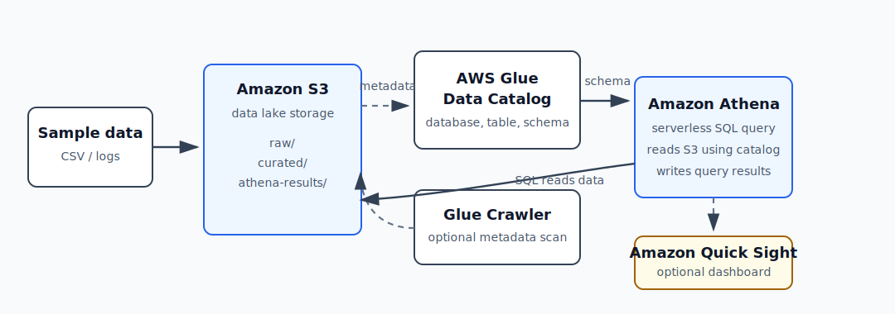

# 项目 5：数据湖入门

项目 5 学的是 **把 S3 里的文件当数据表来查询**。

一句话：

```text
CSV / 日志文件放在 S3
  -> Glue Data Catalog 记录这些文件的表结构
  -> Athena 用 SQL 查询 S3 里的文件
  -> 查询结果写回 S3
  -> Quick / QuickSight 后续可以做 dashboard
```

架构图：



## 当前状态

```text
开始日期：2026-05-01
Region: eu-central-1 / Europe (Frankfurt)
状态：已创建学习 note 和架构图；AWS 资源还没有创建
```

本项目先理解概念，再创建资源。低成本原则：

```text
只用小 CSV 文件
先手动建 Glue/Athena 表，不急着跑 Glue Crawler
Quick / QuickSight 只做概念了解，不强制开通
项目完成后删除 Glue table/database、S3 数据和 Athena 查询结果
```

## 项目目标

项目 4 学的是：

```text
文件上传后自动处理
```

项目 5 往前走一步：

```text
文件已经在 S3 里了，怎么像查数据库一样查询它？
```

最终要能回答：

```text
S3 负责存数据文件。
Glue Data Catalog 负责记录这些数据文件长什么样。
Athena 负责用 SQL 读取 S3 文件。
Quick / QuickSight 可以把查询结果做成图表和 dashboard。
```

## 计划使用的 AWS 资源

| 资源 | 计划名称 | 作用 |
| --- | --- | --- |
| S3 data bucket | `xzhu-aws-learning-data-lake-20260501` | 放 CSV 数据和查询结果 |
| S3 raw prefix | `raw/learning-events/` | 原始 CSV 数据 |
| S3 Athena results prefix | `athena-results/` | Athena 查询结果输出 |
| Glue database | `aws_learning_lake` | 组织数据表的 metadata database |
| Glue table | `learning_events_csv` | 描述 CSV 文件的表结构和 S3 位置 |
| Athena workgroup | 默认 `primary` 或后续单独建 | 执行 SQL 查询 |
| Quick / QuickSight | 不强制创建 | 后续理解 BI dashboard |

## 核心架构

```text
Local CSV
  -> S3 raw data
  -> Glue Data Catalog table
  -> Athena SQL query
  -> S3 query results
```

更具体：

```text
sample.csv
  -> s3://xzhu-aws-learning-data-lake-20260501/raw/learning-events/year=2026/month=05/day=01/sample.csv
  -> Glue database: aws_learning_lake
  -> Glue table: learning_events_csv
  -> Athena: SELECT * FROM learning_events_csv LIMIT 10;
  -> s3://xzhu-aws-learning-data-lake-20260501/athena-results/
```

## 新概念解释

### Data Lake / 数据湖

数据湖是一个集中存放数据的地方。它通常先把原始数据放进去，再由不同分析工具来读取。

在 AWS 里，最常见的形状是：

```text
S3 = 数据湖的存储层
Glue Data Catalog = 数据湖的目录和表结构
Athena / EMR / Glue / Quick = 读取和分析数据的工具
```

数据湖可以存：

```text
CSV
JSON
Parquet
日志
图片
半结构化数据
原始备份
清洗后的数据
```

### S3 在项目 5 里的角色

项目 2 里，S3 存静态网站文件。

项目 4 里，S3 存上传文件和处理结果。

项目 5 里，S3 是数据湖存储层：

```text
raw/      原始数据
curated/  清洗或转换后的数据
athena-results/  Athena 查询结果
```

重点：

```text
S3 只存文件。
S3 自己不知道 CSV 有哪些列，也不会直接理解 SQL。
```

### Metadata / 元数据

元数据就是“描述数据的数据”。

比如 CSV 文件本身是数据：

```text
2026-05-01,Project 5 kickoff,Athena,30
```

描述它的列名和类型就是元数据：

```text
event_date: date
title: string
service: string
minutes: int
```

项目 5 最重要的一句话：

```text
Glue Data Catalog 存的是元数据，不是原始数据文件。
```

### Schema / 表结构

Schema 是一张表的结构定义。

它回答：

```text
这张表有哪些列？
每一列是什么类型？
数据文件在哪里？
文件格式是什么？
有没有分区？
```

例子：

```text
table: learning_events_csv
columns:
  event_date date
  title string
  service string
  minutes int
location:
  s3://.../raw/learning-events/
format:
  CSV
```

### AWS Glue Data Catalog

Glue Data Catalog 是 AWS 的数据目录。

它像数据库的“目录本”：

```text
有哪些 database？
每个 database 下面有哪些 table？
每张 table 有哪些 columns？
这张 table 对应 S3 的哪个路径？
文件格式是什么？
```

它不负责跑 SQL，也不保存 CSV 内容本身。

它负责告诉 Athena：

```text
如果用户查询 learning_events_csv，
你要去哪个 S3 path 读文件，
按照什么列和类型来解释这些文件。
```

### Glue Database

Glue database 不是传统数据库服务器。

它只是 Glue Data Catalog 里的一个 metadata 容器。

类似：

```text
database: aws_learning_lake
  table: learning_events_csv
  table: api_logs_csv
  table: file_processing_results
```

### Glue Table

Glue table 也不是把数据复制进 Glue。

它是一个 metadata definition：

```text
表名
字段
字段类型
S3 location
文件格式
分区信息
```

Athena 查询 table 时，真正读取的是 S3 里的文件。

### Glue Crawler

Crawler 是 Glue 的自动扫描工具。

它可以：

```text
扫描 S3 路径
推断 CSV / JSON / Parquet 的列和类型
自动创建或更新 Glue table
```

项目 5 第一版可以不急着用 Crawler，因为手动建表更有助于理解：

```text
先手动写清楚 schema
再让 Athena 查询
```

等概念熟了，再用 Crawler 省人工配置。

### Amazon Athena

Athena 是 serverless SQL 查询服务。

它的特点：

```text
不用启动数据库服务器
不用把数据导入数据库
直接对 S3 文件执行 SQL
查询结果写回 S3
按查询扫描的数据量计费
```

Athena 依赖 Glue Data Catalog 的 metadata 来理解 S3 文件：

```text
SQL query
  -> Athena 查 Glue Catalog
  -> 找到 table schema 和 S3 location
  -> 读取 S3 文件
  -> 返回结果
```

### Athena Query Results

Athena 每次查询都会把结果保存到 S3。

所以第一次用 Athena 前，需要设置 query result location：

```text
s3://xzhu-aws-learning-data-lake-20260501/athena-results/
```

这个路径不是原始数据，而是 Athena 输出结果。

### Schema-on-read

传统数据库通常是 schema-on-write：

```text
写入数据前，先定义表结构。
数据写入数据库时就按 schema 校验和存储。
```

数据湖常见的是 schema-on-read：

```text
文件先放到 S3。
查询时再根据 Glue table 的 schema 解释这些文件。
```

这让数据湖很灵活，但也意味着：

```text
如果 schema 定义错了，查询结果也会错。
```

### Partition / 分区

分区是用目录结构帮助查询少扫数据。

常见按日期分区：

```text
raw/learning-events/year=2026/month=05/day=01/file.csv
raw/learning-events/year=2026/month=05/day=02/file.csv
```

如果查询只看 2026-05-01：

```sql
WHERE year = 2026 AND month = 5 AND day = 1
```

Athena 可以少读无关目录，从而：

```text
查询更快
扫描数据更少
成本更低
```

### CSV 和 Parquet

CSV：

```text
人能直接看
适合学习和小数据
没有强类型
查询时通常要扫描更多内容
```

Parquet：

```text
列式存储
适合分析查询
支持压缩
查询只需要部分列时更省扫描量
通常比 CSV 更适合 Athena / 数据湖分析
```

项目 5 第一版用 CSV，因为容易理解。后续再学怎么把 CSV 转成 Parquet。

### ETL

ETL 是数据处理流程：

```text
Extract   抽取数据
Transform 转换 / 清洗数据
Load      加载到目标位置
```

项目 5 第一版几乎不做复杂 ETL，只先理解：

```text
CSV 文件进入 S3
Glue 描述文件
Athena 查询文件
```

后续如果把 CSV 转成 Parquet，就是一次简单的 Transform。

### 数据湖和数据仓库

数据湖：

```text
先存大量原始数据
格式更灵活
适合日志、文件、半结构化数据、机器学习、探索分析
常用 S3 + Glue + Athena
```

数据仓库：

```text
更强调结构化表和高性能分析
数据通常先清洗建模
适合稳定报表、BI、业务指标分析
AWS 里常见是 Redshift
```

短记：

```text
数据湖 = 先把数据存下来，查询时再解释。
数据仓库 = 先整理成结构化模型，再高效查询。
```

### Amazon Quick / QuickSight

Amazon QuickSight 已经被 AWS 归入 Amazon Quick 体系。可以先这样理解：

```text
Quick / QuickSight = BI 和 dashboard 层
```

它可以连接 Athena，然后把 SQL 查询结果做成：

```text
图表
仪表盘
业务报表
交互式分析
```

项目 5 不强制开通 Quick / QuickSight，因为它可能涉及用户订阅和 BI 资源。我们先知道它处在架构最上层：

```text
S3 + Glue + Athena 准备好可查询数据
Quick / QuickSight 用来可视化这些数据
```

## 三条要写的 SQL

项目 5 最少写三类 SQL：

总数统计：

```sql
SELECT count(*) AS event_count
FROM learning_events_csv;
```

按日期聚合：

```sql
SELECT event_date, count(*) AS event_count, sum(minutes) AS total_minutes
FROM learning_events_csv
GROUP BY event_date
ORDER BY event_date;
```

按服务筛选：

```sql
SELECT *
FROM learning_events_csv
WHERE service = 'Athena';
```

## 验收标准

- [ ] S3 中有一份小 CSV 数据。
- [ ] Glue Data Catalog 中有 database。
- [ ] Glue Data Catalog 中有 table。
- [ ] Athena 能查询 S3 中的数据。
- [ ] Athena query result 写回 S3。
- [ ] 能解释 S3、Glue Data Catalog、Athena 的关系。
- [ ] 能解释 metadata、schema、crawler、partition。
- [ ] 能说清 CSV 和 Parquet 的区别。
- [ ] 能说清数据湖和数据仓库的区别。

## 清理步骤

项目完成后按这个顺序清理：

```text
1. 删除 Athena 查询结果对象：s3://.../athena-results/
2. 删除 Glue table: learning_events_csv。
3. 删除 Glue database: aws_learning_lake。
4. 删除 S3 raw data。
5. 清空并删除项目 5 的 S3 bucket。
6. 如果创建了 crawler，也删除 crawler 和 crawler role。
7. 如果创建了 CloudWatch Logs，也删除不再需要的 log group。
```

## 费用提醒

项目 5 可能产生费用的地方：

```text
S3 存储和请求
Athena 查询扫描数据量
Athena 查询结果存储
Glue Crawler 运行
Quick / QuickSight 用户订阅或容量
```

低成本规则：

```text
只上传小 CSV。
Athena 只跑少量查询。
先不用 Glue Crawler。
先不开 Quick / QuickSight。
做完就删除资源。
```

## 复盘问题

- 数据湖解决什么问题？
- S3 在数据湖里负责什么？
- Glue Data Catalog 存的是数据本身，还是 metadata？
- Glue database 和传统数据库有什么不同？
- Athena 为什么不需要你启动数据库服务器？
- Athena 查询结果为什么也要写回 S3？
- 什么是 schema-on-read？
- 为什么 partition 可以降低查询成本？
- 为什么 Parquet 通常比 CSV 更适合分析？
- 数据湖和数据仓库有什么区别？
- Quick / QuickSight 在这条链路中处在哪一层？

## 官方参考

- [Amazon Athena 官方说明](https://docs.aws.amazon.com/athena/latest/ug/what-is.html)
- [AWS Glue Data Catalog 官方说明](https://docs.aws.amazon.com/glue/latest/dg/catalog-and-crawler.html)
- [Amazon S3 as data lake storage platform](https://docs.aws.amazon.com/whitepapers/latest/building-data-lakes/amazon-s3-data-lake-storage-platform.html)
- [Amazon Quick 官方说明](https://docs.aws.amazon.com/quick/latest/userguide/what-is.html)
- [Athena columnar storage formats](https://docs.aws.amazon.com/athena/latest/ug/columnar-storage.html)
