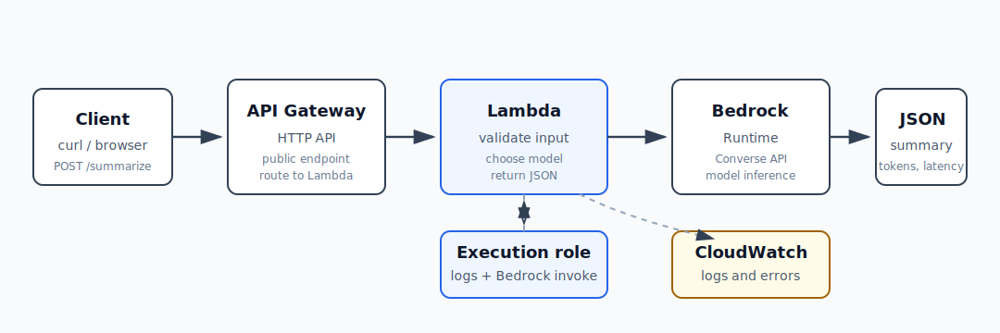

# AI-2：Bedrock Serverless API



## 目标

把 AI-1 里的本地 Bedrock 调用，放进 AWS Serverless 架构里，通过 HTTP API 调用模型。

## 架构

```text
Client / curl
  -> API Gateway HTTP API
  -> Lambda
  -> Bedrock Runtime
  -> CloudWatch Logs
```

## 本节要学的 AWS 重点

- API Gateway 负责 HTTP 入口。
- Lambda 负责运行 Python 代码。
- Lambda execution role 负责给 Lambda 调 Bedrock 的权限。
- Bedrock Runtime 负责模型推理。
- CloudWatch Logs 负责查看 Lambda 日志和错误。

## 为什么前端不直接调用 Bedrock？

Bedrock 是 AWS API，调用它需要 AWS 身份和权限。前端代码运行在用户浏览器里，天然不可信，所以不应该把能调用 Bedrock 的 AWS 凭证放到前端。

### 1. 凭证暴露风险

如果浏览器直接调 Bedrock，就需要某种 AWS 凭证：

```text
access key
secret access key
session token
```

这些一旦进入前端，用户就可以在浏览器 DevTools 或网络请求里看到。别人拿到后可以用你的 AWS 账号调用模型，产生费用或访问不该访问的资源。

### 2. 权限边界太难控制

前端用户不是 AWS IAM 用户。业务上真正想表达的是：

```text
这个用户可以请求一次 summarize
但不能直接调用任意 Bedrock model
不能把 max_tokens 改到超大
不能访问你的 S3
不能访问别人的数据
```

这些规则更适合放在后端 Lambda 里。

### 3. 输入校验和成本控制

如果前端直连 Bedrock，用户可以构造任意请求：

```text
超长 prompt
高 max_tokens
高频请求
更贵模型
绕过你的限制
```

Lambda 可以统一做：

```text
限制文本长度
固定 model id
限制 max_tokens
做 auth / rate limit
记录 user id 或 request id
拒绝异常请求
```

### 4. 日志和排查

生产环境需要知道：

```text
谁调用的
何时调用
用了哪个模型
耗时多久
输入输出大概多少 token
失败类型是什么
```

这些应该进入 CloudWatch Logs。前端直连 Bedrock 很难可靠保留 server-side 日志。

### 5. 后续扩展

现在只是：

```text
API -> Bedrock
```

以后可能变成：

```text
API -> Lambda
   -> Bedrock
   -> DynamoDB 记录请求
   -> S3 保存结果
   -> SQS 异步处理
   -> CloudWatch 监控
```

Lambda 是这条链路的后端控制点。

一句话：

```text
前端负责发业务请求，Lambda 负责拿 AWS 权限、做校验、控成本、打日志，再安全地调用 Bedrock。
```

## 职责边界

| 组件 | 职责 | 不负责什么 |
| --- | --- | --- |
| Client / curl | 发 HTTP 请求，传业务输入 | 不持有 AWS 凭证，不直接调 Bedrock |
| API Gateway | 提供公网 HTTP 入口，路由请求到 Lambda | 不写主要业务逻辑，不直接做模型推理 |
| Lambda | 校验输入、选择模型、调用 Bedrock、整理响应、记录日志 | 不保存长期数据，除非显式接 S3/DynamoDB |
| Lambda execution role | 给 Lambda 授权调用 Bedrock | 不代表终端用户身份，不应该给管理员通配权限 |
| Bedrock Runtime | 执行模型推理并返回结果 | 不负责业务鉴权、用户配额、应用日志 |
| CloudWatch Logs | 保存 Lambda 运行日志和错误 | 不自动替你设计日志字段或成本策略 |

## API Gateway 基础概念

API Gateway 的核心问题是：

```text
外部来了一个 HTTP 请求，我应该把它交给谁处理？
```

一个请求大概长这样：

```http
POST /summarize
Host: 3ygnpvwuf1.execute-api.us-east-1.amazonaws.com
Content-Type: application/json

{"text":"..."}
```

### Method：`GET` / `POST` 是什么

`GET`、`POST` 叫 HTTP method，表示这个请求想做什么。

常见 method：

| Method | 常见含义 |
| --- | --- |
| `GET` | 读取数据 |
| `POST` | 提交数据、创建任务、让后端处理一件事 |
| `PUT` | 整体更新 |
| `PATCH` | 局部更新 |
| `DELETE` | 删除 |

例子：

```http
GET /notes
```

意思是读取 notes 列表。

```http
POST /summarize
```

意思是提交一段文本，请后端总结。

AI-2 用 `POST`，因为 summarize 需要把一段文本放进请求 body：

```json
{"text":"Amazon Bedrock ..."}
```

`GET` 通常不适合放大段 body，也不适合表达“处理这个输入并生成结果”。

### Path：`/summarize` 是什么

`/summarize` 是 URL path，也就是 API 的业务路径。

完整 URL：

```text
https://3ygnpvwuf1.execute-api.us-east-1.amazonaws.com/summarize
```

拆开：

```text
https://3ygnpvwuf1.execute-api.us-east-1.amazonaws.com  API 的入口域名
/summarize                                             具体功能路径
```

`/summarize` 不是 AWS 固定名字，而是自己定义的业务路径。也可以叫：

```text
/summary
/ai/summarize
/v1/summarize
/bedrock/summarize
```

AI-2 叫 `/summarize`，是因为这个 API 的功能是总结文本。

### Route：`POST /summarize` 是什么

在 API Gateway 里，route 通常是：

```text
METHOD + PATH
```

所以：

```text
POST /summarize
```

是一条 route。

它的意思是：

```text
如果有人用 POST 请求 /summarize
就把请求交给某个 integration
```

在 AI-2 里：

```text
POST /summarize
  -> Lambda ai-2-bedrock-summarize
```

如果有人访问：

```text
GET /summarize
```

那是另一条 route。如果没有配置它，就可能返回 not found 或 method 不匹配。

### Integration 是什么

Integration 是 API Gateway 后面接谁。

AI-2 的 integration 是 Lambda：

```text
API Gateway
  -> Lambda ai-2-bedrock-summarize
```

API Gateway 也可以接其他后端，例如：

```text
HTTP backend
AWS service
VPC link
```

但本项目只用 Lambda。

### Stage 是什么

Stage 可以理解成 API 的部署环境或发布层。

常见 stage 名：

```text
dev
test
prod
v1
```

如果 stage 叫 `dev`，URL 可能是：

```text
https://xxxx.execute-api.us-east-1.amazonaws.com/dev/summarize
```

如果 stage 叫 `prod`，URL 可能是：

```text
https://xxxx.execute-api.us-east-1.amazonaws.com/prod/summarize
```

### `$default` 是什么

`$default` 是 HTTP API 的默认 stage。

它的特点是：URL 里不需要额外写 stage 名。

所以当前 URL 是：

```text
https://3ygnpvwuf1.execute-api.us-east-1.amazonaws.com/summarize
```

而不是：

```text
https://3ygnpvwuf1.execute-api.us-east-1.amazonaws.com/prod/summarize
```

也就是说：

```text
$default stage = 直接把 route 挂在根路径下面
```

学习阶段用 `$default` 很方便，因为 URL 短，少一层概念。

### 当前请求如何流动

curl 请求：

```bash
curl -X POST "https://3ygnpvwuf1.execute-api.us-east-1.amazonaws.com/summarize" \
  -H "content-type: application/json" \
  -d '{"text":"..."}'
```

API Gateway 看到：

```text
Method: POST
Path: /summarize
Stage: $default
```

然后匹配 route：

```text
POST /summarize
```

找到 integration：

```text
Lambda ai-2-bedrock-summarize
```

再把请求转给 Lambda。

Lambda 收到的 event 大概会包含：

```json
{
  "body": "{\"text\":\"...\"}",
  "requestContext": {
    "http": {
      "method": "POST",
      "path": "/summarize"
    }
  }
}
```

Lambda 读取：

```python
body = event.get("body")
text = body.get("text")
```

然后调用 Bedrock。

最短记忆：

```text
Method = 想干什么
Path = 对哪个功能
Route = Method + Path
Integration = 后面交给谁
Stage = 哪个发布环境
$default = 默认发布环境，URL 不加环境前缀
```

## Lambda execution role

Lambda 不是用你的个人身份去调用 Bedrock。Lambda 运行时会 assumed 一个 IAM role，这个 role 叫：

```text
Lambda execution role
```

AI-2 当前 role：

```text
ai-2-bedrock-api-lambda-role
```

调用链里的身份关系：

```text
Client
  -> API Gateway
  -> Lambda
  -> Lambda execution role
  -> Bedrock Runtime
```

所以 Bedrock 权限应该授予 `Lambda execution role`，而不是授予前端用户、API Gateway、root user 或本机 `aws-learning` profile。

### trust policy 和 permission policy

`trust policy` 回答：

```text
谁可以扮演这个 role？
```

Lambda execution role 的 trusted entity 是：

```text
lambda.amazonaws.com
```

`permission policy` 回答：

```text
这个 role 被扮演以后可以做什么？
```

AI-2 需要：

```text
写 CloudWatch Logs
调用指定 Bedrock model
```

学习阶段先给 role 挂 AWS 托管策略：

```text
AWSLambdaBasicExecutionRole
```

它负责让 Lambda 写 CloudWatch Logs。

然后再加一个 inline policy，允许调用 Bedrock。

## Bedrock 权限排查记录：Region 选错导致 ARN 不匹配

### 初始目标

最小权限的理想状态是：

```text
这个 Lambda 只会写日志
只会调用指定 Bedrock 模型
别的都不行
```

一开始尝试只允许单个 foundation model ARN：

```json
{
  "Effect": "Allow",
  "Action": [
    "bedrock:InvokeModel",
    "bedrock:InvokeModelWithResponseStream"
  ],
  "Resource": "arn:aws:bedrock:eu-central-1::foundation-model/openai.gpt-oss-20b-1:0"
}
```

Lambda 测试返回：

```json
{
  "statusCode": 500,
  "body": "{\"ok\": false, \"error\": \"AccessDeniedException\"}"
}
```

### 临时放宽权限验证

为了确认是 `Resource` ARN 不匹配，而不是代码问题，临时把 Resource 放宽为：

```json
{
  "Effect": "Allow",
  "Action": [
    "bedrock:InvokeModel",
    "bedrock:InvokeModelWithResponseStream"
  ],
  "Resource": "*"
}
```

测试成功：

```json
{
  "statusCode": 200,
  "body": "{\"ok\": true, \"model_id\": \"openai.gpt-oss-20b-1:0\", ...}"
}
```

结论：

```text
Lambda 代码没有问题。
Bedrock model access 没有问题。
失败点在 IAM policy 的 Resource ARN 范围。
```

### 尝试只允许 Frankfurt foundation models

接着尝试：

```json
{
  "Effect": "Allow",
  "Action": [
    "bedrock:InvokeModel",
    "bedrock:InvokeModelWithResponseStream"
  ],
  "Resource": "arn:aws:bedrock:eu-central-1::foundation-model/*"
}
```

仍然失败：

```text
AccessDeniedException
```

这一步当时容易误判成“Bedrock 背后需要其他 Region 的资源 ARN”。正确做法是继续看 CloudWatch Logs 里的完整错误，同时确认 Lambda / API Gateway / Bedrock client 所在 Region 是否一致。

### CloudWatch Logs 中的真实拒绝资源

CloudWatch Logs 里的错误行：

```text
User: arn:aws:sts::089781651608:assumed-role/ai-2-bedrock-api-lambda-role/ai-2-bedrock-summarize is not authorized to perform: bedrock:InvokeModel on resource: arn:aws:bedrock:us-east-1::foundation-model/openai.gpt-oss-20b-1:0 because no identity-based policy allows the bedrock:InvokeModel action
```

关键点：

```text
被拒绝的 resource 是 us-east-1 的 foundation model ARN。
这说明实际调用 Bedrock 的 Lambda 环境/客户端 Region 是 us-east-1，和原本计划的 eu-central-1 不一致。
```

后来 API Gateway Invoke URL 也显示：

```text
https://3ygnpvwuf1.execute-api.us-east-1.amazonaws.com
```

这进一步说明本次 AI-2 资源创建到了 `us-east-1`，而不是原计划的 `eu-central-1`。

### 正确结论

这次错误不是 Bedrock 必然要求同时授权 `eu-central-1` 和 `us-east-1`。

更准确的结论是：

```text
创建 Lambda / API Gateway 时选错了 Region，导致实际 Bedrock 调用发生在 us-east-1。
IAM policy 却只允许 eu-central-1 的 foundation-model ARN，所以被拒绝。
```

### 如果继续使用 us-east-1 资源

如果当前 Lambda 和 API Gateway 都保留在 `us-east-1`，inline policy 应该允许 `us-east-1` 的模型 ARN：

```json
{
  "Version": "2012-10-17",
  "Statement": [
    {
      "Sid": "AllowInvokeSelectedBedrockModel",
      "Effect": "Allow",
      "Action": [
        "bedrock:InvokeModel",
        "bedrock:InvokeModelWithResponseStream"
      ],
      "Resource": "arn:aws:bedrock:us-east-1::foundation-model/openai.gpt-oss-20b-1:0"
    }
  ]
}
```

如果要坚持使用 `eu-central-1` 作为学习默认 Region，应删除或忽略这次 `us-east-1` 的 API/Lambda，重新在 `eu-central-1` 创建 Lambda、role policy 和 API Gateway。

测试成功：

```json
{
  "statusCode": 200,
  "body": "{\"ok\": true, \"model_id\": \"openai.gpt-oss-20b-1:0\", \"latency_ms\": 646, \"input_tokens\": 122, \"output_tokens\": 214, \"stop_reason\": \"end_turn\", ...}"
}
```

本次排查结论：

```text
遇到 AccessDeniedException 时，不要只猜 policy。
先去 CloudWatch Logs 找完整错误。
错误里的 resource ARN 会暴露实际被调用的 Region 和资源。
如果 ARN 的 Region 和预期不同，优先检查 Console 当前 Region 是否选错。
```

参考：

- [Bedrock Converse API](https://docs.aws.amazon.com/bedrock/latest/APIReference/API_runtime_Converse.html)
- [Bedrock inference profile prerequisites](https://docs.aws.amazon.com/bedrock/latest/userguide/inference-profiles-prereq.html)

## API Gateway 调用与 Lambda timeout 排查

### curl 调用 API Gateway

API Gateway Invoke URL：

```text
https://3ygnpvwuf1.execute-api.us-east-1.amazonaws.com
```

测试命令：

```bash
curl -X POST "https://3ygnpvwuf1.execute-api.us-east-1.amazonaws.com/summarize" \
  -H "content-type: application/json" \
  -d '{"text":"Amazon Bedrock lets developers build generative AI applications using foundation models through AWS APIs. Lambda can call Bedrock securely with an execution role, while API Gateway exposes a public HTTP endpoint."}'
```

第一次返回：

```json
{
  "message": "Internal Server Error"
}
```

这个错误是 API Gateway 对后端失败的简化包装。真正原因要去 Lambda 的 CloudWatch Logs 看。

### CloudWatch Logs 中的 timeout

Lambda 日志：

```text
INIT_START Runtime Version: python:3.12...
START RequestId: 404fe344-a0fe-4ebe-8d8f-47baef0261d3 Version: $LATEST
END RequestId: 404fe344-a0fe-4ebe-8d8f-47baef0261d3
REPORT RequestId: 404fe344-a0fe-4ebe-8d8f-47baef0261d3 Duration: 3000.00 ms Billed Duration: 3451 ms Memory Size: 128 MB Max Memory Used: 85 MB Init Duration: 450.45 ms Status: timeout
```

关键点：

```text
Duration: 3000.00 ms
Status: timeout
```

说明 Lambda 使用默认 `3 seconds` timeout。通过 API Gateway 调用时，冷启动、网络请求和 Bedrock 推理加起来超过 3 秒，Lambda 被强制中断。

### 修复

在 Console 中修改：

```text
Lambda
  -> ai-2-bedrock-summarize
  -> Configuration
  -> General configuration
  -> Edit
  -> Timeout: 15 seconds
```

Memory 暂时保持：

```text
128 MB
```

### 修复后结果

重新 curl 后成功：

```json
{
  "ok": true,
  "model_id": "openai.gpt-oss-20b-1:0",
  "latency_ms": 4670,
  "input_tokens": 116,
  "output_tokens": 189,
  "stop_reason": "end_turn",
  "summary": "- Amazon Bedrock offers foundation models for building generative-AI apps via AWS APIs.\n- AWS Lambda can securely call Bedrock using an execution role.\n- API Gateway can expose Bedrock as a public HTTP endpoint."
}
```

结论：

```text
Lambda 默认 3 秒 timeout 不适合模型调用。
Bedrock API 要预留冷启动、网络、模型推理时间。
学习阶段可以先设 15 秒。
生产阶段需要根据 P95/P99 延迟、模型选择、重试策略和 API Gateway timeout 重新设计。
```

## 待补充

- Lambda 事件格式和 API Gateway 请求有什么关系？
- Lambda 如何调用 `bedrock-runtime`？
- CloudWatch Logs 里应该记录哪些字段？
- Lambda timeout 应该如何设置？

## 清理顺序

AI-2 创建过的 AWS 资源：

| 资源 | 名称 / 线索 | 作用 |
| --- | --- | --- |
| API Gateway HTTP API | `ai-2-bedrock-api`，Invoke URL 类似 `https://3ygnpvwuf1.execute-api.us-east-1.amazonaws.com` | 公网 HTTP 入口 |
| Lambda function | `ai-2-bedrock-summarize` | 调用 Bedrock 的后端函数 |
| IAM role | `ai-2-bedrock-api-lambda-role` | Lambda execution role |
| Inline policy | `ai-2-bedrock-invoke-selected-model` | 允许 Lambda 调 Bedrock |
| CloudWatch Log Group | `/aws/lambda/ai-2-bedrock-summarize` | Lambda 日志 |

推荐清理顺序：

```text
1. 删除 API Gateway，先断掉公网入口。
2. 删除 Lambda function，停止计算入口。
3. 删除 IAM role，收回 Lambda execution role 权限。
4. 删除 CloudWatch Log Group，清理日志存储。
```

为什么先删 API Gateway：

```text
先断公网入口
  -> 再删 Lambda
  -> 再删权限
  -> 最后清日志
```

这样可以避免外部请求还在打进来时，后端资源已经被拆掉。

## 清理记录

清理日期：2026-05-02

Region：

```text
us-east-1
```

已删除资源：

| 资源 | 名称 / 线索 | 状态 |
| --- | --- | --- |
| API Gateway HTTP API | `ai-2-bedrock-api` / `https://3ygnpvwuf1.execute-api.us-east-1.amazonaws.com` | 已删除 |
| Lambda function | `ai-2-bedrock-summarize` | 已删除 |
| IAM role | `ai-2-bedrock-api-lambda-role` | 已删除 |
| Inline policy | `ai-2-bedrock-invoke-selected-model` | 随 IAM role 删除 |
| CloudWatch Log Group | `/aws/lambda/ai-2-bedrock-summarize` | 已删除 |

清理顺序：

```text
1. 删除 API Gateway，断掉公网入口。
2. 删除 Lambda function，停止后端计算。
3. 删除 IAM role，收回 Bedrock 和 CloudWatch Logs 权限。
4. 删除 CloudWatch Log Group，清理日志存储。
```

清理结论：

```text
AI-2 的公网入口、计算资源、权限角色和日志都已删除。
本地 note 和项目骨架保留，用于复盘和以后重建。
```
