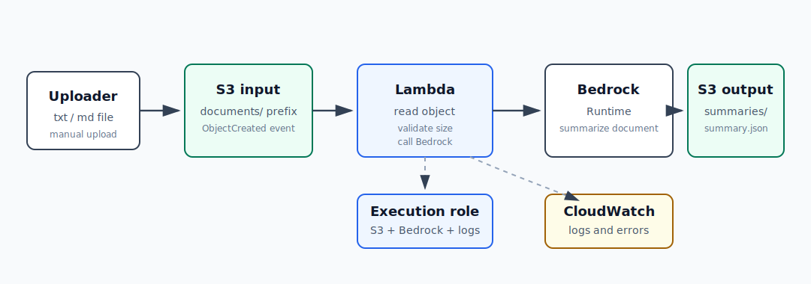

# AI-3：S3 AI 文档处理流水线



## 目标

把触发方式从 AI-2 的 HTTP 请求换成 S3 文件上传事件：

```text
上传文档到 S3 input bucket
  -> S3 ObjectCreated event
  -> Lambda
  -> Bedrock Runtime
  -> S3 output bucket
  -> CloudWatch Logs
```

本节重点不是 prompt，而是 AWS 工程：

- S3 input bucket 和 output bucket 的职责拆分。
- S3 event notification 如何触发 Lambda。
- Lambda 如何读取 S3 object。
- Lambda 如何调用 Bedrock Runtime。
- AI 处理结果如何写回 S3。
- CloudWatch Logs 如何排查失败。
- 文件大小、Lambda timeout、Bedrock 成本如何控制。
- 实验结束后如何清理资源。

## 推荐资源命名

Region 默认使用：

```text
eu-central-1
```

学习资源建议命名：

| 资源 | 建议名称 |
| --- | --- |
| S3 input bucket | `xzhu-ai-3-doc-input-20260502` |
| S3 output bucket | `xzhu-ai-3-doc-output-20260502` |
| Lambda function | `ai-3-s3-document-summarizer` |
| IAM role | `ai-3-s3-document-summarizer-role` |
| CloudWatch Log Group | `/aws/lambda/ai-3-s3-document-summarizer` |

如果 bucket 名称已被占用，给 bucket 加随机后缀。S3 bucket 名称是全局唯一的。

## 职责边界

| 组件 | 职责 |
| --- | --- |
| S3 input bucket | 接收原始文档 |
| S3 event notification | 在对象创建时触发 Lambda |
| Lambda | 读取文件、校验大小、调用 Bedrock、写结果 |
| Lambda execution role | 允许 Lambda 读 input、写 output、调用 Bedrock、写日志 |
| Bedrock Runtime | 生成摘要或结构化结果 |
| S3 output bucket | 保存 `summary.json` |
| CloudWatch Logs | 记录处理结果、错误和排查信息 |

## 操作步骤草案

1. 创建 input bucket 和 output bucket。
2. 创建 Lambda execution role。
3. 给 role 添加权限：CloudWatch Logs、读 input bucket、写 output bucket、调用 Bedrock。
4. 创建 Lambda function。
5. 在 Lambda 里写 S3 event handler。
6. 配置 input bucket 的 S3 event notification。
7. 上传小 `.txt` 或 `.md` 文件到 input bucket。
8. 检查 output bucket 是否生成 summary JSON。
9. 查看 CloudWatch Logs。
10. 清理 S3、Lambda、IAM role、CloudWatch Logs。

## 待学习问题

- S3 event 传给 Lambda 的 event 长什么样？
- Lambda 读取 S3 object 时需要哪些 IAM action？
- 为什么 output bucket 最好和 input bucket 分开？
- 如何避免 Lambda 处理自己写出的 output 文件导致递归触发？
- 文件太大时应该怎么处理？
- Bedrock 调用失败时如何记录 source bucket/key？
- 结果 JSON 应该包含哪些 metadata？

## 本次实测记录

### 创建的 S3 buckets

| 用途 | Bucket | Region |
| --- | --- | --- |
| input | `xzhu-ai-3-doc-input-20260502-a7x9` | `eu-central-1` |
| output | `xzhu-ai-3-doc-output-20260502` | `eu-central-1` |

### 测试文件

本地测试文件：

```text
projects/aws-ai/ai-3-s3-ai-document-pipeline/bedrock-note.txt
```

上传到 input bucket 后的 object key：

```text
documents/bedrock-note.txt
```

S3 trigger 配置：

```text
Event type: ObjectCreated
Prefix: documents/
Suffix: .txt
```

所以会触发：

```text
documents/bedrock-note.txt
```

不会触发：

```text
bedrock-note.txt
documents/bedrock-note.md
other/bedrock-note.txt
```

### CloudWatch Logs 中的 S3 event 关键字段

Lambda 收到的 event 里最重要的是：

```json
{
  "eventSource": "aws:s3",
  "awsRegion": "eu-central-1",
  "eventName": "ObjectCreated:Put",
  "s3": {
    "bucket": {
      "name": "xzhu-ai-3-doc-input-20260502-a7x9",
      "arn": "arn:aws:s3:::xzhu-ai-3-doc-input-20260502-a7x9"
    },
    "object": {
      "key": "documents/bedrock-note.txt",
      "size": 520
    }
  }
}
```

Lambda 代码从这里取：

```text
input_bucket = record["s3"]["bucket"]["name"]
input_key = record["s3"]["object"]["key"]
```

### 成功执行日志

CloudWatch Logs 中 Lambda 打印：

```json
{
  "ok": true,
  "input_bucket": "xzhu-ai-3-doc-input-20260502-a7x9",
  "input_key": "documents/bedrock-note.txt",
  "output_bucket": "xzhu-ai-3-doc-output-20260502",
  "output_key": "summaries/documents/bedrock-note.txt.summary.json",
  "latency_ms": 1283
}
```

Lambda REPORT：

```text
Duration: 1570.68 ms
Billed Duration: 2078 ms
Memory Size: 128 MB
Max Memory Used: 95 MB
Init Duration: 506.62 ms
```

结论：

```text
S3 event 成功触发 Lambda。
Lambda 成功读取 input bucket 中的文档。
Lambda 成功调用 Bedrock Runtime。
Lambda 成功把 summary JSON 写入 output bucket。
```

### 输出文件

output bucket 中生成：

```text
summaries/documents/bedrock-note.txt.summary.json
```

建议检查 JSON 中是否包含：

```text
source.bucket
source.key
model_id
latency_ms
input_tokens
output_tokens
stop_reason
summary
```

## 当前完成状态

- [x] 创建 input bucket。
- [x] 创建 output bucket。
- [x] 创建 Lambda execution role。
- [x] 配置 S3 read / S3 write / Bedrock invoke / CloudWatch Logs 权限。
- [x] 创建 Lambda function。
- [x] 配置 S3 ObjectCreated trigger。
- [x] 上传测试 `.txt` 文件。
- [x] Lambda 被 S3 event 触发。
- [x] output bucket 生成 summary JSON。
- [x] CloudWatch Logs 可查看 event、执行结果和耗时。

## 清理顺序

AI-3 创建过的 AWS 资源：

| 资源 | 名称 / 线索 | 作用 |
| --- | --- | --- |
| S3 input bucket | `xzhu-ai-3-doc-input-20260502-a7x9` | 接收原始文档 |
| S3 output bucket | `xzhu-ai-3-doc-output-20260502` | 保存 summary JSON |
| S3 trigger | input bucket `ObjectCreated`，prefix `documents/`，suffix `.txt` | 上传文档时触发 Lambda |
| Lambda function | `ai-3-s3-document-summarizer` | 读取文档、调用 Bedrock、写结果 |
| IAM role | `ai-3-s3-document-summarizer-role` | Lambda execution role |
| CloudWatch Log Group | `/aws/lambda/ai-3-s3-document-summarizer` | Lambda 日志 |

推荐清理顺序：

```text
1. 删除 S3 trigger，先停止自动触发。
2. 删除 Lambda function，停止计算和 Bedrock 调用。
3. 删除 IAM role，收回 S3 / Bedrock / Logs 权限。
4. 清空并删除 input bucket。
5. 清空并删除 output bucket。
6. 删除 CloudWatch Log Group。
```

为什么先删 S3 trigger：

```text
先断事件触发
  -> 再删 Lambda
  -> 再删权限
  -> 再删数据存储
  -> 最后清日志
```

这样可以避免清理过程中上传或修改 S3 object 时继续触发 Lambda。

## 清理记录

清理日期：2026-05-02

Region：

```text
eu-central-1
```

已删除资源：

| 资源 | 名称 / 线索 | 状态 |
| --- | --- | --- |
| S3 trigger | input bucket `ObjectCreated`，prefix `documents/`，suffix `.txt` | 已删除 |
| Lambda function | `ai-3-s3-document-summarizer` | 已删除 |
| IAM role | `ai-3-s3-document-summarizer-role` | 已删除 |
| S3 input bucket | `xzhu-ai-3-doc-input-20260502-a7x9` | 已清空并删除 |
| S3 output bucket | `xzhu-ai-3-doc-output-20260502` | 已清空并删除 |
| CloudWatch Log Group | `/aws/lambda/ai-3-s3-document-summarizer` | 已删除 |

清理结论：

```text
AI-3 的事件触发、计算资源、权限角色、S3 数据和日志都已删除。
本地 note、架构图、README 和测试 txt 文件保留，用于复盘和以后重建。
```
