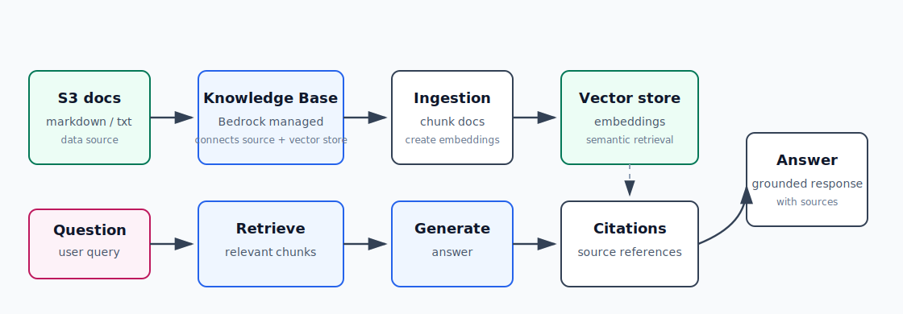

# AI-4：Bedrock Knowledge Bases / 托管 RAG



## 目标

学习 AWS 托管 RAG 的组件连接方式。你已经理解 RAG 原理，所以本节重点不是解释 embedding / vector search 的基础，而是掌握 Bedrock Knowledge Bases 在 AWS 里如何把这些能力托管起来。

目标链路：

```text
S3 documents
  -> Bedrock Knowledge Base
  -> ingestion job
  -> embeddings
  -> vector store
  -> retrieve-and-generate
  -> answer with citations
```

## 本节要学的 AWS 重点

- Knowledge Base 是什么。
- Data source 如何连接 S3。
- Ingestion job 做了什么。
- Embedding model 如何选择。
- Vector store 是谁创建和管理。
- Retrieve and generate 如何测试。
- Citation / source reference 怎么返回。
- 成本来自哪些组件。
- 实验结束后如何删除 Knowledge Base、vector store 和 S3 数据。

## 推荐资源命名

Region 默认使用：

```text
eu-central-1
```

学习资源建议命名：

| 资源 | 建议名称 |
| --- | --- |
| S3 bucket | `xzhu-ai-4-kb-docs-20260502` |
| S3 prefix | `docs/` |
| Knowledge Base | `ai-4-aws-notes-kb` |
| Data source | `ai-4-s3-docs` |
| IAM role | 由 Bedrock Console 自动创建，或手动创建后命名为 `ai-4-bedrock-kb-role` |

如果 S3 bucket 名称已被占用，加随机后缀。

## 推荐测试文档

本节可以先放 2-3 个小 Markdown / text 文档，例如：

```text
docs/bedrock-basics.md
docs/lambda-bedrock-api.md
docs/s3-document-pipeline.md
```

内容可以来自 AI-1、AI-2、AI-3 的学习笔记摘要。

## 职责边界

| 组件 | 职责 |
| --- | --- |
| S3 | 存放原始学习文档 |
| Knowledge Base | 管理数据源、embedding、vector store、检索配置 |
| Data source | 告诉 Knowledge Base 从哪里读文档 |
| Ingestion job | 读取文档、切分、生成 embedding、写入 vector store |
| Embedding model | 把文本 chunk 转成向量 |
| Vector store | 存向量并支持相似度检索 |
| Retrieve and generate | 根据问题检索相关片段，并调用生成模型回答 |
| Citation | 告诉回答依据来自哪些源文档或片段 |

## 本节实操记录

### 1. 创建 S3 文档源

创建 S3 bucket：

```text
xzhu-ai-4-kb-docs-20260502
```

上传文档到：

```text
s3://xzhu-ai-4-kb-docs-20260502/docs/
```

本节测试文档：

```text
docs/bedrock-basics.md
docs/lambda-bedrock-api.md
docs/s3-document-pipeline.md
```

这些文档是 Knowledge Base 的原始知识来源。Knowledge Base 不会训练模型，而是把这些文档解析、切分、向量化后放进 vector store。

### 2. 创建 Knowledge Base

Console 路径：

```text
Amazon Bedrock
  -> Builder tools
  -> Knowledge Bases
  -> Create knowledge base
```

创建结果：

| 配置项 | 值 |
| --- | --- |
| Knowledge Base name | `ai-4-aws-notes-kb` |
| Knowledge Base ID | `BHDJUFWYDC` |
| Region | `eu-central-1` |
| Type | Retrieval-Augmented Generation (RAG) |
| Service role | `AmazonBedrockExecutionRoleForKnowledgeBase_rsgau` |
| Data source | S3 |
| Data source ID | `XT9NESV5AC` |
| S3 URI | `s3://xzhu-ai-4-kb-docs-20260502/docs/` |

### 3. Parser 选择

本节选择：

```text
Amazon Bedrock Standard Parser
```

原因：本节上传的是 Markdown 文本文档，默认 parser 足够读取文本。

其他 parser 的作用：

| Parser | 适合场景 |
| --- | --- |
| Amazon Bedrock Standard Parser | Markdown、txt、csv、html、Word、Excel 等文本类文件 |
| Amazon Bedrock Data Automation as Parser | PDF、图片、音频、视频，尤其需要提取视觉或语音信息时 |
| Foundation models as Parser | 复杂 PDF、图片、版式强的文档，需要模型理解内容时 |

Parser 的位置在 ingestion 阶段：

```text
S3 file
  -> parser extracts text
  -> chunking
  -> embedding model
  -> vector store
```

### 4. Embedding model 和 vector store

选择 embedding model：

```text
Titan Embeddings v2.0 / On-Demand
```

选择 vector store：

```text
Amazon S3 Vectors - new
```

这两个选项的含义：

| 配置 | 作用 |
| --- | --- |
| Embedding model | 把文本 chunk 转成向量 |
| Vector store | 保存向量，并支持相似度检索 |
| Quick create new vector store | Bedrock 帮你创建新的向量存储 |
| S3 Vectors | 用 S3 vector bucket / vector index 存向量，适合学习和长期向量数据存储 |

创建 Knowledge Base 后，embedding model 和 vector store 不能随意更改。选错时通常新建一个 Knowledge Base 更简单。

### 5. Sync / Ingestion

创建完成后，Knowledge Base 还没有真正读入文档。需要在 Data source 处点击：

```text
Synchronisieren / Sync
```

Sync 做的事情：

```text
S3 docs/
  -> Bedrock Standard Parser 读取 Markdown 文本
  -> Chunking 把文档切成片段
  -> Titan Embeddings v2 把 chunk 转成向量
  -> S3 Vectors 保存向量和来源 metadata
```

重要点：

- S3 文件新增或修改后，Knowledge Base 通常不会自动立即知道。
- 需要再次对 data source 执行 Sync。
- Sync 成功后，测试面板和 API 才能检索到新内容。

## Console 测试

测试面板里有两个核心模式：

| 模式 | 对应 API | 作用 |
| --- | --- | --- |
| Nur Abruf: Datenquellen | `Retrieve` | 只返回相关 source chunks，不生成最终答案 |
| Abruf und Antwortgenerierung | `RetrieveAndGenerate` | 先检索 chunks，再用生成模型回答 |

测试问题：

```text
What is Amazon Bedrock according to my notes?
```

结果能返回带引用的回答，并在右侧显示 source blocks。

第二个测试问题：

```text
How does the S3 document pipeline work according to my notes?
```

`Nur Abruf` 的检索结果：

| 排名 | Source | 含义 |
| --- | --- | --- |
| 1 | `s3-document-pipeline.md` | 最相关，正确命中 |
| 2 | `lambda-bedrock-api.md` | 相关，因为也包含 Lambda 调 Bedrock |
| 3 | `bedrock-basics.md` | 弱相关，因为也提到 Bedrock Runtime / IAM |

这个现象说明：RAG 调试时要区分两个阶段。

```text
Retrieve 错了:
  检索阶段没有找到正确 chunk，需要看文档内容、chunking、top_k、metadata filter。

Generate 混了:
  检索结果是对的，但模型综合多个 chunk 回答，需要调 top_k、prompt、reranking。
```

## top_k / Quellblöcke

`Quellblöcke` 是每次从 vector store 返回多少个 source chunks。

常见取舍：

| top_k | 效果 |
| --- | --- |
| 小，例如 1 | 答案更聚焦，但可能漏掉上下文 |
| 大，例如 5 | 信息更全，但可能混入旁边相关内容 |

Console 默认返回多个 source blocks，所以答案可能同时引用多个文件。这个不是错误，而是 RAG 的常见行为。

## 本地代码：Retrieve

脚本：

```text
projects/aws-ai/ai-4-bedrock-knowledge-base-rag/kb_retrieve.py
```

运行：

```bash
uv run python projects/aws-ai/ai-4-bedrock-knowledge-base-rag/kb_retrieve.py
```

默认配置：

```text
profile: aws-learning
region: eu-central-1
knowledge_base_id: BHDJUFWYDC
top_k: 3
```

输出示例：

```text
[1] score=0.5560200835434524
source=s3://xzhu-ai-4-kb-docs-20260502/docs/s3-document-pipeline.md

[2] score=0.38873336973853134
source=s3://xzhu-ai-4-kb-docs-20260502/docs/lambda-bedrock-api.md

[3] score=0.37298715804207494
source=s3://xzhu-ai-4-kb-docs-20260502/docs/bedrock-basics.md
```

这个脚本只调用：

```text
bedrock-agent-runtime.retrieve
```

它不会调用生成模型，只返回 source chunks、score 和 S3 source URI。

## 本地代码：RetrieveAndGenerate

脚本：

```text
projects/aws-ai/ai-4-bedrock-knowledge-base-rag/kb_retrieve_and_generate.py
```

运行：

```bash
uv run python projects/aws-ai/ai-4-bedrock-knowledge-base-rag/kb_retrieve_and_generate.py
```

默认生成模型：

```text
openai.gpt-oss-20b-1:0
```

对应 model ARN：

```text
arn:aws:bedrock:eu-central-1::foundation-model/openai.gpt-oss-20b-1:0
```

这个脚本做两件事：

```text
1. 先调用 Retrieve，打印 retrieved_sources。
2. 再调用 RetrieveAndGenerate，打印 answer 和 citations。
```

这样设计是为了学习时更容易看清 RAG 的证据链。

## 遇到的 API 错误：custom prompt

第一次调用 `RetrieveAndGenerate` 时，遇到：

```text
ValidationException:
Custom prompt templates must be provided for both Orchestration and Generation when using the selected model.
```

原因：

```text
openai.gpt-oss-20b-1:0
```

在 Bedrock Knowledge Base 的 `RetrieveAndGenerate` API 中要求显式提供：

| Prompt | 作用 |
| --- | --- |
| Orchestration prompt | 控制如何把用户问题转成检索 query / 如何组织检索过程 |
| Generation prompt | 控制如何基于 `$search_results$` 生成最终答案 |

修复方式：在 API request 里加入：

```text
orchestrationConfiguration.promptTemplate.textPromptTemplate
generationConfiguration.promptTemplate.textPromptTemplate
```

其中 generation prompt 必须包含：

```text
$search_results$
```

这样模型才能拿到 Knowledge Base 检索出来的内容。

## Citation 现象

脚本成功生成答案后，`retrieved_sources` 正常显示：

```text
retrieved_sources: 3
source 1: s3://xzhu-ai-4-kb-docs-20260502/docs/s3-document-pipeline.md
```

但 `citations` payload 出现：

```text
generated_text=Sorry, I am unable to assist you with this request.
no retrievedReferences returned
```

这说明：

- Retrieve 阶段正常。
- RetrieveAndGenerate 阶段正常生成了答案。
- 但所选模型加自定义 prompt 后，Bedrock 返回的 citation payload 不稳定。

实战判断：

| 方案 | 特点 |
| --- | --- |
| `RetrieveAndGenerate` | AWS 托管程度高，写法简单，但不同模型的 prompt/citation 行为需要验证 |
| `Retrieve + Converse` | 自己先检索，再把 chunks 拼进 prompt 调模型，可控性最高，也能自己管理引用 |

## 和普通 Bedrock 调用的区别

| 调用方式 | 使用的 client | 作用 |
| --- | --- | --- |
| 直接调模型 | `bedrock-runtime` | 调 Converse / InvokeModel，让模型回答 |
| 调 Knowledge Base | `bedrock-agent-runtime` | 调 Retrieve / RetrieveAndGenerate，使用托管 RAG |

普通 Bedrock 调用：

```text
你的 prompt -> model -> answer
```

Knowledge Base RAG：

```text
你的 query
  -> Knowledge Base retrieve source chunks
  -> model receives query + chunks
  -> answer with source context
```

## 成本来源

本节可能涉及的成本：

| 组件 | 成本来自 |
| --- | --- |
| S3 bucket | 文档存储、请求 |
| S3 Vectors | vector bucket / index 存储和查询 |
| Embedding model | Sync 时为 chunks 生成 embedding |
| Generation model | RetrieveAndGenerate 时生成答案 |
| CloudWatch / logs | 如果启用日志交付，可能产生少量日志成本 |

实验结束后应该删除 Knowledge Base、S3 Vectors 相关资源、S3 bucket 和自动创建的 IAM role。

## 清理顺序

推荐清理顺序：

1. 删除 Knowledge Base。
2. 删除 S3 Vectors vector bucket / vector index，如果 Console 没有随 Knowledge Base 自动删掉。
3. 删除 S3 文档 bucket：`xzhu-ai-4-kb-docs-20260502`。
4. 删除 Bedrock 自动创建的 service role：`AmazonBedrockExecutionRoleForKnowledgeBase_rsgau`。
5. 检查是否有 CloudWatch logs / Bedrock delivery logs。

清理时先确认每个资源都属于 AI-4，不要删到 AI-1、AI-2、AI-3 的学习记录或其他分支资源。

## 清理结果

已清理：

| 资源 | 状态 |
| --- | --- |
| Knowledge Base `ai-4-aws-notes-kb` | 已删除 |
| S3 document bucket `xzhu-ai-4-kb-docs-20260502` | 已删除 |
| S3 Vectors vector bucket / index | 已确认删除 |
| IAM role `AmazonBedrockExecutionRoleForKnowledgeBase_rsgau` | 已删除 |

本地学习代码和笔记保留：

```text
projects/aws-ai/ai-4-bedrock-knowledge-base-rag/kb_retrieve.py
projects/aws-ai/ai-4-bedrock-knowledge-base-rag/kb_retrieve_and_generate.py
notes/aws-ai/04-bedrock-knowledge-base-rag.md
```

第 4 节完成状态：

```text
S3 docs
  -> Knowledge Base
  -> Titan Embeddings
  -> S3 Vectors
  -> Retrieve
  -> RetrieveAndGenerate
  -> Cleanup
```
