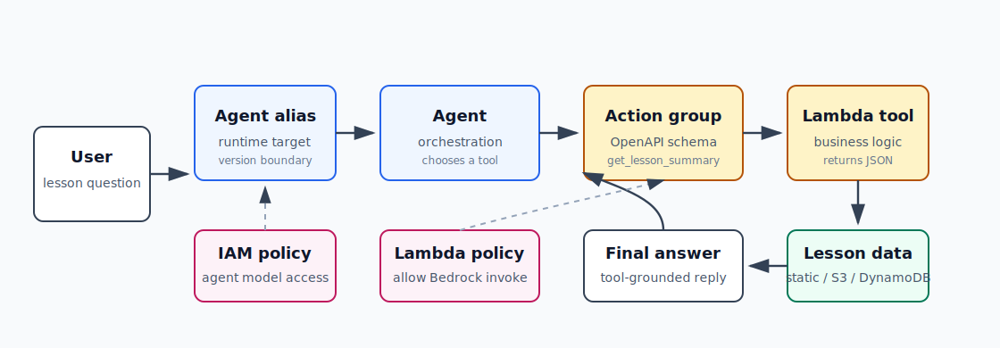

# AI-5：Bedrock Agent 与 Lambda 工具调用



## 目标

构建一个能调用 Lambda 工具的 Bedrock Agent。重点不是重新学习 agent 原理，而是掌握 AWS 里的工程边界：

```text
User
  -> Bedrock Agent alias
  -> Agent orchestration model
  -> Action group schema
  -> Lambda tool
  -> structured tool result
  -> Agent final answer
```

## 本节要学的 AWS 重点

- Agent instruction 如何影响工具选择。
- Action group 是什么。
- OpenAPI schema 如何描述工具输入和输出。
- Lambda 收到的 Bedrock Agent event 长什么样。
- Lambda 应该返回什么 response envelope。
- Agent alias 为什么是应用调用的稳定入口。
- Lambda resource-based policy 为什么必须允许 `bedrock.amazonaws.com` 调用。
- Agent execution role、Lambda execution role、Lambda resource policy 的区别。

## 推荐小项目

本节先做一个低风险工具：

```text
lesson_helper_agent
```

用户问：

```text
Summarize what I learned in AI-2.
```

Agent 应该判断需要调用：

```text
get_lesson_summary(lesson_id="AI-2")
```

Lambda 返回结构化数据：

```json
{
  "lesson_id": "AI-2",
  "title": "Bedrock Serverless API",
  "summary": "...",
  "key_services": ["API Gateway", "AWS Lambda", "Amazon Bedrock"],
  "completed_outputs": ["..."],
  "next_step": "..."
}
```

Agent 再把工具结果组织成自然语言回答。

## 为什么先用静态数据

AI-5 的学习重点是 Agent 到 Lambda 的工具调用链路，不是数据存储。先把 lesson summary 写在 Lambda 里有三个好处：

| 好处 | 说明 |
| --- | --- |
| 权限更少 | Lambda 只需要 CloudWatch Logs 权限，不需要先接 S3 或 DynamoDB |
| 排查更直接 | 如果工具没被调用，问题在 Agent / schema / permission，不会被数据层干扰 |
| 成本更低 | 不额外创建数据库或 bucket |

链路打通后，再把 lesson data 移到：

```text
S3 JSON file
或
DynamoDB table
```

## 本地代码

目录：

```text
projects/aws-ai/ai-5-bedrock-agent-lambda-tool/
```

核心文件：

| 文件 | 作用 |
| --- | --- |
| `lambda_function.py` | Lambda tool handler |
| `action-schema.json` | Agent action group 的 OpenAPI schema |
| `events/get-lesson-summary-ai-2.json` | 本地测试事件 |
| `invoke_agent.py` | 本地调用 Bedrock Agent alias |

本地测试 Lambda handler：

```bash
uv run python projects/aws-ai/ai-5-bedrock-agent-lambda-tool/lambda_function.py \
  projects/aws-ai/ai-5-bedrock-agent-lambda-tool/events/get-lesson-summary-ai-2.json
```

这一步只验证 Lambda event / response contract，不调用 Bedrock。

## Action schema

本节用 OpenAPI 3.0 schema 定义一个 operation：

```text
GET /lesson-summary
operationId: get_lesson_summary
required parameter: lesson_id
optional parameter: detail_level
```

关键点：

- schema 是给 Agent 看的，不是公网 HTTP API。
- 不需要 API Gateway。
- Bedrock Agent 根据 schema 判断什么时候需要这个工具、需要哪些参数。
- Agent 调用工具时，Bedrock 直接把 action event 发给 Lambda。

## Lambda event / response

Bedrock Agent 调用 Lambda 时会传入：

```text
messageVersion
agent
inputText
sessionId
actionGroup
apiPath
httpMethod
parameters
requestBody
sessionAttributes
promptSessionAttributes
```

Lambda 返回时要保留 Bedrock Agent 需要的 envelope：

```text
messageVersion
response.actionGroup
response.apiPath
response.httpMethod
response.httpStatusCode
response.responseBody
sessionAttributes
promptSessionAttributes
```

其中 `responseBody.application/json.body` 是 JSON 字符串，不是直接嵌套的 JSON object。

## Console 创建步骤

推荐资源命名：

| 资源 | 建议名称 |
| --- | --- |
| Lambda function | `ai-5-lesson-summary-tool` |
| Bedrock Agent | `ai-5-lesson-helper-agent` |
| Action group | `LessonSummaryActionGroup` |
| Agent alias | `ai5-dev` |

### 1. 创建 Lambda

Runtime：

```text
Python 3.12
```

代码：

```text
projects/aws-ai/ai-5-bedrock-agent-lambda-tool/lambda_function.py
```

Lambda execution role 暂时只需要：

```text
AWSLambdaBasicExecutionRole
```

因为本版本只读静态数据，不访问 S3 / DynamoDB。

如果后续把 lesson data 移到 S3 或 DynamoDB，再给 Lambda execution role 增加对应的最小读取权限。

### 2. 创建 Agent

Console 路径：

```text
Amazon Bedrock
  -> Builder tools
  -> Agents
  -> Create agent
```

Agent instruction 建议：

```text
You are an AWS AI learning helper. When the user asks what they learned in a specific AI lesson, asks for a recap, or asks which services and outputs belonged to a lesson, call the get_lesson_summary tool. Do not invent lesson facts that are not returned by the tool. If the lesson ID is ambiguous, ask a short clarification question.
```

本次实操实际使用：

```text
You are an AWS AI learning helper. When the user asks what they learned in a specific AI lesson, asks for a recap, or asks which services and outputs belonged to a lesson, call the get_lesson_summary tool. Do not invent lesson facts that are not returned by the tool. If the lesson ID is ambiguous, ask a short clarification question.
```

模型选择：

```text
选择当前 Region 中 Agent 支持、且已经开通 model access 的模型。
```

Agent service role 至少需要能调用所选 orchestration model。如果 action schema 上传到了 S3，这个 role 还需要读取 schema object 的权限。Console 自动创建 role 时通常会帮你生成基础权限；手动创建时要逐项检查。

### 3. 添加 Action group

Action group 类型：

```text
Define with API schema
```

Executor：

```text
Lambda function: ai-5-lesson-summary-tool
```

Schema：

```text
projects/aws-ai/ai-5-bedrock-agent-lambda-tool/action-schema.json
```

可以直接复制到 Console schema editor，也可以上传到 S3 后引用。

### 4. 添加 Lambda resource policy

Bedrock Agent 调 Lambda 不是靠 Lambda execution role，而是靠 Lambda function 的 resource-based policy。

拿到 Agent ID 后运行：

```bash
ACCOUNT_ID=$(aws sts get-caller-identity \
  --profile aws-learning \
  --query Account \
  --output text)

aws lambda add-permission \
  --profile aws-learning \
  --region eu-central-1 \
  --function-name ai-5-lesson-summary-tool \
  --statement-id AllowBedrockAgentInvokeAI5 \
  --action lambda:InvokeFunction \
  --principal bedrock.amazonaws.com \
  --source-account "$ACCOUNT_ID" \
  --source-arn "arn:aws:bedrock:eu-central-1:${ACCOUNT_ID}:agent/AGENT_ID"
```

替换：

```text
AGENT_ID
```

### 5. Prepare 和 Alias

配置修改后需要：

```text
Prepare agent
```

然后创建 alias：

```text
ai5-dev
```

应用侧调用的是 alias，不是 draft agent。

## Console 测试问题

先测明确请求：

```text
Summarize what I learned in AI-2.
```

再测参数归一化：

```text
What did I learn in AI2?
```

再测详细版：

```text
Give me a detailed recap of AI-4 with key concepts.
```

再测澄清：

```text
Summarize the previous lesson.
```

如果 Agent 没有足够上下文，应该先问是哪一节，而不是乱猜。

## 本地 InvokeAgent

创建 alias 后运行：

```bash
uv run python projects/aws-ai/ai-5-bedrock-agent-lambda-tool/invoke_agent.py \
  --agent-id AGENT_ID \
  --agent-alias-id AGENT_ALIAS_ID \
  --prompt "Summarize what I learned in AI-2."
```

脚本默认：

```text
profile: aws-learning
region: eu-central-1
enableTrace: true
```

Trace 的学习价值：

| Trace 里看什么 | 说明 |
| --- | --- |
| orchestration | Agent 如何理解用户输入 |
| action group invocation | 是否选择了 `get_lesson_summary` |
| parameters | 是否传了正确的 `lesson_id` |
| observation | Lambda 返回了什么 |
| final response | Agent 如何把工具结果转成答案 |

## 权限边界

| 权限位置 | 谁使用 | 解决什么 |
| --- | --- | --- |
| Agent execution role | Bedrock Agent | 允许 Agent 调 orchestration model、读取 S3 schema、访问已挂载的 KB 等 |
| Lambda resource policy | Lambda function | 允许 `bedrock.amazonaws.com` invoke 这个函数 |
| Lambda execution role | Lambda runtime | 允许函数写 CloudWatch Logs、访问 S3/DynamoDB 等后端资源 |
| OpenAPI schema | Agent orchestration | 不是权限，只是工具能力说明 |

最容易混淆的是：

```text
Lambda execution role 不能授权 Bedrock 调 Lambda。
Bedrock 调 Lambda 必须看 Lambda resource-based policy。
```

## 本节实操记录：第二轮从头创建

| 配置项 | 值 |
| --- | --- |
| Region | `eu-central-1` |
| Agent name | `ai-5-lesson-helper-agent` |
| Agent ID | `GQ7LU45HYV` |
| Console test alias | `TSTALIASID` |
| Agent version used by Console test | `DRAFT` |
| Foundation model | `amazon.nova-micro-v1:0` |
| Lambda function | `ai-5-lesson-summary-tool` |
| Action group | `LessonSummaryActionGroup` |
| Account | `089781651608` |

本轮从零开始做的顺序：

```text
1. 创建 Lambda function: ai-5-lesson-summary-tool
2. 在 Lambda Console 用 Bedrock Agent event fixture 测试成功
3. 创建 Bedrock Agent: ai-5-lesson-helper-agent
4. 添加 Action Group: LessonSummaryActionGroup
5. 将 OpenAPI schema 绑定到 Action Group
6. 给 Lambda resource-based policy 添加 bedrock.amazonaws.com invoke 权限
7. Prepare Agent
8. 在 Bedrock Console Test 面板测试工具调用
```

Lambda 本地/Console 测试成功输出的关键结构：

```text
messageVersion: 1.0
response.actionGroup: LessonSummaryActionGroup
response.apiPath: /lesson-summary
response.httpMethod: GET
response.httpStatusCode: 200
response.responseBody.application/json.body: JSON string
```

这个测试只证明 Lambda tool 自己能跑，还没有经过 Agent 和大模型。

## 本轮排错记录

### 1. 模型已经选择工具

Console trace 中已经看到：

```text
stopReason: tool_use
toolUse.name: GET__LessonSummaryActionGroup__get_lesson_summary
toolUse.input.lesson_id: AI-2
toolUse.input.detail_level: brief
```

这说明 Agent 的大模型编排层已经成功做了三件事：

```text
1. 理解用户要 AI-2 summary
2. 选择 get_lesson_summary 工具
3. 生成工具参数 lesson_id=AI-2, detail_level=brief
```

### 2. Lambda response / permission 问题

第一次 Agent 测试后出现：

```text
failureCode: 424
failureReason: The server encountered an error processing the Lambda response. Check the Lambda response and retry the request
```

排查思路：

```text
1. 看 Trace 是否已经出现 toolUse。
2. 看 Lambda CloudWatch Logs 是否出现同一时间的 START / END。
3. 如果模型有 toolUse，但 Lambda 没有对应时间日志，优先检查 Lambda resource-based policy。
4. Source ARN 必须指向当前 Agent，而不是旧 Agent，也不是 alias ARN。
```

本轮当前 Agent 的 Source ARN 应为：

```text
arn:aws:bedrock:eu-central-1:089781651608:agent/GQ7LU45HYV
```

### 3. 成功后的判断标准

成功时应该同时看到：

```text
Trace:
  toolUse -> action group invocation -> observation -> final response

CloudWatch Logs:
  START RequestId
  {"actionGroup": "LessonSummaryActionGroup", "apiPath": "/lesson-summary", ...}
  END RequestId
  REPORT RequestId
```

成功调用的 trace 关键片段：

```text
invocationType: ACTION_GROUP
executionType: LAMBDA
actionGroupName: LessonSummaryActionGroup
apiPath: /lesson-summary
verb: get
parameters:
  lesson_id: AI-2
  detail_level: brief
```

CloudWatch Logs 中也能看到 Lambda 收到的参数：

```text
{"actionGroup": "LessonSummaryActionGroup", "apiPath": "/lesson-summary", "httpMethod": "GET", "parameters": [{"name": "lesson_id", "type": "string", "value": "AI-2"}, {"name": "detail_level", "type": "string", "value": "brief"}]}
```

## 本节心智模型

```text
Lambda
  真正执行工具逻辑。
  输入是 Bedrock Agent event，输出是 Bedrock Agent response envelope。

Action schema
  给模型看的工具说明书。
  它描述工具名、路径、参数、返回结构和适用场景。

Action group
  把 schema 和 Lambda executor 绑到 Agent 上。

Agent
  调 foundation model 做编排判断。
  它决定直接回答、追问用户，还是调用工具。

Lambda resource-based policy
  决定 bedrock.amazonaws.com 能不能 invoke 这个 Lambda。
  这不是 Lambda execution role。

Prepare
  把 draft 配置编译成可运行状态。

Alias
  给应用侧一个稳定调用入口。
  Console Test 面板可能使用内置 TSTALIASID 测 draft。
```

核心区别：

```text
模型负责判断和表达。
Lambda 负责确定性执行。
Schema 负责描述工具。
IAM/resource policy 负责权限边界。
```

## 常见问题

| 现象 | 优先检查 |
| --- | --- |
| Agent 不调用工具 | instruction 是否明确、schema description 是否清楚、是否 prepare |
| Lambda 被拒绝调用 | Lambda resource policy 是否有 `bedrock.amazonaws.com` 和正确 SourceArn |
| 工具参数错 | schema parameter description 是否包含规范例子 |
| 修改 schema 后没生效 | 是否重新 Prepare agent / 更新 alias |
| 本地脚本不能 invoke | Agent ID、alias ID、Region、profile、IAM 权限 |

## 清理顺序

Console 手动清理推荐顺序：

1. 删除自定义 Agent alias，例如 `ai5-dev`。
2. 删除 Bedrock Agent `ai-5-lesson-helper-agent`。这会删除 Action Group、Console 测试 alias、Agent 版本等从属配置。
3. 删除 Lambda function `ai-5-lesson-summary-tool`。
4. 删除 CloudWatch Log Group `/aws/lambda/ai-5-lesson-summary-tool`。
5. 删除 Lambda execution role，例如 `ai-5-lesson-summary-tool-role-xxxx`。
6. 删除 Bedrock Agent service role，例如 `AmazonBedrockExecutionRoleForAgents_...`。
7. 如果 action schema 上传到了 S3，删除对应 S3 object。

删除前确认资源属于 AI-5，不要删除其他实验或生产资源。

清理后在 Console 中搜索确认：

```text
Bedrock Agents: ai-5-lesson-helper-agent
Lambda: ai-5-lesson-summary-tool
CloudWatch Log group: /aws/lambda/ai-5-lesson-summary-tool
IAM Roles: ai-5-lesson-summary-tool-role
IAM Roles: AmazonBedrockExecutionRoleForAgents
```

都搜索不到，说明云上学习资源已清理完成。

## 费用提醒

- Agent 调用会触发底层模型推理费用。
- Lambda 和 CloudWatch Logs 通常很低，但不是零。
- 如果后续接 S3 / DynamoDB，会增加存储和请求费用。
- 学习阶段限制测试轮数，不做多轮压测。

## 参考

- Bedrock Agent Lambda event / response: https://docs.aws.amazon.com/bedrock/latest/userguide/agents-lambda.html
- Bedrock Agent OpenAPI schema: https://docs.aws.amazon.com/bedrock/latest/userguide/agents-api-schema.html
- Bedrock Agents service role permissions: https://docs.aws.amazon.com/bedrock/latest/userguide/agents-permissions.html
- InvokeAgent with boto3: https://docs.aws.amazon.com/bedrock/latest/userguide/agents-invoke-agent.html
