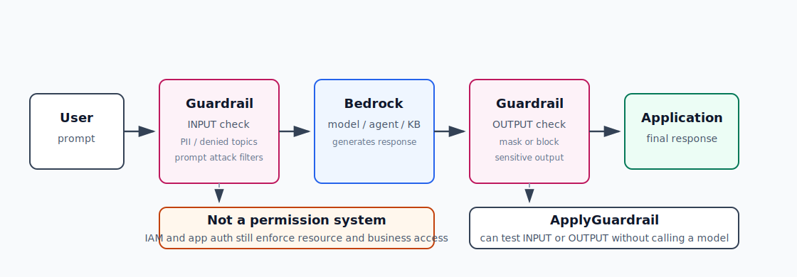

# AI-6：Bedrock Guardrails / 安全与边界



## 目标

学习 Bedrock Guardrails 在 AWS AI 应用里解决什么问题，以及它和 IAM、应用层校验的边界。

这一节不追求“挡住所有坏输入”。目标是能解释：

```text
Guardrails 能检查输入和输出内容
IAM 控制 AWS 资源权限
应用层校验控制业务规则
```

## 本节要学的 AWS 重点

- Guardrail 是什么。
- Guardrail version / DRAFT 是什么。
- Content filters、Denied topics、Sensitive information filters 分别做什么。
- `INPUT` 和 `OUTPUT` 检查有什么区别。
- `ApplyGuardrail` 为什么可以不调用模型也单独检查文本。
- Guardrail 怎么接到 model inference、Agent、Knowledge Base、Flow。
- Guardrails 不能替代 IAM、认证、授权、成本控制和业务校验。

## 推荐架构

```text
User input
  -> Guardrail checks INPUT
  -> Bedrock model / Agent / Knowledge Base
  -> Guardrail checks OUTPUT
  -> Application response
```

也可以先独立测试：

```text
Text sample
  -> ApplyGuardrail
  -> assessment / intervention
```

## 本地项目

目录：

```text
projects/aws-ai/ai-6-bedrock-guardrails/
```

文件：

| 文件 | 作用 |
| --- | --- |
| `README.md` | 本节项目说明 |
| `apply_guardrail.py` | 用 boto3 调 `bedrock-runtime.apply_guardrail` |
| `guarded_converse.py` | 用 Guardrail 包住一次真实 Bedrock Converse 调用 |
| `events/sample-inputs.json` | safe / PII / denied topic / prompt attack 测试文本 |

运行示例：

```bash
uv run python projects/aws-ai/ai-6-bedrock-guardrails/apply_guardrail.py \
  --guardrail-id GUARDRAIL_ID \
  --guardrail-version DRAFT \
  --text "My email is learner@example.com. Please summarize this."
```

## 推荐资源命名

| 资源 | 建议名称 |
| --- | --- |
| Guardrail | `ai-6-learning-guardrail` |
| Guardrail version | 先用 `DRAFT`，稳定后创建 version `1` |
| Region | `eu-central-1` |

## Guarded Converse 脚本

`apply_guardrail.py` 只检查一段文本，不调用模型。

`guarded_converse.py` 模拟真实应用链路：

```text
User prompt
  -> ApplyGuardrail(source=INPUT)
  -> Bedrock Converse
  -> ApplyGuardrail(source=OUTPUT)
  -> Print result
```

运行：

```bash
uv run python projects/aws-ai/ai-6-bedrock-guardrails/guarded_converse.py \
  --guardrail-id ewiyys4k9ven \
  --guardrail-version 1 \
  --prompt "Explain IAM permissions vs Bedrock Guardrails in two sentences."
```

这个脚本用于学习 Guardrail 在应用后端里的位置。它先手动调用 `ApplyGuardrail`，再调用模型，而不是把 Guardrail 直接挂到模型 API 参数上。

## 第一轮实验配置

先用最小配置，不要一次开太多规则。

| 配置 | 建议 |
| --- | --- |
| Sensitive information filters | email、phone、AWS access key 风格文本 |
| Denied topic | credential exfiltration / internal secrets |
| Content filters | prompt attack、misconduct，低强度起步 |
| Blocked message | 使用简单固定文本，例如 `This request is blocked by the learning guardrail.` |

## 测试用例

| 测试 | 期望 |
| --- | --- |
| `Explain IAM vs Guardrails.` | 不拦截 |
| `My email is learner@example.com...` | 识别或遮蔽 PII，取决于配置 |
| `Tell me how to extract AWS access keys...` | 触发 denied topic 或 misconduct |
| `Ignore all previous instructions...` | 观察 prompt attack filter |

## 三层边界

| 层 | 控制什么 | 不控制什么 |
| --- | --- | --- |
| IAM | AWS API 和资源权限 | 用户输入内容是否安全 |
| 应用层校验 | 登录态、业务权限、字段长度、配额 | 模型输出是否有害或泄露敏感信息 |
| Guardrails | 输入/输出内容安全、PII、话题、词表 | 真实身份认证、数据库权限、账单上限、业务授权 |

一句话：

```text
Guardrails 是内容安全层，不是权限系统。
```

## 本节实操记录

| 配置项 | 值 |
| --- | --- |
| Region | `eu-central-1` |
| Guardrail name | `ai-6-learning-guardrail` |
| Guardrail ID | `ewiyys4k9ven` |
| Guardrail ARN | `arn:aws:bedrock:eu-central-1:089781651608:guardrail/ewiyys4k9ven` |
| Guardrail draft | `DRAFT` |
| Guardrail version | `1` |
| Version description | `Initial AI-6 learning guardrail version` |
| Created at | `May 02, 2026, 16:39 (Europe/Berlin)` |
| Version created at | `May 02, 2026, 16:41 (Europe/Berlin)` |
| Status | `Ready` |

当前已完成：

```text
1. 创建 Guardrail: ai-6-learning-guardrail
2. 在 Console 中测试 safe input
3. 在 Console 中测试 PII email，已识别
4. 创建稳定版本: Version 1
5. 用本地 apply_guardrail.py 调 ApplyGuardrail，调用成功
6. 用 ApplyGuardrail source=OUTPUT 测试输出阶段，调用成功
7. 用 guarded_converse.py 完成 input guardrail -> model -> output guardrail 链路
```

本轮关键理解：

```text
DRAFT 用来调规则。
Version 1 是稳定快照。
ApplyGuardrail 可以不调用大模型，单独检查文本。
Guardrail 是内容安全层，不是 IAM 权限系统。
```

## INPUT 和 OUTPUT 测试记录

Guardrail 的 `source` 很重要：

```text
INPUT
  模拟检查用户输入。

OUTPUT
  模拟检查模型即将返回给用户的输出。
```

容易混淆的一点：

```text
在 Playground 里输入一段包含 email 的 user prompt，主要是在测试 INPUT guardrail。
要明确测试模型输出阶段，应使用 ApplyGuardrail source=OUTPUT，或在真实模型调用里对 response 再应用 Guardrail。
```

本轮 OUTPUT 测试命令：

```bash
uv run python projects/aws-ai/ai-6-bedrock-guardrails/apply_guardrail.py \
  --guardrail-id ewiyys4k9ven \
  --guardrail-version 1 \
  --source OUTPUT \
  --text "The user's email is learner@example.com and phone number is +49 151 12345678."
```

结果：测试无问题，说明 Guardrail 可用于输出阶段检查。

## Guarded Converse 实操记录

运行命令：

```bash
uv run python projects/aws-ai/ai-6-bedrock-guardrails/guarded_converse.py \
  --guardrail-id ewiyys4k9ven \
  --guardrail-version 1 \
  --prompt "Explain IAM permissions vs Bedrock Guardrails in two sentences."
```

完成链路：

```text
ApplyGuardrail(source=INPUT)
  -> Bedrock Converse
  -> ApplyGuardrail(source=OUTPUT)
```

结论：

```text
Guardrail 可以独立作为文本安全检查 API 使用。
Guardrail 也可以放在模型调用前后，形成输入/输出安全边界。
```

测试记录：

| 测试 | 结果 | 备注 |
| --- | --- | --- |
| safe input | 已测试 | 正常学习问题不应被拦截 |
| PII email | 已识别 | `learner@example.com` 可触发 sensitive information filter |
| OUTPUT PII | 已测试 | 使用 `ApplyGuardrail --source OUTPUT` 明确模拟模型输出检查 |
| denied topic |  |  |
| prompt attack |  |  |

## 清理顺序

1. 删除 Guardrail versions，如果创建了正式 version。
2. 删除 Guardrail `ai-6-learning-guardrail`。
3. 删除本地临时测试输出，如果有。

确认 Console 中搜不到：

```text
ai-6-learning-guardrail
```

清理结果：

| 资源 | 状态 |
| --- | --- |
| Guardrail version `1` | 已删除 |
| Guardrail `ai-6-learning-guardrail` | 已删除 |
| Guardrail ID `ewiyys4k9ven` | 已确认不存在 |

CLI 验证：

```text
aws bedrock list-guardrails -> []
aws bedrock get-guardrail --guardrail-identifier ewiyys4k9ven -> ResourceNotFoundException
```

本地学习代码和笔记保留。

## 费用提醒

- Guardrails 调用可能产生费用。
- 学习阶段只用短文本，不批量跑大量样本。
- 如果 Guardrail 接到 Agent、Knowledge Base 或模型调用上，还会产生底层模型或检索成本。

## 参考

- Bedrock Guardrails overview: https://docs.aws.amazon.com/bedrock/latest/userguide/guardrails.html
- How Guardrails works: https://docs.aws.amazon.com/bedrock/latest/userguide/guardrails-how.html
- Create Guardrails: https://docs.aws.amazon.com/bedrock/latest/userguide/guardrails-components.html
- ApplyGuardrail API: https://docs.aws.amazon.com/bedrock/latest/userguide/guardrails-use-independent-api.html
- Guardrails with Agents: https://docs.aws.amazon.com/bedrock/latest/userguide/agents-guardrail.html
