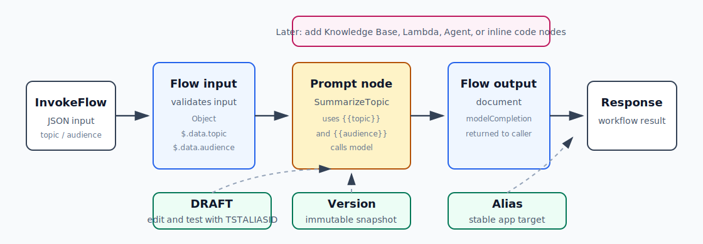

# AI-7：Bedrock Flows / 可视化 AI 工作流



## 目标

学习用 Amazon Bedrock Flows 把 Prompt、模型、Knowledge Base、Lambda 等节点编排成可视化 AI workflow。

这一节先做最小 Flow：

```text
Flow input
  -> Prompt node
  -> Flow output
```

后续再扩展：

```text
Flow input
  -> Prompt node
  -> Knowledge Base node / Lambda node
  -> Flow output
```

## 本节要学的 AWS 重点

- Flow 是什么。
- Node 是什么。
- Connection 是什么。
- Flow input / Flow output 的职责。
- Prompt node 如何使用变量。
- Expression 例如 `$.data.topic` 如何把输入 JSON 映射到节点变量。
- DRAFT、Test alias、Version、Alias 的区别。
- Flow 和 Agent、Step Functions 的区别。
- Flow 的成本来自它调用的底层资源，例如模型、KB、Lambda、S3。

## 基本概念

| 概念 | 说明 |
| --- | --- |
| Flow | 一个由节点和连接组成的 AI workflow |
| Node | Flow 里的一个步骤，例如 input、prompt、Lambda、KB、output |
| Connection | 把一个节点的输出传给另一个节点的输入 |
| Flow input | Flow 的入口，接收 InvokeFlow 或 Console Test 的输入 |
| Flow output | Flow 的出口，返回最终结果 |
| Prompt node | 调用一个模型执行 prompt |
| Expression | 从整体输入里抽取某个字段，例如 `$.data.topic` |

## 和 Agent 的区别

| 服务 | 决策方式 |
| --- | --- |
| Agent | 模型自己决定下一步、是否调用工具 |
| Flow | 你明确画出步骤和连接 |
| Step Functions | 通用 AWS 工作流，适合更复杂的生产后端编排 |

一句话：

```text
Agent 是模型主导的动态决策。
Flow 是开发者画出来的确定流程。
```

## 本地项目

目录：

```text
projects/aws-ai/ai-7-bedrock-flows/
```

文件：

| 文件 | 作用 |
| --- | --- |
| `README.md` | 本节项目说明 |
| `events/minimal-topic-input.json` | 最小 Flow 测试输入 |

## 推荐资源命名

| 资源 | 建议名称 |
| --- | --- |
| Flow | `ai-7-topic-summary-flow` |
| Prompt node | `SummarizeTopic` |
| Flow alias | `ai7-dev` |
| Region | `eu-central-1` |
| Model | `amazon.nova-micro-v1:0` 或 Console 支持的低成本文本模型 |

## 最小 Flow 设计

输入 JSON：

```json
{
  "topic": "Bedrock Agents and Lambda tools",
  "audience": "an engineer learning AWS AI"
}
```

Prompt node：

```text
Summarize {{topic}} for {{audience}} in three concise bullet points.
```

变量映射：

| Prompt variable | Expression | Type |
| --- | --- | --- |
| `topic` | `$.data.topic` | String |
| `audience` | `$.data.audience` | String |

连接：

```text
Flow input.output
  -> SummarizeTopic.topic
Flow input.output
  -> SummarizeTopic.audience
SummarizeTopic.modelCompletion
  -> Flow output.document
```

## DRAFT / Version / Alias

Bedrock Flow 和 Agent 很像，也有发布概念：

| 概念 | 作用 |
| --- | --- |
| DRAFT | 当前正在编辑的工作草稿 |
| Test alias `TSTALIASID` | Console 测试 draft 用 |
| Version | 从 DRAFT 创建的不可变快照 |
| Alias | 应用调用的稳定入口，指向某个 version |

## 本节实操记录

| 配置项 | 值 |
| --- | --- |
| Region | `eu-central-1` |
| Flow name | `ai-7-topic-summary-flow` |
| Flow ID | `CQY9L4W2R4` |
| Prompt node | `SummarizeTopic` |
| Model | `amazon.nova-micro-v1:0` |
| Test alias | `TSTALIASID` |
| Version | `2` |
| Alias | `ai7-dev` |
| Alias ID | `2QH7KR2TI7` |
| Service role | `AmazonBedrockExecutionRoleForFlows_WXWFDDJDKBM` |
| Flow ARN | `arn:aws:bedrock:eu-central-1:089781651608:flow/CQY9L4W2R4` |
| Status | `Prepared` |

本轮完成顺序：

```text
1. 创建 Flow: ai-7-topic-summary-flow
2. 使用最小结构 Flow input -> Prompt node -> Flow output
3. 将 Flow input 的 document 类型设为 Object
4. 将 Prompt node 命名为 SummarizeTopic
5. Prompt 使用变量 {{topic}} 和 {{audience}}
6. 配置 topic / audience 的输入映射
7. 发布版本
8. 创建 alias: ai7-dev
9. 通过 alias 创建 execution 并成功返回结果
```

执行输入：

```json
{
  "topic": "Bedrock Agents and Lambda tools",
  "audience": "an engineer learning AWS AI"
}
```

成功输出：

```text
- Bedrock Agents: Simplify the creation of intelligent applications by providing a framework to build, deploy, and manage AI-driven agents that can interact with users through natural language. Offers pre-built components and connectors to various AWS services.

- Lambda Functions: Serverless compute service allowing engineers to run code in response to events without managing servers. Ideal for backend logic execution, integration with Bedrock Agents, and scaling dynamically based on demand.

- Integration Tools: Facilitate seamless interaction between Bedrock Agents and Lambda functions, enabling the execution of complex workflows and real-time data processing, leveraging AWS's extensive ecosystem for AI and machine learning application
```

本轮关键理解：

```text
Flow input JSON
  -> topic / audience 映射进 Prompt node
  -> Prompt node 调模型
  -> Flow output 返回 modelCompletion
```

Flow 是显式编排，不是 Agent 式动态决策。

测试记录：

| 测试输入 | 结果 | 备注 |
| --- | --- | --- |
| `minimal-topic-input.json` | 成功 | 通过 `ai7-dev` alias 调用 Version 2 |

## 清理顺序

1. 删除 Flow alias，例如 `ai7-dev`。
2. 删除 Flow versions。
3. 删除 Flow `ai-7-topic-summary-flow`。
4. 删除自动创建的 service role，如果不再使用。

清理后确认 Console 中搜不到：

```text
ai-7-topic-summary-flow
```

清理结果：

| 资源 | 状态 |
| --- | --- |
| Flow alias `ai7-dev` | 已删除 |
| Flow versions | 已删除 |
| Flow `ai-7-topic-summary-flow` | 已删除 |
| Flow ID `CQY9L4W2R4` | 已确认不存在 |
| Service role `AmazonBedrockExecutionRoleForFlows_WXWFDDJDKBM` | 已删除 |

CLI 验证：

```text
aws bedrock-agent get-flow --flow-identifier CQY9L4W2R4 -> ResourceNotFoundException
aws bedrock-agent list-flows -> []
aws iam get-role --role-name AmazonBedrockExecutionRoleForFlows_WXWFDDJDKBM -> NoSuchEntity
```

本地学习代码和笔记保留。

## 费用提醒

- Flow 成本来自被它调用的底层资源。
- 最小 Prompt node 会产生一次模型调用费用。
- 如果接 Knowledge Base、Lambda、S3，会分别产生对应服务费用。
- 学习阶段限制测试次数。

## 参考

- Bedrock Flows overview: https://docs.aws.amazon.com/bedrock/latest/userguide/flows.html
- Key definitions for Flows: https://docs.aws.amazon.com/bedrock/latest/userguide/key-definitions-flow.html
- Node types for Flows: https://docs.aws.amazon.com/bedrock/latest/userguide/flows-nodes.html
- Create first Flow: https://docs.aws.amazon.com/bedrock/latest/userguide/flows-get-started.html
- Single prompt Flow example: https://docs.aws.amazon.com/bedrock/latest/userguide/flows-ex-prompt.html
- InvokeFlow API: https://docs.aws.amazon.com/bedrock/latest/APIReference/API_agent-runtime_InvokeFlow.html
- Deploy Flow with versions and aliases: https://docs.aws.amazon.com/bedrock/latest/userguide/flows-deploy.html
