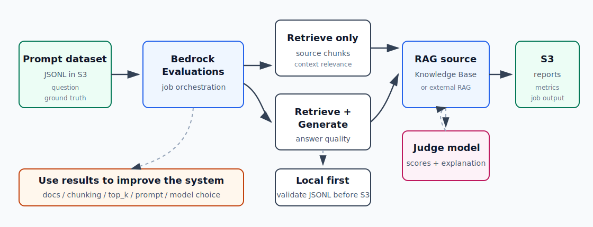

# AI-8：Bedrock Evaluations / 模型与 RAG 评估



## 目标

从“我问了几个问题感觉还行”升级到“我有测试集和评估结果”。

这一节重点不是先创建 AWS Evaluation job，而是先建立评估意识：

```text
问题集
  -> 期望答案
  -> 期望来源
  -> 实际检索结果
  -> 实际生成答案
  -> 评估报告
  -> 改文档 / chunking / top_k / prompt / model
```

## 本节要学的 AWS 重点

- Bedrock Evaluations 能评估什么。
- Model evaluation 和 RAG evaluation 的区别。
- Retrieve-only evaluation 和 Retrieve-and-generate evaluation 的区别。
- Judge model 是什么。
- 评估集为什么要放 S3。
- JSONL prompt dataset 的作用。
- Evaluation job 的结果为什么也写回 S3。
- 如何用评估结果指导 prompt、文档、chunking、top_k 或模型选择。

## 基本概念

| 概念 | 说明 |
| --- | --- |
| Model evaluation | 评估模型对 prompt 的回答质量 |
| RAG evaluation | 评估 RAG 系统检索和生成是否符合预期 |
| Retrieve only | 只评估检索结果，不评估最终回答 |
| Retrieve and generate | 同时评估检索结果和生成答案 |
| Ground truth | 期望答案、期望来源或期望检索文本 |
| Judge model | 用另一个 LLM 给结果打分和解释 |
| Evaluation report | 评估 job 输出的指标和明细报告 |

## Retrieve-only vs Retrieve-and-generate

| 类型 | 看什么 | 适合排查什么 |
| --- | --- | --- |
| Retrieve only | 相关 chunk 有没有被找出来 | 文档、embedding、chunking、top_k、metadata filter |
| Retrieve and generate | 答案是否正确、完整、忠实 | prompt、生成模型、引用、幻觉、上下文使用 |

RAG 排查顺序：

```text
先看 Retrieve 是否命中正确来源。
再看 Generate 是否正确使用来源。
```

## 本地项目

目录：

```text
projects/aws-ai/ai-8-bedrock-evaluations/
```

文件：

| 文件 | 作用 |
| --- | --- |
| `README.md` | 本节项目说明 |
| `datasets/aws-ai-rag-eval.jsonl` | 本地评估集模板 |
| `validate_eval_dataset.py` | 校验 JSONL 格式和必填字段 |
| `manual-scorecard.md` | 人工评分模板 |

校验：

```bash
uv run python projects/aws-ai/ai-8-bedrock-evaluations/validate_eval_dataset.py \
  projects/aws-ai/ai-8-bedrock-evaluations/datasets/aws-ai-rag-eval.jsonl
```

## 本地评估集

当前评估集覆盖：

| ID | 主题 |
| --- | --- |
| `ai8-001` | AI-1 model access vs IAM |
| `ai8-002` | AI-2 frontend 不直连 Bedrock |
| `ai8-003` | AI-3 S3 文档流水线 |
| `ai8-004` | AI-4 Retrieve vs RetrieveAndGenerate |
| `ai8-005` | AI-5 action schema vs Lambda tool |
| `ai8-006` | AI-6 Guardrails vs IAM / app auth |
| `ai8-007` | AI-7 Flow vs Agent |

这个 JSONL 是本地学习模板。真正创建 Bedrock Evaluation job 前，需要按 Console 当前要求转换为对应的 AWS dataset schema，并上传到 S3。

## 人工评分模板

在没有创建 AWS Evaluation job 时，先用：

```text
projects/aws-ai/ai-8-bedrock-evaluations/manual-scorecard.md
```

评分维度：

| 字段 | 含义 |
| --- | --- |
| `retrieval_hit` | 是否检索到期望来源 |
| `answer_correctness` | 答案是否正确回答问题 |
| `source_grounding` | 答案是否被检索内容支持 |
| `missing_points` | 缺失了哪些关键点 |
| `score` | 0-3 总分 |

评分标准：

| Score | Meaning |
| --- | --- |
| 0 | Incorrect or unsupported |
| 1 | Partially correct, important gaps |
| 2 | Mostly correct, minor gaps |
| 3 | Correct, grounded, and complete |

当前 `manual-scorecard.md` 已填入 reference-answer baseline：

```text
7 / 7 samples scored
Average score: 3.0 / 3.0
```

注意：这是使用期望答案作为候选答案时的满分基线。之后评估真实 RAG 或模型回答时，要用实际回答覆盖这些评分。

## 推荐资源命名

如果后续创建 AWS Evaluation job：

| 资源 | 建议名称 |
| --- | --- |
| S3 bucket | `xzhu-ai-8-evaluations-20260502` |
| Input prefix | `datasets/` |
| Output prefix | `results/` |
| Evaluation job | `ai-8-aws-ai-notes-rag-eval` |
| IAM role | `ai-8-bedrock-evaluation-role` 或 Console 自动创建 |

## 本节实操记录

当前阶段：

```text
本地初始化完成。
未创建 AWS Evaluation job。
未创建 S3 bucket。
未产生云上评估资源。
```

本地校验结果：

| 检查 | 状态 |
| --- | --- |
| JSONL 格式 | 通过 |
| 必填字段 | 通过 |
| ID 去重 | 通过 |
| 样本数 | `7` |

校验命令输出：

```json
{
  "ok": true,
  "records": 7
}
```

## 清理顺序

当前只初始化本地文件，无云上资源需要清理。

如果后续创建 Evaluation job：

1. 停止仍在运行的 Evaluation job。
2. 删除或保留评估报告 S3 output，按学习需要决定。
3. 删除 S3 input/output bucket 或 prefix。
4. 删除临时 IAM evaluation service role。
5. 删除临时 Knowledge Base / vector store，如果为评估重建过。

## 费用提醒

- Evaluation 可能调用 generator model 和 judge model。
- RAG evaluation 还可能触发 Knowledge Base retrieval。
- S3 input/output 会产生存储和请求费用。
- 学习阶段只用极小评估集。

## 参考

- Bedrock Evaluations overview: https://docs.aws.amazon.com/bedrock/latest/userguide/evaluation.html
- Prompt datasets for model evaluation: https://docs.aws.amazon.com/bedrock/latest/userguide/model-evaluation-prompt-datasets.html
- RAG evaluations overview: https://docs.aws.amazon.com/bedrock/latest/userguide/evaluation-kb.html
- RAG prompt dataset: https://docs.aws.amazon.com/bedrock/latest/userguide/knowledge-base-evaluation-prompt.html
- Retrieve-only RAG evaluation: https://docs.aws.amazon.com/bedrock/latest/userguide/knowledge-base-evaluation-create-ro.html
- Retrieve-and-generate RAG evaluation: https://docs.aws.amazon.com/bedrock/latest/userguide/knowledge-base-evaluation-create-randg.html
- Review RAG evaluation reports: https://docs.aws.amazon.com/bedrock/latest/userguide/knowledge-base-evaluation-report.html
