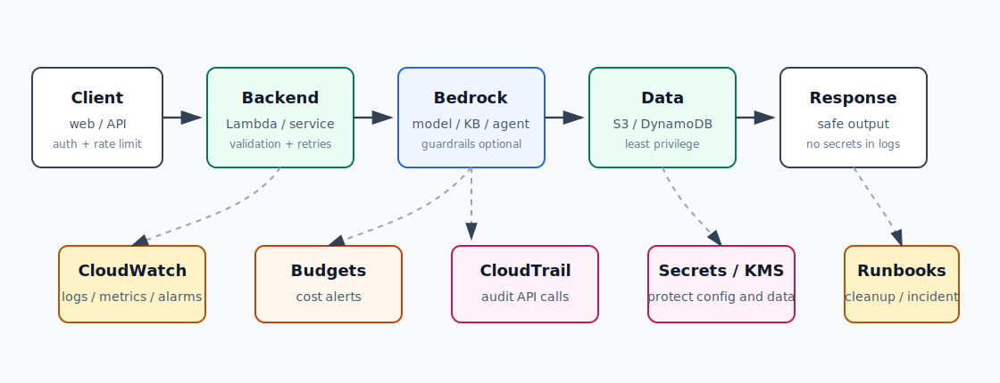
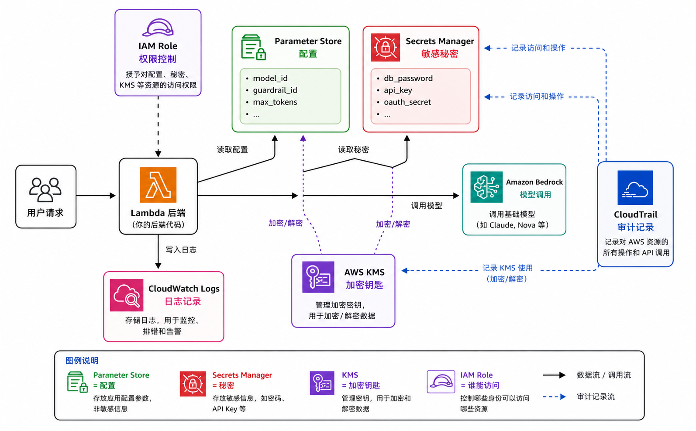

# AI-9：AI 生产化、观测与治理



## 目标

把“能跑”提升到“可控、可观测、可解释、可治理”。

AI-1 到 AI-8 已经覆盖了模型调用、Serverless API、S3 pipeline、Knowledge Base、Agent、Guardrails、Flows、Evaluations。AI-9 把这些能力收束成生产化 checklist。

## 本节要学的 AWS 重点

- CloudWatch Logs / Metrics / Alarms。
- AWS Budgets 和 Cost Explorer。
- CloudTrail 审计。
- IAM least privilege 和 Access Analyzer。
- Secrets Manager / SSM Parameter Store。
- KMS 和数据加密。
- 输入输出日志的敏感信息边界。
- timeout、retry、DLQ、幂等和失败路径。
- 清理 runbook。

## 核心问题

| 问题 | 关注点 |
| --- | --- |
| 谁能调用？ | auth、业务授权、IAM |
| 能花多少钱？ | token、模型、评估、日志、预算 |
| 出错能不能查？ | request id、structured logs、CloudWatch |
| 会不会泄露？ | secrets、PII、prompt/output logging |
| 会不会无限重试？ | timeout、retry、DLQ、idempotency |
| 用完会不会继续收费？ | cleanup runbook、tags、log retention |

## 三层控制

| 层 | 控制什么 |
| --- | --- |
| IAM | AWS API 和资源访问 |
| 应用层 | 用户身份、业务权限、限流、输入 schema |
| AI 安全层 | Guardrails、prompt policy、tool boundary |

## KMS、Secrets Manager 和 Parameter Store



| 服务 | 主要用途 | 例子 |
| --- | --- | --- |
| Parameter Store | 保存应用配置 | model_id、guardrail_id、max_tokens |
| Secrets Manager | 保存敏感秘密 | db_password、third_party_api_key、OAuth secret |
| KMS | 管理加密钥匙 | 加密 secrets、SecureString、S3 对象、日志 |

核心区别：

```text
Parameter Store = 配置
Secrets Manager = 秘密
KMS = 加密钥匙
IAM Role = 谁能访问
CloudTrail = 谁访问过的审计记录
```

## 本地项目

目录：

```text
projects/aws-ai/ai-9-ai-production-governance/
```

文件：

| 文件 | 作用 |
| --- | --- |
| `README.md` | 本节项目说明 |
| `templates/production-checklist.md` | 上线前 checklist |
| `templates/log-schema.json` | 建议结构化日志字段 |
| `templates/cost-control-template.md` | 成本控制模板 |
| `templates/cleanup-runbook.md` | 清理 runbook |

## 推荐日志字段

不要记录完整敏感 prompt。推荐记录 metadata：

```json
{
  "request_id": "string",
  "operation": "summarize",
  "model_id": "amazon.nova-micro-v1:0",
  "input_chars": 1200,
  "output_chars": 400,
  "latency_ms": 950,
  "status": "success",
  "error_type": null,
  "guardrail_action": "none"
}
```

## 本节实操记录

当前阶段：

```text
本地模板初始化完成。
本地 governance 概念与日志 schema 阅读完成。
未创建 AWS 资源。
```

初始化文件：

| 文件 | 状态 |
| --- | --- |
| production checklist | 已创建 |
| log schema | 已创建 |
| cost control template | 已创建 |
| cleanup runbook | 已创建 |

## Console 检查记录

| 区域 | 检查结果 |
| --- | --- |
| CloudWatch Logs / Log groups | 搜索 `/aws/lambda`，无 AI 学习资源残留日志组 |
| CloudWatch Alarms / All alarms | 无残留 alarms |
| Billing and Cost Management / Budgets | 账户已有 budget；本节未修改 |
| Billing and Cost Management / Cost Explorer | 已按 Service 查看；Amazon Bedrock 有使用成本记录 |
| CloudTrail / Event history | 已搜索到 `DeleteFlow` 事件，可用于审计谁在何时删除了 Flow |
| Secrets Manager | 当前无 learning secret |
| Systems Manager / Parameter Store | 当前无 learning parameter |
| KMS / Customer managed keys | 当前无 learning customer managed key |

## 清理顺序

当前只初始化本地模板，无云上资源需要清理。

如果后续创建 CloudWatch alarms、Budgets、dashboard 或 IAM policy：

1. 删除临时 alarms / dashboards。
2. 删除临时 Budgets。
3. 删除临时 IAM policy / role。
4. 删除不再需要的 log groups 或设置 retention。

## 参考

- CloudWatch Logs: https://docs.aws.amazon.com/AmazonCloudWatch/latest/logs/WhatIsCloudWatchLogs.html
- CloudWatch Alarms: https://docs.aws.amazon.com/AmazonCloudWatch/latest/monitoring/AlarmThatSendsEmail.html
- AWS Budgets: https://docs.aws.amazon.com/cost-management/latest/userguide/budgets-managing-costs.html
- Cost Explorer: https://docs.aws.amazon.com/cost-management/latest/userguide/ce-what-is.html
- CloudTrail: https://docs.aws.amazon.com/awscloudtrail/latest/userguide/cloudtrail-user-guide.html
- IAM Access Analyzer: https://docs.aws.amazon.com/IAM/latest/UserGuide/what-is-access-analyzer.html
- Secrets Manager: https://docs.aws.amazon.com/secretsmanager/latest/userguide/intro.html
- SSM Parameter Store: https://docs.aws.amazon.com/systems-manager/latest/userguide/systems-manager-parameter-store.html
- KMS: https://docs.aws.amazon.com/kms/latest/developerguide/overview.html
