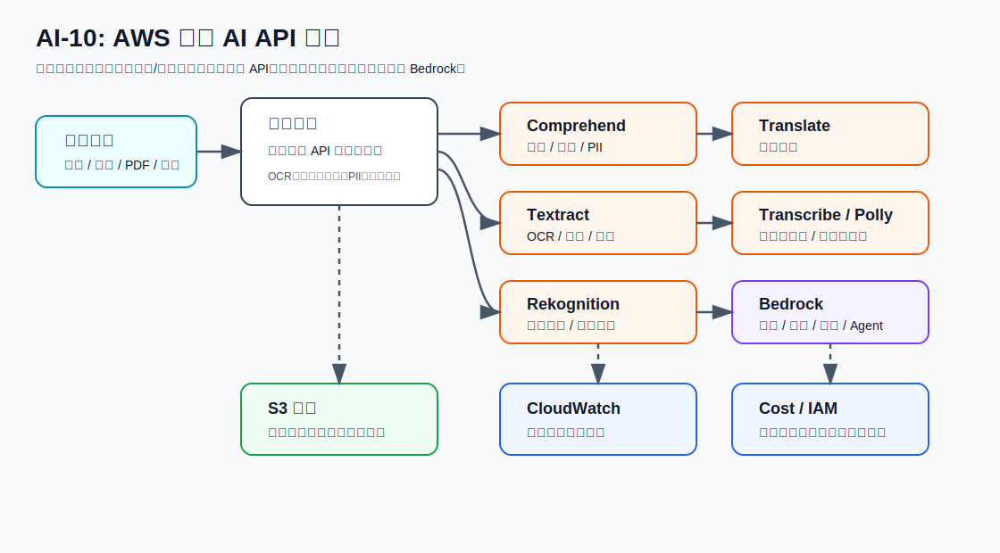

# AI-10：AWS 专用 AI API



## 目标

建立 AWS AI 服务选型能力：不是所有 AI 需求都要交给大模型。OCR、翻译、语音转写、语音合成、PII 检测、图片识别这类任务，通常先看 AWS 专用 AI API。

AI-10 的重点不是把每个服务深挖到底，而是学会判断：

```text
专用识别 / 转换任务 -> 优先专用 AI API
开放式总结 / 问答 / 推理 / Agent -> Bedrock
自定义训练 / 自定义模型部署 -> SageMaker AI
```

## 本节要学的 AWS 重点

| 服务 | 解决什么问题 | 常见输入 | 常见输出 |
| --- | --- | --- | --- |
| Amazon Comprehend | NLP、实体、情绪、PII 检测 | text | entities、sentiment、PII offsets |
| Amazon Translate | 文本翻译 | text | translated text |
| Amazon Textract | OCR、表格、表单抽取 | image、PDF、S3 document | blocks、lines、tables、forms |
| Amazon Transcribe | 音频转文字 | audio in S3 或 stream | transcript JSON |
| Amazon Polly | 文字转语音 | text | audio stream / audio file |
| Amazon Rekognition | 图片/视频识别、内容审核 | image、video | labels、moderation labels、faces |

## 和 Bedrock 的区别

| 维度 | 专用 AI API | Bedrock |
| --- | --- | --- |
| 任务类型 | 明确、固定、结构化 | 开放、生成、推理 |
| 输出稳定性 | 更稳定，字段固定 | 更灵活，但需要 prompt 和校验 |
| 成本单位 | 页、字符、分钟、图片等 | input/output token 或模型计费单位 |
| 工程形态 | 直接调用服务 API | 调用模型、Knowledge Base、Agent、Flow |
| 适合场景 | OCR、转写、翻译、PII、图片标签 | 总结、问答、RAG、Agent、复杂推理 |

## 推荐学习顺序

先做三个最小 demo：

1. Comprehend：检测文本中的 PII。
2. Translate：把英文学习摘要翻译成中文。
3. Textract：从一张图片里抽文字。

后续再补：

4. Transcribe：S3 音频转文字。
5. Polly：文字转语音。
6. Rekognition：图片标签或内容审核。

## 本地项目

目录：

```text
projects/aws-ai/ai-10-aws-specialized-ai-apis/
```

文件：

| 文件 | 作用 |
| --- | --- |
| `README.md` | 本节项目说明 |
| `events/sample-texts.json` | Comprehend / Translate 的样例文本 |
| `comprehend_pii_entities.py` | 调用 Comprehend 检测 PII |
| `translate_text.py` | 调用 Translate 翻译文本 |
| `textract_detect_text.py` | 调用 Textract 从本地图片抽文字 |
| `outputs/` | 保存本地运行输出 |

## 最小权限动作

学习阶段只需要按 demo 开权限，不要直接给管理员权限。

| Demo | IAM action |
| --- | --- |
| Comprehend PII | `comprehend:DetectPiiEntities` |
| Translate text | `translate:TranslateText` |
| Textract image OCR | `textract:DetectDocumentText` |

后续异步任务可能需要额外权限，例如 S3 读写、Transcribe job、Textract async job。

## 本节实操记录

当前阶段：

```text
本地模板初始化完成。
未创建 AWS 资源。
```

### Comprehend Console 测试

测试文本：

```text
Hello, my name is Alex Chen. Please send the invoice to alex.chen@example.com or call +1-206-555-0100.
```

Entities 页签结果：

| 文本 | 类型 |
| --- | --- |
| Alex Chen | Person |
| alex.chen@example.com | Other |
| +1-206-555-0100 | Other |

PII 页签结果：

| 文本 | 类型 |
| --- | --- |
| Alex Chen | Name |
| alex.chen@example.com | Email |
| +1-206-555-0100 | Phone |

结论：

```text
Entities 用于通用实体识别。
PII 用于个人敏感信息识别，更适合日志脱敏和隐私保护。
```

## 清理顺序

当前只初始化本地模板，无云上资源需要清理。

如果后续创建 S3 输入输出或异步 job：

1. 删除 Transcribe / Textract 测试输出文件。
2. 清空并删除临时 S3 bucket 或 prefix。
3. 删除临时 IAM policy / role。
4. 删除不再需要的 CloudWatch Log Group。

## 参考

- Amazon Comprehend: https://aws.amazon.com/documentation-overview/comprehend/
- Amazon Comprehend DetectPiiEntities: https://docs.aws.amazon.com/comprehend/latest/APIReference/API_DetectPiiEntities.html
- Amazon Translate: https://docs.aws.amazon.com/translate/latest/dg/getting-started.html
- Amazon Textract: https://docs.aws.amazon.com/en_us/textract/latest/dg/getting-started.html
- Amazon Transcribe: https://docs.aws.amazon.com/transcribe/latest/dg/how-it-works.html
- Amazon Polly: https://docs.aws.amazon.com/en_us/polly/latest/dg/getting-started.html
- Amazon Rekognition: https://docs.aws.amazon.com/rekognition/latest/dg/getting-started.html
