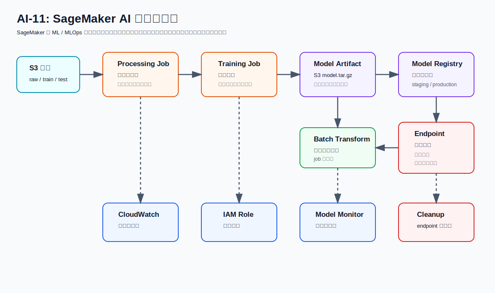

# AI-11：SageMaker 总览与选型



## 目标

建立 SageMaker AI 的完整地图。AI-11 不急着训练模型，先把概念、资源关系、计费风险和清理顺序讲清楚。

SageMaker AI 是 ML / MLOps 平台，不是单纯的大模型调用服务。

```text
Bedrock = 调用托管大模型
专用 AI API = OCR、翻译、语音、PII、图片识别等固定能力
SageMaker = 自己处理数据、训练模型、部署模型、监控模型、管理模型版本
```

## SageMaker 主线

```text
Raw data in S3
  -> Processing Job
  -> Training Job
  -> Model Artifact in S3
  -> Model Registry
  -> Batch Transform or Endpoint
  -> Model Monitor / CloudWatch
```

## 核心概念

| 概念 | 人话解释 | 是否持续收费 |
| --- | --- | --- |
| S3 data | 训练、验证、测试、推理输入输出 | 按存储和请求收费 |
| Processing Job | 托管数据预处理任务 | 跑完停止 |
| Training Job | 托管训练任务 | 跑完停止 |
| Model Artifact | 训练输出的模型文件，例如 `model.tar.gz` | S3 存储收费 |
| SageMaker Model | 部署定义：模型文件、镜像、role | 通常只是配置 |
| Endpoint Configuration | endpoint 的机器规格和部署配置 | 通常只是配置 |
| Endpoint | 在线推理服务 | 持续运行，重点警惕 |
| Batch Transform | 离线批量推理 job | 跑完停止 |
| Model Registry | 模型版本、审批和元数据 | 配置和元数据 |
| Pipeline | 可重复的 ML workflow | 执行时按底层资源收费 |
| Studio app / Notebook | 交互式开发环境 | 可能持续收费 |

## 开发入口选择

本路线默认不用 Studio 里的 JupyterLab / Code Editor 作为主开发工具。

```text
主开发入口：本地 VS Code
  -> aws cli / boto3 / sagemaker sdk
  -> SageMaker Processing / Training / Batch Transform / Endpoint
  -> S3 / CloudWatch / Model Registry
```

Studio / JupyterLab 只作为观察控制台和理解资源关系的入口，不作为主要写代码的地方。

重要边界：

```text
Domain = Studio 工作区、用户、权限和环境边界
Training / Processing / Endpoint = SageMaker 托管计算资源
```

也就是说，不用 Studio JupyterLab 也可以从本地 VS Code 创建 training job、processing job、model、endpoint 和 batch transform job。

## Bedrock 与 SageMaker 的边界

| 需求 | 优先选择 |
| --- | --- |
| 总结、问答、RAG、Agent、Flow | Bedrock |
| OCR、翻译、语音、PII、图片识别 | AWS 专用 AI API |
| 训练自己的模型 | SageMaker |
| 部署自己的模型 endpoint | SageMaker |
| 批量离线推理 | SageMaker Batch Transform |
| 模型版本、审批、pipeline、monitor | SageMaker |

## Hugging Face 模型部署选型

如果从 Hugging Face 下载或使用一个模型，生产部署通常优先考虑 SageMaker，而不是直接手动搭 EC2。

| 场景 | 优先选择 |
| --- | --- |
| 把 Hugging Face 模型部署成在线 API | SageMaker Endpoint |
| 离线跑一批输入数据 | SageMaker Batch Transform |
| 快速使用 Hugging Face Hub 模型 | SageMaker Hugging Face container / JumpStart |
| 完全自管 CUDA、vLLM、TGI、Nginx、监控和扩缩容 | EC2 |
| 调用 AWS 托管大模型能力 | Bedrock |

核心区别：

```text
SageMaker = 托管模型部署平台
EC2 = 自己搭服务器和推理服务
```

典型 SageMaker 链路：

```text
HF_MODEL_ID / model.tar.gz
  -> SageMaker Model
  -> Endpoint Configuration
  -> Endpoint
  -> Application inference request
```

学习阶段优先顺序：

```text
本地 VS Code 编排
  -> HF 模型 + Batch Transform
  -> HF 模型 + 短时 Endpoint
  -> 大模型 / GPU / vLLM / TGI / autoscaling
```

后续 SageMaker 课程不再以传统表格模型为主线。主线改成 Hugging Face 模型：

```text
HF_MODEL_ID
  -> SageMaker Hugging Face / PyTorch container
  -> model.tar.gz 或 Hub model reference
  -> Batch Transform / Endpoint
```

## 本节实操

本节先只做控制台观察：

1. 打开 SageMaker AI 控制台。
2. 找到 Studio / Domains，但不把 Studio JupyterLab 当主开发工具。
3. 找到 Training jobs。
4. 找到 Models / Endpoint configurations / Endpoints。
5. 找到 Batch transform jobs。
6. 找到 Pipelines 和 Model Registry。
7. 记录当前是否已有残留资源。

## 本地项目

目录：

```text
projects/aws-ai/ai-11-sagemaker-overview-and-selection/
```

文件：

| 文件 | 作用 |
| --- | --- |
| `README.md` | 本节项目说明 |
| `templates/sagemaker-cleanup-checklist.md` | SageMaker 清理检查表 |
| `templates/sagemaker-selection-table.md` | Bedrock、专用 API、SageMaker 选型表 |

## 当前记录

```text
本地模板初始化完成。

SageMaker Domain 已创建：
- Domain name: QuickSetupDomain-20260502T200989
- Domain ID: d-051tv5vtrxwt
- Status: Ready
- VPC: vpc-0d72ee5f56fb56420

User profile 已创建：
- User profile: default-20260502T200989
- Status: InService
- Execution role: arn:aws:iam::089781651608:role/ai-12-sagemaker-execution-role

Studio 已打开观察过。
Running instances 页面显示 0 running instances。
不继续创建 JupyterLab space；后续默认使用本地 VS Code + SDK 控制 SageMaker。
```

## 清理顺序

如果后续创建 SageMaker 资源，优先按这个顺序检查：

1. 删除 realtime endpoint。
2. 删除 endpoint configuration。
3. 删除 SageMaker model。
4. 停止或删除 Studio app、notebook、space。
5. 删除 processing / training / transform job 的临时 S3 输入输出。
6. 删除不再需要的 model artifacts。
7. 删除临时 model package / package group。
8. 删除临时 pipeline。
9. 删除临时 IAM policy / role。
10. 删除不再需要的 CloudWatch Log Group，或设置 retention。

## 参考

- SageMaker AI getting started: https://aws.amazon.com/sagemaker/ai/getting-started/
- SageMaker AI setup guide: https://docs.aws.amazon.com/sagemaker/latest/dg/gs.html
- SageMaker training: https://docs.aws.amazon.com/sagemaker/latest/dg/how-it-works-training.html
- SageMaker inference options: https://docs.aws.amazon.com/sagemaker/latest/dg/deploy-model-get-started.html
- SageMaker pricing: https://aws.amazon.com/sagemaker/ai/pricing/
