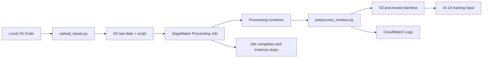

# AI-13：Processing Jobs

## 目标

把本地数据预处理脚本迁移到 SageMaker 托管计算。

Processing Job 的人话解释：

```text
SageMaker 临时开一台机器
  -> 拉取输入数据和脚本
  -> 跑数据处理
  -> 把输出写回 S3
  -> 机器自动停止
```

它适合清洗、切分、转换数据，不适合长期 API 服务或在线推理。

## 架构图



关键理解：

```text
Processing Job 是一次性计算任务。
输入和脚本来自 S3。
输出写回 S3。
实例在 job 完成后自动停止。
```

## 本节项目

目录：

```text
projects/aws-ai/ai-13-processing-jobs/
```

本地流程：

```text
data/raw/sample_reviews.jsonl
  -> scripts/preprocess_reviews.py
  -> data/processed/train.jsonl
  -> data/processed/test.jsonl
```

## 数据格式

原始输入：

```json
{"id":"r001","text":"The model answered quickly.","sentiment":"positive","source":"demo"}
```

处理后输出：

```json
{"id":"r001","text":"The model answered quickly.","label":2,"label_name":"positive"}
```

标签映射：

| sentiment | label |
| --- | --- |
| negative | 0 |
| neutral | 1 |
| positive | 2 |

## 本地命令

```bash
uv run python projects/aws-ai/ai-13-processing-jobs/scripts/preprocess_reviews.py \
  --input projects/aws-ai/ai-13-processing-jobs/data/raw/sample_reviews.jsonl \
  --output-dir projects/aws-ai/ai-13-processing-jobs/data/processed
```

## 下一步

把同一个脚本交给 SageMaker Processing：

```text
local VS Code
  -> upload raw data and script to S3
  -> create Processing Job
  -> processing container runs preprocess_reviews.py
  -> processed output lands in S3
  -> CloudWatch Logs records stdout/stderr
```

## S3 输入上传

配置文件：

```text
projects/aws-ai/ai-13-processing-jobs/config.json
```

上传脚本：

```text
projects/aws-ai/ai-13-processing-jobs/upload_inputs.py
```

上传命令：

```bash
uv run python projects/aws-ai/ai-13-processing-jobs/upload_inputs.py
```

目标位置：

```text
s3://aws-ai-sagemaker-learning-089781651608-eu-central-1-an/sagemaker/ai-13/raw/sample_reviews.jsonl
s3://aws-ai-sagemaker-learning-089781651608-eu-central-1-an/sagemaker/ai-13/scripts/preprocess_reviews.py
```

## 创建 Processing Job

脚本：

```text
projects/aws-ai/ai-13-processing-jobs/run_processing_job.py
```

命令：

```bash
uv run python projects/aws-ai/ai-13-processing-jobs/run_processing_job.py
```

本节使用 SageMaker PyTorch CPU container 作为托管 Python runtime：

```text
763104351884.dkr.ecr.eu-central-1.amazonaws.com/pytorch-training:2.1.0-cpu-py310
```

这里不是训练模型，只是借这个预置容器运行 Python 数据处理脚本。

Processing Job 的容器路径映射：

```text
s3://.../sagemaker/ai-13/raw/
  -> /opt/ml/processing/input

s3://.../sagemaker/ai-13/scripts/
  -> /opt/ml/processing/code

/opt/ml/processing/output
  -> s3://.../sagemaker/ai-13/processed/<job-name>/
```

实例配置：

```text
Instance type: ml.t3.medium
Instance count: 1
Volume: 30 GB
Max runtime: 900 seconds
```

第一次尝试使用 `ml.m5.large` 创建 Processing Job 失败，原因是当前账号在 `eu-central-1` 的 `ml.m5.large for processing job usage` 配额为 `0`。

Service Quotas 查询结果显示：

```text
ml.t3.medium for processing job usage: 4
ml.m5.large for processing job usage: 0
```

因此本节改用 `ml.t3.medium`。

## 当前记录

本地预处理已跑通：

```text
Input records: 10
Train records: 7
Test records: 3
```

已生成：

```text
projects/aws-ai/ai-13-processing-jobs/data/processed/train.jsonl
projects/aws-ai/ai-13-processing-jobs/data/processed/test.jsonl
```

这两个文件是生成物，不作为源文件长期保留。本地目录只保留 `.gitkeep`，后续正式输出由 SageMaker Processing 写到 S3。

SageMaker Processing Job 已跑通：

```text
Job name: ai-13-preprocess-20260502-191348
Status: Completed
Instance type: ml.t3.medium
Image: 763104351884.dkr.ecr.eu-central-1.amazonaws.com/pytorch-training:2.1.0-cpu-py310
```

输出位置：

```text
s3://aws-ai-sagemaker-learning-089781651608-eu-central-1-an/sagemaker/ai-13/processed/ai-13-preprocess-20260502-191348/
```

AI-13 结论：

```text
本地 VS Code
  -> S3 raw/script
  -> SageMaker Processing Job
  -> S3 processed output
```

Processing Job 是 job 型资源，完成后计算实例自动停止；当前没有 endpoint 或 notebook 持续运行。
