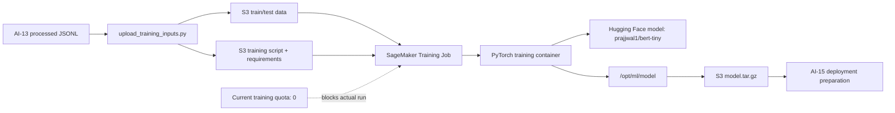

# AI-14：Hugging Face Training Jobs 基础

## 目标

准备一个 SageMaker Training Job 的 Hugging Face transformer 训练流程，理解它如何生成 SageMaker 可管理的 `model.tar.gz`。

本节当前不实际运行 Training Job，因为账号在 `eu-central-1` 的常见 training instance quota 为 `0`，而且当前学习目标是理解链路，不是消耗训练资源。

本节不走传统表格模型路线，主线是：

```text
AI-13 processed JSONL
  -> SageMaker Training Job
  -> Hugging Face transformer
  -> /opt/ml/model
  -> S3 model.tar.gz
```

## 架构图



关键理解：

```text
upload_training_inputs.py 只准备 S3 输入。
run_training_job.py 才会创建 SageMaker Training Job。
train_text_classifier.py 是容器里真正执行的训练代码。
```

## 准备工作状态

本地项目已创建：

```text
projects/aws-ai/ai-14-huggingface-training-jobs/
```

文件：

| 文件 | 作用 |
| --- | --- |
| `config.json` | AI-14 的 profile、role、bucket、model、training instance 配置 |
| `requirements.txt` | 训练容器内安装的 Hugging Face 依赖 |
| `scripts/train_text_classifier.py` | Hugging Face 文本分类训练脚本 |
| `upload_training_inputs.py` | 复制 AI-13 processed 数据并上传训练脚本 |
| `run_training_job.py` | 创建 SageMaker Training Job |

S3 输入也已准备：

```text
s3://aws-ai-sagemaker-learning-089781651608-eu-central-1-an/sagemaker/ai-14/train/train.jsonl
s3://aws-ai-sagemaker-learning-089781651608-eu-central-1-an/sagemaker/ai-14/test/test.jsonl
s3://aws-ai-sagemaker-learning-089781651608-eu-central-1-an/sagemaker/ai-14/scripts/train_text_classifier.py
s3://aws-ai-sagemaker-learning-089781651608-eu-central-1-an/sagemaker/ai-14/scripts/requirements.txt
```

## 模型选择

```text
HF_MODEL_ID = prajjwal1/bert-tiny
```

这是一个很小的 Hugging Face transformer，适合学习 SageMaker Training Job 机制。正式大模型路线也是同一套概念，只是需要 GPU、更多配额和更严肃的成本规划。

## S3 规划

输入：

```text
s3://aws-ai-sagemaker-learning-089781651608-eu-central-1-an/sagemaker/ai-14/train/train.jsonl
s3://aws-ai-sagemaker-learning-089781651608-eu-central-1-an/sagemaker/ai-14/test/test.jsonl
s3://aws-ai-sagemaker-learning-089781651608-eu-central-1-an/sagemaker/ai-14/scripts/train_text_classifier.py
s3://aws-ai-sagemaker-learning-089781651608-eu-central-1-an/sagemaker/ai-14/scripts/requirements.txt
```

输出：

```text
s3://aws-ai-sagemaker-learning-089781651608-eu-central-1-an/sagemaker/ai-14/models/<training-job-name>/model.tar.gz
```

## 训练容器

使用 SageMaker PyTorch CPU image 作为 runtime：

```text
763104351884.dkr.ecr.eu-central-1.amazonaws.com/pytorch-training:2.1.0-cpu-py310
```

容器启动时安装：

```text
transformers==4.37.2
safetensors==0.4.2
```

## Quota 发现

准备阶段查询了 `eu-central-1` 的 Training Job quotas，常见训练实例当前为 `0`，包括：

```text
ml.m5.large for training job usage: 0
ml.t3.large for training job usage: 0
ml.g5.xlarge for training job usage: 0
```

因此 AI-14 当前不直接跑 Training Job。以后如果要真正训练，需要先满足其中一个条件：

```text
1. 申请 training job quota increase，例如 ml.m5.large
2. 或切换到有训练配额的 Region
```

## 当前决策

本节不继续申请 quota，也不运行 `run_training_job.py`。

原因：

```text
1. 当前已经读完并理解 Training Job 代码结构。
2. AI-14 的目标是理解 HF training artifact 链路。
3. 继续跑 Training Job 会引入 quota 和计算费用问题。
4. 下一节可以先学习部署概念和 Batch Transform 这种更安全的一次性推理方式。
```

如果以后需要真的训练，再回来处理：

```text
Service Quotas
  -> Amazon SageMaker
  -> training job usage
  -> request quota for a small CPU or GPU instance
```
