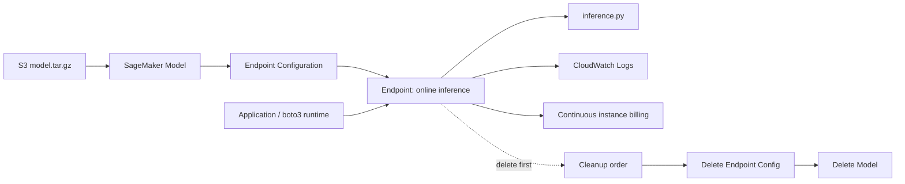

# AI-15：SageMaker 模型产物与部署准备

## 本节目标

AI-15 学的是：训练完的 Hugging Face 模型，怎么变成可以被应用调用的 SageMaker 推理服务。

这节不训练模型，也不创建 endpoint。先把部署链路、模型包结构、推理入口和费用边界讲清楚。

核心链路：

```text
AI-13 Processing Job
  -> train/test 数据
  -> AI-14 Training Job
  -> model.tar.gz
  -> AI-15 SageMaker Model
  -> Endpoint Configuration
  -> Endpoint
  -> InvokeEndpoint
```

一句话总结：

```text
Training Job 负责产出模型包。
Deployment 负责把模型包变成 API。
```

## 架构图



关键理解：

```text
Model 和 Endpoint Config 是配置。
Endpoint 才是在线机器。
Endpoint 不删就会持续计费。
```

## 为什么需要 AI-15

模型训练完成后，应用不能直接调用 Training Job。

Training Job 是一次性任务，跑完就结束；真正在线服务用户请求，需要另一个部署链路：

```text
模型文件
  -> 推理容器
  -> 在线实例
  -> HTTP/API 调用
```

在 SageMaker 里，这条链路被拆成三个资源：

| 资源 | 作用 | 关键点 |
| --- | --- | --- |
| SageMaker Model | 登记模型包和推理镜像 | 只是配置，不是在线服务 |
| Endpoint Configuration | 登记部署机器和实例数量 | 也是配置，不启动机器 |
| Endpoint | 真正启动实例并接收推理请求 | 持续计费，必须记得删 |

## 本地项目

```text
projects/aws-ai/ai-15-sagemaker-model-deployment/
```

文件：

| 文件 | 作用 |
| --- | --- |
| `config.json` | AI-15 的 role、artifact、inference image、endpoint instance 配置 |
| `deployment_plan.py` | 只打印部署 API 计划，不创建 AWS 资源 |
| `model_artifact_layout.md` | 解释 `model.tar.gz` 里面应该有什么 |
| `inference_code/inference.py` | SageMaker 推理入口代码骨架 |
| `inference_code/requirements.txt` | 推理容器需要安装的依赖 |

## model.tar.gz 是什么

SageMaker 部署时吃的是 S3 里的模型包，通常叫：

```text
model.tar.gz
```

对 Hugging Face 文本分类模型来说，解压后大概是：

```text
model.tar.gz
  config.json
  model.safetensors or pytorch_model.bin
  tokenizer.json
  tokenizer_config.json
  vocab.txt
  special_tokens_map.json
  metrics.json
  code/
    inference.py
    requirements.txt
```

各部分作用：

| 文件 | 作用 |
| --- | --- |
| `config.json` | Hugging Face 模型结构配置 |
| `model.safetensors` / `pytorch_model.bin` | 模型权重 |
| tokenizer 文件 | 把输入文本转换成 token |
| `metrics.json` | 训练/评估指标，主要给人和治理流程看 |
| `code/inference.py` | Endpoint 收到请求后执行的推理逻辑 |
| `code/requirements.txt` | 推理容器启动时补装依赖 |

关键理解：

```text
model.tar.gz = 模型权重 + tokenizer + 推理代码
```

## inference.py 的角色

SageMaker 推理容器会按固定函数名调用 `inference.py`：

```text
model_fn
input_fn
predict_fn
output_fn
```

含义：

| 函数 | 什么时候执行 | 作用 |
| --- | --- | --- |
| `model_fn(model_dir)` | Endpoint 启动时 | 从 `/opt/ml/model` 加载模型和 tokenizer |
| `input_fn(request_body, content_type)` | 每次请求进来时 | 把 JSON 请求解析成 Python 数据 |
| `predict_fn(input_data, model)` | 每次请求进来时 | 调用 tokenizer 和模型做预测 |
| `output_fn(prediction, accept)` | 返回响应前 | 把预测结果转成 JSON |

本节的请求格式设计成：

```json
{"text": "this product is great"}
```

或者：

```json
{"texts": ["good product", "bad support"]}
```

返回格式大概是：

```json
{
  "predictions": [
    {
      "label_id": 2,
      "label": "positive",
      "score": 0.91
    }
  ]
}
```

## deployment_plan.py 在干嘛

`deployment_plan.py` 是 dry-run 脚本，只打印计划，不创建资源。

它模拟以后真正部署时的三个 API：

```text
CreateModel
CreateEndpointConfig
CreateEndpoint
```

对应关系：

| API | 做什么 | 是否启动机器 |
| --- | --- | --- |
| `CreateModel` | 指定模型包 S3 地址、推理镜像、IAM role | 否 |
| `CreateEndpointConfig` | 指定实例类型、实例数量、流量配置 | 否 |
| `CreateEndpoint` | 按配置启动 endpoint | 是 |

最重要的费用边界：

```text
CreateEndpoint 才是启动在线实例的动作。
Endpoint 不删，就会持续计费。
```

## config.json 关键字段

| 字段 | 含义 |
| --- | --- |
| `sagemaker_role_arn` | Endpoint 用这个 role 读 S3、拉镜像、写日志 |
| `source_model_artifact_s3_uri` | `model.tar.gz` 的 S3 地址 |
| `inference_image_uri` | 推理容器镜像 |
| `endpoint_instance_type` | Endpoint 用什么机器 |
| `endpoint_initial_instance_count` | Endpoint 初始实例数量 |

当前 `source_model_artifact_s3_uri` 还是占位符：

```text
s3://.../sagemaker/ai-14/models/<training-job-name>/model.tar.gz
```

原因：AI-14 没有真正跑 Training Job，所以还没有真实模型包。

## Training Image 和 Inference Image

训练镜像和推理镜像不是一回事。

| 镜像 | 用在哪里 | 关注点 |
| --- | --- | --- |
| Training image | Training Job | 读训练数据、训练模型、保存 `/opt/ml/model` |
| Inference image | Endpoint | 加载模型、处理请求、返回预测 |

AI-14 用的是 training image：

```text
pytorch-training:2.1.0-cpu-py310
```

AI-15 计划用的是 inference image：

```text
pytorch-inference:2.1.0-cpu-py310
```

## 资源与费用边界

| 资源 | 是否持续计费 | 说明 |
| --- | --- | --- |
| S3 `model.tar.gz` | 低成本存储费 | 文件越大费用越高，但通常不是最大风险 |
| SageMaker Model | 否 | 控制面配置 |
| Endpoint Configuration | 否 | 控制面配置 |
| Endpoint | 是 | 在线实例持续运行 |
| CloudWatch Logs | 低成本存储费 | Endpoint 日志会保存 |

真正危险的是 endpoint：

```text
Endpoint = 一直开着的推理服务器
```

所以以后如果实操 endpoint，删除顺序必须是：

```text
1. Delete endpoint
2. Delete endpoint configuration
3. Delete model
4. 删除不需要的 S3 artifact
5. 删除不需要的 CloudWatch logs
```

## 当前状态

AI-15 本地准备已完成：

```text
deployment_plan.py dry-run 可运行
inference.py 骨架已创建
model_artifact_layout.md 已记录
note 和 roadmap 已更新
```

没有创建：

```text
SageMaker Model
Endpoint Configuration
Endpoint
```

因此当前没有 endpoint 持续费用。

## 继续部署前必须确认

真正部署前要先确认三件事：

```text
1. AI-14 是否真的有 model.tar.gz
2. endpoint instance quota 是否可用
3. 是否准备好测试后立即删除 endpoint
```

如果只是学习推理链路，下一节先学 Batch Transform 更安全，因为它是一次性批量推理 job，跑完自动停止。

## 本节记忆点

```text
1. Training Job 产出 model.tar.gz。
2. model.tar.gz 里不只是权重，还要有 tokenizer 和推理代码。
3. SageMaker Model 是登记模型包和推理镜像。
4. Endpoint Config 是登记机器规格和实例数量。
5. Endpoint 才是真正在线服务，也才是主要持续费用来源。
```
