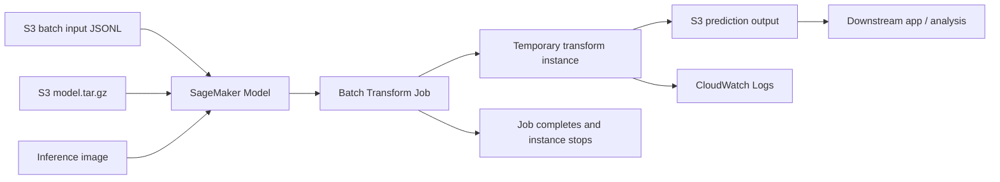

# AI-16：Batch Transform / 离线批量推理

## 本节目标

AI-16 学的是：不用长期在线 endpoint，也能让 SageMaker 对一批 S3 文件做推理。

这节先做本地准备，不创建 SageMaker Model，也不创建 Batch Transform Job。

## 学习记录

状态：

```text
已读完，已通过。
```

本节实际完成的是概念和本地准备：

```text
1. 理解 Batch Transform 是离线批量推理 job。
2. 理解它和 real-time endpoint 的区别。
3. 明确 Batch Transform 需要 SageMaker Model，但不需要 Endpoint Config / Endpoint。
4. 创建本地 dry-run 脚本，只打印 CreateModel 和 CreateTransformJob 请求。
5. 没有创建任何 AWS 资源。
```

当前费用状态：

```text
没有 SageMaker Model
没有 Batch Transform Job
没有 Endpoint
没有新增 AWS 计算费用
```

## 为什么先学 Batch Transform

AI-15 讲了实时 endpoint：

```text
model.tar.gz
  -> SageMaker Model
  -> Endpoint Configuration
  -> Endpoint
```

Endpoint 适合低延迟在线 API，但会持续运行实例，也会持续计费。

Batch Transform 的思路不同：

```text
S3 input file
  -> Batch Transform Job
  -> S3 output file
  -> job completes
```

它适合离线批处理，例如：

```text
1. 每天晚上给 10 万条评论打标签
2. 对历史客服记录做情感分类
3. 批量跑 embedding / 分类 / rerank
4. 不需要毫秒级响应，只需要结果文件
```

## 架构图



关键理解：

```text
Batch Transform 仍然需要 SageMaker Model。
但它不需要 Endpoint Config，也不需要 Endpoint。
Transform Job 跑完后实例自动停止。
```

## 和 Endpoint 的区别

| 对比项 | Real-time Endpoint | Batch Transform |
| --- | --- | --- |
| 输入 | 单次请求 | S3 文件 |
| 输出 | 同步 API 响应 | S3 输出文件 |
| 延迟 | 低延迟 | 不追求低延迟 |
| 计算资源 | 长期运行 | job 期间临时运行 |
| 费用风险 | 忘删会持续计费 | job 完成后停止 |
| 适合场景 | 在线应用、聊天、实时分类 | 离线批处理、历史数据分析 |

## 本地项目

```text
projects/aws-ai/ai-16-batch-transform-offline-inference/
```

文件：

| 文件 | 作用 |
| --- | --- |
| `config.json` | Batch Transform 的 role、artifact、inference image、input/output S3 配置 |
| `batch_transform_plan.py` | 只打印 API 计划，不创建 AWS 资源 |
| `data/input/batch_input.jsonl` | 本地批量输入样例 |

## 输入格式

Batch Transform 常见输入是 JSON Lines：

```json
{"text":"The support team answered quickly and solved my issue."}
{"text":"The product works, but the setup instructions are unclear."}
```

这里每一行是一条推理请求。

对应 TransformInput 里的关键配置：

```text
ContentType: application/jsonlines
SplitType: Line
BatchStrategy: SingleRecord
```

意思是：

```text
按行切分输入文件。
每一行作为一次模型调用。
输出也按行写回 S3。
```

## Batch Transform 的资源链路

Batch Transform 不是直接拿 `model.tar.gz` 就能跑。

它仍然需要先有 SageMaker Model：

```text
model.tar.gz + inference image + execution role
  -> SageMaker Model
  -> CreateTransformJob
  -> S3 output
```

但是它不需要：

```text
Endpoint Configuration
Endpoint
```

这就是它比实时 endpoint 更适合学习和离线任务的原因。

## batch_transform_plan.py 在干嘛

`batch_transform_plan.py` 是 dry-run 脚本，只打印以后真正要调用的 API：

```text
CreateModel
CreateTransformJob
```

对应关系：

| API | 做什么 | 是否长期运行 |
| --- | --- | --- |
| `CreateModel` | 登记模型包、推理镜像、IAM role | 否 |
| `CreateTransformJob` | 启动一次批量推理 job | 否，job 完成后停止 |

注意：

```text
CreateTransformJob 运行期间会计费。
但它不像 endpoint 那样一直开着。
```

## 当前状态

AI-16 本地准备已完成，当前只有：

```text
本地 note
本地 dry-run 脚本
本地 sample input
```

不会创建：

```text
SageMaker Model
Batch Transform Job
Endpoint
```

所以当前不会新增 AWS 计算费用。

## 真正运行前必须确认

以后如果要真的跑 Batch Transform，需要先确认：

```text
1. 有真实 model.tar.gz
2. 有可用 transform job instance quota
3. 输入 JSONL 已上传到 S3
4. 输出 S3 prefix 可以写入
5. 运行后检查 job status 和 S3 output
```

## 本节记忆点

```text
1. Endpoint 是在线 API，适合实时请求。
2. Batch Transform 是离线 job，适合批量文件推理。
3. Batch Transform 仍然需要 SageMaker Model。
4. Batch Transform 不需要 Endpoint Config 和 Endpoint。
5. Batch Transform 跑完自动停，费用风险比 endpoint 低。
```
