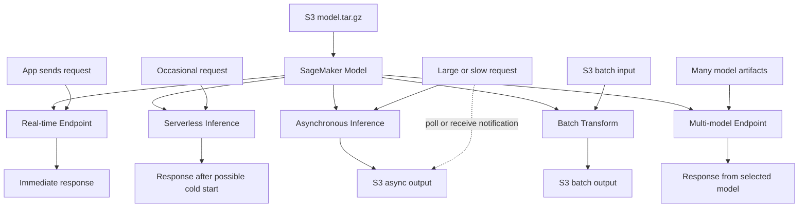

# AI-17：Inference 模式全家桶

## 本节目标

AI-17 学的是 SageMaker 里几种推理方式怎么选。

这节不创建资源，不部署 endpoint。重点是以后看到一个业务场景时，能判断该用哪种推理模式。

## 学习记录

状态：

```text
已读完，已通过。
```

本节实际完成的是推理模式选型：

```text
1. 理解 Real-time Endpoint、Serverless、Async、Batch Transform、Multi-model Endpoint 的区别。
2. 理解 Batch Transform 是 job 路线，不需要 endpoint。
3. 理解其他几类主要围绕 Model / Endpoint Config / Endpoint 变化。
4. 能根据延迟、流量、输入来源、结果返回方式和模型数量做选择。
5. 没有创建任何 AWS 资源。
```

当前费用状态：

```text
没有 SageMaker Model
没有 Endpoint
没有 Serverless endpoint
没有 Async endpoint
没有 Batch Transform Job
没有新增 AWS 计算费用
```

## 总览

同一个模型产物，可以走不同推理路径：

```text
model.tar.gz
  -> SageMaker Model
  -> one inference mode
```

常见推理方式：

| 模式 | 中文理解 | 关键词 |
| --- | --- | --- |
| Real-time Endpoint | 实时在线 API | 低延迟、持续运行、同步返回 |
| Serverless Inference | 无服务器实时推理 | 低频调用、按需启动、可能冷启动 |
| Asynchronous Inference | 异步在线推理 | 请求较慢、结果稍后取、大输入输出 |
| Batch Transform | 离线批量推理 | S3 文件、批处理、跑完停止 |
| Multi-model Endpoint | 多模型共享 endpoint | 很多小模型、共享机器、按需加载 |

## 在 AWS 里怎么用

这些模式不是五个完全独立的服务。它们大多围绕同一组 SageMaker 资源变化：

```text
model.tar.gz
  -> SageMaker Model
  -> Endpoint Configuration
  -> Endpoint
```

例外是 Batch Transform：

```text
model.tar.gz
  -> SageMaker Model
  -> Transform Job
```

对应关系：

| 模式 | AWS 里怎么创建 | 主要 API | 调用方式 | 清理重点 |
| --- | --- | --- | --- | --- |
| Real-time Endpoint | 创建 Model、Endpoint Config、Endpoint | `CreateModel`、`CreateEndpointConfig`、`CreateEndpoint` | `InvokeEndpoint` | 先删 Endpoint |
| Serverless Inference | 创建 Endpoint Config 时不用实例类型，改用 serverless 配置 | `CreateEndpointConfig` with `ServerlessConfig` | `InvokeEndpoint` | 先删 Endpoint |
| Asynchronous Inference | 创建 Endpoint Config 时加 async 配置，结果写 S3 | `CreateEndpointConfig` with `AsyncInferenceConfig` | `InvokeEndpointAsync` | 先删 Endpoint，再看 S3 输出 |
| Batch Transform | 创建 Model 后直接创建 Transform Job | `CreateModel`、`CreateTransformJob` | 输入/输出都在 S3 | job 跑完停，清 S3 输出和 Model |
| Multi-model Endpoint | 创建支持多模型的 Model 和 Endpoint | `CreateModel`、`CreateEndpointConfig`、`CreateEndpoint` | `InvokeEndpoint` 时指定 target model | 先删 Endpoint，再清多个模型 artifact |

Console 里大致对应：

```text
SageMaker AI
  -> Inference
  -> Models
  -> Endpoint configurations
  -> Endpoints
  -> Batch transform jobs
```

注意：Console 菜单名字可能会随 AWS UI 调整，但底层概念基本就是这些 API。

## AWS 资源关系

### Real-time Endpoint

```text
S3 model.tar.gz
  -> CreateModel
  -> CreateEndpointConfig(instance type + instance count)
  -> CreateEndpoint
  -> InvokeEndpoint
```

你在 AWS 里会看到：

```text
Model
Endpoint configuration
Endpoint
CloudWatch Logs
```

### Serverless Inference

```text
S3 model.tar.gz
  -> CreateModel
  -> CreateEndpointConfig(ServerlessConfig)
  -> CreateEndpoint
  -> InvokeEndpoint
```

它和 real-time endpoint 的区别不是调用方式，而是 Endpoint Config 里的计算配置不同：

```text
Real-time: InstanceType + InitialInstanceCount
Serverless: MemorySizeInMB + MaxConcurrency
```

### Asynchronous Inference

```text
S3 model.tar.gz
  -> CreateModel
  -> CreateEndpointConfig(AsyncInferenceConfig)
  -> CreateEndpoint
  -> InvokeEndpointAsync
  -> S3 output
```

它适合结果不需要马上返回的场景。请求提交后，结果写到 S3。

### Batch Transform

```text
S3 model.tar.gz
  -> CreateModel
  -> CreateTransformJob
  -> S3 input
  -> S3 output
```

它不需要：

```text
Endpoint Configuration
Endpoint
```

所以它不像 endpoint 那样持续在线运行。

### Multi-model Endpoint

```text
多个 model.tar.gz in S3
  -> Multi-model SageMaker Model
  -> Endpoint Configuration
  -> Endpoint
  -> InvokeEndpoint(TargetModel=...)
```

它本质上还是 endpoint，只是同一个 endpoint 可以按请求加载不同模型。

## 架构图



关键理解：

```text
不是所有推理都应该用 endpoint。
先看输入、延迟、流量、结果返回方式，再选模式。
```

## 选择问题

做推理方案前，先问这几个问题：

```text
1. 用户是否需要马上拿到结果？
2. 请求是一条一条来，还是一批文件？
3. 流量是持续的，还是偶尔调用？
4. 单次请求会不会很慢？
5. 输入/输出是不是很大？
6. 是一个模型，还是很多模型？
7. 能不能接受冷启动？
8. 成本风险能不能接受？
```

## 选型表

| 场景 | 推荐模式 | 原因 |
| --- | --- | --- |
| 聊天机器人、实时分类、实时推荐 | Real-time Endpoint | 需要低延迟同步响应 |
| 偶尔调用的小模型 API | Serverless Inference | 不想长期跑实例，但能接受冷启动 |
| 文档处理、视频/音频分析、慢推理 | Asynchronous Inference | 请求耗时长，结果可以稍后取 |
| 每晚处理大量历史数据 | Batch Transform | 输入输出都在 S3，跑完自动停 |
| 很多租户/客户各有一个小模型 | Multi-model Endpoint | 多模型共享 endpoint，减少长期实例浪费 |

## Real-time Endpoint

适合：

```text
1. 用户在线等结果
2. 延迟要求低
3. 流量相对稳定
4. 应用需要同步 API
```

不适合：

```text
1. 只是偶尔调用
2. 大部分时间没流量
3. 忘记删除会造成持续费用
```

费用边界：

```text
Endpoint 会持续运行实例。
不删就持续计费。
```

## Serverless Inference

适合：

```text
1. 流量低或不稳定
2. 不想长期管理实例
3. 可以接受冷启动
```

不适合：

```text
1. 延迟非常敏感
2. 模型很大，启动很慢
3. 需要稳定高吞吐
```

关键理解：

```text
Serverless 不是免费。
它是减少空闲实例成本，但可能牺牲冷启动延迟。
```

## Asynchronous Inference

适合：

```text
1. 单次推理时间长
2. 输入或输出比较大
3. 用户不需要马上拿到结果
4. 结果可以写到 S3
```

典型例子：

```text
长文档分析
大图片处理
批量但还需要按请求提交的任务
```

和 Batch Transform 的区别：

```text
Async Inference 更像“异步 API”。
Batch Transform 更像“离线文件批处理 job”。
```

## Batch Transform

适合：

```text
1. 输入已经是 S3 文件
2. 不需要实时响应
3. 一次处理很多条记录
4. job 跑完即可停止
```

不适合：

```text
1. 用户在线等结果
2. 需要毫秒级响应
3. 请求是一条一条实时进来的
```

我们 AI-16 已经学过：

```text
S3 input
  -> Batch Transform Job
  -> S3 output
  -> job completes
```

## Multi-model Endpoint

适合：

```text
1. 有很多小模型
2. 每个模型访问量不高
3. 希望共享同一组实例
4. 可以接受模型加载延迟
```

典型场景：

```text
每个客户一个分类模型
每个地区一个小模型
大量低频模型需要统一托管
```

不适合：

```text
1. 单个大模型
2. 每个模型都高频访问
3. 不能接受首次加载延迟
```

## 快速决策

```text
要马上返回结果，并且流量稳定 -> Real-time Endpoint
要马上返回结果，但流量很低 -> Serverless Inference
请求很慢，结果可以稍后取 -> Asynchronous Inference
输入是一批 S3 文件 -> Batch Transform
很多小模型共享机器 -> Multi-model Endpoint
```

## 当前状态

本节只做选型学习：

```text
没有创建 SageMaker Model
没有创建 Endpoint
没有创建 Serverless endpoint
没有创建 Async endpoint
没有创建 Batch Transform Job
没有新增 AWS 计算费用
```

## 本节记忆点

```text
1. Endpoint 不是唯一推理方式。
2. Batch Transform 适合离线批量文件。
3. Async Inference 适合慢请求，结果稍后取。
4. Serverless Inference 适合低频请求，但可能冷启动。
5. Multi-model Endpoint 适合很多低频小模型共享资源。
```
