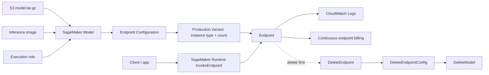

# AI-18：Model、Endpoint Config 与 Endpoint

## 本节目标

AI-18 是实时 endpoint 专题。

AI-15 已经讲过 endpoint 是什么；AI-18 讲的是：如果真的要部署实时 endpoint，AWS 里每一步是什么、什么时候开始计费、怎么调用、怎么安全删除。

本节先做 dry-run 和 checklist，不创建 endpoint。

## 学习记录

状态：

```text
已读完，已通过。
```

本节实际完成的是实时 endpoint checklist：

```text
1. 理解 SageMaker Model、Endpoint Configuration、Endpoint 的区别。
2. 理解 CreateModel、CreateEndpointConfig、CreateEndpoint、InvokeEndpoint 的顺序。
3. 理解 DeleteEndpoint、DeleteEndpointConfig、DeleteModel 的安全删除顺序。
4. 明确 CreateEndpoint 之后才会启动在线实例并产生持续计费风险。
5. 没有创建任何 AWS 资源。
```

当前费用状态：

```text
没有 SageMaker Model
没有 Endpoint Configuration
没有 Endpoint
没有新增 AWS 计算费用
```

## 架构图



关键理解：

```text
SageMaker Model 是模型登记。
Endpoint Configuration 是部署规格。
Endpoint 是真正在线跑的服务。
Endpoint 才是持续计费风险。
```

## 三件套

| 资源 | 干嘛的 | 是否在线运行 |
| --- | --- | --- |
| SageMaker Model | 记录模型包、推理镜像、execution role | 否 |
| Endpoint Configuration | 记录实例类型、实例数、variant 流量 | 否 |
| Endpoint | 根据配置启动推理实例并接收请求 | 是 |

一句话：

```text
Model 和 Endpoint Config 是配置。
Endpoint 是服务。
```

## 创建顺序

真实创建时顺序是：

```text
1. CreateModel
2. CreateEndpointConfig
3. CreateEndpoint
4. 等待 EndpointStatus = InService
5. InvokeEndpoint
```

### CreateModel

作用：

```text
告诉 SageMaker：
1. model.tar.gz 在哪个 S3 地址
2. 用哪个 inference image 启动容器
3. 用哪个 execution role 读取模型和写日志
4. 容器启动时执行哪个 inference.py
```

主要字段：

| 字段 | 含义 |
| --- | --- |
| `ModelName` | SageMaker Model 名字 |
| `ExecutionRoleArn` | endpoint 容器使用的 IAM role |
| `PrimaryContainer.Image` | 推理镜像 |
| `PrimaryContainer.ModelDataUrl` | `model.tar.gz` 的 S3 地址 |
| `PrimaryContainer.Environment` | 容器环境变量，例如 `SAGEMAKER_PROGRAM` |

### CreateEndpointConfig

作用：

```text
告诉 SageMaker：
1. endpoint 用哪个 Model
2. 用什么实例类型
3. 启动几个实例
4. 流量如何分配
```

主要字段：

| 字段 | 含义 |
| --- | --- |
| `EndpointConfigName` | endpoint config 名字 |
| `ProductionVariants` | 生产 variant 列表 |
| `ModelName` | 指向哪个 SageMaker Model |
| `InstanceType` | 例如 `ml.m5.large` |
| `InitialInstanceCount` | 初始实例数量 |
| `InitialVariantWeight` | 流量权重 |

### CreateEndpoint

作用：

```text
根据 Endpoint Configuration 真正启动在线推理服务。
```

这是最重要的费用边界：

```text
CreateEndpoint 之后会启动实例。
Endpoint 不删，就持续计费。
```

## 调用方式

Endpoint 创建完成后，状态变成：

```text
EndpointStatus = InService
```

然后调用的是 SageMaker Runtime：

```text
InvokeEndpoint
```

请求大概是：

```json
{
  "EndpointName": "ai-18-realtime-classifier-endpoint",
  "ContentType": "application/json",
  "Accept": "application/json",
  "Body": {
    "text": "The support team answered quickly and solved my issue."
  }
}
```

这里的 `Body` 会交给模型包里的 `inference.py`：

```text
input_fn -> predict_fn -> output_fn
```

## CloudWatch Logs

Endpoint 容器的日志会进入 CloudWatch Logs。

通常用来看：

```text
1. 模型是否加载成功
2. requirements 是否安装成功
3. inference.py 是否报错
4. 请求是否进入容器
5. 容器是否超时或内存不足
```

## 删除顺序

删除必须按这个顺序：

```text
1. DeleteEndpoint
2. DeleteEndpointConfig
3. DeleteModel
4. 删除不需要的 S3 model artifact / input / output
5. 删除或设置 CloudWatch Logs retention
```

最重要的是第一步：

```text
先删除 Endpoint。
```

因为 Endpoint 才是持续运行实例的资源。

## endpoint_dry_run.py 在干嘛

本地脚本：

```text
projects/aws-ai/ai-18-realtime-endpoint-checklist/endpoint_dry_run.py
```

只打印这些请求：

```text
CreateModel
CreateEndpointConfig
CreateEndpoint
InvokeEndpoint
DeleteEndpoint
DeleteEndpointConfig
DeleteModel
```

它不调用 AWS，不创建资源。

## 真正运行前必须确认

```text
1. 有真实 model.tar.gz
2. endpoint instance quota 可用
3. 知道要用哪个 instance type
4. 已准备好测试请求
5. 已准备好立刻删除 endpoint
6. 知道去 CloudWatch Logs 哪里排错
```

## 当前状态

```text
没有创建 SageMaker Model
没有创建 Endpoint Configuration
没有创建 Endpoint
没有新增 AWS 计算费用
```

## 本节记忆点

```text
1. Model 是模型登记。
2. Endpoint Config 是部署规格。
3. Endpoint 是在线服务。
4. InvokeEndpoint 是运行时调用 API。
5. DeleteEndpoint 必须最先做。
```
