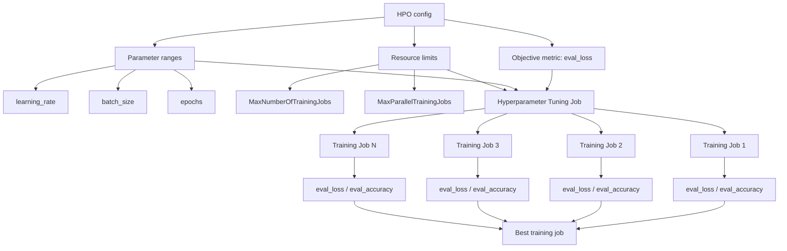

# AI-19：Hyperparameter Tuning / HPO 自动调参

## 本节目标

AI-19 学的是 SageMaker HPO：让 SageMaker 自动尝试多组训练参数，找出指标最好的训练任务。

本节只做 dry-run 和概念笔记，不启动 tuning job。

## 学习记录

状态：

```text
已读完，已通过。
```

本节实际完成的是 HPO 概念和 dry-run：

```text
1. 理解 HPO 是自动启动多个 Training Jobs 来试参数。
2. 理解 objective metric、parameter ranges、metric definitions 的作用。
3. 理解 max jobs 和 max parallel jobs 是成本刹车。
4. 明确真实运行前必须让训练脚本能读取 SageMaker 分配的 hyperparameters。
5. 没有创建任何 AWS 资源。
```

当前费用状态：

```text
没有 Hyperparameter Tuning Job
没有 Training Job
没有新增 AWS 计算费用
```

## HPO 是什么

普通 Training Job：

```text
你手动选一组参数
  -> 跑一次 Training Job
  -> 得到一个模型和一组指标
```

HPO：

```text
你定义参数搜索范围
  -> SageMaker 自动启动多个 Training Jobs
  -> 每个 job 用不同参数
  -> 根据 objective metric 比较结果
  -> 选出 best training job
```

一句话：

```text
HPO = 自动批量试参数 + 自动比较指标。
```

## 架构图



关键理解：

```text
一个 HPO job 会创建多个 Training Jobs。
所以 HPO 的成本风险比单个 Training Job 更高。
```

## 核心概念

| 概念 | 作用 |
| --- | --- |
| Objective metric | 用哪个指标判断训练好坏 |
| Objective type | 指标是越大越好，还是越小越好 |
| Parameter ranges | 哪些超参数可以被搜索 |
| MaxNumberOfTrainingJobs | 总共最多跑多少个 training jobs |
| MaxParallelTrainingJobs | 同时最多跑多少个 training jobs |
| MetricDefinitions | 从训练日志里提取指标的正则 |
| Best training job | HPO 选出来的最优训练任务 |

## Objective Metric

本节用：

```text
MetricName: eval_loss
Type: Minimize
```

意思是：

```text
测试集 loss 越低越好。
```

也可以用：

```text
MetricName: eval_accuracy
Type: Maximize
```

意思是：

```text
测试集 accuracy 越高越好。
```

## Parameter Ranges

本节计划搜索：

```text
learning_rate: 0.00001 到 0.0001
batch_size: 2 到 8
epochs: 1 到 3
```

这些不是模型自己学出来的参数，而是训练前设置的超参数。

## MetricDefinitions

AI-14 的训练脚本会打印：

```text
eval_accuracy=0.666667
eval_loss=0.912345
```

HPO 需要从日志里抓指标，所以要配置正则：

```text
eval_loss=([0-9\.]+)
eval_accuracy=([0-9\.]+)
```

SageMaker 会从 CloudWatch training logs 中提取这些值，再判断哪个 training job 最好。

## 成本边界

HPO 的费用放大点：

```text
1. 每一次参数尝试都是一个 Training Job。
2. MaxNumberOfTrainingJobs 越大，总成本上限越高。
3. MaxParallelTrainingJobs 越大，同一时间烧钱越快。
4. GPU instance 会让成本更快放大。
```

学习阶段建议：

```text
MaxNumberOfTrainingJobs: 2 到 4
MaxParallelTrainingJobs: 1
InstanceType: 小 CPU 或明确可承受的小 GPU
MaxRuntimeInSeconds: 保守设置
```

## 和普通 Training Job 的区别

| 对比项 | 普通 Training Job | HPO |
| --- | --- | --- |
| 参数 | 手动给一组 | 给范围，让 SageMaker 搜索 |
| job 数量 | 1 个 | 多个 |
| 输出 | 一个训练结果 | 多个训练结果 + best job |
| 成本 | 单次训练成本 | 多次训练成本 |
| 风险 | quota / 单 job 费用 | quota / 多 job 并发 / 成本放大 |

## 当前 dry-run

本地项目：

```text
projects/aws-ai/ai-19-hyperparameter-tuning-dry-run/
```

文件：

| 文件 | 作用 |
| --- | --- |
| `config.json` | HPO 的 role、S3、训练镜像、实例和限制配置 |
| `hpo_plan.py` | 只打印 CreateHyperParameterTuningJob 请求，不调用 AWS |
| `README.md` | 本节项目说明 |

执行：

```bash
uv run python projects/aws-ai/ai-19-hyperparameter-tuning-dry-run/hpo_plan.py
```

这个脚本只打印 request shape，不创建 tuning job。

## 真实运行前的坑

真实 HPO 要确认训练容器能读取 SageMaker 传入的 hyperparameters。

AI-14 的训练脚本当前是 CLI 参数风格：

```text
--epochs
--batch-size
--learning-rate
```

真正运行 HPO 时，需要确认容器能把 SageMaker hyperparameters 正确传给这些 CLI 参数，或者加一个 adapter，从 SageMaker 的 hyperparameters 配置读取参数再启动训练脚本。

本节先不做真实运行，所以只记录这个兼容性要求。

## 当前状态

```text
没有创建 Hyperparameter Tuning Job
没有创建 Training Job
没有新增 AWS 计算费用
```

## 本节记忆点

```text
1. HPO 会自动创建多个 Training Jobs。
2. Objective metric 决定什么叫“最好”。
3. Parameter ranges 决定 SageMaker 搜哪些参数。
4. Max jobs 和 max parallel jobs 是成本刹车。
5. HPO 成本风险比单个 Training Job 更高。
```
