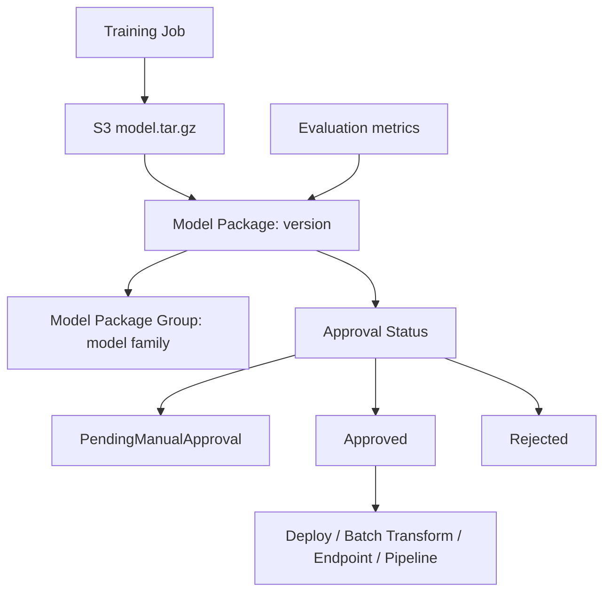

# AI-20：Model Registry / 模型注册表

## 本节目标

AI-20 学的是 SageMaker Model Registry：把模型 artifact 登记成可追踪、可审批、可部署的模型版本。

本节只做 dry-run 和概念笔记，不创建 Model Package Group，也不注册模型版本。

## 学习记录

状态：

```text
已读完，已通过。
```

本节实际完成的是 Model Registry 概念和 dry-run：

```text
1. 理解 Model Registry 是模型版本控制和审批中心。
2. 理解 Model Package Group、Model Package、Approval Status、Model Metrics。
3. 理解 S3 model.tar.gz 和 Model Package 的区别。
4. 理解 PendingManualApproval、Approved、Rejected 的用途。
5. 没有创建任何 AWS 资源。
```

当前费用状态：

```text
没有 Model Package Group
没有 Model Package
没有更新审批状态
没有新增 AWS 计算费用
```

## 为什么需要 Model Registry

Training Job 产出的是文件：

```text
model.tar.gz
```

但真实项目里会有很多次训练：

```text
model-v1.tar.gz
model-v2.tar.gz
model-v3.tar.gz
```

需要回答这些问题：

```text
1. 哪个模型是线上版本？
2. 哪个版本还在测试？
3. 哪个版本指标最好？
4. 哪个版本被拒绝？
5. 这个模型来自哪次训练？
6. 这个版本能不能部署到 production？
```

Model Registry 就是管这些问题的。

一句话：

```text
Model Registry = 模型版本控制 + 审批中心。
```

## 架构图



关键理解：

```text
S3 artifact 是文件。
Model Package 是登记后的模型版本。
Model Package Group 是一组版本。
Approval Status 决定这个版本是否允许进入后续部署流程。
```

## 核心概念

| 概念 | 作用 |
| --- | --- |
| Model Package Group | 一个模型系列，例如 `review-classifier` |
| Model Package | 某一次训练产出的模型版本 |
| Model Approval Status | 版本审批状态 |
| Model Metrics | 记录模型质量指标 |
| Customer Metadata | 自定义元数据，例如训练来源、指标摘要 |
| Model Package ARN | 某个模型版本的唯一标识 |

## Model Package Group

可以理解成一个模型项目或模型系列：

```text
review-classifier
```

它下面会有多个版本：

```text
review-classifier / version 1
review-classifier / version 2
review-classifier / version 3
```

## Model Package

Model Package 是具体某一个模型版本。

它会记录：

```text
1. model.tar.gz 在哪里
2. 用哪个 inference image
3. 支持哪些 content type
4. 支持哪些 inference instance
5. 模型指标在哪里
6. 当前审批状态是什么
```

## Approval Status

常见状态：

| 状态 | 含义 |
| --- | --- |
| `PendingManualApproval` | 等人审 |
| `Approved` | 可以进入部署流程 |
| `Rejected` | 不允许部署 |

典型流程：

```text
新模型注册
  -> PendingManualApproval
  -> 人看 metrics / 风险 / 成本
  -> Approved or Rejected
```

## Model Metrics

Metrics 用来记录模型质量，例如：

```text
eval_accuracy: 0.91
eval_loss: 0.42
```

真实项目里通常把完整 metrics JSON 放到 S3：

```text
s3://.../metrics/model-quality.json
```

Model Package 里记录这个 metrics 文件地址。

## 和 S3 model.tar.gz 的区别

| 对比项 | S3 model.tar.gz | Model Package |
| --- | --- | --- |
| 本质 | 文件 | 注册表里的版本记录 |
| 是否有审批 | 没有 | 有 |
| 是否有版本语义 | 只有路径名 | 有版本 |
| 是否记录 metrics | 不一定 | 可以记录 |
| 是否适合 production 流程 | 不够 | 适合 |

一句话：

```text
model.tar.gz 是原材料。
Model Package 是进入治理流程后的模型版本。
```

## model_registry_plan.py 在干嘛

本地脚本：

```text
projects/aws-ai/ai-20-model-registry-dry-run/model_registry_plan.py
```

只打印这些请求：

```text
CreateModelPackageGroup
CreateModelPackage
UpdateModelPackage
```

它不调用 AWS，不创建资源。

## 当前 dry-run 设计

模型系列：

```text
ai-20-review-classifier
```

模型版本初始状态：

```text
PendingManualApproval
```

示例指标：

```text
eval_accuracy: 0.91
eval_loss: 0.42
```

审批更新：

```text
PendingManualApproval -> Approved
```

## 成本边界

Model Registry 本身主要是控制面元数据，不是主要成本来源。

真正的费用仍然主要来自：

```text
Training Job
Endpoint
Batch Transform Job
S3 artifact
CloudWatch Logs
```

## 当前状态

```text
没有创建 Model Package Group
没有创建 Model Package
没有更新审批状态
没有新增 AWS 计算费用
```

## 本节记忆点

```text
1. Model Registry 管模型版本，不训练也不推理。
2. Model Package Group 是模型系列。
3. Model Package 是某个模型版本。
4. Approval Status 控制版本能不能部署。
5. Registry 给后面的 Pipeline / Deploy / Rollback 提供版本依据。
```
