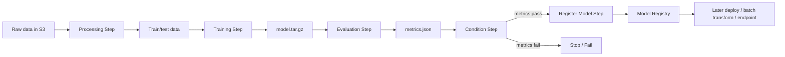

# AI-21：SageMaker Pipelines

## 本节目标

AI-21 学的是 SageMaker Pipelines：把 Processing、Training、Evaluation、Condition、Register Model 串成一条可重复执行的 ML workflow。

本节只做 dry-run 和概念笔记，不创建 Pipeline，也不执行 Pipeline。

## 学习记录

状态：

```text
已读完，已通过。
```

本节实际完成的是 Pipeline 概念和 dry-run：

```text
1. 理解 SageMaker Pipelines 是 ML 专用 workflow / CI-CD。
2. 理解 Pipeline definition 和 Pipeline execution 的区别。
3. 理解 Parameters、Processing step、Training step、Evaluation step、Condition step、Register model step。
4. 理解 Condition step 是指标闸门，达标才 Register Model。
5. 没有创建任何 AWS 资源。
```

当前费用状态：

```text
没有 Pipeline
没有 Pipeline execution
没有 Processing Job
没有 Training Job
没有注册 Model Package
没有新增 AWS 计算费用
```

## 为什么需要 Pipelines

前面我们学过很多单独的资源：

```text
Processing Job
Training Job
Evaluation
Model Registry
Batch Transform
Endpoint
```

如果每次都手动点或手动跑脚本，会有几个问题：

```text
1. 步骤容易漏。
2. 参数不一致。
3. 产物来源不好追踪。
4. 模型是否达标靠人工记。
5. 无法稳定复现一次训练发布流程。
```

SageMaker Pipelines 解决的是：

```text
把 ML 流程定义成可重复执行、可追踪、可参数化的 pipeline。
```

一句话：

```text
SageMaker Pipelines = ML 专用 workflow / CI-CD。
```

## 架构图



关键理解：

```text
Pipeline 本身不是训练。
Pipeline execution 会按定义启动 Processing Job、Training Job 等资源。
```

## 核心组成

| 概念 | 作用 |
| --- | --- |
| Pipeline | 一条 ML workflow 定义 |
| Pipeline execution | pipeline 的一次运行 |
| Parameters | 每次运行时可传入的变量 |
| Processing step | 数据处理 / 评估等计算步骤 |
| Training step | 模型训练步骤 |
| Condition step | 根据指标决定走哪条分支 |
| Register model step | 把模型注册进 Model Registry |

## 推荐流程

本节使用这条经典流程：

```text
Processing
  -> Training
  -> Evaluation
  -> Condition
  -> Register Model
```

含义：

```text
1. Processing：把原始数据处理成 train/test。
2. Training：训练模型，产出 model.tar.gz。
3. Evaluation：加载模型和 test 数据，产出 metrics.json。
4. Condition：判断指标是否达到阈值。
5. Register Model：只有达标才注册到 Model Registry。
```

## Pipeline Parameters

参数让同一条 pipeline 可以复用：

```text
InputDataUri
ModelApprovalStatus
AccuracyThreshold
```

例子：

```text
InputDataUri = s3://.../raw/sample_reviews.jsonl
ModelApprovalStatus = PendingManualApproval
AccuracyThreshold = 0.90
```

这样同一条 pipeline 可以换数据、换审批状态、换指标阈值。

## Condition Step

Condition Step 是 pipeline 的判断节点。

比如：

```text
if eval_accuracy >= 0.90:
    RegisterModel
else:
    Stop
```

它的价值是：

```text
模型没达标就不要注册，不要进入部署流程。
```

## 和 Step Functions 的区别

| 对比项 | SageMaker Pipelines | AWS Step Functions |
| --- | --- | --- |
| 主要用途 | ML/MLOps workflow | 通用业务 workflow |
| 原生 ML steps | 强 | 需要自己集成 |
| 和 SageMaker Training / Registry | 原生集成 | 可集成，但更通用 |
| 可视化 lineage / executions | 更偏 ML | 更偏通用状态机 |
| 适合场景 | 训练、评估、注册、部署 | 跨服务编排、业务流程 |

一句话：

```text
SageMaker Pipelines 更适合 ML 生命周期。
Step Functions 更适合通用 AWS 工作流。
```

## pipeline_plan.py 在干嘛

本地脚本：

```text
projects/aws-ai/ai-21-sagemaker-pipelines-dry-run/pipeline_plan.py
```

它只打印：

```text
CreatePipeline request
Readable pipeline definition
```

不会调用 AWS，不会创建 Pipeline。

## 真实运行前必须确认

真实创建和执行 Pipeline 前要确认：

```text
1. Processing script 已准备好。
2. Training script 已准备好。
3. Evaluation script 已准备好。
4. S3 input/output 路径清楚。
5. execution role 权限足够。
6. Processing / Training quotas 可用。
7. Condition metric 的读取路径正确。
8. Register Model 指向正确的 Model Package Group。
```

## 成本边界

Pipeline definition 本身主要是控制面元数据。

但 Pipeline execution 会创建实际资源：

```text
Processing Job
Training Job
Model Registry action
可能还有 Batch Transform / Endpoint
```

所以费用来自执行步骤，不是来自“写了一个 pipeline 定义”。

## 当前状态

```text
没有创建 Pipeline
没有启动 Pipeline execution
没有创建 Processing Job
没有创建 Training Job
没有注册 Model Package
没有新增 AWS 计算费用
```

## 本节记忆点

```text
1. Pipeline 把 ML 步骤串成可重复 workflow。
2. Pipeline definition 是定义，execution 才会跑资源。
3. Parameters 让 pipeline 可以复用。
4. Condition step 用指标控制是否注册模型。
5. Pipelines 是 SageMaker MLOps 的主线能力。
```
