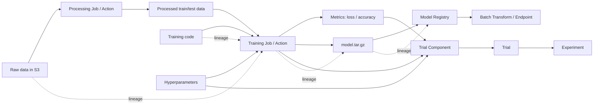

# AI-22：SageMaker Experiments、Lineage 与 Debugging

## 本节目标

AI-22 学的是训练结果管理：让每一次训练都能比较、能追踪、能解释来源。

本节只做本地 dry-run 和概念笔记，不创建 Experiment，不启动 Training Job，不开启 Debugger / Profiler。

## 学习记录

状态：

```text
本地材料已准备，待阅读。
```

本节要掌握的是：

```text
1. Experiments 用来比较多次训练结果。
2. Lineage 用来追踪数据、代码、训练任务、模型产物之间的关系。
3. Debugger / Profiler 用来观察训练过程和资源使用情况。
4. 这些能力本身不是训练模型，而是管理训练过程。
```

当前费用状态：

```text
没有创建 Experiment
没有创建 Trial
没有创建 Trial Component
没有创建 Lineage Artifact / Action / Context
没有启动 Training Job
没有开启 Debugger / Profiler
没有新增 AWS 计算费用
```

## 为什么需要这节

前面我们已经学到：

```text
Processing Job
Training Job
Batch Transform
Endpoint
Model Registry
Pipelines
```

但真实项目里，问题不是“能不能训练一次”，而是：

```text
1. 哪一次训练效果最好？
2. 这次训练用了什么数据？
3. 这次训练用了什么代码版本？
4. 训练参数是什么？
5. 最后部署的模型来自哪一次训练？
6. 如果结果变差，能不能追到原因？
```

SageMaker Experiments 和 Lineage 解决的就是这些问题。

一句话：

```text
Experiments 管比较，Lineage 管来源，Debugger / Profiler 管过程。
```

## 架构图



看图时抓住一条主线：

```text
训练不是孤立的。
训练 = 数据 + 代码 + 参数 + 指标 + 模型产物。
```

## 核心概念

| 概念 | 作用 | 类比 |
| --- | --- | --- |
| Experiment | 一组相关实验的集合 | 一个项目文件夹 |
| Trial | 某一次实验尝试 | 第 1 次 / 第 2 次训练方案 |
| Trial Component | 一次具体运行或步骤 | 某个 Training Job 的记录 |
| Parameter | 训练参数 | learning_rate、epochs |
| Metric | 训练指标 | eval_loss、eval_accuracy |
| Artifact | 产物或输入 | 数据、代码、model.tar.gz |
| Action | 产生或消费 artifact 的动作 | processing、training、deploy |
| Context | 逻辑上下文 | experiment、pipeline、model package group |
| Association | 关系线 | A 产生 B、A 来源于 B |
| Lineage | 上面这些关系组成的来源链路 | 模型血缘 |

最重要的三个：

```text
Experiment -> Trial -> Trial Component
```

可以理解成：

```text
一个实验项目
  -> 多次实验尝试
    -> 每次尝试里的具体训练/处理步骤
```

## 在 AWS 里怎么用

主要有三类入口。

### 1. SageMaker Studio

在 Studio 里通常看：

```text
Experiments
Models
Pipelines
Model Registry
Lineage / artifacts
```

Studio 更适合看图和对比指标，不一定适合写代码。我们仍然用 VS Code 写脚本。

### 2. SageMaker API / boto3

Experiments 相关 API：

```text
CreateExperiment
CreateTrial
CreateTrialComponent
AssociateTrialComponent
Search
```

Lineage 相关 API：

```text
CreateArtifact
CreateAction
CreateContext
AddAssociation
QueryLineage
```

训练观察相关配置：

```text
DebugHookConfig
ProfilerConfig
ProfilerRuleConfigurations
```

### 3. SageMaker Pipelines

如果使用 SageMaker Pipelines，很多步骤天然就更容易被追踪。

关系是：

```text
Pipelines 负责自动化流程。
Experiments 负责比较实验结果。
Lineage 负责追踪输入输出关系。
Model Registry 负责保存可发布模型版本。
```

## 为什么不能只靠文件名管理实验

比如你有这些文件：

```text
model-final.tar.gz
model-final-v2.tar.gz
model-good.tar.gz
model-best-real-final.tar.gz
```

这些名字回答不了：

```text
1. 用的是哪份训练数据？
2. learning_rate 是多少？
3. 训练了几个 epoch？
4. eval_accuracy 是多少？
5. 是谁批准进入 Model Registry 的？
6. 后来哪个 endpoint 用了它？
```

所以文件名只能存东西，不能管理实验。

Experiment / Lineage 存的是结构化元数据。

## Debugger / Profiler

Debugger 和 Profiler 都是训练观察工具，但关注点不同。

| 工具 | 看什么 | 解决什么问题 |
| --- | --- | --- |
| Debugger | loss、梯度、权重、张量等训练信号 | 模型训练有没有异常 |
| Profiler | CPU、GPU、内存、IO、框架耗时 | 资源有没有浪费 |

对 Hugging Face / 大模型训练来说，常见关注点是：

```text
1. loss 是否下降。
2. eval_accuracy / eval_loss 是否稳定。
3. GPU 利用率是不是太低。
4. dataloader 是否拖慢训练。
5. checkpoint / model artifact 是否正常写出。
```

本路线先不真开 Debugger / Profiler，因为它们通常依附 Training Job，可能产生 S3 / CloudWatch 日志和额外数据。

## 和前几节的关系

```text
AI-14 Training Job
  -> 产出模型和指标

AI-19 HPO
  -> 自动跑多组参数
  -> 更需要 Experiments 比较结果

AI-20 Model Registry
  -> 保存可发布模型版本
  -> 需要 Lineage 解释模型来源

AI-21 Pipelines
  -> 自动串起 Processing / Training / Register
  -> 更容易形成完整 Lineage
```

一句话：

```text
AI-22 是给前面所有训练和发布步骤补“追踪能力”。
```

## experiment_plan.py 在干嘛

本地脚本：

```text
projects/aws-ai/ai-22-experiments-lineage-debugging-dry-run/experiment_plan.py
```

它只打印：

```text
1. Experiment / Trial / Trial Component 的创建计划。
2. 参数和指标应该记录在哪里。
3. Lineage 的 Artifact / Action / Context / Association 关系。
4. Debugger / Profiler 的配置形状。
```

不会调用 AWS，不会创建任何资源。

## build_experiment_plan 在干嘛

这个函数生成的是：

```text
如果我要把一次训练记录进 SageMaker Experiments，应该创建哪些实验记录。
```

它本身不训练模型、不调用 AWS、不创建资源，只是把 `config.json` 里的信息整理成一组 request plan。

核心关系：

```text
Experiment
  -> Trial
    -> Trial Component
```

对应到代码里的操作：

```text
CreateExperiment
CreateTrial
CreateTrialComponent
AssociateTrialComponent
```

含义：

| 操作 | 意思 | 例子 |
| --- | --- | --- |
| CreateExperiment | 创建实验大文件夹 | 评论分类模型实验 |
| CreateTrial | 创建一次实验尝试 | bert-tiny baseline |
| CreateTrialComponent | 记录一次具体训练运行 | 参数、指标、输入、输出 |
| AssociateTrialComponent | 把运行记录挂到 trial 下面 | 这次 training run 属于这个 trial |

`CreateTrialComponent` 最关键，它记录：

```text
Parameters:
  learning_rate
  epochs
  batch_size
  max_length

Metrics:
  eval_loss
  eval_accuracy

InputArtifacts:
  train data
  test data
  training code

OutputArtifacts:
  model.tar.gz
```

它的价值是：

```text
不用只靠 model.tar.gz / model-final.tar.gz 这种文件名猜结果。
可以结构化查询哪次训练效果最好、用了什么参数、用了哪份数据、产出了哪个模型。
```

一句话记：

```text
build_experiment_plan = 给训练结果做“实验记录表”。
```

## build_lineage_plan 在干嘛

这个函数生成的是一条模型血缘链路：

```text
这个模型是由什么数据 + 什么代码 + 哪次训练任务产生的，后来挂到了哪个 Model Registry 里。
```

它分成四类对象。

### Artifacts：东西

Artifact 是可追踪的物品。

本节里的 Artifact：

```text
raw_data_artifact    = 训练数据
script_artifact      = 训练代码
model_artifact       = 训练出来的 model.tar.gz
```

Artifact 可以是数据、代码、模型文件、镜像、评估报告。

### Action：动作

Action 是发生过的动作。

本节里的 Action：

```text
training_action = TrainingJob
```

意思是：

```text
训练任务消费了数据和代码，产出了模型。
```

### Context：上下文

Context 是更大的业务上下文。

本节里的 Context：

```text
registry_context = ModelPackageGroup
```

意思是：

```text
这个模型后来进入了哪个 Model Registry 分组。
```

### Associations：关系线

Associations 是血缘图里的连线。

本节里的关系：

```text
raw data        --ContributedTo--> training action
training code   --ContributedTo--> training action
training action --Produced-------> model artifact
model artifact  --AssociatedWith-> model registry context
```

画成一句话：

```text
训练数据 + 训练代码 -> 训练任务 -> model.tar.gz -> Model Registry
```

它的价值是：

```text
以后看到一个模型，可以反查：
1. 它是哪次 training job 产出的。
2. 那次 training job 用了哪份训练数据。
3. 用的是哪份训练脚本。
4. 最后被放进了哪个 Model Registry。
```

和 `build_experiment_plan` 的区别：

| 函数 | 关注点 | 问题 |
| --- | --- | --- |
| build_experiment_plan | 实验对比 | 哪次训练最好 |
| build_lineage_plan | 来源追踪 | 这个模型从哪来 |

一句话记：

```text
Experiments = 比较哪次训练好
Lineage = 追踪这个模型从哪来
```

## 真实运行前必须确认

真实记录实验前要确认：

```text
1. Training Job 名称稳定。
2. 输入数据 S3 URI 清楚。
3. 训练代码路径清楚。
4. model.tar.gz 输出路径清楚。
5. 指标名称统一，比如 eval_loss / eval_accuracy。
6. Experiment 命名规则统一。
7. 是否由 Pipeline 自动记录，还是手动记录。
8. 是否真的需要开启 Debugger / Profiler。
```

## 成本边界

Experiment / Trial / Lineage 主要是控制面元数据。

但相关动作可能带来费用：

```text
Training Job 会产生计算费用。
Debugger / Profiler 会写 S3 / CloudWatch 数据。
长时间保存 artifacts 会产生 S3 存储费用。
Endpoint 如果部署，会产生持续计算费用。
```

所以这节本身不该先跑训练，先把追踪结构学明白。

## 当前状态

```text
没有创建 AWS 资源
没有启动 Training Job
没有开启 Debugger / Profiler
只有本地 dry-run 文件和笔记
```

## 本节记忆点

```text
1. Experiment 是实验集合。
2. Trial 是一次实验尝试。
3. Trial Component 是一次具体运行记录。
4. Lineage 追踪数据、代码、训练任务、模型产物的关系。
5. Debugger 看训练信号，Profiler 看系统资源。
6. 这些能力是 MLOps 的追踪层，不是模型训练本身。
```
