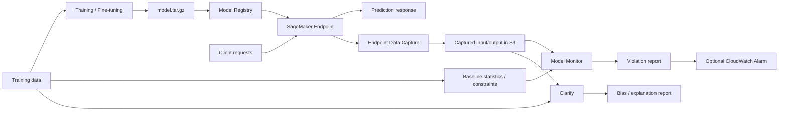

# AI-23：Model Monitor 与 Clarify

## 本节目标

AI-23 学的是模型上线后的治理，不是训练模型。

本节先只记录概念，不创建 endpoint，不开启 data capture，不创建 monitoring schedule，不跑 Clarify job。

## 学习记录

状态：

```text
概念学习中。
```

本节核心：

```text
Model Monitor = 模型上线后，监控数据和质量有没有变坏
Clarify = 模型上线前后，分析偏差、公平性、可解释性
```

当前费用状态：

```text
没有创建 Endpoint
没有开启 Endpoint Data Capture
没有创建 Monitoring Schedule
没有运行 Monitoring Job
没有运行 Clarify Job
没有新增 AWS 计算费用
```

## Model Monitor 是什么

Model Monitor 负责回答：

```text
模型上线后还正常吗？
```

它主要看：

```text
1. 输入数据有没有变。
2. 数据分布有没有漂移。
3. 模型质量有没有变差。
4. 线上请求格式有没有异常。
```

例子：

```text
训练时评论平均 50 字，上线后用户输入平均 500 字。
训练时 mostly English，上线后来了很多 German / Chinese。
训练时准确率 90%，上线后一段时间用户反馈变差。
线上请求里空文本、超长文本、格式错误变多。
```

一句话：

```text
Model Monitor 负责“模型还正常吗”。
```

## Clarify 是什么

Clarify 负责回答：

```text
模型为什么这样判断？这个模型是否公平？
```

它主要看：

```text
1. Bias：模型是否对某些群体、类别、样本不公平。
2. Explainability：模型为什么给出这个预测。
3. Feature attribution：哪些字段、词、特征推动了模型判断。
```

一句话：

```text
Clarify 负责“模型为什么这样判断，是否公平”。
```

## 架构图



## Endpoint Data Capture 是什么

Endpoint Data Capture 的作用：

```text
把线上 Endpoint 的请求和响应，复制一份到 S3，给 Model Monitor 后面分析用。
```

为什么需要它：

```text
Model Monitor 要比较线上数据和训练数据。
如果没有保存线上请求，它就没有东西可以分析。
```

流程：

```text
用户请求
  -> SageMaker Endpoint
      -> 模型返回结果
      -> 同时把 input / output 抓一份写到 S3
            -> Model Monitor 定期分析
```

关键点：

```text
Data Capture 不会自动修模型。
Data Capture 不会自动报警。
Data Capture 只是先把线上样本保存下来。
```

后面还需要：

```text
1. 建 baseline。
2. 建 monitoring schedule。
3. 看 violation report。
4. 需要的话接 CloudWatch Alarm。
```

一句话：

```text
没有 Data Capture，Model Monitor 就没有线上样本可监控。
```

## Baseline 是什么

Baseline 是训练数据或参考数据的“正常分布”。

比如：

```text
text_length 平均值是多少。
空文本比例是多少。
类别分布是什么样。
数值字段最大值 / 最小值 / 缺失率是多少。
```

Model Monitor 比较的是：

```text
Captured data 和 Baseline 差得大不大。
```

例子：

```text
Baseline:
  text_length 平均 80

Captured data:
  text_length 平均 900
```

这就是一个数据漂移信号。

## Baseline 怎么生成

Baseline 通常不是手写一堆规则，而是 SageMaker 根据一份参考数据跑出来的。

流程：

```text
训练数据 / 参考数据
  -> Baseline Processing Job
  -> statistics.json
  -> constraints.json
```

两个核心输出：

| 文件 | 作用 | 例子 |
| --- | --- | --- |
| statistics.json | 描述正常数据长什么样 | 平均值、最大值、最小值、缺失率、类别分布 |
| constraints.json | 描述数据应该满足什么约束 | 字段不能为空、数据类型、数值范围、允许的类别 |

上线后再比较：

```text
Captured data
  -> Monitoring Job
  -> 和 baseline 对比
  -> violation report
```

一句话：

```text
baseline 不是监控结果，而是监控的参照物。
```

## Monitoring Schedule 是什么

Monitoring Schedule 是定时启动 Model Monitor 的规则。

Data Capture 只负责保存线上请求，Baseline 只是参照物。真正做比较的是 Monitoring Job。

流程：

```text
Endpoint Data Capture
  -> S3 captured data

Baseline
  -> statistics.json / constraints.json

Monitoring Schedule
  -> 每小时 / 每天启动 Monitoring Job

Monitoring Job
  -> 比较 captured data 和 baseline
  -> 输出 violation report
```

可以这样理解：

```text
Monitoring Schedule = 闹钟
Monitoring Job = 真正干活的检查任务
Violation Report = 检查结果
```

AWS 里常见 API：

```text
CreateMonitoringSchedule
DescribeMonitoringSchedule
DeleteMonitoringSchedule
ListMonitoringExecutions
```

注意：

```text
每次 Monitoring Job 跑起来，都会产生处理任务费用。
```

## Violation Report 与 CloudWatch Alarm

Violation Report 是 Model Monitor 的检查结果。

它回答：

```text
这批线上数据和 baseline 相比，哪里不正常？
```

例子：

```text
字段 text 缺失率变高。
text_length 超过正常范围。
某个类别突然大量出现。
输入格式不符合约束。
```

流程：

```text
Monitoring Job
  -> 读取 captured data
  -> 读取 baseline statistics / constraints
  -> 输出 violation report 到 S3
```

CloudWatch Alarm 是提醒机制。

它回答：

```text
发现异常后，要不要通知人？
```

常见流程：

```text
Violation Report / Monitoring Metrics
  -> CloudWatch Metrics
  -> CloudWatch Alarm
  -> SNS / Email / Slack / Lambda
```

关系：

```text
Violation Report = 异常报告
CloudWatch Alarm = 异常提醒
```

注意：

```text
Model Monitor 不会自动重训模型。
Alarm 不会自动修模型。
真正生产里通常是人或自动化流程看 report 后，决定是否回滚、重训、调整输入校验。
```

## Clarify：Bias 与 Explainability

Clarify 不是以监控线上数据漂移为主，它更关注：

```text
模型有没有偏见？
模型为什么这么预测？
```

### Bias

Bias 看的是：

```text
模型对不同群体、类别、样本是否不公平。
```

例子：

```text
贷款模型：
  对不同年龄段批准率差异太大。

招聘模型：
  对某些群体推荐率明显偏低。

文本分类模型：
  对某些语言、地区、姓名类型误判更多。
```

### Explainability

Explainability 看的是：

```text
哪些输入特征影响了模型预测。
```

传统表格模型里可能是：

```text
income
age
credit_score
```

文本模型里可以理解成：

```text
哪些 token / 词 / 句子片段影响了分类结果。
```

Clarify 常见输出：

```text
bias report
feature attribution report
explainability report
```

和 Model Monitor 的区别：

| 能力 | 关注点 | 典型问题 |
| --- | --- | --- |
| Model Monitor | 线上是否还正常 | 数据漂移了吗？质量变差了吗？ |
| Clarify | 判断是否合理、是否可解释 | 为什么这么预测？是否有偏差？ |

一句话：

```text
Monitor 看“是否还正常”，Clarify 看“是否合理、是否可解释”。
```

## 常见监控类型

| 类型 | 看什么 | 例子 |
| --- | --- | --- |
| Data quality | 输入数据格式和分布 | 字段缺失、长度异常、类别变化 |
| Model quality | 模型效果 | 准确率、F1、误差变差 |
| Bias drift | 偏差变化 | 某些群体预测结果明显变坏 |
| Feature attribution drift | 解释性变化 | 影响预测的关键特征变了 |

## 和前几节的关系

```text
AI-18 Endpoint
  -> Endpoint 是线上推理入口
  -> Data Capture 通常挂在 Endpoint 上

AI-20 Model Registry
  -> 管模型版本
  -> 监控发现问题后，可能回滚或换版本

AI-21 Pipelines
  -> 可以把 baseline / evaluation / register 串进流程

AI-22 Experiments / Lineage
  -> 追踪模型从哪来
  -> AI-23 关注模型上线后还稳不稳定
```

## 成本边界

Model Monitor / Clarify 真跑起来会产生费用：

```text
Endpoint 持续运行会产生计算费用。
Data Capture 会写 S3，产生存储费用。
Monitoring Job 会启动处理任务，产生计算费用。
Clarify Job 也会启动处理任务，产生计算费用。
CloudWatch Logs / Metrics / Alarm 可能产生少量费用。
```

所以本节先不创建资源，先学结构。

## 本节记忆点

```text
1. Model Monitor 看模型上线后还正不正常。
2. Clarify 看模型为什么这样判断，是否公平。
3. Endpoint Data Capture 把线上 input/output 保存到 S3。
4. Baseline 是训练数据或参考数据的正常分布。
5. Model Monitor 比较 Captured data 和 Baseline。
6. Data Capture 只负责保存样本，不负责修模型和报警。
7. Monitoring Schedule 是定时检查规则。
8. Violation Report 是异常报告，CloudWatch Alarm 是提醒机制。
9. Clarify 更关注 bias 和 explainability。
```
