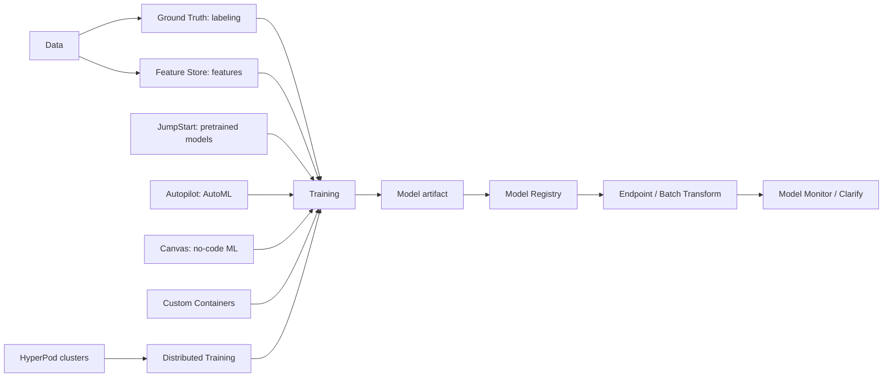

# AI-24：Feature Store、Ground Truth 与高级能力

## 本节目标

AI-24 是 SageMaker 高级能力总览。

本节不深入实操，不创建 Feature Group，不创建 Ground Truth 标注任务，不启动 Autopilot，不创建 HyperPod 集群。

目标是：

```text
看到这些 SageMaker 名词时，知道它们分别解决什么问题。
```

## 学习记录

状态：

```text
概念学习中。
```

当前费用状态：

```text
没有创建 Feature Store 资源
没有创建 Ground Truth 标注任务
没有启动 JumpStart 部署
没有启动 Autopilot Job
没有创建 Canvas 应用资源
没有创建 Distributed Training Job
没有创建 Custom Container 镜像
没有创建 HyperPod 集群
没有新增 AWS 计算费用
```

## 总览图



按领域分：

```text
数据侧:
  Feature Store
  Ground Truth

建模侧:
  JumpStart
  Autopilot / AutoML
  Canvas

训练侧:
  Distributed Training
  Custom Containers
  HyperPod

生产侧:
  Model Monitor
  Clarify
  Model Registry
  Pipelines
```

## Feature Store 是什么

Feature Store 是特征仓库。

模型可能需要这些特征：

```text
user_age
user_country
last_7_days_purchase_count
avg_session_duration
risk_score
```

如果训练时一套代码算特征，线上推理时另一套代码算特征，就容易出现：

```text
训练时看到的特征 != 线上推理时看到的特征
```

这叫：

```text
train / serve skew
```

Feature Store 的价值：

```text
让训练和线上推理使用同一套特征来源。
```

它更常用于传统 ML、推荐、风控、广告、用户画像等场景。

一句话：

```text
Feature Store 管训练和推理共用的特征。
```

## Ground Truth 是什么

Ground Truth 是数据标注服务。

比如要训练：

```text
图片分类
文本分类
NER
目标检测
情感分类
```

就需要人工或半自动给数据打标签：

```text
这张图是 cat。
这句话是 positive。
这个词是 PERSON。
这个框里是 car。
```

Ground Truth 管的是：

```text
标注任务
标注人员
标注界面
标注结果
质量控制
```

一句话：

```text
Ground Truth 管训练数据的标签。
```

## JumpStart 是什么

JumpStart 是预训练模型和解决方案模板库。

适合：

```text
我想快速拿一个现成模型来部署、微调、试用。
```

例子：

```text
Hugging Face 模型
Llama / Mistral 类模型
图像模型
文本分类模板
RAG / embedding 示例方案
```

一句话：

```text
JumpStart = 现成模型和方案模板。
```

按当前路线：

```text
可以了解，尤其是部署 Hugging Face / 大模型时可能遇到。
但不作为主线，因为我们优先学底层 Training / Model / Endpoint / Pipeline。
```

## Autopilot / AutoML 是什么

Autopilot 是 SageMaker 的自动建模能力。

它适合传统机器学习：

```text
我有一个表格数据集，让 SageMaker 自动试算法、特征处理、调参。
```

例子：

```text
房价预测
客户流失预测
信用评分
销量预测
```

它会自动做：

```text
数据分析
特征处理
模型选择
调参
生成候选模型
```

一句话：

```text
Autopilot = 表格数据自动训练 baseline 模型。
```

按当前路线：

```text
暂时不重点学，因为它偏传统表格 ML，不是 Hugging Face / LLM 主线。
```

## Canvas 是什么

Canvas 是低代码 / 无代码 ML 界面。

适合：

```text
业务人员不写代码，也能上传数据、训练模型、看预测。
```

常见用户：

```text
运营
产品
分析师
业务团队
```

常见任务：

```text
预测客户流失
分类工单
销量预测
文本情感分析
```

一句话：

```text
Canvas = 给非工程用户用的可视化 ML 工具。
```

按当前路线：

```text
只知道用途，不作为主线。
```

## JumpStart、Autopilot、Canvas 区别

| 能力 | 面向谁 | 解决什么 |
| --- | --- | --- |
| JumpStart | 工程师 / ML 用户 | 快速使用现成模型和模板 |
| Autopilot | ML 用户 / 数据科学用户 | 自动建模，主要适合表格数据 |
| Canvas | 业务用户 | 低代码可视化 ML |

一句话：

```text
JumpStart 找模型，Autopilot 自动建模，Canvas 给业务低代码用。
```

## Distributed Training 是什么

Distributed Training 是分布式训练。

什么时候需要：

```text
一个 GPU / 一台机器训练不动。
模型太大。
数据太多。
训练时间太长。
```

它把训练拆到多张 GPU / 多台机器上。

常见场景：

```text
大模型 fine-tuning
多 GPU 训练
大规模图像 / 文本训练
```

一句话：

```text
Distributed Training = 用多机多卡一起训练。
```

按当前路线：

```text
先理解概念，不实操。
```

## Custom Containers 是什么

Custom Containers 是自定义容器。

什么时候需要：

```text
内置 PyTorch / Hugging Face 镜像不够用。
需要特殊系统依赖。
需要自己控制启动命令。
需要定制推理服务。
```

它让你自己做 Docker image，然后 SageMaker 用你的镜像跑训练或推理。

一句话：

```text
Custom Containers = 自己带运行环境。
```

按当前路线：

```text
Custom Containers 很重要。
Hugging Face 模型部署、特殊推理服务、LLM serving 经常会用到。
```

## HyperPod 是什么

HyperPod 是大规模训练集群能力。

它不是普通入门训练功能，而是给大模型训练团队用的基础设施能力。

适合：

```text
长时间大规模训练
多节点 GPU 集群
需要容错和集群管理
训练 foundation model / 大模型
```

一句话：

```text
HyperPod = 管大规模训练集群。
```

按当前路线：

```text
只知道名字和用途，不深入。
```

## Distributed Training、Custom Containers、HyperPod 区别

| 能力 | 关注点 | 一句话 |
| --- | --- | --- |
| Distributed Training | 训练方式 | 多机多卡怎么跑 |
| Custom Containers | 运行环境 | 用什么镜像跑 |
| HyperPod | 基础设施 | 大规模训练集群怎么管 |

## 当前最重要的是哪些

按当前 Hugging Face / VS Code / SageMaker 路线，优先级是：

```text
高优先级:
  Custom Containers
  JumpStart

中优先级:
  Feature Store
  Ground Truth
  Distributed Training

低优先级:
  Autopilot
  Canvas
  HyperPod
```

原因：

```text
Custom Containers 直接关系到现代模型训练和部署。
JumpStart 可能用于快速试大模型和预训练模型。
Feature Store / Ground Truth 是生产 ML 重要能力，但不一定是当前 LLM 主线第一步。
Autopilot / Canvas 偏传统 AutoML 和业务低代码。
HyperPod 偏大规模训练平台，不适合入门阶段实操。
```

## 成本边界

这些高级能力真正使用时都可能产生费用：

```text
Feature Store:
  存储、读写、在线特征服务可能收费。

Ground Truth:
  标注任务、人工标注、数据处理可能收费。

JumpStart:
  部署模型会创建 endpoint，可能持续收费。

Autopilot:
  会启动训练和调参任务，可能创建多个候选模型。

Canvas:
  可能有应用会话、模型训练、预测费用。

Distributed Training:
  多机多卡训练，费用会快速放大。

Custom Containers:
  ECR 镜像存储、训练、推理资源可能收费。

HyperPod:
  大规模训练集群，成本最高，不用于当前学习实操。
```

## 本节记忆点

```text
1. Feature Store 管特征，减少 train / serve skew。
2. Ground Truth 管数据标注。
3. JumpStart 提供现成模型和方案模板。
4. Autopilot 自动做传统表格 AutoML。
5. Canvas 给业务用户做低代码 ML。
6. Distributed Training 是多机多卡训练方式。
7. Custom Containers 是自定义运行环境。
8. HyperPod 是大规模训练集群。
9. 当前路线最值得重点关注的是 Custom Containers 和 JumpStart。
```
