# AI-25：SageMaker Capstone

## 本节目标

AI-25 是 SageMaker 专项的收束项目。

目标不是追求模型效果，而是把前面学过的 SageMaker 主线串成一条能讲清楚、能复现、能清理的端到端流程。

本节先只做本地设计和 dry-run，不创建 AWS 资源。

## 学习记录

状态：

```text
本地 Capstone 框架已准备，待阅读。
```

当前费用状态：

```text
没有启动 Processing Job
没有启动 Training Job
没有创建 Model
没有创建 Endpoint Config
没有创建 Endpoint
没有创建 Batch Transform Job
没有注册 Model Package
没有创建 Pipeline
没有创建 Monitoring Schedule
没有新增 AWS 计算费用
```

## Capstone 主题

本项目主题：

```text
Hugging Face 文本分类模型生产化流程
```

它不是传统 XGBoost / Canvas 路线，而是继续沿用当前方向：

```text
VS Code
S3
SageMaker Processing
Hugging Face / PyTorch container
model.tar.gz
Model Registry
Batch Transform
可选短时 Endpoint
Monitor / Clarify checklist
Cleanup report
```

## 总架构图

```mermaid
flowchart LR
  Local["VS Code local project"] --> S3Raw["S3 raw data"]
  Local --> S3Scripts["S3 scripts"]

  S3Raw --> Processing["Processing Job"]
  S3Scripts --> Processing
  Processing --> Processed["S3 processed train/test"]

  Processed --> Training["Training / Packaging Job"]
  S3Scripts --> Training
  Training --> Artifact["S3 model.tar.gz"]
  Training --> Metrics["S3 metrics.json"]

  Artifact --> Registry["Model Registry"]
  Metrics --> Registry

  Registry --> Batch["Batch Transform"]
  Batch --> BatchOutput["S3 batch predictions"]

  Registry -. optional .-> EndpointModel["SageMaker Model"]
  EndpointModel -. optional .-> EndpointConfig["Endpoint Config"]
  EndpointConfig -. optional .-> Endpoint["Short-lived Endpoint"]
  Endpoint -. optional .-> Capture["Data Capture to S3"]
  Capture -. optional .-> Monitor["Model Monitor checklist"]

  Registry --> Cleanup["Cleanup report"]
  BatchOutput --> Cleanup
  Endpoint --> Cleanup
```



## 主流程

Capstone 主流程：

```text
1. S3 放原始数据。
2. Processing 处理数据。
3. Training / Packaging 产出 model.tar.gz。
4. Evaluation 产出 metrics.json。
5. Model Registry 注册模型版本。
6. Batch Transform 做离线推理。
7. 可选短时 Endpoint 做实时推理。
8. Model Monitor / Clarify 写上线检查清单。
9. Cleanup report 记录删除顺序和费用边界。
```

这条线覆盖了：

```text
AI-12 环境 / IAM / S3
AI-13 Processing
AI-14 Training
AI-15 Model artifact / deployment prep
AI-16 Batch Transform
AI-18 Endpoint
AI-20 Model Registry
AI-21 Pipeline 思维
AI-22 Experiments / Lineage
AI-23 Monitor / Clarify
AI-24 Custom Containers / JumpStart 选型意识
```

## 为什么先做 dry-run

当前学习阶段不直接启动完整流程，原因：

```text
1. SageMaker quota 可能限制 Training / Processing / Endpoint 实例。
2. Endpoint 是持续计费资源。
3. Capstone 重点是理解生产化结构，不是烧资源跑大模型。
4. 先把请求、产物、清理顺序写清楚，后面需要时再逐步开启真实运行。
```

一句话：

```text
先把链路设计对，再决定是否花钱跑。
```

## 本地项目文件

项目目录：

```text
projects/aws-ai/ai-25-sagemaker-capstone/
```

主要文件：

```text
README.md
config.json
capstone_plan.py
cleanup_checklist.md
```

## capstone_plan.py 在干嘛

本地脚本：

```text
projects/aws-ai/ai-25-sagemaker-capstone/capstone_plan.py
```

它只打印：

```text
1. Capstone 的阶段计划。
2. 每个阶段对应的 SageMaker / AWS 资源。
3. 每个阶段输入输出放在哪里。
4. 哪些步骤会产生费用。
5. 清理顺序。
```

不会调用 AWS，不会创建资源。

## 真实运行时的资源边界

如果以后真的跑，资源边界应该这样拆：

| 阶段 | 主要资源 | 成本特征 |
| --- | --- | --- |
| 数据准备 | S3 | 低，存储费用 |
| Processing | Processing Job | 按运行时间计费 |
| Training / Packaging | Training Job | 按运行时间计费，可能受 quota 限制 |
| Evaluation | Processing Job 或 Training 内输出 | 按运行时间计费 |
| Model Registry | Model Package Group / Model Package | 主要是元数据 |
| Batch Transform | Transform Job | 按运行时间计费 |
| Endpoint | Model / Endpoint Config / Endpoint | Endpoint 持续计费 |
| Monitor | Data Capture / Monitoring Job | S3 + 处理任务费用 |
| Clarify | Clarify Processing Job | 按运行时间计费 |

## Endpoint 是否必须做

不必须。

Capstone 的低成本路线优先：

```text
Batch Transform
```

原因：

```text
Batch Transform 是 job 型资源，跑完就结束。
Endpoint 是服务型资源，不删就持续收费。
```

如果要做 Endpoint，只做短时验证：

```text
CreateEndpoint
InvokeEndpoint
DeleteEndpoint
DeleteEndpointConfig
DeleteModel
```

## Monitor / Clarify 在 Capstone 里怎么处理

低成本路线先不跑 Monitor / Clarify job，只写 checklist。

Checklist 应该说明：

```text
1. Endpoint 是否开启 data capture。
2. Captured data 放到哪个 S3 prefix。
3. Baseline dataset 用哪份数据。
4. Monitoring schedule 多久跑一次。
5. Violation report 放到哪里。
6. CloudWatch Alarm 如何通知。
7. Clarify 要分析哪些 bias / explainability 问题。
```

## Capstone 验收标准

完成后应该能解释：

```text
1. 数据从哪里来。
2. Processing 做了什么。
3. model.tar.gz 从哪里来。
4. 模型指标记录在哪里。
5. 模型如何进入 Model Registry。
6. Batch Transform 如何做离线推理。
7. Endpoint 为什么是可选项。
8. Monitor / Clarify 如何接入生产治理。
9. 每个资源如何删除。
10. 哪些地方可能产生费用。
```

## 本节记忆点

```text
1. Capstone 是把 SageMaker 主线串起来。
2. 低成本路线优先 Batch Transform，不优先 Endpoint。
3. Endpoint 是可选短时验证，不是必须。
4. Model Registry 是模型发布前的版本和审批中心。
5. Monitor / Clarify 在 Capstone 里先以 checklist 形式接入。
6. Cleanup report 是 Capstone 的一部分，不是事后随便删。
```
