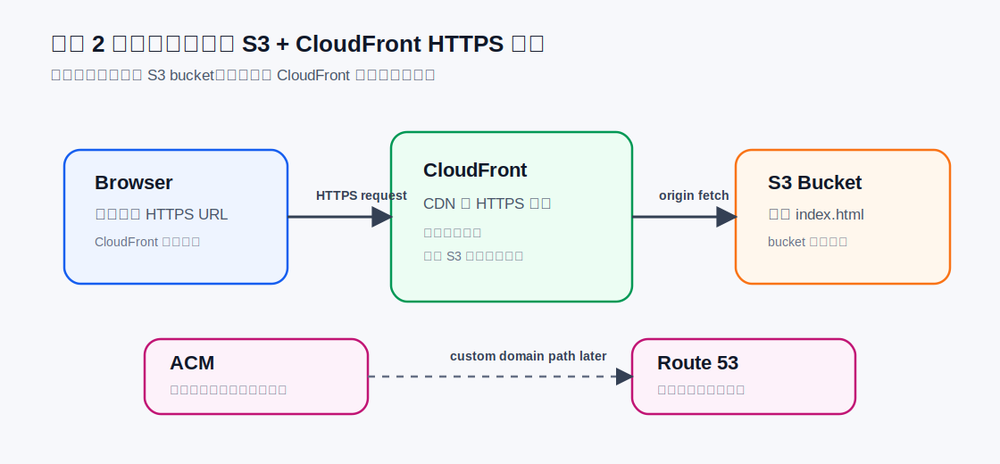

# 项目 2：静态网站发布项目

项目 2 的目标是发布一个静态 AWS 学习主页。这个项目用来理解 S3、CloudFront、HTTPS 入口、私有 bucket 和资源清理。

## 本地文件

```text
projects/aws-main/project-2-static-site/
  index.html
  README.md
  assets/
    static-site-flow.svg
```

入口文件：

```text
../../projects/aws-main/project-2-static-site/index.html
```

架构图：



## 低成本规则

- 不购买域名。
- 不使用 Route 53。
- 不申请自定义 ACM certificate。
- 使用 CloudFront 默认域名完成 HTTPS 访问。
- S3 bucket 保持私有，不直接公开整个 bucket。
- 项目完成后记录并执行 CloudFront 和 S3 的清理步骤。

## 目标架构

```text
Browser
  -> CloudFront HTTPS URL
  -> private S3 bucket origin
  -> index.html / static assets
```

S3 负责存储静态文件。CloudFront 负责 HTTPS 访问入口、CDN 缓存，以及限制用户不直接访问 S3 bucket。

## 静态网页、S3、EC2/VPS

静态网页只需要把文件发给浏览器，不需要服务器端运行代码。

常见静态文件：

```text
index.html
style.css
main.js
image.png
logo.svg
```

区别：

| 概念 | 它是什么 | 会不会运行代码 | 适合什么 |
| --- | --- | --- | --- |
| 静态网页 | HTML/CSS/JS/图片文件 | 不需要服务器运行后端代码 | 学习主页、文档站、作品集 |
| S3 | 云文件仓库/对象存储 | 不运行代码 | 存网页文件、图片、备份、上传文件 |
| EC2 | AWS 云服务器 | 可以运行代码 | 后端 API、Next.js SSR、worker |
| VPS | 云服务器通用说法 | 可以运行代码 | 和 EC2 类似，但不是 AWS 特定产品 |

最短记忆：

```text
静态网页 -> S3 + CloudFront
动态应用 -> EC2 / ECS / Lambda / App Runner + 数据库
```

## S3 bucket 和对象上传

已创建普通 S3 bucket：

```text
xzhu-aws-learning-static-site-20260501
```

类型：

```text
Allzweck-Bucket / General purpose bucket
```

Region：

```text
eu-central-1 / Europe (Frankfurt)
```

已上传对象：

```text
assets/static-site-flow.svg
index.html
```

上传命令：

```bash
aws s3 sync projects/aws-main/project-2-static-site s3://xzhu-aws-learning-static-site-20260501 --exclude README.md --profile aws-learning
```

验证命令：

```bash
aws s3 ls s3://xzhu-aws-learning-static-site-20260501 --recursive --human-readable --profile aws-learning
```

当前 bucket 仍然启用了 Block Public Access：

```text
BlockPublicAcls: true
IgnorePublicAcls: true
BlockPublicPolicy: true
RestrictPublicBuckets: true
```

这符合项目 2 的目标：不要直接公开 S3 bucket，后续通过 CloudFront 访问。

## S3 bucket 类型

| 德语 | 英文 | 是什么 | 当前是否使用 |
| --- | --- | --- | --- |
| Allzweck-Buckets | General purpose buckets | 普通 S3 bucket，最常用，放 HTML、图片、备份、上传文件 | 使用 |
| Verzeichnis-Buckets | Directory buckets | 给 S3 Express One Zone 用，追求低延迟、高性能 | 不用 |
| Tabellen-Buckets | Table buckets | 给表格/数据湖分析用，比如 Iceberg 表 | 不用 |
| Vektor-Buckets | Vector buckets | 给 AI 向量检索/RAG 用，存 embeddings | 不用 |

项目 2 只需要普通 General purpose bucket。

## S3 如何收费

S3 bucket 本身是容器，主要费用来自：

- 存储费：存了多少 GB，存了多久。
- 请求费：PUT、GET、LIST、DELETE 等 API 请求。
- 数据传出费：数据从 S3 发到互联网可能收费。
- 管理功能费：Storage Lens、Inventory、Replication 等高级功能可能收费。
- 特殊 bucket/存储类型费用：Directory bucket、Table bucket、Vector bucket 有各自计费方式。

当前项目只有 `index.html` 和一个 SVG，文件非常小，S3 成本预计极低。但仍然保留预算告警。

## CloudFront distribution

已创建 CloudFront distribution：

```text
Distribution name: aws-learning-static-site
Distribution ID: E3M6RP17632GUT
Distribution domain name: dmt8742p7dnze.cloudfront.net
Billing plan: Free ($0/month)
Origin: xzhu-aws-learning-static-site-20260501.s3.eu-central-1.amazonaws.com
```

访问地址：

```text
https://dmt8742p7dnze.cloudfront.net/
```

当前验收结果：

- CloudFront URL 可以访问静态学习主页。
- S3 直链不能公开访问，说明 bucket 没有直接暴露给互联网。
- CloudFront 可以读取私有 S3 bucket 中的 `index.html` 和静态资源。

## S3 与 CloudFront 的职责

最核心：

```text
S3 管内容存储
CloudFront 管内容分发
```

更准确一点：

```text
S3 = origin / 源站
CloudFront = CDN / 分发层 / HTTPS 入口
```

访问流程：

```text
用户浏览器
  -> 请求 CloudFront 域名
  -> CloudFront 看自己缓存里有没有
  -> 如果有，直接返回
  -> 如果没有，去 S3 origin 拿文件
  -> 拿到后返回给用户，并缓存一份
```

安全模型：

```text
用户可以访问 CloudFront
用户不能直接访问 S3
CloudFront 可以访问 S3
```

## 为什么项目 2 用 CloudFront

项目 2 是静态网站。静态网站的核心问题是：

```text
我有一堆 HTML / CSS / JS / 图片文件，
怎么让全世界用户快速、安全、稳定地下载这些文件？
```

这正是 CloudFront 擅长的事情。

CloudFront 在项目 2 里的职责：

- 提供公开 HTTPS 访问地址。
- 把 S3 里的静态文件缓存到离用户更近的边缘节点。
- 减少每次都回源到 S3 的次数。
- 让 S3 bucket 保持私有，只允许 CloudFront 去读。
- 适合分发 `index.html`、CSS、JS、图片、SVG、字体等静态内容。

项目 2 不需要 API Gateway，因为项目 2 没有后端逻辑：

```text
用户请求 /index.html
  -> CloudFront 找文件
  -> S3 返回文件
  -> 浏览器渲染页面
```

这里不需要：

- 解析 `POST /notes` 这种业务请求。
- 调用 Python 代码。
- 写入数据库。
- 根据不同 route 执行不同函数。

一句话：

```text
CloudFront 适合“把已经存在的文件分发出去”。
API Gateway 适合“把 HTTP 请求交给后端代码处理”。
```

## 为什么 CloudFront 默认域名不用买

CloudFront 默认域名是 AWS 自己拥有的 `cloudfront.net` 下的子域名。

例子：

```text
dmt8742p7dnze.cloudfront.net
```

拆开看：

```text
cloudfront.net        AWS 拥有的域名
dmt8742p7dnze         AWS 自动生成的唯一子域名
```

所以你没有购买域名，只是在使用 CloudFront 服务自带的默认访问地址。它不单独收域名注册费。

但默认域名免费不等于 CloudFront 全部免费。真正可能产生费用的是请求次数、数据传出流量、缓存失效请求超出免费额度、高级安全/日志/套餐等。

正式网站通常会使用自己的域名，例如：

```text
topicfollow.com
www.topicfollow.com
learn.xzhu.com
```

那时才需要域名注册、DNS、ACM 证书和 CloudFront alternate domain name。

## 本地更新后的手动部署步骤

如果本地修改了 `projects/aws-main/project-2-static-site` 中的文件，需要：

```bash
aws s3 sync projects/aws-main/project-2-static-site s3://xzhu-aws-learning-static-site-20260501 --exclude README.md --profile aws-learning
aws cloudfront create-invalidation --distribution-id E3M6RP17632GUT --paths "/*" --profile aws-learning
```

第一条命令把本地文件同步到 S3。第二条命令创建 CloudFront invalidation，让旧缓存失效，CloudFront 下次重新从 S3 拉取新文件。

自动化部署后续在 CI/CD 项目中再做。

## 项目 2 复盘

我用了哪些 AWS 服务？

- Amazon S3：存放静态网站文件。
- Amazon CloudFront：提供 HTTPS 访问入口和 CDN 分发。
- IAM / IAM Identity Center：通过 `aws-learning` profile 使用 SSO 管理员身份操作资源。
- CloudTrail：记录创建 bucket、上传对象、创建 distribution 等账号操作。

为什么选择这些服务？

- 静态网页不需要服务器运行后端代码，所以不需要 EC2 或 VPS。
- S3 适合存储 HTML、CSS、JS、图片、SVG 等静态对象。
- CloudFront 适合作为公开访问入口，提供 HTTPS、缓存和 CDN 分发。
- S3 bucket 保持私有，避免直接暴露存储层。

这些服务之间如何通信？

```text
User browser
  -> CloudFront
  -> S3 origin
```

用户访问 CloudFront 默认域名。CloudFront 如果没有缓存，就从 S3 origin 读取对象，再返回给用户并缓存。

哪些资源可能持续收费？

- S3 存储容量。
- S3 API 请求，例如 PUT、GET、LIST。
- CloudFront 请求和流量。
- CloudFront invalidation 超出免费额度后可能收费。

当前项目文件很小、访问量很低，预计费用极低，但仍需要预算告警和清理清单。

我如何清理资源？

清理顺序：

1. Disable CloudFront distribution。
2. 等待 distribution 完全 disabled。
3. Delete CloudFront distribution。
4. 清空 S3 bucket。
5. Delete S3 bucket。
6. 回到 CloudTrail Event history 确认删除操作有记录。

如果重做一次，我会改什么？

- 项目 2 初期仍然不绑定自定义域名，避免 Route 53、ACM 和 DNS 把学习焦点带偏。
- 等理解 S3 + CloudFront 后，再单独补自定义域名和证书。

我现在能解释的概念：

- 静态网页和动态应用的区别。
- S3 bucket 和 object。
- General purpose bucket 与其他 S3 bucket 类型的区别。
- CloudFront distribution、origin、cache、invalidation。
- 为什么默认 CloudFront 域名不用单独购买。
- 为什么 S3 bucket 不直接公开。
