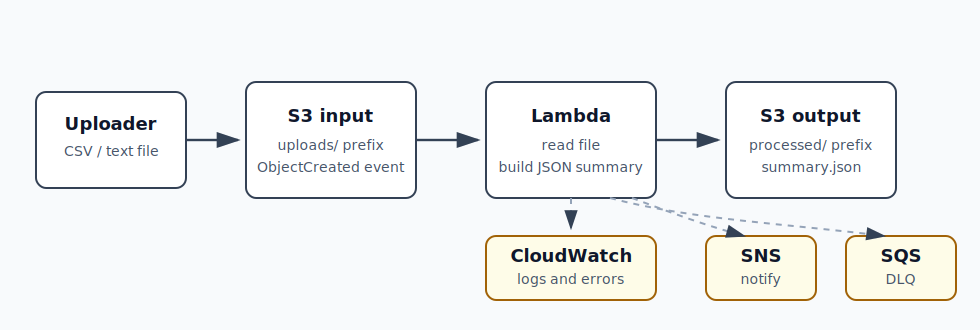

# 项目 4：文件上传与数据处理

项目 4 学的是 **事件驱动架构**。这个项目不是让用户主动调用 API，而是让 AWS 在“文件上传”这个事件发生后，自动触发后续处理。

一句话：

```text
把文件上传到 S3 input bucket
  -> S3 产生 ObjectCreated 事件
  -> Lambda 自动处理文件
  -> 结果写入 S3 output bucket
  -> 成功时发 SNS 通知
  -> 失败时进入 SQS 失败队列
```

架构图：



## 当前状态

```text
完成日期：2026-05-01
清理日期：2026-05-01
Region: eu-central-1 / Europe (Frankfurt)
状态：S3 trigger、Lambda 处理、SQS 失败追踪、SNS 成功通知都已跑通；AWS 资源已删除
```

已验证主链路：

```text
s3://xzhu-aws-learning-file-input-20260501/uploads/sample.csv
  -> learning-file-processor Lambda
  -> s3://xzhu-aws-learning-file-output-20260501/processed/uploads/sample.csv.summary.json
  -> /aws/lambda/learning-file-processor CloudWatch log group
```

## 本地文件

```text
projects/aws-main/project-4-file-processing/
  lambda_function.py
  events/
    s3-object-created.json
  sample-data/
    sample.csv
```

核心代码：

```text
../../projects/aws-main/project-4-file-processing/lambda_function.py
```

样例文件：

```text
../../projects/aws-main/project-4-file-processing/sample-data/sample.csv
```

## 已创建并已删除的 AWS 资源

| 资源 | 名称 | 作用 |
| --- | --- | --- |
| S3 input bucket | `xzhu-aws-learning-file-input-20260501` | 接收原始上传文件 |
| S3 output bucket | `xzhu-aws-learning-file-output-20260501` | 保存 Lambda 生成的摘要结果 |
| Lambda | `learning-file-processor` | 读取文件、生成 JSON summary、写回 S3、发布 SNS |
| IAM role | `learning-file-processor-role` | Lambda 运行时使用的权限身份 |
| CloudWatch log group | `/aws/lambda/learning-file-processor` | 查看 Lambda 成功日志和错误 |
| SQS queue | `learning-file-processing-dlq` | 接收 Lambda 失败后的记录 |
| SNS topic | `learning-file-processing-results` | 发送处理成功通知 |

清理结果：

```text
S3 event notification: 已删除
Lambda function: 已删除
SQS queue: 已删除
SNS topic: 已删除
S3 input/output buckets: 已清空并删除
IAM role: 已删除
CloudWatch log group: 已删除
```

## 和项目 3 的区别

项目 3 是 HTTP 请求驱动：

```text
用户发 HTTP 请求
  -> API Gateway
  -> Lambda
  -> DynamoDB
```

项目 4 是事件驱动：

```text
文件上传发生了
  -> S3 产生事件
  -> Lambda 自动执行
```

关键区别：

```text
项目 3 的起点是用户请求。
项目 4 的起点是 AWS 资源状态变化。
```

## 第一阶段：S3 触发 Lambda

第一阶段目标：

```text
S3 input bucket
  -> S3 ObjectCreated event
  -> Lambda
  -> S3 output bucket
  -> CloudWatch Logs
```

已完成：

- [x] 创建 input bucket。
- [x] 创建 output bucket。
- [x] 创建 Lambda execution role。
- [x] 部署 `learning-file-processor` Lambda。
- [x] 配置 input bucket 的 S3 trigger。
- [x] 上传 `uploads/sample.csv`。
- [x] output bucket 出现 `processed/uploads/sample.csv.summary.json`。
- [x] CloudWatch Logs 出现 `/aws/lambda/learning-file-processor`。

### S3 trigger 配置

```text
Bucket: xzhu-aws-learning-file-input-20260501
Event type: All object create events
Prefix: uploads/
Suffix: 留空
Target: learning-file-processor Lambda
```

重点：上传文件必须在 `uploads/` 路径下才会触发 Lambda。

会触发：

```text
uploads/sample.csv
uploads/test.txt
```

不会触发：

```text
sample.csv
other/sample.csv
```

### 为什么要分 input bucket 和 output bucket

如果 Lambda 把结果写回同一个会触发自己的路径，可能形成循环：

```text
Lambda 写结果
  -> S3 又触发 Lambda
  -> Lambda 再写结果
  -> 不断重复
```

所以项目 4 使用：

```text
input bucket: 只接收上传文件
output bucket: 只保存处理结果
```

## Lambda 做了什么

Lambda 从 S3 event 里拿到：

```text
bucket name
object key
object size
```

然后做：

```text
1. 用 s3:GetObject 读取 input bucket 里的文件。
2. 统计文本 / CSV 信息。
3. 生成 JSON summary。
4. 用 s3:PutObject 写到 output bucket。
5. 如果配置了 SNS_TOPIC_ARN，就 publish 成功通知。
```

生成的摘要字段：

```text
source_bucket
source_key
processed_at
object_size_bytes
line_count
non_empty_line_count
word_count
character_count
preview
csv.columns
csv.column_count
csv.data_row_count
```

输出路径规则：

```text
OUTPUT_PREFIX + "/" + 原 object key + ".summary.json"
```

例子：

```text
输入：uploads/sample.csv
输出：processed/uploads/sample.csv.summary.json
```

## Lambda 环境变量

当前使用：

```text
OUTPUT_BUCKET=xzhu-aws-learning-file-output-20260501
OUTPUT_PREFIX=processed
MAX_BYTES=100000
SNS_TOPIC_ARN=arn:aws:sns:eu-central-1:089781651608:learning-file-processing-results
```

说明：

| 环境变量 | 作用 |
| --- | --- |
| `OUTPUT_BUCKET` | Lambda 把处理结果写到哪个 bucket |
| `OUTPUT_PREFIX` | 输出文件放在哪个前缀下 |
| `MAX_BYTES` | 单个文件允许读取的最大大小，用来避免误处理大文件 |
| `SNS_TOPIC_ARN` | 成功处理后 publish 到哪个 SNS topic |

注意：

```text
SNS_TOPIC_ARN 必须是 topic ARN。
不要填 subscription ARN。
```

正确：

```text
arn:aws:sns:eu-central-1:089781651608:learning-file-processing-results
```

错误：

```text
arn:aws:sns:eu-central-1:089781651608:learning-file-processing-results:86063bb5-...
```

后面多一段 UUID 的通常是 subscription ARN，不是 topic ARN。

## IAM 权限

Lambda 使用：

```text
learning-file-processor-role
```

这个 role 需要四类权限。

### 写 CloudWatch Logs

使用 AWS managed policy：

```text
AWSLambdaBasicExecutionRole
```

作用：

```text
logs:CreateLogGroup
logs:CreateLogStream
logs:PutLogEvents
```

### 读 input bucket

```json
{
  "Effect": "Allow",
  "Action": "s3:GetObject",
  "Resource": "arn:aws:s3:::xzhu-aws-learning-file-input-20260501/uploads/*"
}
```

### 写 output bucket

```json
{
  "Effect": "Allow",
  "Action": "s3:PutObject",
  "Resource": "arn:aws:s3:::xzhu-aws-learning-file-output-20260501/processed/*"
}
```

### 发送失败消息到 SQS

```json
{
  "Effect": "Allow",
  "Action": "sqs:SendMessage",
  "Resource": "arn:aws:sqs:eu-central-1:089781651608:learning-file-processing-dlq"
}
```

### 发布成功通知到 SNS

```json
{
  "Effect": "Allow",
  "Action": "sns:Publish",
  "Resource": "arn:aws:sns:eu-central-1:089781651608:learning-file-processing-results"
}
```

## 第二阶段：SQS 失败追踪

SQS 在这里不是触发 Lambda，而是接收 Lambda 失败后的记录。

当前链路：

```text
Lambda 异步调用失败
  -> AWS 自动重试
  -> 重试耗尽
  -> 失败记录进入 SQS
```

配置位置：

```text
Lambda
  -> Konfiguration
  -> Ziele
  -> Asynchronous invocation
  -> On failure
  -> SQS queue: learning-file-processing-dlq
```

已验证失败场景：

```text
测试方式：临时把 MAX_BYTES 改成 10，然后上传 uploads/sample.csv
文件大小：140 bytes
失败原因：uploads/sample.csv is 140 bytes, larger than MAX_BYTES=10
Lambda 条件：RetriesExhausted
调用次数：3
SQS queue: learning-file-processing-dlq
```

SQS 消息里看到的结构：

```text
requestContext: Lambda 调用上下文
requestPayload: 原始 S3 ObjectCreated 事件
responseContext: Lambda 响应上下文
responsePayload: Lambda 抛出的错误和 stackTrace
condition: RetriesExhausted
approximateInvokeCount: 3
```

这说明失败没有悄悄消失，而是被保留下来，可以之后排查或重放。

## 第三阶段：SNS 成功通知

SNS 用来发“处理成功”的业务通知。

当前链路：

```text
Lambda 处理文件成功
  -> 代码主动 sns.publish()
  -> SNS topic
  -> email / SMS / 其他订阅者收到通知
```

已验证：

```text
Topic: learning-file-processing-results
Lambda 环境变量：SNS_TOPIC_ARN 指向 topic ARN
Lambda 权限：sns:Publish 指向 topic ARN
结果：上传新文件并成功处理后，已收到 SNS 通知
```

### 为什么 SNS 没放在 Ziele 里

`Ziele / Destinations` 是 Lambda 平台层的调用结果通知。

如果把 SNS 放在：

```text
Ziele -> On success -> SNS
```

收到的是 Lambda 平台报告，结构类似：

```text
requestContext
requestPayload
responseContext
responsePayload
```

这适合审计“这次 Lambda 调用成功了”。

项目 4 的 SNS 是业务通知，所以放在代码里主动 publish：

```text
source
output
line_count
word_count
processed_at
```

短记：

```text
Ziele / Destination SNS = Lambda 平台说：这次调用成功/失败了
代码 publish SNS = 业务代码说：这个文件处理完成了
```

## CloudWatch Logs 怎么看

路径：

```text
CloudWatch
  -> Logs
  -> Log groups
  -> /aws/lambda/learning-file-processor
  -> Log stream
```

成功时能看到：

```text
START RequestId: ...
Processed s3://.../uploads/sample.csv -> s3://.../processed/uploads/sample.csv.summary.json
END RequestId: ...
REPORT RequestId: ...
```

失败时能看到：

```text
ValueError
Traceback
AccessDeniedException
```

常见错误：

| 现象 | 可能原因 |
| --- | --- |
| log group 不存在 | Lambda 还没真正运行过，或者 trigger 没触发 |
| output bucket 没结果 | 文件没有上传到 `uploads/`，或者 Lambda 报错 |
| SQS 没消息 | Lambda 没配置 On failure destination，或者 role 没有 `sqs:SendMessage` |
| SNS 手动能发，Lambda 发不出 | `SNS_TOPIC_ARN` 写错，或 role 没有 `sns:Publish` |
| SNS ARN 后面多 UUID | 填成了 subscription ARN，不是 topic ARN |

## 核心名词

| 名词 | 含义 |
| --- | --- |
| `S3` | AWS 对象存储，像云端文件仓库 |
| `Bucket` | S3 里的顶层容器 |
| `Object` | S3 里的具体文件 |
| `Key` | S3 object 的路径名，例如 `uploads/sample.csv` |
| `Prefix` | key 的前缀过滤，例如 `uploads/` |
| `Lambda` | 按事件运行代码的 serverless 计算服务 |
| `Trigger` | 触发 Lambda 的事件来源 |
| `S3 Event Notification` | S3 在对象创建、删除等事件发生时通知其他服务 |
| `ObjectCreated` | S3 对象创建事件 |
| `CloudWatch Logs` | Lambda 日志查看位置 |
| `IAM Role` | Lambda 运行时使用的权限身份 |
| `SQS` | 队列，适合排队和失败消息保留 |
| `DLQ` | Dead Letter Queue，失败消息队列 |
| `SNS` | 通知广播服务 |
| `SNS Topic` | 通知频道，订阅者从这里收到消息 |
| `Subscription` | SNS topic 的订阅者，例如 email 或 SMS |
| `EventBridge` | 更通用的事件总线和规则路由服务 |

最短记忆：

```text
S3 = 存文件
Lambda = 处理文件
CloudWatch Logs = 看运行过程
SQS = 保存失败
SNS = 成功通知
EventBridge = 更通用的事件路由
```

## EventBridge 后续理解

本项目还没有实际接 EventBridge。它可以作为 S3 直接 trigger 的对比。

一句话：

```text
EventBridge 是事件路由中心。
```

它的作用是：

```text
很多 AWS 服务发生事件
  -> 统一发到 EventBridge
  -> EventBridge 按规则判断
  -> 转发给 Lambda / SQS / SNS / Step Functions / ECS 等目标
```

S3 直接 trigger：

```text
S3 ObjectCreated
  -> Lambda
```

EventBridge 方式：

```text
S3 ObjectCreated
  -> EventBridge rule
  -> Lambda target
```

对比：

| 方式 | 适合场景 |
| --- | --- |
| S3 Event Notification | 简单、直接、只关心 S3 事件 |
| EventBridge | 多服务事件、复杂规则、统一事件路由 |

更详细一点：

| 对比 | S3 Event Notification | EventBridge |
| --- | --- | --- |
| 角色 | S3 直接通知目标 | 统一事件路由中心 |
| 路径 | `S3 -> Lambda` | `S3 -> EventBridge -> Lambda` |
| 简单程度 | 更简单 | 多一层配置 |
| 适合 | 单个 bucket 的简单触发 | 多来源、多规则、多目标 |
| 过滤能力 | prefix / suffix 等简单过滤 | 可以按事件 JSON 字段做更复杂匹配 |
| 架构意义 | 点对点连接 | 事件总线，解耦系统 |

当前项目 4 用 S3 trigger 就够了：

```text
只关心一个 input bucket
只处理 uploads/ 下面的文件
只触发一个 Lambda
```

以后场景变复杂时再学 EventBridge，例如：

```text
所有文件上传事件都先进一个事件中心
CSV 文件触发 Lambda A
图片文件触发 Lambda B
大文件事件通知 SQS
生产环境事件发 SNS 告警
不同服务的事件都走统一规则
```

核心区别：

```text
S3 trigger 是“这个 bucket 直接叫这个 Lambda”。
EventBridge 是“所有事件先到事件中心，再按规则分发”。
```

## 清理步骤

项目 4 已在 2026-05-01 按这个顺序清理：

```text
1. 删除 S3 input bucket 的 event notification，也就是 S3 trigger。
2. 删除 Lambda function: learning-file-processor。
3. 删除 SQS queue: learning-file-processing-dlq。
4. 删除 SNS topic: learning-file-processing-results。
5. 清空并删除 input bucket。
6. 清空并删除 output bucket。
7. 删除 IAM role: learning-file-processor-role。
8. 删除 CloudWatch log group: /aws/lambda/learning-file-processor。
```

第一步详细解释：

```text
S3 event notification / S3 trigger 不是 bucket，也不是文件。
它是 input bucket 和 Lambda 之间的自动触发规则。
```

之前配置的是：

```text
当 xzhu-aws-learning-file-input-20260501 里 uploads/ 下出现新文件
  -> 自动调用 learning-file-processor Lambda
```

删除第一步，就是先关掉这条自动触发规则：

```text
S3 input bucket 不再自动叫 Lambda。
```

它可以从两个地方看到：

```text
Lambda
  -> learning-file-processor
  -> Konfiguration
  -> Auslöser
```

或者：

```text
S3
  -> xzhu-aws-learning-file-input-20260501
  -> Eigenschaften / Properties
  -> Event notifications
```

为什么先删它：

```text
先关掉自动触发关系，再删除 Lambda 和 bucket，清理顺序更干净。
```

注意：

```text
S3 bucket 必须先清空，才能删除。
CloudWatch log group 如果不删，会继续保留日志。
SNS email / SMS 订阅跟随 topic 删除。
```

## 费用提醒

这个项目成本很低，但以下资源都可能计费：

```text
S3 存储和请求
Lambda 调用
CloudWatch Logs 存储
SQS 请求
SNS 通知
```

学习阶段不要上传大文件。`MAX_BYTES` 保持较小值可以防止误处理大文件。

## 复盘问题

- 什么是事件驱动架构？
- 项目 3 的 HTTP 请求驱动和项目 4 的事件驱动有什么区别？
- 为什么 S3 trigger 要限制 `uploads/` prefix？
- 为什么 output bucket 不应该触发同一个 Lambda？
- Lambda 为什么需要 IAM role？
- SQS 和 SNS 的区别是什么？
- 为什么失败消息要进入 SQS？
- 为什么 SNS 业务通知放在代码里，而不是放在 Lambda `Ziele` 里？
- EventBridge 相比 S3 Event Notification 多解决了什么问题？
