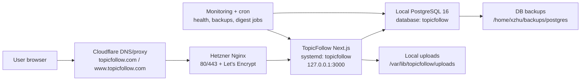
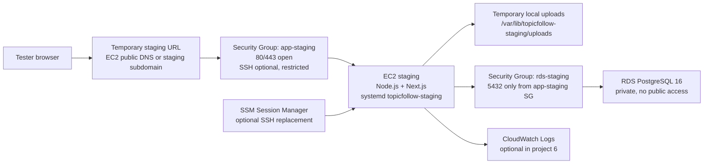

# 项目 6：TopicFollow 迁移盘点与 V1 低改造原型

## 当前 Hetzner 架构盘点

盘点日期：2026-05-01

当前真实状态：

```text
网站、PostgreSQL 数据库、图片/uploads 文件都在同一台 Hetzner 服务器上。
```

服务器：

| 项目 | 当前值 |
| --- | --- |
| Host | `ubuntu-4gb-nbg1-1` |
| Origin IP | `46.225.136.182` |
| App 目录 | `/opt/topicfollow/app` |
| 当前代码 | `main...origin/main`，commit `c2713fe` |
| 生产 env 文件 | `/opt/topicfollow/app/.env.production` |
| 外部健康检查 | `https://www.topicfollow.com/api/health` |

### 当前访问链路



### 应用层

TopicFollow 由 systemd 管理：

| 项目 | 当前值 |
| --- | --- |
| systemd service | `topicfollow.service` |
| service 状态 | `active/running` |
| service 文件 | `/etc/systemd/system/topicfollow.service` |
| 运行用户 | `www-data` |
| WorkingDirectory | `/opt/topicfollow/app` |
| ExecStart | `/usr/bin/npm run start -- --hostname 127.0.0.1 --port 3000` |
| EnvironmentFile | `/opt/topicfollow/app/.env.production` |

应用只监听本机 `127.0.0.1:3000`，外部用户不直接访问 Node/Next.js 进程。

### Nginx / HTTPS / 域名

Nginx 当前状态：

| 项目 | 当前值 |
| --- | --- |
| nginx service | `active/running` |
| site config | `/etc/nginx/sites-enabled/topicfollow` -> `/etc/nginx/sites-available/topicfollow` |
| server_name | `topicfollow.com`、`www.topicfollow.com` |
| HTTP | `80` |
| HTTPS | `443` |
| TLS certificate | `/etc/letsencrypt/live/topicfollow.com/fullchain.pem` |
| TLS key | `/etc/letsencrypt/live/topicfollow.com/privkey.pem` |
| Reverse proxy | `proxy_pass http://127.0.0.1:3000` |

本地 DNS 查询结果显示 `topicfollow.com` / `www.topicfollow.com` 解析到 Cloudflare IP：

```text
104.21.71.32
172.67.142.199
```

所以公网访问链路是：

```text
Browser
  -> Cloudflare
  -> Hetzner Nginx 80/443
  -> 127.0.0.1:3000 Next.js
```

### 数据库

PostgreSQL 当前在 Hetzner 本机运行：

| 项目 | 当前值 |
| --- | --- |
| service | `postgresql@16-main.service` |
| PostgreSQL 版本/cluster | `16 main` |
| 状态 | `online` |
| 端口 | `5432` |
| data directory | `/var/lib/postgresql/16/main` |
| log file | `/var/log/postgresql/postgresql-16-main.log` |
| 应用数据库 | `topicfollow` |
| 应用数据库用户 | `topicfollow_user` |

备份脚本使用：

```text
pg_dump -h localhost -U topicfollow_user -d topicfollow --no-owner --no-privileges | gzip
```

发现的问题：

```text
PostgreSQL 当前 listen_addresses = '*'
服务器上 5432 正在监听 0.0.0.0 和 ::
从本机外部探测 46.225.136.182:5432 可以连通 TCP
```

这不一定代表任何人都能登录数据库，因为还要看 `pg_hba.conf` 和密码权限；但它说明数据库端口已经暴露在公网 TCP 层。项目 6 迁移前应把它列为安全风险，后续需要确认是否可以改成只监听 localhost，或至少用防火墙限制来源。

### 图片 / uploads

生产 uploads 目录：

| 项目 | 当前值 |
| --- | --- |
| 环境变量 | `UPLOADS_STORAGE_DIR=/var/lib/topicfollow/uploads` |
| 目录 | `/var/lib/topicfollow/uploads` |
| owner | `www-data:www-data` |

当前结论：

```text
图片/uploads 仍然依赖 Hetzner 本机磁盘。
项目 6 只盘点和临时验证 uploads 行为。
项目 7 再把 uploads 正式迁到 S3 + CloudFront。
```

### 环境变量清单

本节只记录变量名、用途和迁移策略，不记录任何 secret 值。

生产服务器 `/opt/topicfollow/app/.env.production` 当前存在这些变量名：

```text
APP_URL
AUTH_SECRET
CONTENT_ADMIN_EMAILS
CRON_SECRET
DATABASE_URL
GOOGLE_CLIENT_ID
GOOGLE_CLIENT_SECRET
HELLO_EMAIL
HELLO_EMAIL_NAME
LEGAL_ENTITY_NAME
NEXT_PUBLIC_APP_URL
PRIVACY_EMAIL
RESEND_API_KEY
RESEND_FROM_EMAIL
RESEND_FROM_NAME
RESEND_WEBHOOK_SECRET
SUPPORT_EMAIL
UPLOADS_STORAGE_DIR
```

`.env.example` 还出现了这些生产文件当前没有的变量：

```text
COOKIE_DOMAIN
NEXT_PUBLIC_ANALYTICS_PROVIDER
NEXT_PUBLIC_EMAIL_PROVIDER
NEXT_PUBLIC_SUPPORT_PROVIDER
OPENAI_API_KEY
POLICY_EFFECTIVE_DATE
PRIMARY_REGIONS
TEST_DATABASE_URL
```

代码还支持这些 public profile 变量：

```text
NEXT_PUBLIC_LEGAL_ENTITY_NAME
NEXT_PUBLIC_POLICY_EFFECTIVE_DATE
NEXT_PUBLIC_PRIMARY_REGIONS
NEXT_PUBLIC_PRIVACY_EMAIL
NEXT_PUBLIC_SUPPORT_EMAIL
```

已确认的非 secret 指针：

```text
NEXT_PUBLIC_APP_URL=https://www.topicfollow.com
UPLOADS_STORAGE_DIR=/var/lib/topicfollow/uploads
```

已确认存在但不记录值的 secret：

```text
DATABASE_URL
AUTH_SECRET
RESEND_API_KEY
GOOGLE_CLIENT_SECRET
```

#### 迁移策略表

| 变量 | 当前生产 | 用途 | AWS 迁移策略 | staging 策略 |
| --- | --- | --- | --- | --- |
| `DATABASE_URL` | 有 | 应用连接 PostgreSQL；缺失时进入 mock fallback | 放 `Secrets Manager` 或 `SSM SecureString`；production 指向 RDS production | 指向 RDS staging，绝不能指向 Hetzner production |
| `TEST_DATABASE_URL` | 无 | 本地/CI 测试数据库 | CI 环境单独配置；不放生产 task | staging 不需要，除非在 AWS 跑测试 |
| `AUTH_SECRET` | 有 | session、验证 token、账号恢复等签名 | secret；production 迁移时优先保留现值，避免所有用户 session/token 立即失效 | staging 用独立值，不能复用 production |
| `CRON_SECRET` | 有 | 保护 `/api/cron/send-topic-digests` 和 `/api/cron/purge-deleted-accounts` | secret；用于 EventBridge Scheduler、cron 或内部调用的 Bearer token | staging 用独立值，并默认不启用真实邮件/清理任务 |
| `RESEND_API_KEY` | 有 | 发送 transactional email，读取 inbound email 内容 | secret；production 放 Secrets/SSM | staging 不要用真实生产发送 key，或使用受限测试 key |
| `RESEND_WEBHOOK_SECRET` | 有 | 验证 Resend inbound webhook 签名 | secret；production webhook 切到 AWS 后更新 | staging 用单独 webhook secret，不接生产 webhook |
| `GOOGLE_CLIENT_ID` | 有 | Google OAuth client ID | 普通配置或 SSM String；不是高敏 secret | staging 应使用单独 OAuth client 或至少单独 redirect URI |
| `GOOGLE_CLIENT_SECRET` | 有 | Google OAuth client secret | secret；production 放 Secrets/SSM | staging 用独立 secret |
| `OPENAI_API_KEY` | 当前生产无 | topic/orchestrator 或 AI 相关脚本可能需要 | secret；只有需要在 AWS 跑相关 job 时再配置 | staging 默认不配置，避免误跑成本任务 |
| `NEXT_PUBLIC_APP_URL` | 有 | canonical site URL、OAuth base URL | 普通配置；production 切流时改为正式域名 | staging 使用临时域名，例如 EC2/ALB/CloudFront staging URL |
| `APP_URL` | 有 | `NEXT_PUBLIC_APP_URL` 的 server-side fallback | 普通配置；可以保留但要和正式 URL 一致 | staging 指向 staging URL |
| `COOKIE_DOMAIN` | 当前生产无 | cookie parent domain；生产跨子域共享 cookie 时使用 | 普通配置；正式域名切流前确认是否需要 `.topicfollow.com` | staging 通常留空，避免污染正式域名 cookie |
| `UPLOADS_STORAGE_DIR` | 有 | 本地 uploads 文件目录 | 项目 6 继续指向 EC2 本地临时目录；项目 7 后改成 storage adapter/S3 配置 | staging 用独立目录，不复用生产 uploads |
| `CONTENT_ADMIN_EMAILS` | 有 | 允许进入内容管理和内容变更的邮箱列表 | 普通但敏感配置；可放 SSM String | staging 可使用测试管理员邮箱 |
| `LEGAL_ENTITY_NAME` | 有 | 公开法律主体/邮件 sender fallback | 普通配置 | staging 可同 production 或标注 staging |
| `NEXT_PUBLIC_LEGAL_ENTITY_NAME` | 当前生产无 | public policy 页面法律主体，优先级高于 `LEGAL_ENTITY_NAME` | 普通配置；如需浏览器可见值，使用这个 | staging 可不设 |
| `SUPPORT_EMAIL` | 有 | 公开 support email、邮件 sender fallback | 普通配置 | staging 可用测试/内部邮箱 |
| `NEXT_PUBLIC_SUPPORT_EMAIL` | 当前生产无 | 浏览器可见 support email，优先级高于 `SUPPORT_EMAIL` | 普通配置 | staging 可不设 |
| `PRIVACY_EMAIL` | 有 | privacy request email | 普通配置 | staging 可用测试/内部邮箱 |
| `NEXT_PUBLIC_PRIVACY_EMAIL` | 当前生产无 | 浏览器可见 privacy email，优先级高于 `PRIVACY_EMAIL` | 普通配置 | staging 可不设 |
| `HELLO_EMAIL` | 有 | welcome email sender | 普通配置，依赖 Resend 已验证 sender/domain | staging 默认不发真实 welcome email |
| `HELLO_EMAIL_NAME` | 有 | welcome email sender display name | 普通配置 | staging 可标注 staging |
| `RESEND_FROM_EMAIL` | 有 | transactional email from address | 普通配置，但必须匹配 Resend 验证域名 | staging 不要指向会误导用户的正式 sender |
| `RESEND_FROM_NAME` | 有 | transactional email sender display name | 普通配置 | staging 可标注 staging |
| `NEXT_PUBLIC_ANALYTICS_PROVIDER` | 当前生产无 | 公开 policy/说明页面展示 analytics provider | 普通配置 | staging 可不设 |
| `NEXT_PUBLIC_EMAIL_PROVIDER` | 当前生产无 | 公开 policy/说明页面展示 email provider | 普通配置 | staging 可不设 |
| `NEXT_PUBLIC_SUPPORT_PROVIDER` | 当前生产无 | 公开 policy/说明页面展示 support provider | 普通配置 | staging 可不设 |
| `NEXT_PUBLIC_POLICY_EFFECTIVE_DATE` | 当前生产无 | 公开 policy effective date | 普通配置 | staging 可不设 |
| `NEXT_PUBLIC_PRIMARY_REGIONS` | 当前生产无 | 公开主要服务/数据区域说明 | 普通配置 | staging 可不设 |

#### 需要修正或确认的问题

1. `.env.example` 里有 `POLICY_EFFECTIVE_DATE` 和 `PRIMARY_REGIONS`，但当前代码读取的是 `NEXT_PUBLIC_POLICY_EFFECTIVE_DATE` 和 `NEXT_PUBLIC_PRIMARY_REGIONS`。迁移前应统一命名，避免以为配置生效但实际走默认值。
2. 生产 `.env.production` 有 `APP_URL` 和 `NEXT_PUBLIC_APP_URL`，正式切流时两者应保持一致，避免 canonical URL、OAuth redirect 和邮件链接出现混用。
3. `AUTH_SECRET` 如果在 AWS production 使用新值，旧 session、密码重置、邮箱验证等 token 可能失效。正式迁移时建议先保留旧值，稳定后再计划轮换。
4. staging 环境导入生产数据库后，`RESEND_API_KEY`、`RESEND_WEBHOOK_SECRET`、`CRON_SECRET`、Google OAuth 等必须和 production 分离，默认关闭真实邮件和后台 job。
5. 项目 6 暂时保留 `UPLOADS_STORAGE_DIR` 本地目录模型；项目 7 再引入 S3/CloudFront 相关变量或 storage adapter 配置。

### 数据库迁移路径

本节确认从 Hetzner PostgreSQL 迁移到 RDS PostgreSQL staging 的路径。当前只做只读盘点和 restore 方案，不修改生产数据库。

#### 当前数据库状态

| 项目 | 当前值 |
| --- | --- |
| PostgreSQL 版本 | `16.13 (Ubuntu 16.13-0ubuntu0.24.04.1)` |
| 当前数据库 | `topicfollow` |
| 当前应用用户 | `topicfollow_user` |
| 数据库大小 | `28 MB` |
| schema | `public` |
| public base tables | `26` |
| schema migrations | `47` |
| migration 时间范围 | `2026-04-19 17:20:22+00` 到 `2026-04-26 16:45:24+00` |
| extensions | `plpgsql` only |
| encoding | `UTF8` |
| collation / ctype | `en_US.UTF-8` / `en_US.UTF-8` |

最大的表：

| table | size |
| --- | --- |
| `articles` | `7424 kB` |
| `web_vital_events` | `2888 kB` |
| `event_signals` | `2656 kB` |
| `topic_events` | `1488 kB` |
| `topic_research_state` | `1216 kB` |

最近的 migrations：

| migration | applied_at |
| --- | --- |
| `046_user_preferences_preferred_locale_de.sql` | `2026-04-26 16:43:29+00` |
| `045_source_identity_and_region_cleanup.sql` | `2026-04-26 16:45:24+00` |
| `044_merge_duplicate_sources.sql` | `2026-04-20 21:28:09+00` |
| `043_backfill_estimated_midnight_timestamps.sql` | `2026-04-20 21:12:32+00` |
| `042_topic_events_timestamp_confidence.sql` | `2026-04-20 21:02:45+00` |

#### 当前备份状态

服务器上的最新备份：

```text
/home/xzhu/backups/postgres/topicfollow_2026-05-01_01-00-01.sql.gz
size: 2.8 MB
gzip integrity: ok
dumped from PostgreSQL 16.13
dumped by pg_dump 16.13
```

备份命令当前使用：

```text
pg_dump -h localhost -U topicfollow_user -d topicfollow --no-owner --no-privileges | gzip
```

这个格式适合导入 RDS staging，因为：

1. `--no-owner` 不要求 RDS 里存在 Hetzner 同名 owner。
2. `--no-privileges` 不恢复 Hetzner 上的 grant/acl。
3. 当前只使用默认 `plpgsql` extension，没有发现需要 RDS superuser 权限安装的扩展。
4. 数据库只有 `28 MB`，首次 restore 演练可以很快完成。

本地 Mac 当前 `output/backups/topicfollow-db` 里最新只到：

```text
topicfollow_2026-04-21_03-00-01.sql.gz
```

所以在真正做 RDS restore 演练前，需要先从 Hetzner 拉取最新备份，或直接在服务器上生成/下载当天备份。

#### RDS staging 建议

项目 6 的 RDS staging 建议：

| 项目 | 建议 |
| --- | --- |
| Engine | `PostgreSQL 16`，尽量匹配 Hetzner `16.13` |
| Environment | staging only |
| Public access | `No` |
| Subnet | private subnet |
| Security group | 只允许 EC2 staging security group 访问 `5432` |
| Database name | `topicfollow` 或 `topicfollow_staging`，二选一后固定 |
| App user | 单独创建 staging app user |
| Backup retention | 学习阶段可以 `1-7 days`，避免忘记成本 |
| Deletion protection | staging 可关闭；production 再打开 |

RDS 不应该像当前 Hetzner 一样把 `5432` 暴露到公网。

#### Restore 演练草案

先把最新备份拉到执行 restore 的机器上：

```bash
scp xzhu@46.225.136.182:/home/xzhu/backups/postgres/topicfollow_2026-05-01_01-00-01.sql.gz .
gzip -t topicfollow_2026-05-01_01-00-01.sql.gz
```

导入 RDS staging：

```bash
export RDS_STAGING_DATABASE_URL='postgresql://<user>:<password>@<rds-endpoint>:5432/<database>?sslmode=require'
gzip -cd topicfollow_2026-05-01_01-00-01.sql.gz | psql "$RDS_STAGING_DATABASE_URL" -v ON_ERROR_STOP=1
```

导入后在 TopicFollow app 代码目录跑 migration：

```bash
DATABASE_URL="$RDS_STAGING_DATABASE_URL" npm run db:migrate
```

然后用 staging app 验证：

```bash
curl -fsS https://<staging-host>/api/health
```

期望结果：

```text
database.configured = true
database.connected = true
content.contentMode 不是 database-unavailable
HTTP status = 200
```

#### 数据库迁移风险

1. 当前 Hetzner PostgreSQL `5432` 从公网 TCP 可达；RDS staging/production 必须改成私有访问。
2. 正式迁移时必须有写入冻结窗口，避免 Hetzner 和 AWS 双写。
3. staging 导入生产数据库后不能运行真实 digest、账号清理、webhook、topic orchestrator。
4. 正式迁移前要确认本地/远端最新备份一致，不能用过期的本地 Apr 21 备份做最终导入。
5. `AUTH_SECRET`、`CRON_SECRET`、`RESEND_*` 等 secret 要和数据库一起规划，否则 restore 成功后应用仍可能因为环境变量不完整而 `/api/health` 返回 503 或邮件误发。

### 图片 / uploads 迁移范围

本节确认当前需要从 Hetzner 本机磁盘迁移出去的文件范围。项目 6 只做盘点；项目 7 再正式迁到 S3 + CloudFront。

#### 生产 uploads 目录

| 项目 | 当前值 |
| --- | --- |
| 生产目录 | `/var/lib/topicfollow/uploads` |
| owner | `www-data:www-data` |
| 总大小 | `8.3 MB` |
| 文件数 | `71` |
| 文件类型 | `webp: 71` |
| 当前主目录 | `topics/` |

当前生产目录结构：

```text
/var/lib/topicfollow/uploads/
  topics/
    topic-<topic-slug>/
      hero.webp
```

示例路径：

```text
topics/topic-2026-bulgarian-presidential-election/hero.webp
topics/topic-american-iran-war/hero.webp
topics/topic-anthropic-claude/hero.webp
topics/topic-carbon-pricing-in-canada/hero.webp
topics/topic-us-china-semiconductor-export-controls-timeline/hero.webp
```

路径生成逻辑在 TopicFollow 代码里：

```text
getTopicHeroUploadPath(slug) -> topics/topic-${slug}/hero.webp
uploadPublicBlob(pathname, file) -> /uploads/<pathname>
```

当前公开访问逻辑：

```text
Browser requests /uploads/...
  -> Next.js route src/app/uploads/[...path]/route.ts
  -> readFile(UPLOADS_STORAGE_DIR + requested path)
  -> return file response
```

#### 数据库引用情况

数据库中当前和 uploads 相关的字段：

| 表/字段 | 总行数 | 空值 | `/uploads/...` | `http...` | 说明 |
| --- | ---: | ---: | ---: | ---: | --- |
| `topics.hero_image` | 71 | 0 | 71 | 0 | 当前所有 topic hero image 都是本地 uploads URL |
| `topics.hero_image_download_url` | 71 | 53 | 18 | 0 | 部分和 `hero_image` 相同，作为 metadata |
| `users.avatar_url` | 1 | 1 | 0 | 0 | 当前没有用户头像文件 |
| `feedback_requests.attachment_url` | 0 | 0 | 0 | 0 | 当前没有 feedback attachment |
| `topic_creation_requests.attachment_url` | 0 | 0 | 0 | 0 | 当前没有 topic request attachment |
| `inbound_email_requests.attachment_urls` | 0 | 0 | 0 | 0 | 当前没有 inbound email attachment |

路径对账结果：

```text
topics.hero_image 中的 /uploads 引用数：71
磁盘上的 uploads 文件数：71
数据库引用但磁盘缺失：0
磁盘存在但 topics.hero_image 未引用：0
```

当前结论：生产 uploads 迁移范围很小，而且现在主要是 topic hero images。项目 7 做 S3 迁移时，第一批可以专注处理：

```text
/uploads/topics/topic-<slug>/hero.webp
topics.hero_image
topics.hero_image_download_url
```

但代码已经支持未来这些路径，所以设计 S3 key 时也要预留：

```text
/uploads/avatars/<userId>-<random>.png|jpg|webp
/uploads/feedback/<userId>-<random>.png|jpg|webp
```

对应代码位置：

| 类型 | 生成路径 | 数据库存储 |
| --- | --- | --- |
| topic hero image | `topics/topic-${slug}/hero.webp` | `topics.hero_image`、`topics.hero_image_download_url` |
| avatar | `avatars/<userId>-<random>.<ext>` | `users.avatar_url` |
| feedback/topic request attachment | `feedback/<userId>-<random>.<ext>` | `feedback_requests.attachment_url(s)`、`topic_creation_requests.attachment_url(s)` |

#### 仓库里的 public/uploads

本地仓库还有：

```text
/Users/xzhu/Documents/Web_Development/topicfollow/public/uploads
size: 8.0 MB
files: 74
```

这些看起来是历史或本地静态图片资产，不是当前生产 `UPLOADS_STORAGE_DIR`。项目 7 迁 S3 时要以 Hetzner 生产目录 `/var/lib/topicfollow/uploads` 为准，同时单独判断 `public/uploads` 是否还有被代码、数据库或旧页面引用的遗留图片。

#### S3 迁移建议

项目 7 的目标 S3 key 可以保持当前路径结构：

```text
uploads/topics/topic-<slug>/hero.webp
uploads/avatars/<filename>
uploads/feedback/<filename>
```

长期数据库策略建议：

```text
数据库保存稳定 object key 或 /uploads/... 兼容路径。
展示层通过 helper 转成 CloudFront URL。
旧 /uploads/... 路径保留 redirect 或 route fallback，避免切流当天 404。
```

第一轮迁移验证清单：

1. `aws s3 sync /var/lib/topicfollow/uploads s3://<bucket>/uploads/`。
2. 对比文件数量：源端 `71`，S3 `71`。
3. 抽样打开至少 10 个 topic hero image。
4. 验证首页、topic 页面、搜索结果里的图片。
5. 验证旧 `/uploads/topics/.../hero.webp` 仍能访问或 redirect。
6. 新上传 topic hero image 后，确认进入 S3 而不是 EC2 本地磁盘。

#### 图片迁移风险

1. 当前图片 URL 存在数据库里，不能只搬文件；还要保证 URL/helper 兼容。
2. `topics.hero_image_download_url` 有 18 条 `/uploads/...`，如果只改 `hero_image` 会留下 metadata 不一致。
3. 未来 avatar 和 feedback attachment 虽然当前没有生产文件，但代码已经支持，S3 adapter 不能只硬编码 topic hero image。
4. `public/uploads` 和生产 `UPLOADS_STORAGE_DIR` 是两套目录，迁移时要避免把本地历史文件误认为生产真相。
5. 如果直接上 ECS/Fargate 而不先迁 S3，容器重启或换 task 后本地 uploads 会丢失。

### AWS staging 目标架构

项目 6 的 AWS 目标不是正式生产迁移，而是低改造跑通一个 staging 环境：

```text
EC2 跑 Next.js
  + RDS PostgreSQL staging
  + EC2 本地临时 uploads
  + CloudWatch / SSM 基础运维
```

暂时不切正式域名，不影响 `www.topicfollow.com`，不把 production traffic 导到 AWS。

#### 推荐 staging 架构



#### 资源设计

| 层 | AWS 资源 | staging 设计 |
| --- | --- | --- |
| Network | VPC | 用默认 VPC 也可以学习；更严谨是单独 `topicfollow-staging` VPC |
| Subnet | public subnet | EC2 staging 放 public subnet，方便低改造访问和调试 |
| Subnet | private subnet | RDS 放 private subnet，不给公网 IP |
| Security Group | `topicfollow-staging-app-sg` | 入站只开 HTTP/HTTPS；SSH 如果需要，只允许自己的 IP，后续用 SSM 替代 |
| Security Group | `topicfollow-staging-rds-sg` | 入站 `5432` 只允许 `topicfollow-staging-app-sg` |
| Compute | EC2 | 低规格实例，安装 Node.js、npm、git，运行 `next start` |
| Process manager | systemd | service 名可以用 `topicfollow-staging`，和 Hetzner production 区分 |
| Database | RDS PostgreSQL | PostgreSQL 16，`Public access = No`，用最新 Hetzner 备份 restore |
| Files | EC2 local disk | 项目 6 只用临时 uploads 目录验证；项目 7 再迁 S3 |
| Logs | CloudWatch Logs | 可选：先记录 systemd/journalctl，后续接 CloudWatch agent |
| Access | SSM Session Manager | 可选学习点；配置好后可以关闭公网 SSH |
| Secrets | `.env.staging` 或 SSM/Secrets | 项目 6 可先用 EC2 本地 env 文件；项目 9 再系统化迁 Secrets Manager/SSM |

#### staging 环境变量原则

staging 必须和 production 分离：

| 变量 | staging 要求 |
| --- | --- |
| `NEXT_PUBLIC_APP_URL` / `APP_URL` | 指向 staging URL，不是 `https://www.topicfollow.com` |
| `DATABASE_URL` | 指向 RDS staging，不是 Hetzner production |
| `UPLOADS_STORAGE_DIR` | 指向 `/var/lib/topicfollow-staging/uploads` |
| `AUTH_SECRET` | 使用 staging 独立值，不复用 production |
| `CRON_SECRET` | 使用 staging 独立值，并默认不启用 cron |
| `RESEND_API_KEY` | 默认不配置，或使用测试/受限 key |
| `RESEND_WEBHOOK_SECRET` | 默认不接 production webhook |
| `GOOGLE_CLIENT_ID` / `GOOGLE_CLIENT_SECRET` | 用 staging OAuth client，或至少配置 staging redirect URI |
| `CONTENT_ADMIN_EMAILS` | 使用测试管理员邮箱 |

#### staging 部署步骤草案

1. 创建 EC2 staging。
2. 创建 RDS PostgreSQL 16 staging，确认 `Public access = No`。
3. 配置 RDS security group：只允许 EC2 app security group 访问 `5432`。
4. 从 Hetzner 拉取最新 `topicfollow_*.sql.gz` 备份。
5. 把备份导入 RDS staging。
6. 在 EC2 上 clone TopicFollow，安装依赖。
7. 创建 staging env 文件，确保所有 URL、DB、uploads、secret 都是 staging。
8. 运行 `npm run db:migrate`。
9. 运行 `npm run build`。
10. 用 systemd 启动 `next start -- --hostname 127.0.0.1 --port 3000`。
11. 如果使用 Nginx，在 EC2 上把 80/443 反代到 `127.0.0.1:3000`。
12. 访问 staging 首页和 `/api/health`。
13. 抽样验证 topic 页面和图片。

#### 项目 6 明确不做

项目 6 不做这些事：

```text
不切 www.topicfollow.com 正式 DNS
不停止 Hetzner production
不把 production users 导到 AWS
不启用真实邮件发送
不接生产 Resend webhook
不运行生产 digest / purge / topic orchestrator
不正式迁 S3 uploads
不做 ECS/Fargate
```

这些留给项目 7-10。

#### staging 验收标准

项目 6 staging 跑通的定义：

1. EC2 staging 能访问 TopicFollow 首页。
2. `/api/health` 返回 `200`。
3. `/api/health` 里 `database.configured = true`。
4. `/api/health` 里 `database.connected = true`。
5. RDS staging 只允许 EC2 security group 访问，不能从公网直接连。
6. 至少一次 Hetzner 备份导入 RDS staging 成功。
7. `npm run db:migrate` 在 RDS staging 上成功。
8. staging 不发真实用户邮件，不接生产 webhook，不运行生产 cron/job。
9. topic hero images 至少有一种临时方案可显示：复制 uploads 到 EC2 staging，或明确记录项目 7 前该项暂不完整。

#### staging 风险和决策

| 问题 | 建议 |
| --- | --- |
| EC2 是否直接放公网 | 项目 6 可以放 public subnet 低改造学习，但只开放必要端口 |
| SSH 是否开放 | 初期可限制到个人 IP；配置 SSM 后关闭 SSH |
| RDS 是否公网可访问 | 不可以。RDS staging 也必须 private |
| 是否复制 uploads 到 EC2 | 可以少量复制用于页面验证，但这只是临时方案 |
| 是否使用真实 Resend/Google/OAuth | staging 默认使用独立配置，避免影响 production |
| 是否需要 CloudFront/ALB | 项目 6 不需要；项目 8/10 再考虑 |
| 是否需要 NAT Gateway | 项目 6 的 EC2 public subnet 可以先避免 NAT Gateway 成本 |

### AWS 创建前预检

预检日期：2026-05-01

当前 AWS CLI / 账号状态：

| 项目 | 当前值 |
| --- | --- |
| AWS CLI profile | `aws-learning` |
| Region | `eu-central-1` / Europe Frankfurt |
| Account | `089781651608` |
| Caller identity | `AWSReservedSSO_AdministratorAccess.../xzhu-admin` |
| 当前 EC2 instances | 无 |
| 当前 RDS instances | 无 |
| 当前 RDS subnet groups | 无 |
| 当前 EC2 key pairs | 无 |

当前默认 VPC：

| 项目 | 当前值 |
| --- | --- |
| VPC | `vpc-0d72ee5f56fb56420` |
| CIDR | `172.31.0.0/16` |
| IsDefault | `true` |
| Default security group | `sg-074878dfacb806c6a` |

默认 subnets：

| AZ | Subnet ID | CIDR | Auto public IP |
| --- | --- | --- | --- |
| `eu-central-1a` | `subnet-0f249aec37e3228a3` | `172.31.16.0/20` | `true` |
| `eu-central-1b` | `subnet-0a00f0efd91d30b84` | `172.31.32.0/20` | `true` |
| `eu-central-1c` | `subnet-0d5427d4b90402d07` | `172.31.0.0/20` | `true` |

默认 route table 有：

```text
172.31.0.0/16 -> local
0.0.0.0/0 -> Internet Gateway
```

#### staging 网络决策

当前有两个可选路线：

| 方案 | 做法 | 优点 | 缺点 | 适合 |
| --- | --- | --- | --- | --- |
| A. 默认 VPC 低改造 | EC2 和 RDS 都放默认 VPC；EC2 在 public subnet；RDS 设置 `PubliclyAccessible=false`，security group 只允许 EC2 SG 访问 | 简单、快、低成本，不需要 NAT Gateway | subnet 本身是 public route table，不是严格私有网络练习 | 项目 6 快速 staging |
| B. 自定义 VPC | 新建 VPC、public subnet、private subnet、route table；EC2 public，RDS private | 更接近生产网络边界，能真正练 VPC/subnet | 步骤更多，容易引入 NAT Gateway/路由复杂度 | 项目 6 进阶或项目 10 前 |

建议：项目 6 先用方案 A，理由是本项目重点是迁移盘点、RDS restore、Next.js 在 AWS 跑通；严格 VPC 分层可以在项目 9/10 用 IaC 再补。

但即使用方案 A，也必须做到：

```text
RDS PubliclyAccessible = false
RDS SG inbound 5432 source = EC2 app SG
不能开放 0.0.0.0/0 到 RDS 5432
EC2 SSH 如需开启，只允许自己的公网 IP
```

#### 下一步创建资源顺序

如果采用方案 A，资源创建顺序：

1. 创建 app security group：`topicfollow-staging-app-sg`。已创建：`sg-002c16291ee751db1`。
2. 创建 RDS security group：`topicfollow-staging-rds-sg`，只允许 app SG 访问 `5432`。已创建：`sg-08ac757bf6b0212c0`。
3. 创建 RDS subnet group，使用默认 VPC 的 3 个 subnets。已创建：`topicfollow-staging-db-subnet-group`。
4. 创建 RDS PostgreSQL 16 staging，`PubliclyAccessible=false`。已创建：`topicfollow-staging-postgres`。
5. 创建 EC2 staging，放在默认 public subnet。已创建：`i-047149e9fda270965`。
6. 安装 Node.js/git/npm，clone TopicFollow。基础环境已安装；EC2 root EBS 已从 `8 GiB` 扩到 `20 GiB`，root filesystem 已扩容到约 `19 GiB`。TopicFollow 已 clone 到 `/opt/topicfollow/app`，`npm ci` 已成功。
7. 测试 EC2 到 RDS staging 的连接；已用 `psql` 从 EC2 成功连接 RDS PostgreSQL `16.13`。然后拉取 Hetzner 最新 DB backup，导入 RDS staging。EC2 直接 SSH 到 Hetzner 因缺少 Hetzner SSH key 报 `Permission denied (publickey)`，改用 Mac 作为中转站复制备份到 EC2。已复制并校验 `/home/ubuntu/topicfollow-migration/topicfollow_2026-05-01_01-00-01.sql.gz`。RDS restore 后检查到 `26` 张 public tables、`71` 条 topics，和 Hetzner 盘点一致。
8. 配置 `.env.staging` / `.env.production`，确保不使用 production side-effect secrets。注意：RDS staging password 曾被贴到对话中，继续前应旋转 RDS master password，并同步更新 EC2 上的 `.env.production`。
9. 跑 `npm run db:migrate`、`npm run build`、`npm start`。`npm run db:migrate` 和 `npm run build` 已在 EC2 上成功；systemd `topicfollow-staging` 已能在 `127.0.0.1:3000` 响应。
10. 验证 `/api/health`。已返回 `ok=true`、database connected、`topicCount=71`、`articleCount=1767`、`sourceCount=760`。Nginx 已配置公网 `80` 反代到 `127.0.0.1:3000`，`http://51.102.96.167/api/health` 返回正常 JSON，首页 redirect 到 `http://51.102.96.167/en`。uploads 已通过 Mac 中转同步到 EC2 `/var/lib/topicfollow/uploads`，共 `71` 个文件、`8.3M`，和 Hetzner 盘点一致。最终检查：`topicfollow-staging.service` 和 `nginx.service` 均为 `active (running)` 且 `enabled`，`http://51.102.96.167/en` 返回 `200 OK`。

#### 已创建的 AWS staging 资源

| 资源 | ID / 名称 | 配置 |
| --- | --- | --- |
| App security group | `sg-002c16291ee751db1` / `topicfollow-staging-app-sg` | VPC `vpc-0d72ee5f56fb56420`; inbound `80` from `0.0.0.0/0`, `443` from `0.0.0.0/0`, `22` from `212.204.102.90/32`; outbound all |
| RDS security group | `sg-08ac757bf6b0212c0` / `topicfollow-staging-rds-sg` | VPC `vpc-0d72ee5f56fb56420`; inbound PostgreSQL `5432` only from `sg-002c16291ee751db1`; outbound all |
| RDS DB subnet group | `topicfollow-staging-db-subnet-group` | VPC `vpc-0d72ee5f56fb56420`; subnets `subnet-0f249aec37e3228a3` (`eu-central-1a`), `subnet-0a00f0efd91d30b84` (`eu-central-1b`), `subnet-0d5427d4b90402d07` (`eu-central-1c`); status `Complete` |
| RDS PostgreSQL staging | `topicfollow-staging-postgres` | PostgreSQL `16.13`; class `db.t4g.micro`; storage `20 GiB gp3`; DB name `topicfollow`; master user `topicfollowadmin`; endpoint `topicfollow-staging-postgres.c5q4g40462w8.eu-central-1.rds.amazonaws.com:5432`; Single-AZ `eu-central-1a`; `PubliclyAccessible=false`; backup retention `1`; deletion protection `false`; Performance Insights `false`; Enhanced Monitoring `0` |
| EC2 staging | `i-047149e9fda270965` / `topicfollow-staging-ec2` | Type `t3.micro`; AMI `ami-0596cf3199908321b`; key pair `topicfollow-staging-key`; VPC `vpc-0d72ee5f56fb56420`; subnet `subnet-0a00f0efd91d30b84`; private IP `172.31.34.104`; public IP `51.102.96.167`; public DNS `ec2-51-102-96-167.eu-central-1.compute.amazonaws.com`; security group `sg-002c16291ee751db1`; installed Node.js `22.22.2`, npm `10.9.7`, psql `16.13`, swap `2 GiB`; root EBS `20 GiB`, root filesystem about `19 GiB` with `15 GiB` free after expansion |

#### 临时资源清理记录

2026-05-01 晚上完成项目 6 staging 验证后，应用户要求先删除 AWS 临时资源，明天可重新创建：

| 资源 | 清理状态 |
| --- | --- |
| EC2 `i-047149e9fda270965` | 已 terminate；不再处于 running/stopped/shutting-down |
| Root EBS `vol-0ac3019b51d073f23` | 已随 EC2 删除，`InvalidVolume.NotFound` |
| RDS `topicfollow-staging-postgres` | 已删除，跳过 final snapshot |
| App security group `sg-002c16291ee751db1` | 已删除 |
| RDS security group `sg-08ac757bf6b0212c0` | 已删除 |
| DB subnet group `topicfollow-staging-db-subnet-group` | 已删除 |
| EC2 key pair `topicfollow-staging-key` | AWS key pair 已删除 |
| Secrets Manager | 检查为空，无 staging secret 残留 |

Hetzner production 没有修改或删除。

### 备份

Hetzner 本机备份：

| 项目 | 当前值 |
| --- | --- |
| 备份目录 | `/home/xzhu/backups/postgres` |
| 备份脚本 | `/home/xzhu/backups/postgres/backup-topicfollow.sh` |
| 备份格式 | `topicfollow_YYYY-MM-DD_HH-MM-SS.sql.gz` |
| Hetzner 保留 | `7` 天 |
| 最新观察到的备份 | `topicfollow_2026-05-01_01-00-01.sql.gz` |

本地 Mac 也有拉取备份的 launchd 任务：

| 项目 | 当前值 |
| --- | --- |
| 本地同步脚本 | `ops/local-backup/pull-topicfollow-backups.sh` |
| 本地目标目录 | `output/backups/topicfollow-db` |
| 本地保留 | `30` 天 |
| 本地计划时间 | 每天 `04:00` |

### Cron / 后台任务

Hetzner 当前 TopicFollow 相关 cron：

| 时间 | 任务 |
| --- | --- |
| `0 1 * * *` | 执行 PostgreSQL 备份 |
| `*/5 * * * *` | 运行 TopicFollow Telegram monitor check |
| `0 6 * * *` | 发送 TopicFollow monitor summary |
| `0 6 * * *` | 调用本机 `/api/cron/send-topic-digests` |
| `0 1 * * *` | 调用本机 `/api/cron/purge-deleted-accounts` |
| `* * * * *` | 在 `/opt/topicfollow/app` 运行 `scripts/check-main-and-deploy.sh` 自动部署检查 |

注意：staging 环境导入生产数据后，不能直接启用这些会产生副作用的任务，尤其是邮件 digest、账号清理、webhook 和 topic orchestrator。

### 监控

当前有两层监控：

| 层 | 当前状态 |
| --- | --- |
| 外部健康检查 | UptimeRobot 监控 `https://www.topicfollow.com/api/health` |
| 服务器内监控 | `/home/xzhu/monitoring/topicfollow/monitor-topicfollow.sh` |
| Telegram 通知 | `/home/xzhu/monitoring/topicfollow/send-telegram.sh` |

服务器内监控覆盖：

```text
生产 /api/health
PostgreSQL service state
root disk usage
CPU load
RAM usage
database backup freshness
domain expiry
SSL certificate expiry
```

### 当前架构的迁移风险

1. 网站、数据库、uploads 都耦合在同一台 Hetzner 服务器上，迁移时必须拆成应用、数据库、文件三条线。
2. PostgreSQL 5432 当前从公网 TCP 可达，这是安全风险；迁到 AWS 后 RDS 不应该暴露公网。
3. uploads 依赖本地磁盘，不能直接搬到无状态容器环境。
4. cron/job 会产生真实副作用，staging 必须默认关闭或替换成测试配置。
5. Cloudflare 保护的是 Web 入口，不保护直接访问 Hetzner origin IP 的数据库端口。
