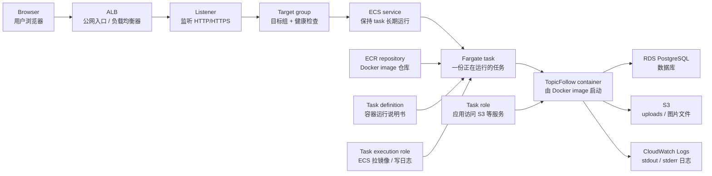

# 项目 8：TopicFollow 容器化部署到 ECS Fargate

目标：把 TopicFollow 从“在服务器上安装 Node、git clone、npm build、systemd 启动”升级为“构建 Docker image，推送到 ECR，再由 ECS Fargate 运行 container”。

项目 8 先学习和验证 staging 架构，不迁移 production，不复用项目 7 的临时 AWS 资源。项目 10 正式迁移时重新创建 production 资源。

## 当前起点

项目 6 学的是低改造迁移：

```text
Browser
  -> EC2 public IP
  -> Nginx
  -> Next.js process
  -> RDS
  -> local uploads
```

项目 7 学的是把 uploads 从本地磁盘抽离到 S3：

```text
Next.js
  -> /uploads/... compatibility route
  -> S3 object
```

项目 8 要学的是把应用进程从 EC2 里抽离出来：

```text
Browser
  -> ALB
  -> ECS Service
  -> Fargate Task
  -> TopicFollow container
  -> RDS / S3
```

## 总架构图

项目 8 的完整请求链路：



可以分成三层理解：

```text
入口层：Browser -> ALB -> Listener -> Target group
运行层：ECS service -> Fargate task -> Container
依赖层：ECR / RDS / S3 / CloudWatch Logs / IAM role
```

镜像发布链路：

```text
Dockerfile
  -> docker build
  -> TopicFollow Docker image
  -> docker push
  -> ECR repository
  -> ECS task definition 引用 image
  -> ECS service 部署新 task
```

请求访问链路：

```text
Browser
  -> ALB:80/443
  -> Target group health check 确认可用 task
  -> Fargate task:3000
  -> TopicFollow container
  -> RDS / S3
```

## 为什么要学 ECS Fargate

EC2 部署像是在云上租一台服务器，自己负责很多事：

| EC2 单机部署 | ECS Fargate 部署 |
| --- | --- |
| 自己安装 Node、Nginx、systemd | 镜像里带应用运行环境 |
| 自己 SSH 上去部署 | 推镜像，让 ECS 拉镜像运行 |
| 服务器坏了要自己处理 | service 可以自动补 task |
| 多实例扩容麻烦 | service desired count 可以调 |
| 上传文件不能依赖本机磁盘 | 配合 S3 更自然 |

Fargate 的重点不是“更便宜”，而是“少管服务器”。学习时要特别注意 ALB、Fargate、CloudWatch Logs 都可能持续收费。

## 核心概念

| 概念 | 你可以先这样理解 |
| --- | --- |
| Dockerfile | 构建 image 的说明书：基础镜像、复制代码、安装依赖、build、启动命令 |
| Docker image | 应用的可运行包，像一个冻结好的运行环境 |
| Container | image 跑起来之后的进程 |
| ECR repository | AWS 里的 Docker image 仓库 |
| ECS cluster | 一组要运行容器的逻辑空间 |
| Task definition | 容器运行说明书：镜像、CPU、内存、端口、环境变量、日志、role |
| Task | 按 task definition 真正跑起来的一份 container |
| ECS service | 保持 task 长期运行，挂了会再拉起来 |
| Fargate | AWS 托管底层服务器，你不直接管 EC2 |
| ALB | 网站入口，接收公网 HTTP/HTTPS，再转发给 task |
| Target group | ALB 后面的目标列表和健康检查规则 |
| CloudWatch Logs | 容器 stdout/stderr 日志收集处 |
| Task execution role | ECS 用来拉 ECR 镜像、写 CloudWatch Logs 的 role |
| Task role | 应用代码用来访问 S3、Secrets Manager 等 AWS 服务的 role |

### 名词分组理解

Docker 负责“把应用打包”：

| 名词 | 作用 |
| --- | --- |
| `Dockerfile` | 告诉 Docker 如何构建 TopicFollow image |
| `Docker image` | 构建完成但还没有运行的应用包 |
| `Container` | image 运行起来之后的进程实例 |
| `Port` | container 对外监听的端口，例如 Next.js 常见是 `3000` |

ECR / ECS / Fargate 负责“把容器跑起来”：

| 名词 | 作用 |
| --- | --- |
| `ECR repository` | 保存 TopicFollow image，类似应用镜像仓库 |
| `ECS cluster` | ECS 里的逻辑管理空间，不等于某台服务器 |
| `Task definition` | 运行说明书，描述 image、CPU、内存、端口、环境变量、日志和 role |
| `Task` | 根据 task definition 启动出来的一份运行实例 |
| `ECS service` | 保证指定数量的 task 长期运行，task 挂了会重新拉起 |
| `Fargate` | AWS 托管底层机器，你不需要 SSH 到 EC2 上维护系统 |

ALB 负责“让公网请求进来”：

| 名词 | 作用 |
| --- | --- |
| `ALB` | 网站公网入口，接收浏览器 HTTP/HTTPS 请求 |
| `Listener` | ALB 上的监听规则，例如监听 `80` 或 `443` |
| `Target group` | ALB 后面的一组目标，这里通常是 ECS task |
| `Health check` | ALB 定期请求 `/api/health`，判断 task 是否健康 |
| `Security group` | AWS 防火墙规则，控制谁能访问 ALB、ALB 能否访问 task |

IAM 和配置负责“安全地给权限和参数”：

| 名词 | 作用 |
| --- | --- |
| `Environment variables` | 运行时配置，例如 `DATABASE_URL`、`APP_URL`、`UPLOADS_S3_BUCKET` |
| `Secret` | 敏感配置，例如数据库密码、OAuth secret，不应该写进 image |
| `Task execution role` | ECS 平台用：拉 ECR image、写 CloudWatch Logs |
| `Task role` | 应用代码用：访问 S3、Secrets Manager、SSM Parameter Store 等服务 |
| `CloudWatch Logs` | 收集容器的 stdout/stderr，方便排错 |

最容易混的几组：

| 对比 | 区别 |
| --- | --- |
| `Docker image` vs `Container` | image 是还没运行的应用包；container 是 image 跑起来之后的进程 |
| `Task definition` vs `Task` | task definition 是说明书；task 是按说明书真正启动的实例 |
| `ECS service` vs `Task` | service 负责长期维护 task；task 是某一次具体运行 |
| `Task execution role` vs `Task role` | execution role 给 ECS 平台用；task role 给 TopicFollow 应用代码用 |
| `ALB` vs `Target group` | ALB 是入口；target group 是入口后面的目标列表和健康检查规则 |

一句话记忆：

```text
Dockerfile 造 image，ECR 存 image，ECS 用 task definition 跑 task，
service 保持 task 活着，Fargate 托管底层机器，ALB 把公网请求转进来。
```

## 项目 8 学习顺序

1. 理解 Docker image 和 container。
2. 为 TopicFollow 写 `Dockerfile`。
3. 本地 build image，运行 container，确认 `/api/health` 正常。
4. 明确哪些配置是运行时环境变量，不能打进 image。
5. 创建 ECR repository，把 image push 到 ECR。
6. 创建 ECS cluster。
7. 创建 task definition。
8. 创建 ECS service。
9. 创建 ALB、target group、listener，把公网流量转发到 ECS service。
10. 打开 CloudWatch Logs 看容器日志。
11. 做一次镜像更新和回滚。
12. 清理测试资源。

## 先不做的事

项目 8 前半段先不连接 production：

- 不切正式域名。
- 不迁移 production 数据。
- 不复用项目 7 已删除的 S3 bucket。
- 不把长期 access key 写进 `.env`。
- 不默认创建 NAT Gateway，因为学习项目里 NAT Gateway 成本偏高。

## 网络选择

ECS Fargate 有一个容易混淆的地方：task 放在哪里。

| 方案 | 含义 | 学习项目建议 |
| --- | --- | --- |
| Public subnet + public IP | task 自己有公网出入口，ALB 转发进来 | 便宜、简单，适合项目 8 学习 |
| Private subnet + NAT Gateway | task 没公网 IP，通过 NAT 出网 | 更接近生产，但 NAT Gateway 持续收费明显 |
| Private subnet + VPC endpoints | 用 endpoint 访问 ECR/S3/Logs 等 AWS 服务 | 更专业，但配置更多 |

项目 8 建议先用 `public subnet + public IP + ALB` 跑通概念。项目 10 再决定 production 是否升级为 private subnet。

## TopicFollow 容器化重点

TopicFollow 运行时需要这些类型的配置：

| 类型 | 示例 |
| --- | --- |
| App URL | `APP_URL`, `NEXT_PUBLIC_APP_URL` |
| Database | `DATABASE_URL` |
| Uploads | `UPLOADS_STORAGE_BACKEND`, `UPLOADS_S3_BUCKET`, `UPLOADS_S3_REGION`, `UPLOADS_S3_PREFIX` |
| Auth / OAuth | Google、GitHub 或其他 OAuth secrets |
| Email / admin | `CONTENT_ADMIN_EMAILS` 等 |

原则：

- Docker image 只放代码和依赖。
- `.env.production` 不复制进 image。
- secret 后续用 ECS environment、Secrets Manager 或 SSM Parameter Store 注入。
- S3 权限用 task role，不用长期 access key。

## 验收标准

- TopicFollow image 本地可以 build。
- 本地 container 可以启动。
- `/api/health` 能返回正常结果，或者明确知道缺少哪类环境变量。
- image 能 push 到 ECR。
- ECS Fargate service 能启动至少 1 个 task。
- ALB 能访问 staging `/api/health`。
- CloudWatch Logs 能看到容器日志。
- 能解释 image、container、ECR、task definition、task、service、cluster、ALB 的区别。
- 测试资源有清理记录。

## 清理清单

项目 8 做完或暂停时检查：

- 删除 ECS service。
- 确认 running task 已停止。
- 删除 ALB、listener、target group。
- 删除 ECS cluster。
- 删除 ECR repository 中测试 image，再删除 repository。
- 删除项目相关 CloudWatch Log Group。
- 删除临时 IAM role。
- 确认没有 NAT Gateway、Elastic IP、EC2、RDS 等额外资源残留。

## 第一课：Docker 在这里替代了什么

项目 6 里，我们在 EC2 上做了这些事：

```text
sudo apt install nodejs
git clone repo
npm ci
npm run build
systemd 启动 npm run start
```

Docker 的作用是把“安装运行环境 + 应用代码 + 启动命令”打包成一个 image：

```text
Dockerfile
  -> docker build
  -> TopicFollow image
  -> docker run
  -> TopicFollow container
```

所以 ECS Fargate 不是直接运行 GitHub repo，而是运行已经构建好的 Docker image。
