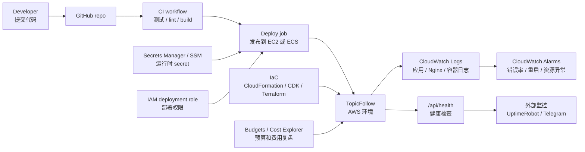

# 项目 9：TopicFollow CI/CD、监控与成本治理

目标：理解把 TopicFollow 从“手动 SSH 部署、人工看日志、事后看账单”升级为“可重复部署、可观察、可控成本”的基本概念。

当前学习策略：

- 项目 9 先作为概念笔记，不作为项目 10 的前置阻塞。
- 项目 10 可以直接实战；遇到部署、监控、告警、成本问题时，再回到这份笔记查概念。
- 项目 9 的重点不是马上搭完整平台，而是知道每个组件解决什么问题。

## 项目 9 在整条链路里的位置

项目 6/7/8 主要解决“应用怎么迁到 AWS”：

```text
应用运行：EC2 或 ECS
数据库：RDS PostgreSQL
文件：S3 uploads
入口：Nginx / ALB / CloudFront / DNS
```

项目 9 解决“迁过去之后怎么长期维护”：

```text
代码变更
  -> CI 测试
  -> 构建
  -> 部署
  -> 健康检查
  -> 日志 / 告警
  -> 成本复盘
```

一句话理解：

```text
项目 9 不是新的业务功能，而是给生产环境加发布、观察和成本刹车。
```

## 总体架构图



## 核心概念

### CI/CD

| 名词 | 解释 |
| --- | --- |
| `CI` | Continuous Integration，持续集成。每次提交后自动跑测试、lint、build，尽早发现问题。 |
| `CD` | Continuous Delivery/Deployment，持续交付或持续部署。把通过检查的版本自动或半自动发布到环境。 |
| `Pipeline` | 从代码提交到测试、构建、部署的一整条流水线。 |
| `Workflow` | GitHub Actions 里的自动化流程文件，通常放在 `.github/workflows/`。 |
| `Job` | workflow 里的一个任务，例如 `test`、`build`、`deploy`。 |
| `Step` | job 里的具体步骤，例如 checkout、install dependencies、run tests。 |
| `Runner` | 执行 workflow 的机器。可以是 GitHub-hosted runner，也可以是自托管 runner。 |
| `Artifact` | CI 过程中产出的文件，例如 build 包、测试报告、Docker image。 |
| `Quality gate` | 发布前必须通过的检查，例如 tests、lint、build、typecheck。 |
| `Rollback` | 新版本有问题时退回旧版本。EC2 可回退代码/服务，ECS 可回退 image 或 task definition。 |

项目 9 推荐的最小质量门禁：

```text
npm test
npm run lint
npm run build
```

如果 TopicFollow 还有页面测试或类型检查，也应该加入：

```text
npm run test:pages
npm run typecheck
```

### 部署权限

| 名词 | 解释 |
| --- | --- |
| `IAM deployment role` | 专门给 CI/CD 使用的部署角色，只给发布所需权限。 |
| `Least privilege` | 最小权限原则，只允许做必要操作。 |
| `OIDC` | GitHub Actions 和 AWS 建立临时身份信任的方式，避免保存长期 AWS access key。 |
| `Access key` | 长期访问密钥。生产部署尽量不要依赖个人长期 access key。 |
| `Environment` | 部署目标环境，例如 `staging`、`production`。 |
| `Environment protection` | GitHub environment 的保护规则，例如 production 部署前需要手动批准。 |

安全原则：

- CI 不使用 root user。
- CI 不使用个人管理员长期 access key。
- staging 和 production 使用不同 secret、不同数据库、不同 bucket。
- production deploy 最好需要人工确认。

### Secret 管理

| 名词 | 解释 |
| --- | --- |
| `Secret` | 敏感值，例如数据库密码、OAuth secret、Resend API key。 |
| `Secrets Manager` | AWS 专门管理 secret 的服务，支持版本和轮换，费用比 SSM 更明显。 |
| `SSM Parameter Store` | Systems Manager 的参数存储，可存普通参数和 SecureString，适合较简单配置。 |
| `Runtime injection` | 应用启动时注入环境变量，而不是把 secret 写进代码或镜像。 |

TopicFollow 常见 secret：

| 类型 | 示例 |
| --- | --- |
| Database | `DATABASE_URL` |
| Auth | `AUTH_SECRET`, Google/GitHub OAuth secret |
| Email | `RESEND_API_KEY`, `RESEND_WEBHOOK_SECRET` |
| Uploads | S3 bucket 名、region、prefix 通常不是 secret，但访问权限要靠 IAM role |

### 日志、指标和告警

| 名词 | 解释 |
| --- | --- |
| `CloudWatch Logs` | 收集应用、Nginx、容器或系统日志。 |
| `Log group` | 一类日志的集合，例如 `/topicfollow/production/app`。 |
| `Log stream` | 某个实例、task 或进程的一条日志流。 |
| `Metric` | 可被统计的数字，例如 5xx 数量、CPU、内存、RDS 连接数。 |
| `CloudWatch Alarm` | 指标超过阈值时触发告警。 |
| `Dashboard` | 把关键指标放在一个页面看。 |
| `Health check` | 定期访问 `/api/health` 判断应用是否可用。 |
| `Uptime monitor` | 从外部模拟用户访问，检查网站是否真的能打开。 |

最小监控目标：

| 目标 | 说明 |
| --- | --- |
| 应用可用性 | `/api/health` 返回正常 |
| 错误率 | 5xx 或应用 error 日志异常时告警 |
| 数据库 | RDS 连接、CPU、存储空间、备份状态 |
| 运行环境 | EC2 CPU、内存、磁盘，或 ECS task 重启 |
| 域名和 HTTPS | 域名解析、证书到期时间 |
| 备份新鲜度 | 最近一次备份是否按时生成 |

### CloudTrail

| 名词 | 解释 |
| --- | --- |
| `CloudTrail` | 记录 AWS API 操作历史，回答“谁在什么时候改了什么”。 |
| `Event history` | 默认可查看近期管理事件。 |
| `Trail` | 把事件长期保存到 S3，适合审计和生产环境。 |

CloudTrail 不是应用日志。它记录的是 AWS 控制面操作，例如创建 RDS、修改安全组、删除 bucket。

### IaC

| 名词 | 解释 |
| --- | --- |
| `IaC` | Infrastructure as Code，把基础设施写成代码或模板。 |
| `CloudFormation` | AWS 原生模板工具。 |
| `CDK` | 用 TypeScript/Python 等语言生成 CloudFormation。 |
| `Terraform` | 多云常用 IaC 工具。 |
| `Drift` | 实际 AWS 资源和代码定义不一致。 |

项目 9 的最低要求不是“一切都 IaC”，而是至少把关键资源写清楚：

```text
VPC / subnet / security group
EC2 或 ECS
RDS
S3
IAM role / policy
CloudWatch Logs / Alarms
Secrets / Parameters
```

### 成本治理

| 名词 | 解释 |
| --- | --- |
| `Tag` | 给资源打标签，例如 `Project=TopicFollow`, `Environment=production`。 |
| `AWS Budgets` | 预算告警，费用接近阈值时通知。 |
| `Cost Explorer` | 查看费用来源，按服务、tag、时间分析。 |
| `Cost allocation tag` | 用 tag 汇总费用，需要在 Billing 里启用。 |
| `Retention` | 日志或备份保留时间。保留太久会增加成本。 |

TopicFollow 需要重点盯的费用：

| 服务 | 风险点 |
| --- | --- |
| RDS | 持续运行、存储、备份、快照 |
| EC2 / ECS Fargate | 计算资源持续收费 |
| ALB | 即使流量小也会持续收费 |
| NAT Gateway | 学习项目里很容易超预算 |
| CloudWatch Logs | 日志量和保留时间会产生费用 |
| Secrets Manager | 每个 secret 可能持续收费 |
| S3 / CloudFront | 存储、请求、流量 |

## TopicFollow 的推荐最小方案

如果项目 10 先走 EC2 低改造路线，项目 9 的最小落地方案可以是：

```text
GitHub Actions
  -> npm test / lint / build
  -> SSH 或 SSM 部署到 EC2
  -> systemd restart TopicFollow
  -> curl /api/health
  -> 失败则停止并保留旧版本
```

如果后续升级到 ECS/Fargate，部署链路变成：

```text
GitHub Actions
  -> test / lint / build
  -> docker build
  -> push image to ECR
  -> update ECS service
  -> wait for deployment stable
  -> health check
```

## Staging 与 Production 隔离

| 项目 | Staging | Production |
| --- | --- | --- |
| 数据库 | 测试 RDS 或脱敏副本 | 真实用户数据 |
| S3 bucket | staging uploads bucket | production uploads bucket |
| Secret | staging secret | production secret |
| 邮件 | 默认不发真实用户邮件 | 正式邮件 |
| Webhook | 可用测试 endpoint | 正式 endpoint |
| Cron/job | 默认关闭或 dry run | 按计划执行 |
| 域名 | staging 子域名或临时地址 | 正式域名 |

核心原则：

```text
staging 允许坏，但不能产生真实副作用；
production 允许慢一点发布，但必须可回滚、可观察。
```

## 动手任务

- [ ] 选择 CI/CD 主线：GitHub Actions 优先，AWS 原生路线可选 CodeBuild/CodePipeline。
- [ ] 为 staging 和 production 定义独立 environment。
- [ ] 建立部署权限，不使用 root user 或个人长期管理员 access key。
- [ ] 在 CI 中运行测试、lint、build。
- [ ] 明确部署目标：EC2 systemd、ECS service，或其他托管方式。
- [ ] 把 `DATABASE_URL`、`AUTH_SECRET`、OAuth secret、Resend secret 放入 Secrets Manager 或 SSM。
- [ ] 配置 `/api/health` 健康检查。
- [ ] 接入 CloudWatch Logs。
- [ ] 至少配置 3 个关键告警：应用不可用、错误率异常、数据库/运行环境异常。
- [ ] 建立资源 tag 规范：`Project`, `Environment`, `Owner`, `ManagedBy`。
- [ ] 建立预算告警和成本复盘表。
- [ ] 写资源清单：哪些长期保留，哪些测试后删除。

## 验收标准

- 一次 commit 能触发测试。
- 部署失败时能从 CI 日志、应用日志或 CloudWatch Logs 找到原因。
- secret 不散落在脚本、代码、镜像或聊天记录里。
- staging 和 production 不共用数据库、bucket、secret、cron/job。
- 至少有应用健康、错误率、数据库或运行环境 3 类告警。
- 有一份 AWS 资源清单和费用关注项。
- 能解释 CI/CD、Secrets Manager、CloudWatch Logs、CloudWatch Alarm、CloudTrail、IaC、Budgets 分别解决什么问题。

## 复盘问题

- 现有 Hetzner `deploy-production.sh` 迁到 AWS 后哪些步骤还保留？哪些被替代？
- GitHub Actions 和 CodePipeline 各自适合什么？
- Secrets Manager 和 SSM Parameter Store 怎么选？
- 监控、日志、告警、健康检查分别解决什么问题？
- staging 为什么要默认关闭真实邮件、webhook 和生产后台任务？
- 哪些资源必须用 IaC 管理，哪些临时实验资源可以手动创建？
- 如果部署失败，如何判断问题出在代码、环境变量、数据库、网络还是权限？

## 清理清单

- 删除测试 workflow 里不再使用的 secret。
- 删除测试 deployment role 或临时 access key。
- 删除测试 CloudWatch Alarm 和 Log Group。
- 删除测试 CodeBuild / CodePipeline 资源。
- 删除不再使用的 Secrets Manager secret 或 SSM parameter。
- 调整 CloudWatch Logs retention，避免无限期保存测试日志。
- 保留生产必要的 CloudTrail、预算告警和关键日志。

## 费用提醒

- Secrets Manager、CloudWatch Logs、CloudWatch Alarms、CodeBuild、ALB、ECS、RDS 都可能持续收费。
- 监控资源也要纳入成本复盘，不要只看计算和数据库。
- 测试日志和临时 secret 做完要清理。
