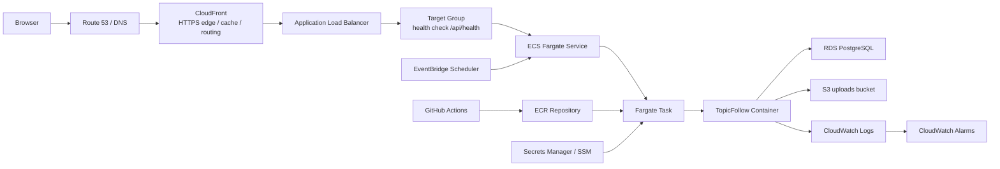

# 项目 10：TopicFollow Hetzner -> AWS 现代生产架构迁移

目标：从 2026-05-04 开始，真正把当前运行在 Hetzner 的 TopicFollow production 迁移到 AWS。这个项目不是学习演示，不是 staging 练习，不是低改造搬家，而是一次真实生产迁移：直接迁到完整、现代、可运维的 AWS 架构。

本项目要迁移的不是“代码样例”，而是完整网站：

```text
Hetzner production
  -> 应用代码和运行方式
  -> PostgreSQL 生产数据库
  -> /var/lib/topicfollow/uploads 生产文件
  -> Nginx / systemd / cron / backup
  -> 域名 / HTTPS / OAuth / Resend / webhook
  -> AWS modern production
```

## 当前决策

- 项目 8 不作为单独前置课，但 Docker、ECR、ECS Fargate、ALB 会直接进入项目 10 实战。
- 项目 9 不作为单独前置课，但 CI/CD、监控、secret、成本治理会直接进入项目 10 实战。
- 项目 10 不走低改造 EC2 + Nginx 生产路线。
- 项目 10 的 AWS 目标是现代生产架构：容器化、托管运行、托管数据库、对象存储、secret 管理、日志告警、可回滚发布。
- 明天的核心目标是把 Hetzner 网站内容迁到这套 AWS modern production candidate，并在验证通过后再决定正式切 DNS。

## 目标现代生产架构

默认目标链路：

```text
Browser
  -> Route 53 / DNS
  -> CloudFront
  -> ALB
  -> ECS Fargate Service
  -> Fargate Task
  -> TopicFollow Container
  -> RDS PostgreSQL
  -> S3 uploads
```

配套能力：

```text
GitHub Actions
  -> test / lint / build
  -> docker build
  -> push image to ECR
  -> update ECS service
  -> CloudWatch Logs / Alarms

Secrets Manager / SSM
  -> DATABASE_URL / AUTH_SECRET / OAuth / Resend secrets

EventBridge Scheduler
  -> digest / purge / topic orchestrator / scheduled jobs
```

现代架构图：



## 现代架构组件职责

| 组件 | 职责 |
| --- | --- |
| Route 53 / DNS | 正式域名切流入口，保留旧记录和回滚记录 |
| ACM | 给 CloudFront / ALB 提供 HTTPS 证书 |
| CloudFront | 统一公网 HTTPS 入口，可缓存静态资源和图片，后续可接 WAF |
| ALB | 把 HTTP/HTTPS 请求转发到健康的 ECS task |
| Target group | 保存 ECS task 目标和 `/api/health` 健康检查规则 |
| ECS Fargate Service | 保持指定数量的 TopicFollow task 长期运行，支持滚动发布和回滚 |
| Fargate Task | 真正运行 TopicFollow container 的实例 |
| ECR | 保存 TopicFollow Docker image |
| RDS PostgreSQL | 承接 Hetzner production PostgreSQL 数据 |
| S3 uploads bucket | 承接 `/var/lib/topicfollow/uploads` 生产文件 |
| Secrets Manager / SSM | 保存 production secret，不写进 image、仓库或笔记 |
| CloudWatch Logs | 收集 container 日志、部署排错 |
| CloudWatch Alarms | 应用健康、5xx、task 重启、RDS 指标异常告警 |
| EventBridge Scheduler | 替代或承接 Hetzner cron/job |
| GitHub Actions | 构建、测试、推送 image、更新 ECS service |

## 网络目标

目标网络不是单台 EC2，而是分层 VPC：

```text
Public subnets
  -> ALB

Private subnets
  -> ECS Fargate tasks
  -> RDS PostgreSQL

S3 / ECR / CloudWatch / Secrets
  -> 通过 IAM role、VPC endpoint 或 NAT 出网访问
```

需要明天做的网络决策：

| 决策 | 说明 |
| --- | --- |
| ECS task 是否放 private subnet | 现代生产默认 private subnet |
| 是否使用 NAT Gateway | task 需要访问外部 API，例如 Google OAuth、Resend、GitHub 等，通常需要出网能力 |
| 是否补 VPC endpoints | ECR、S3、CloudWatch Logs、Secrets Manager 可用 endpoint 降低公网依赖，但配置更多 |
| RDS 是否 public | production 默认不 public，只允许 ECS security group 访问 |
| ALB 是否唯一公网入口 | 是；ECS task 和 RDS 不直接暴露公网 |

## 迁移对象清单

| 对象 | 从哪里来 | 到哪里去 | 说明 |
| --- | --- | --- | --- |
| 应用代码 | Hetzner 当前 TopicFollow repo | Docker image -> ECR -> ECS Fargate | 不在 AWS 上手动长期跑 Node 进程 |
| 生产数据库 | Hetzner PostgreSQL | AWS RDS PostgreSQL | 最终 cutover 前必须重新导出最新备份 |
| uploads 文件 | `/var/lib/topicfollow/uploads` | S3 production bucket | 包括 topic hero images、avatars、feedback attachments |
| 环境变量 | Hetzner `.env.production` | ECS task env + Secrets Manager/SSM | 记录变量名，不写 secret 明文 |
| Web server | Hetzner Nginx | CloudFront + ALB | Nginx 不再是 AWS production 主入口 |
| 进程管理 | Hetzner systemd | ECS service | service 负责保持 task 存活和滚动更新 |
| 后台任务 | cron / scripts / API cron | EventBridge Scheduler / ECS scheduled task / HTTP schedule | 防止 Hetzner 与 AWS 双跑 |
| 域名 | 当前 DNS | Route 53 或现有 DNS 指向 CloudFront/ALB | 切流前降低 TTL，保留回滚记录 |
| HTTPS | 当前证书方案 | ACM certificate | CloudFront 证书通常在 `us-east-1`，ALB 证书在目标 region |
| OAuth | Google/GitHub callback | 新 AWS production URL | callback 必须提前加入 provider console |
| Email | Resend sender / webhook | AWS production app | 切流前验证发送、回调和 inbound/webhook |
| 监控备份 | Hetzner 当前方案 | CloudWatch + RDS backup + external monitor | 迁移后不能失去备份和故障发现能力 |

## 明天第一目标

2026-05-04 先完成这些事：

1. 确认当前 Hetzner production 的真实状态。
2. 确认现代 AWS production 目标架构和 region。
3. 写出当日迁移 Runbook，不靠临场记忆操作。
4. 为 TopicFollow 准备 production Docker image。
5. 创建 ECR repository 并推送 image。
6. 创建 RDS production candidate 并导入最新数据库备份。
7. 创建 S3 production bucket 并同步 uploads。
8. 创建 ECS Fargate service、ALB、CloudWatch Logs、IAM roles、Secrets。
9. 在不切正式 DNS 的情况下，通过 ALB/CloudFront 完整验证。
10. 只有验证通过，才进入正式 DNS 切流讨论。

今天已经明确：明天不是“继续学习项目 8/9”，也不是“EC2 低改造上线”，而是直接迁移真实 TopicFollow 到现代 AWS production candidate。

## 明天开工入口

从这里开始，不从课程顺序开始：

```text
1. 连接 Hetzner production
2. 盘点当前运行状态
3. 生成最新数据库备份
4. 盘点 uploads
5. 准备 Dockerfile / image / ECR
6. 准备 RDS / S3 / Secrets / IAM
7. 创建 ECS Fargate service + ALB
8. 部署 TopicFollow container
9. 验证
10. 决定是否切 DNS
```

## 阶段 1：Hetzner 生产盘点

只记录必要事实，不把 secret 明文写进笔记。

| 检查项 | 要确认什么 |
| --- | --- |
| 当前域名 | production 域名、www/non-www、DNS provider |
| 应用目录 | TopicFollow repo 路径、branch、commit |
| Node 版本 | 当前 Node.js 版本，用来确定 Docker image runtime |
| 包管理器 | npm / pnpm / yarn，lockfile 类型 |
| build 命令 | 当前生产部署使用的 build/start 命令 |
| systemd | service 名称、工作目录、环境变量来源、restart 策略；仅作为迁移参考 |
| Nginx | server_name、proxy_pass 端口、HTTPS 配置；迁到 AWS 后由 CloudFront/ALB 替代 |
| PostgreSQL | 版本、数据库名、用户、连接方式、备份方式 |
| uploads | 路径、文件数量、总大小、最新修改时间 |
| cron/job | digest、deleted account purge、topic orchestrator、backup、monitor |
| 邮件 | Resend sender、webhook、inbound route、测试方法 |
| OAuth | Google/GitHub callback URL |
| 监控 | 当前 UptimeRobot、Telegram monitor、备份检查 |
| 回滚路径 | Hetzner 保留多久、如何恢复写入 |

## 阶段 2：AWS Modern Production Candidate

先建立可以承接生产流量的现代 AWS 环境：

| 组件 | 目标 |
| --- | --- |
| ECR | 保存 TopicFollow production image |
| ECS cluster | 运行 TopicFollow service 的逻辑空间 |
| ECS task definition | 定义 image、CPU、内存、端口、env、secret、logs、roles |
| ECS Fargate service | 保持 production task 运行，支持滚动发布 |
| ALB + target group | 暴露 HTTP/HTTPS 入口，健康检查 `/api/health` |
| CloudFront | 正式公网入口，后续可缓存静态资源和 uploads |
| RDS PostgreSQL | 承接 production 数据库 |
| S3 uploads bucket | 承接 production uploads |
| IAM roles | task execution role 拉 ECR/写日志；task role 访问 S3/Secrets |
| Secrets Manager / SSM | 保存 production secret |
| CloudWatch Logs | 保存 container 日志 |
| CloudWatch Alarms | 至少覆盖健康、5xx、task 重启、RDS 异常 |
| EventBridge Scheduler | 承接生产定时任务 |

最低现代生产链路：

```text
CloudFront
  -> ALB
  -> ECS Fargate service
  -> TopicFollow container
  -> RDS DATABASE_URL
  -> S3 uploads backend
```

## 阶段 3：Docker Image / ECR / ECS

AWS production 不手动 SSH 到服务器长期运行 `npm start`，而是运行 Docker image。

构建链路：

```text
TopicFollow repo
  -> Dockerfile
  -> docker build
  -> TopicFollow production image
  -> docker push
  -> ECR repository
  -> ECS task definition
  -> ECS service deployment
```

必须确认：

| 检查 | 说明 |
| --- | --- |
| `.dockerignore` | 不把 `.env.production`、`node_modules`、`.next`、git 垃圾打进 image |
| build 命令 | image 内可完成 production build |
| start 命令 | container 能监听预期端口，例如 `3000` |
| env 注入 | runtime env 来自 ECS task definition / Secrets，不写进 image |
| health check | `/api/health` 可被 ALB target group 检查 |
| logs | stdout/stderr 进入 CloudWatch Logs |

## 阶段 4：数据库迁移

数据库是最高风险对象，不能用旧备份冒充最终数据。

流程：

```text
Hetzner PostgreSQL
  -> 生成最新 dump
  -> 校验 dump 文件大小和时间
  -> 导入 RDS
  -> 跑 migrations
  -> 验证关键表数量和抽样数据
```

必须验证：

| 验证项 | 说明 |
| --- | --- |
| dump 时间 | 必须是迁移当天或冻结窗口内生成 |
| 导入结果 | RDS 中无明显错误 |
| migrations | 当前代码所需 migrations 已执行 |
| 用户数据 | 抽样用户、session/auth 相关表正常 |
| topic 数据 | topic、source、article、digest 等关键表数量合理 |
| 图片引用 | `topics.hero_image` 等 `/uploads/...` 路径仍可用 |

切流前最终动作：

```text
冻结 Hetzner 写入
  -> 重新导出最终 dump
  -> 导入/覆盖 AWS RDS production
  -> 验证
```

## 阶段 5：Uploads 迁移

uploads 是网站内容的一部分，不是可选项。

当前已知生产路径：

```text
/var/lib/topicfollow/uploads
```

迁移目标：

```text
s3://<production-bucket>/uploads/
```

可选访问方式：

| 方式 | 说明 |
| --- | --- |
| Next.js compatibility route | `/uploads/...` 请求进入 app，再由 app 读 S3；迁移风险较低 |
| CloudFront + S3 origin | `/uploads/*` 直接由 CloudFront 读私有 S3；更现代，但 routing/OAC 配置更多 |

验证方式：

| 验证项 | 说明 |
| --- | --- |
| 文件数量 | Hetzner 本地数量与 S3 object 数量一致或差异有解释 |
| 总大小 | Hetzner 本地大小与 S3 总大小接近 |
| topic hero | 抽样多个 topic hero image |
| avatars | 如果存在 avatar 文件，抽样验证 |
| feedback attachments | 如果存在附件，抽样验证 |
| 新上传 | AWS 环境中新上传能写入 S3 |
| 旧 URL | `/uploads/...` 旧路径仍能访问 |

切流前必须做最后一次增量同步：

```text
冻结写入后
  -> rsync / aws s3 sync 最后一次 uploads
  -> 再验证数量和抽样图片
```

## 阶段 6：Secret 和环境变量

环境变量重点：

| 类型 | 示例 |
| --- | --- |
| URL | `APP_URL`, `NEXT_PUBLIC_APP_URL`, `COOKIE_DOMAIN` |
| Database | `DATABASE_URL` |
| Auth | `AUTH_SECRET`, OAuth client id/secret |
| Uploads | `UPLOADS_STORAGE_BACKEND=s3`, `UPLOADS_S3_BUCKET`, `UPLOADS_S3_REGION`, `UPLOADS_S3_PREFIX` |
| Email | `RESEND_API_KEY`, `RESEND_WEBHOOK_SECRET` |
| Admin | `CONTENT_ADMIN_EMAILS` |

原则：

- 不在笔记里保存 secret 明文。
- 不提交 `.env.production`。
- 不把 secret 打进 Docker image。
- production secret 进入 Secrets Manager 或 SSM，再由 ECS task 注入。
- S3 权限靠 ECS task role，不用长期 access key。

## 阶段 7：定时任务迁移

Hetzner cron/job 不能在切流后继续写 production，同时 AWS 也不能漏跑关键任务。

| 当前任务 | AWS 目标 |
| --- | --- |
| digest 邮件 | EventBridge Scheduler 调用 HTTP endpoint，或 ECS scheduled task |
| deleted account purge | EventBridge Scheduler / ECS scheduled task |
| topic orchestrator | ECS scheduled task 或保留外部 orchestrator，但只指向 AWS production |
| 数据库备份 | RDS automated backup + snapshot 策略 |
| 监控日报 | CloudWatch / 外部监控 / Telegram monitor 新目标 |

切流前必须确认：

```text
Hetzner cron 已暂停或只读
AWS scheduled jobs 已配置或明确暂时关闭
不会出现 Hetzner 和 AWS 双跑
```

## 阶段 8：切流前验证

不切正式 DNS 前，用 ALB DNS、CloudFront domain、临时域名或 hosts override 测试 AWS 环境。

必须通过：

- `/api/health` 正常。
- ALB target group health check healthy。
- ECS service desired/running task 数量正确。
- CloudWatch Logs 能看到应用日志。
- 首页正常。
- topic 页面正常。
- 搜索正常。
- 登录正常。
- Google/GitHub OAuth callback 正常。
- 账号页正常。
- 图片和 uploads 正常显示。
- 新上传能写入 S3。
- 密码重置邮件正常。
- 账号验证邮件正常。
- Resend webhook 指向 AWS production。
- cron/job 不会在 AWS 和 Hetzner 双跑。
- RDS 数据关键表数量正确。

没有全部通过，不切 DNS。

## 阶段 9：DNS 切流

切流前：

1. 降低 DNS TTL。
2. 记录旧 DNS 记录。
3. 准备新 DNS 记录。
4. 准备回滚 DNS 记录。
5. 停止或冻结 Hetzner 写入。
6. 做最终数据库 dump。
7. 做最后一次 uploads 增量同步。
8. AWS modern production candidate 最终验证通过。

切流顺序：

```text
冻结 Hetzner 写入
  -> 最终 DB dump
  -> 导入 AWS RDS
  -> 最后一次 uploads sync
  -> ECS/ALB/CloudFront 最终验证
  -> DNS 指向 AWS
  -> 观察日志 / 登录 / 图片 / 邮件 / task health
```

切流后：

- Hetzner 暂时保留，不立即删除。
- Hetzner 应保持只读或暂停写入。
- 观察 ECS service、ALB、CloudFront、RDS、S3、Resend、OAuth。
- 记录所有异常和修复。

## 回滚原则

回滚不是简单把 DNS 改回去。只要 AWS 已经产生新写入，就会出现数据分叉。

回滚前先判断：

| 情况 | 处理 |
| --- | --- |
| AWS 尚无新写入 | 可以较快 DNS 回滚到 Hetzner |
| AWS 已有新用户/新内容/新上传 | 必须决定丢弃 AWS 新写入，或补同步回 Hetzner |
| 邮件/webhook 已切到 AWS | 回滚时也要恢复 provider 配置 |
| uploads 已在 AWS 新增 | 回滚时要同步新增 uploads 或接受丢失 |

回滚记录必须包含：

```text
DNS 回滚值
Hetzner 服务恢复步骤
数据库处理方式
uploads 处理方式
OAuth / Resend / webhook 恢复方式
预计数据损失说明
```

## 成功标准

项目 10 完成的定义：

- 正式域名访问 AWS 现代生产版本 TopicFollow。
- 应用运行在 ECS Fargate，而不是手动维护的 EC2 Node 进程。
- Docker image 存在 ECR，ECS service 可滚动更新和回滚。
- 数据库已经从 Hetzner 迁到 RDS。
- uploads 已经从 Hetzner 迁到 S3。
- 登录、OAuth、topic 页面、搜索、图片、邮件、健康检查正常。
- CloudWatch Logs 可查，至少有关键告警入口。
- 定时任务不会在 Hetzner 和 AWS 双跑。
- 切流后没有 Hetzner 和 AWS 双写。
- Hetzner 保留为短期回滚路径。
- 有明确备份和恢复路径。
- 有明确成本清单和保留/清理决策。

## 明天不做什么

- 不为了补课而暂停迁移。
- 不走 EC2 + Nginx 低改造生产路线。
- 不在没验证前切 DNS。
- 不用过期备份迁生产。
- 不把 secret 明文写进笔记、仓库或 image。
- 不让 Hetzner 和 AWS 同时写 production。

## 明天第一句话

明天打开这份笔记后，直接开始：

```text
现在开始 TopicFollow 真实生产迁移：
目标是现代 AWS production 架构，先连接 Hetzner 盘点当前 production 状态。
```
