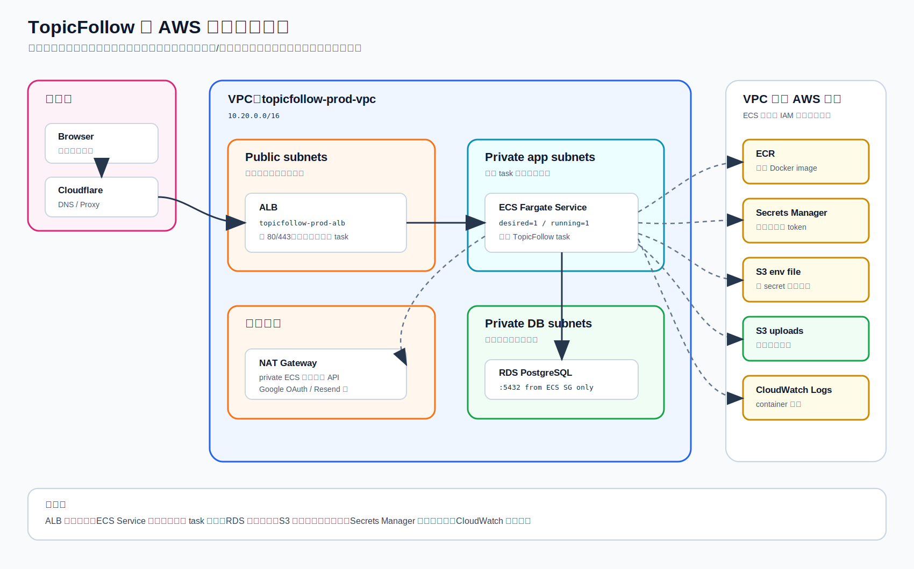
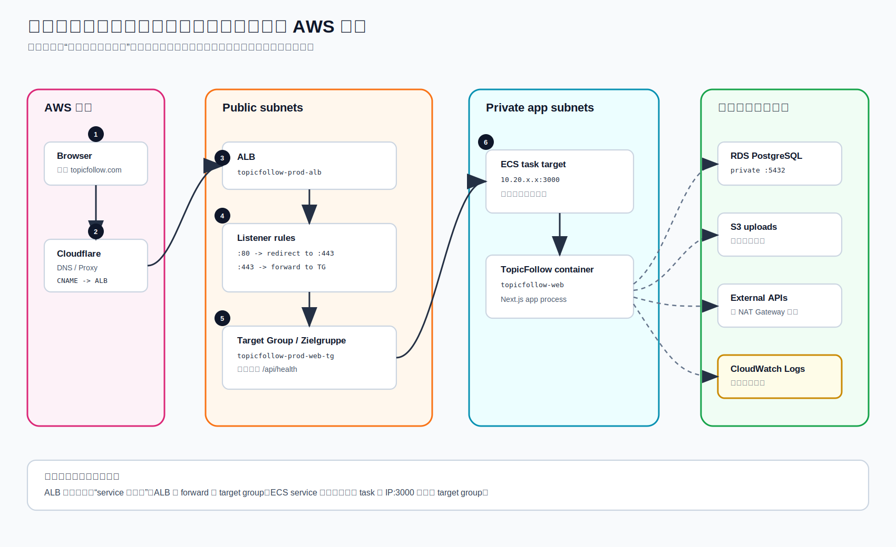
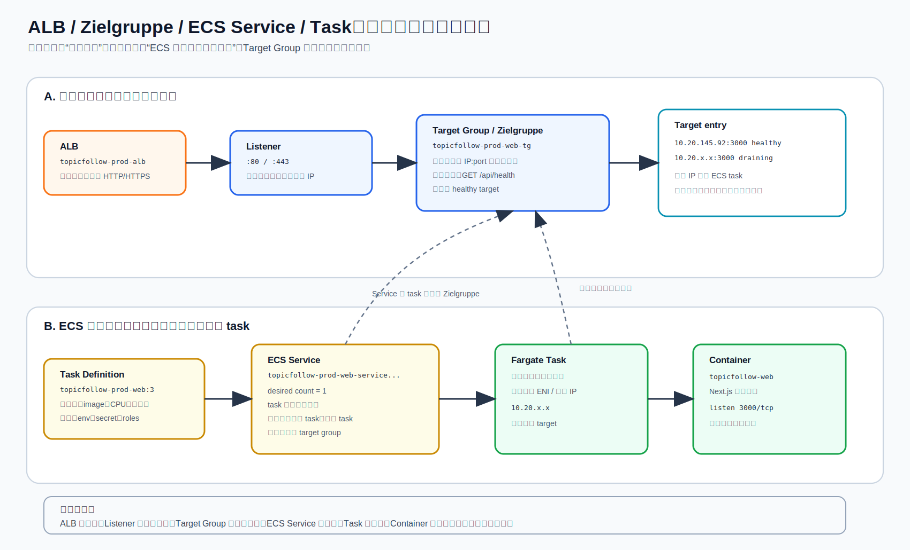
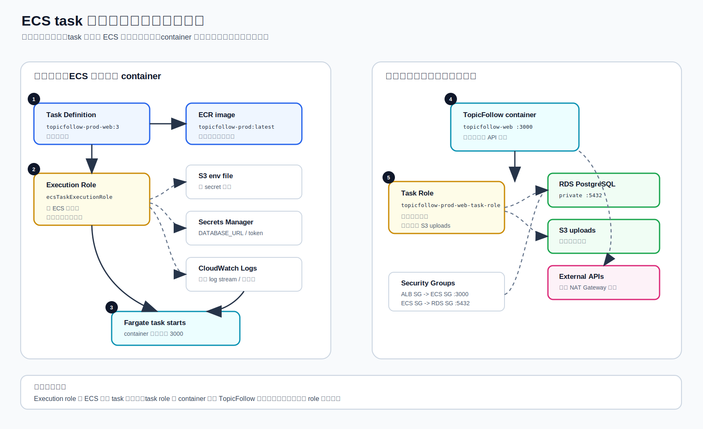
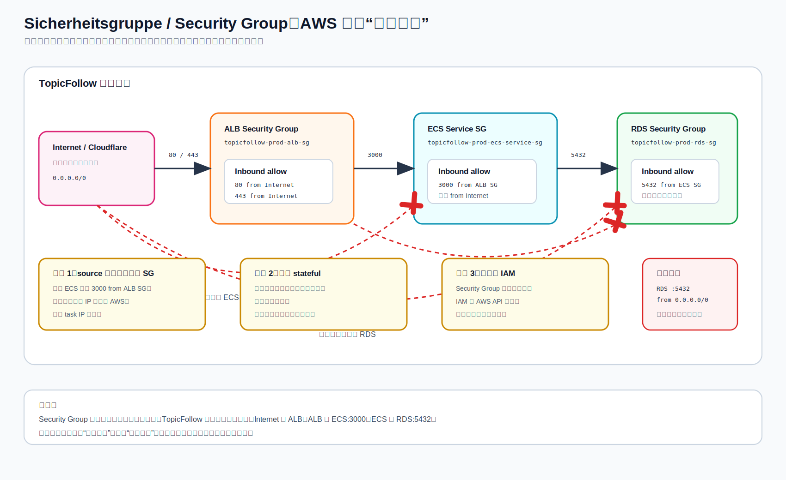

# 项目 10：TopicFollow 从 Hetzner 迁移到 AWS 生产环境

日期：2026-05-04
区域：`eu-central-1`
AWS 账号：`089781651608`
域名：`topicfollow.com`、`www.topicfollow.com`
当前状态：**生产流量已经切到 AWS；Hetzner 上的 TopicFollow 文件、服务、cron、监控、备份已清理，Nginx/PostgreSQL 已停用**

这份笔记是 TopicFollow 真实生产迁移的学习版记录。它不只记录“创建了哪些资源”，而是解释这些资源为什么存在、彼此怎么连接、最终 cutover 到底发生了什么。

secret 明文不写入笔记。

## 先记住一句话

这次迁移不是把 Hetzner 服务器原样复制到 AWS。

真正发生的是：

```text
旧世界：
一台 Hetzner 机器附近同时负责 Nginx、Node 进程、PostgreSQL、uploads、cron。

新世界：
Cloudflare 负责域名入口。
ALB 负责公网 HTTPS 入口。
ECS Fargate 负责长期运行 TopicFollow container。
RDS 负责 PostgreSQL。
S3 负责 uploads 文件。
Secrets Manager / S3 env file 负责运行时配置。
CloudWatch 负责日志。
```

所以你要理解的不是“某一台 AWS 服务器在哪里”，而是 **请求、容器、数据、配置分别交给了哪个 AWS 服务**。

## 五张 AWS 组件核心图

这些是手写 SVG，不是 Mermaid。

### 图 1：AWS 组件地图



这张图先不看迁移历史，只看现在 AWS 上有哪些组件，以及它们各自负责什么：

- Cloudflare 是域名入口。
- ALB 是公网 HTTP/HTTPS 入口。
- ECS Fargate Service 负责维持应用 task。
- RDS 存数据库。
- S3 存 uploads 和非 secret env file。
- ECR 存 Docker image。
- Secrets Manager 存敏感配置。
- CloudWatch 收 container 日志。

### 图 2：用户请求路径



用户打开网站时，真正的运行时请求是：

```text
Browser
  -> Cloudflare DNS / Proxy
  -> ALB
  -> Listener :443
  -> Target Group / Zielgruppe
  -> healthy ECS task IP:3000
  -> TopicFollow container
  -> RDS / S3 / external APIs
```

这里最容易混的是：ALB 不是直接“进入 service”。从请求角度看，ALB 先进入 `Listener`，listener 再 forward 到 `Target Group`，target group 里面登记的是真实 task 的 `IP:port`。

ECS service 的作用是在后台帮你维护 task，并把健康 task 自动注册到 target group。

### 图 3：ALB、Zielgruppe、Service、Task 的关系



AWS 德文控制台里的 `Zielgruppe` 就是英文 `Target Group`。

不要把它理解成“用户群体”或者“目标客户”。在 ALB 语境里，它的意思是：

```text
负载均衡器后面可以被转发请求的一组后端目标。
```

在这个项目里，后端目标是 ECS Fargate task 的私有 IP 和端口：

```text
10.20.145.92:3000
```

这个 IP 不是固定资产。task 重启、部署、替换后，IP 可能变。你真正依赖的是：

```text
ALB listener -> target group -> ECS service 自动注册的健康 task
```

### 图 4：ECS task 启动与运行时配置



这张图讲 ECS task 启动和运行时的配置来源。

最重要的是分清两个 role：

```text
execution role：ECS 平台启动 task 时用。
task role：container 里的 TopicFollow 应用代码运行时用。
```

启动阶段：

```text
ECS execution role
  -> 拉 ECR image
  -> 读取 S3 env file
  -> 读取 Secrets Manager
  -> 写 CloudWatch Logs
```

运行阶段：

```text
TopicFollow container
  -> 用 task role 访问 S3 uploads
  -> 用 DATABASE_URL 访问 RDS
  -> 通过 NAT Gateway 访问外部 API
```

### 图 5：Sicherheitsgruppe / Security Group



AWS 德文控制台里的 `Sicherheitsgruppe` 就是英文 `Security Group`。

它是资源外面的一圈网络门禁，回答的问题是：

```text
谁可以访问这个资源的哪个端口？
```

在这个项目里最重要的三条允许规则是：

| 谁访问 | 访问谁 | 端口 | 为什么 |
| --- | --- | --- | --- |
| Internet / Cloudflare | ALB security group | `80`, `443` | 用户必须能访问网站入口 |
| ALB security group | ECS service security group | `3000` | ALB 要把请求转给 container |
| ECS service security group | RDS security group | `5432` | 应用要连接 PostgreSQL |

反过来，这些事情不允许：

```text
Internet -> ECS task :3000
Internet -> RDS :5432
ALB -> RDS :5432
```

所以 security group 不是 IAM 权限，也不是 subnet。它管的是网络连接和端口。

## 术语对照：这几个词到底在干嘛

| 词 | 在这个项目里的名字 | 你应该怎么理解 |
| --- | --- | --- |
| `ALB` / Load Balancer | `topicfollow-prod-alb` | 公网入口。用户请求先进它。 |
| `Listener` | `80`、`443` | ALB 上的端口规则。`80` redirect，`443` forward。 |
| `Target Group` / `Zielgruppe` | `topicfollow-prod-web-tg` | ALB 后面的健康后端名单。这里登记的是 task 的 `IP:3000`。 |
| `Health check` | `/api/health` | ALB 定期检查 task 是否健康。健康才转发流量。 |
| `ECS Cluster` | `topicfollow-prod-cluster` | ECS 的逻辑空间，不是一台服务器。 |
| `Task Definition` | `topicfollow-prod-web:3` | 容器启动说明书：image、CPU、内存、端口、env、secret、role、logs。 |
| `Task` | Fargate task | 按 task definition 真正启动出来的一份运行实例。 |
| `ECS Service` | `topicfollow-prod-web-service-sesec3gq` | 保持 task 长期运行。挂了补一个，部署时替换，自动接 target group。 |
| `Fargate` | launch type | AWS 帮你托管底层机器，你不 SSH 到 EC2 管系统。 |
| `Container` | `topicfollow-web` | 真正运行 TopicFollow Next.js app 的进程环境。 |
| `Task execution role` | `ecsTaskExecutionRole` | 给 ECS 平台用：拉 ECR image、读 env/secrets、写 logs。 |
| `Task role` | `topicfollow-prod-web-task-role` | 给应用代码用：TopicFollow container 访问 S3 uploads。 |
| `Security Group` | ALB SG / ECS SG / RDS SG | AWS 防火墙。控制谁能访问谁的哪个端口。 |
| `NAT Gateway` | `nat-183c9d47d6d5eccc6` | private subnet 里的 ECS task 访问外部 API 的出口。 |
| `S3 Gateway Endpoint` | `vpce-0801c44055d2246e8` | ECS 访问 S3 时走 AWS 内部路径。 |

## 三条线分开想

### 线 1：用户流量线

这是用户打开网页时发生的事情：

```text
topicfollow.com
  -> Cloudflare
  -> ALB HTTPS listener :443
  -> target group topicfollow-prod-web-tg
  -> healthy ECS task 10.20.x.x:3000
  -> Next.js container
  -> RDS / S3
```

这条线里，最核心的问题是：

```text
公网请求能不能安全、稳定地转到健康的 container？
```

答案靠这几个东西一起完成：

- Cloudflare DNS 指到 ALB。
- ALB 接公网 HTTP/HTTPS。
- Listener 决定 redirect 或 forward。
- Target group 保存健康 task。
- Security group 只允许 ALB 访问 ECS `3000`。
- ECS task 再访问 RDS `5432` 和 S3。

### 线 2：容器运行线

这是 AWS 怎样把 TopicFollow 跑起来：

```text
Dockerfile
  -> build image
  -> push to ECR
  -> task definition 引用 image
  -> ECS service 根据 task definition 启动 task
  -> Fargate 提供底层计算资源
  -> container 监听 3000
```

这里要分清：

```text
Task definition 是说明书。
Task 是按说明书启动出来的那一份运行实例。
Service 是保持 task 活着的控制器。
Fargate 是 AWS 提供的底层运行平台。
```

所以 service 不是应用本身。task 才是应用正在运行的那一份。

### 线 3：网站代码自动部署线


现在网站代码从本地更新到生产，不再手动 SSH，也不需要在本机直连 AWS 生产机器。流程是：

```text
本地 Mac
  -> git commit
  -> git push main
  -> GitHub Actions 自动启动 Deploy production
  -> 用 OIDC 临时 assume AWS deploy role
  -> npm ci / lint / Next.js build
  -> 读取当前 ECS service 的 runtime platform
  -> QEMU + Docker Buildx 构建匹配架构的 image
  -> push 到 ECR: topicfollow-prod:web-<commit>
  -> 用当前正在跑的 service task definition 作为模板
  -> 注册新的 task definition revision，只替换 image
  -> update ECS service
  -> ECS rolling update，等待 service stable
  -> smoke test /api/health 和首页
```

这里最关键的理解是：

```text
git push 不等于网站代码自己变了。
git push 只是触发 GitHub Actions。
真正让网站变新的是：新 image -> 新 task definition revision -> ECS service rolling update。
```

为什么 workflow 要读取 ECS runtime platform：

```text
TopicFollow ECS task 是 ARM64。
如果 GitHub Actions 只构建 linux/amd64 image，
ECS Fargate 会拉不到匹配平台的 image。
```

所以 workflow 里有两步很重要：

| 步骤 | 作用 |
| --- | --- |
| `Resolve ECS runtime platform` | 看当前 ECS service 到底需要 `ARM64` 还是 `X86_64` |
| `Set up QEMU` + `Docker Buildx` | 在 GitHub runner 上构建匹配 ECS 的 Docker image |

自动部署只管网站代码，不管生产数据写入：

| 事情 | 是否跟随 `git push` 自动执行 | 正确方式 |
| --- | --- | --- |
| 网站代码上线 | 是 | GitHub Actions -> ECR -> ECS service |
| 新 topic 写入 RDS | 否 | ECS one-off `write-plan` helper |
| hero 图片上传和写 `topics.hero_image` | 否 | ECS hero image helper |

这样设计的原因是安全边界清楚：

```text
普通代码部署可以自动化。
生产数据写入必须显式执行。
```

### 线 4：新 topic 写入数据库线


现在有了新的 topic，经过 subagent 阶段后，不会由 subagent 直接写生产库。真正链路是：

```text
本地 Mac
  -> run topic pipeline
  -> collector / cleaner / summarizer / structure / aggregation
  -> 每个阶段只写 tmp/topicfollow-*.json
  -> 最终形成 tmp/topicfollow-aggregation_<topic>.json
  -> run-ecs-write-plan.sh 上传 aggregation 到 S3
  -> ECS one-off task 运行 write-plan
  -> write-plan 读取 S3 aggregation JSON
  -> applyTopicIngestionPlan()
  -> 写入 AWS RDS PostgreSQL
  -> 网站页面和搜索从 RDS 读到新 topic
```

最重要的边界：

```text
subagent 阶段 = 产出 JSON
write-plan 阶段 = 写数据库
```

为什么要这样做：

- Mac 本地不放生产 `DATABASE_URL`。
- 生产 RDS 在 private subnet，不应该被本机直接连接。
- ECS one-off task 在 AWS 网络里，有 task role 和正确的生产环境变量。
- 写库动作显式、可审计、能看 CloudWatch logs。

写库确认时至少看这些：

| 检查 | 意义 |
| --- | --- |
| ECS task exit code `0` | 写库命令成功退出 |
| CloudWatch `write-plan` JSON | 能看到 upsert/insert/link 数量 |
| `topic id` / `topic slug` | writer 确认 seed topic |
| topic page HTTP `200` | 网站能从 RDS 读到 topic |
| search 页面能查到 | search dataset 读 DB 成功 |

`applyTopicIngestionPlan()` 会负责写这些表：

```text
topics
articles
sources
topic_events
event_signals
article_topics
topic_search_state
topic_research_state
```

这也回答了一个核心问题：

```text
新 topic 经过 subagent 后，仍然会像原来一样写入数据库。
但写库位置从“本地/旧服务器直接 DATABASE_URL”变成了“AWS ECS one-off write-plan”。
```

### 线 5：hero 图片上传和更新数据库线


hero 图片和 topic 文本不完全一样。它有两个必须同步的部分：

```text
图片文件本体 -> S3
图片引用路径 -> RDS topics.hero_image
```

现在生产 hero 图片流程是：

```text
本地生成或选择图片
  -> bash scripts/run-ecs-topic-hero-image.sh "<topic>" "<local-image-path>"
  -> helper 把源图上传到 S3 staging
  -> ECS one-off task 读取 staging 源图
  -> 压缩和标准化为 WebP
  -> 写入正式 S3 object
  -> 更新 RDS topics.hero_image 和 metadata
  -> 网站 topic 页面 / OG image 使用新路径
  -> helper 删除 staging 源图
```

最终公开路径固定为：

```text
/uploads/topics/topic-<topic-slug>/hero.webp
```

对应的 S3 key 是：

```text
uploads/topics/topic-<topic-slug>/hero.webp
```

数据库里保存的是公开路径，不是 `s3://...`：

```text
topics.hero_image = /uploads/topics/topic-<topic-slug>/hero.webp
```

metadata 一起更新：

| 字段 | 当前生成图语义 |
| --- | --- |
| `hero_image_source` | `generated` |
| `hero_image_origin_url` | `null` |
| `hero_image_download_url` | 同最终 `/uploads/topics/.../hero.webp` 路径 |
| `hero_image_license` | `null` |
| `hero_image_author` | `null` |
| `hero_image_attribution` | `null` |
| `hero_image_downloaded_at` | 当前时间 |

最容易出错的两种半完成状态：

| 状态 | 结果 |
| --- | --- |
| 只上传 S3，没有更新 RDS | 网站不知道应该显示这张图 |
| 只更新 RDS，没有上传 S3 | 网站引用一个不存在的图片 URL |

所以现在正确的心智模型是：

```text
hero 图片上线 = S3 final object + RDS hero_image path + metadata
```

### 线 6：数据和配置线

应用启动和运行时还需要数据与配置：

```text
启动时：
ECS execution role
  -> 拉 ECR image
  -> 读取 S3 env file
  -> 读取 Secrets Manager secret
  -> 写 CloudWatch Logs

运行时：
TopicFollow container
  -> 用 task role 访问 S3 uploads
  -> 用 DATABASE_URL 访问 RDS
  -> 通过 NAT Gateway 访问外部 API
```

这里也要分清两个 role：

```text
execution role 给 ECS 平台用。
task role 给你的应用代码用。
```

如果 TopicFollow 代码要读写 S3，它用的是 task role。
如果 ECS 启动容器时要拉 image、读 secret、写日志，它用的是 execution role。

## 原 Hetzner 生产是什么样

| 项目 | 值 |
| --- | --- |
| 主机 | `ubuntu-4gb-nbg1-1` |
| SSH 用户 | `xzhu` |
| 应用路径 | `/opt/topicfollow/app` |
| Git remote | `git@github.com:gcxzer/topicfollow.git` |
| 分支 | `main` |
| Node | `v22.22.2` |
| npm | `10.9.7` |
| systemd service | `topicfollow.service` |
| 环境变量文件 | `/opt/topicfollow/app/.env.production` |
| 旧启动方式 | `npm run start -- --hostname 127.0.0.1 --port 3000` |
| 旧 Web 入口 | Nginx |
| 旧数据库 | Hetzner 本机 PostgreSQL `16.13` |
| 旧 uploads 路径 | `/var/lib/topicfollow/uploads` |

旧架构的特点是集中：

```text
Nginx、Node、PostgreSQL、uploads、cron 都离 Hetzner 主机很近。
```

优点是直观。缺点是生产能力都压在一套机器和手工运维方式上。

## 新 AWS 生产是什么样

最终生产流量已经是：

```text
Cloudflare
  -> ALB
  -> Target Group
  -> ECS Fargate Task
  -> RDS PostgreSQL
  -> S3 uploads bucket
```

公网只应该到 ALB。ECS task 和 RDS 都不直接暴露公网。

## AWS 资源清单

### 基础信息

| 项目 | 值 |
| --- | --- |
| AWS CLI profile | `aws-learning` |
| Region | `eu-central-1` |
| Account | `089781651608` |
| AWS Application | `topicfollow-production` |

### VPC / 网络

| 资源 | 值 |
| --- | --- |
| VPC | `vpc-048908daa27b5c4d7` / `topicfollow-prod-vpc` |
| CIDR | `10.20.0.0/16` |
| Public subnet 1 | `subnet-08392008ee9644ddf` / `10.20.0.0/20` / `eu-central-1a` |
| Public subnet 2 | `subnet-0a89d41273a0c9675` / `10.20.16.0/20` / `eu-central-1b` |
| Private app subnet 1 | `subnet-01e0153728068627f` / `10.20.128.0/20` / `eu-central-1a` |
| Private app subnet 2 | `subnet-0023bb67b13179a12` / `10.20.144.0/20` / `eu-central-1b` |
| Private DB subnet 1 | `subnet-096482bb9a355e2fb` / `10.20.160.0/20` / `eu-central-1a` |
| Private DB subnet 2 | `subnet-06b6393c114f8d676` / `10.20.176.0/20` / `eu-central-1b` |
| NAT Gateway | `nat-183c9d47d6d5eccc6` |
| S3 Gateway Endpoint | `vpce-0801c44055d2246e8` |

记忆方式：

```text
ALB 是用户进来的门。
NAT Gateway 是 ECS 出去访问外部 API 的门。
S3 Gateway Endpoint 是 ECS 访问 S3 的 AWS 内部路。
```

### 安全组

| 来源 | 目标 | 端口 | 意义 |
| --- | --- | --- | --- |
| Internet | ALB SG | `80`, `443` | 只有 ALB 对公网开放 |
| ALB SG | ECS service SG | `3000` | ALB 可以访问 TopicFollow container |
| ECS service SG | RDS SG | `5432` | 应用可以访问 PostgreSQL |

这就是三道门：

```text
公网 -> ALB
ALB -> ECS task
ECS task -> RDS
```

公网不能直接访问 ECS task，也不能直接访问 RDS。

### S3

| 项目 | 值 |
| --- | --- |
| Bucket | `topicfollow-prod-uploads-089781651608-eu-central-1-an` |
| uploads prefix | `uploads/` |
| ECS env prefix | `ecs-env/` |
| Public access | 全部阻止 |
| Object ownership | `BucketOwnerEnforced`，ACL 禁用 |
| 默认加密 | SSE-S3 / `AES256` |
| 最终对象数量 | `73` 个非空对象 |
| 最终对象总大小 | `8420936` bytes |

S3 在这个项目里有两个用途：

| 用途 | 路径 | 谁用 |
| --- | --- | --- |
| 用户上传文件 | `uploads/` | TopicFollow 应用运行时读写 |
| ECS 非 secret env file | `ecs-env/topicfollow-prod-web.env` | ECS 启动 task 时读取 |

非 secret 环境变量文件：

```text
s3://topicfollow-prod-uploads-089781651608-eu-central-1-an/ecs-env/topicfollow-prod-web.env
```

内容只包含非 secret 配置：

```text
NODE_ENV=production
NEXT_PUBLIC_APP_URL=https://topicfollow.com
APP_URL=https://topicfollow.com
UPLOADS_STORAGE_BACKEND=s3
UPLOADS_S3_BUCKET=topicfollow-prod-uploads-089781651608-eu-central-1-an
UPLOADS_S3_REGION=eu-central-1
UPLOADS_S3_PREFIX=uploads
AWS_REGION=eu-central-1
```

### RDS PostgreSQL

| 项目 | 值 |
| --- | --- |
| DB instance | `topicfollow-prod-postgres` |
| Engine | PostgreSQL `16.13` |
| Endpoint | `topicfollow-prod-postgres.c5q4g40462w8.eu-central-1.rds.amazonaws.com:5432` |
| DB subnet group | `topicfollow-prod-db-subnet-group` |
| Public access | `false` |
| Storage | `20 GiB` `gp3` |
| Backup retention | `7` days |
| Deletion protection | enabled |
| RDS security group | `sg-0cb247a8aeb04623a` / `topicfollow-prod-rds-sg` |
| RDS master secret | RDS 自动管理的 Secrets Manager secret |

最终导入后的核心表计数：

| 表 | 数量 |
| --- | --- |
| `topics` | `79` |
| `articles` | `2066` |
| `sources` | `877` |
| `users` | `1` |

健康接口显示的内容计数：

| 指标 | 数量 |
| --- | --- |
| topicCount | `79` |
| articleCount | `2078` |
| sourceCount | `877` |

直接表计数和健康接口 `articleCount` 不完全相同，是应用健康接口统计口径与直接表查询口径不同导致，健康接口验证通过。

### ECR / Docker

| 项目 | 值 |
| --- | --- |
| ECR repository | `089781651608.dkr.ecr.eu-central-1.amazonaws.com/topicfollow-prod` |
| Image tag | `latest` |
| Image size | 约 `194 MB` |
| 本地构建名 | `topicfollow-prod:latest` |

迁移中新增了：

```text
Dockerfile
.dockerignore
```

踩坑记录：

第一次 ECS task definition 使用 `Linux/X86_64`，但本地 Docker Desktop 推上去的 image 是 ARM64 manifest，因此启动失败。后来改成 `Linux/ARM64` 后服务正常。

这件事的本质是：

```text
ECS task definition 声明的 CPU 架构
必须和 ECR image manifest 里的架构匹配。
```

### ECS

| 项目 | 值 |
| --- | --- |
| Cluster | `topicfollow-prod-cluster` |
| Service | `topicfollow-prod-web-service-sesec3gq` |
| Task definition | `topicfollow-prod-web:3` |
| Launch type | Fargate |
| OS / Architecture | `Linux/ARM64` |
| Network mode | `awsvpc` |
| Task CPU | `1024` / 1 vCPU |
| Task memory | `3072` MiB / 3 GB |
| Container | `topicfollow-web` |
| Container port | `3000/tcp` |
| CloudWatch log group | `/topicfollow/prod/web` |
| Log stream prefix | `ecs` |

Task definition 版本记录：

| Revision | 结果 |
| --- | --- |
| `topicfollow-prod-web:1` | X86_64，与 image 架构不匹配，已 deregister |
| `topicfollow-prod-web:2` | ARM64，服务可运行 |
| `topicfollow-prod-web:3` | ARM64，补齐生产 runtime secrets，当前使用 |

### IAM / Secrets

| 角色 | 用途 |
| --- | --- |
| `ecsTaskExecutionRole` | ECS/Fargate 用来拉 ECR image、读取 S3 env file、读取 Secrets Manager、写 CloudWatch Logs |
| `topicfollow-prod-web-task-role` | 应用容器自身使用，访问 S3 uploads |

应用 runtime secret：

```text
arn:aws:secretsmanager:eu-central-1:089781651608:secret:/topicfollow/prod/web-5ETCL7
```

注入到 ECS 的 secret key：

```text
DATABASE_URL
AUTH_SECRET
CONTENT_ADMIN_EMAILS
CRON_SECRET
GOOGLE_CLIENT_ID
GOOGLE_CLIENT_SECRET
HELLO_EMAIL
HELLO_EMAIL_NAME
LEGAL_ENTITY_NAME
PRIVACY_EMAIL
RESEND_API_KEY
RESEND_FROM_EMAIL
RESEND_FROM_NAME
RESEND_WEBHOOK_SECRET
SUPPORT_EMAIL
```

secret value 不写进笔记。

### ALB / HTTPS

| 项目 | 值 |
| --- | --- |
| ALB | `topicfollow-prod-alb` |
| ALB DNS | `topicfollow-prod-alb-174366725.eu-central-1.elb.amazonaws.com` |
| ALB security group | `sg-00394479ba2e93c4d` / `topicfollow-prod-alb-sg` |
| ECS service security group | `sg-0ba3af6d70566127f` / `topicfollow-prod-ecs-service-sg` |
| Target group | `topicfollow-prod-web-tg` |
| Target type | `ip` |
| Target port | `3000` |
| Health path | `/api/health` |
| HTTPS certificate | ACM certificate for `topicfollow.com` and `www.topicfollow.com` |

Listener：

| Port | Protocol | 行为 |
| --- | --- | --- |
| `80` | HTTP | redirect 到 HTTPS `443` |
| `443` | HTTPS | forward 到 `topicfollow-prod-web-tg` |

这里的关键细节是 target type：

```text
Target type = ip
```

因为 Fargate task 使用 `awsvpc` 网络模式。每个 task 有自己的 ENI 和私有 IP，所以 target group 里登记的是 IP target，而不是 EC2 instance target。

### ACM / Cloudflare DNS

ACM certificate：

```text
arn:aws:acm:eu-central-1:089781651608:certificate/e5385bd6-aac3-471b-b851-ff838f5afdba
```

证书域名：

```text
topicfollow.com
www.topicfollow.com
```

Cloudflare DNS 最终记录：

| Type | Name | Target | Proxy |
| --- | --- | --- | --- |
| CNAME | `topicfollow.com` | `topicfollow-prod-alb-174366725.eu-central-1.elb.amazonaws.com` | Proxied |
| CNAME | `www` | `topicfollow-prod-alb-174366725.eu-central-1.elb.amazonaws.com` | Proxied |

ACM DNS validation 的两个 CNAME 保持 DNS only，不要删除。邮件相关 MX/TXT 记录也不要动。

## 实际执行过程

### 1. 盘点旧生产

先确认 Hetzner 上到底有什么：

- 应用路径、git remote、分支。
- Node/npm 版本。
- systemd service。
- Nginx 入口。
- `.env.production`。
- PostgreSQL 版本和数据库。
- uploads 路径。
- cron 里有哪些生产写入任务。

这一步的意义是：知道要迁走哪些东西，以及哪些东西切流时必须冻结。

### 2. 创建 S3 uploads bucket

- 创建 bucket：`topicfollow-prod-uploads-089781651608-eu-central-1-an`
- 创建 `uploads/` prefix
- 阻止 public access
- 禁用 ACL
- 启用 SSE-S3 默认加密
- 从 Hetzner `/var/lib/topicfollow/uploads` 同步文件
- 最终冻结后再次同步，S3 中 `73` 个非空对象，总大小 `8420936` bytes

为什么先做 S3：

```text
uploads 文件不是数据库的一部分。
数据库迁过去不等于图片、附件也迁过去。
```

### 3. 创建 VPC 网络

- 创建专用生产 VPC，而不是使用 default VPC。
- 创建 public subnets 给 ALB / NAT Gateway。
- 创建 private app subnets 给 ECS Fargate。
- 创建 private DB subnets 给 RDS。
- 创建 NAT Gateway 支持 ECS 访问外部 API。
- 创建 S3 Gateway Endpoint。

这一步是在 AWS 里先把“房间和走廊”搭好：

```text
public subnet：允许公网入口组件存在，比如 ALB。
private app subnet：放应用 task，不直接暴露公网。
private DB subnet：放数据库，更不直接暴露公网。
```

### 4. 创建 RDS

- 创建 DB subnet group。
- 创建 RDS PostgreSQL `16.13`。
- 设置 private only。
- 开启 backup retention `7` days。
- 开启 deletion protection。
- 创建 RDS security group，只允许 ECS service SG 访问 PostgreSQL `5432`。

RDS 不对公网开放。应用能连数据库，是因为：

```text
ECS service SG -> RDS SG : 5432
```

### 5. 初次数据导入

初次 candidate 导入用于验证 AWS 版本是否能跑起来。

这不是最终数据。它的作用是：

```text
先让 AWS 上的 app 有一份接近生产的数据，
用来验证 RDS 连接、schema、内容页面、health check。
```

最终生产数据要等 cutover 时重新 dump。

### 6. Docker / ECR

- 给 TopicFollow repo 添加 `Dockerfile` 和 `.dockerignore`。
- 本地 Docker Desktop 构建 `topicfollow-prod:latest`。
- 推送到 ECR `topicfollow-prod`。
- ECR 中 `latest` image 可被 ECS 拉取。

从 AWS 角度看，ECS 不关心 GitHub repo。ECS 关心的是 ECR 里的 image。

```text
GitHub repo -> Docker build -> ECR image -> ECS task definition
```

### 7. ECS task definition / service

- 创建 ECS cluster：`topicfollow-prod-cluster`。
- 创建 execution role：`ecsTaskExecutionRole`。
- 创建 task role：`topicfollow-prod-web-task-role`。
- 创建 task definition：当前 `topicfollow-prod-web:3`。
- 创建 ECS service：`topicfollow-prod-web-service-sesec3gq`。
- 使用 private app subnets。
- 使用 ECS service SG。
- 连接 ALB target group。

这一段的心理模型：

```text
task definition：怎么启动一份 TopicFollow。
service：我要一直有 1 份 TopicFollow 活着。
task：现在真的跑起来的那一份。
```

### 8. Runtime config

非 secret runtime env 放在 S3 env file：

```text
ecs-env/topicfollow-prod-web.env
```

secret runtime env 放在 Secrets Manager：

```text
/topicfollow/prod/web
```

RDS 自动创建的 master secret 是 RDS 管理密码，不要删除。

为什么分开：

```text
普通配置可以放 S3 env file。
密码、token、OAuth secret 进入 Secrets Manager。
两者都不写进 Docker image。
```

### 9. ALB / HTTPS

- 创建 ALB security group。
- 创建 ALB target group，健康检查 `/api/health`。
- 创建 ALB。
- 创建 HTTPS listener `443`。
- ACM 证书通过 Cloudflare DNS CNAME 验证。
- HTTP `80` listener 改为 redirect 到 HTTPS `443`。

ALB 在 ECS 前面。它不是为了“运行应用”，而是为了：

```text
接公网 HTTPS 请求
检查后端 task 健康
只把请求转发给健康 task
```

### 10. 最终数据库导入

初次 candidate 导入只用于验证。最终 cutover 时重新冻结 Hetzner 并生成最终 dump：

```text
topicfollow_2026-05-04_18-27-42.sql.gz
```

最终 dump 大小：

```text
3457670 bytes
```

最终导入流程：

```text
停止 Hetzner 应用写入
  -> 禁用生产写入 cron
  -> 生成最终 PostgreSQL dump
  -> ECS service scale 到 0
  -> 临时 EC2 导入 RDS
  -> 恢复 ECS service 到 1
  -> 验证 /api/health
  -> 删除临时 EC2 和临时安全组
```

这里 ECS scale 到 `0` 的意义是：导入最终数据时，AWS 这边也不要有应用写数据库。

### 11. DNS cutover

切流前已确认：

- AWS `/api/health` 正常。
- ECS service running `1`。
- ALB target healthy。
- RDS 数据导入完成。
- S3 uploads 最终同步完成。
- Hetzner 写入被冻结。

Cloudflare 中把旧的 Hetzner `A` 记录：

```text
topicfollow.com -> 46.225.136.182
www             -> 46.225.136.182
```

改成：

```text
topicfollow.com -> CNAME -> topicfollow-prod-alb-174366725.eu-central-1.elb.amazonaws.com
www             -> CNAME -> topicfollow-prod-alb-174366725.eu-central-1.elb.amazonaws.com
```

Cloudflare apex CNAME 使用 CNAME flattening，这是正常的。

## 最终验证结果

### 公网验证

| 检查 | 结果 |
| --- | --- |
| `https://topicfollow.com/api/health` | `ok=true` |
| `https://topicfollow.com/en` | HTTP `200` |
| `https://www.topicfollow.com/en` | HTTP `200` |
| 抽样 topic 页面 | HTTP `200` |
| Cloudflare proxy | 已生效 |

健康接口返回重点：

```json
{
  "ok": true,
  "app": "topicfollow",
  "environment": "production",
  "database": {
    "configured": true,
    "connected": true
  },
  "content": {
    "contentMode": "database",
    "usingFallback": false,
    "fallbackAllowed": false,
    "topicCount": 79,
    "articleCount": 2078,
    "sourceCount": 877
  },
  "environmentIssues": []
}
```

这说明：

```text
应用是真的在 production 模式。
数据库配置存在。
数据库连接成功。
内容来自 database，不是 fallback。
环境变量检查没有问题。
```

### AWS 内部验证

| 检查 | 结果 |
| --- | --- |
| ECS service | `ACTIVE` |
| Desired tasks | `1` |
| Running tasks | `1` |
| Pending tasks | `0` |
| Deployment | `COMPLETED` |
| Target group | target `10.20.145.92:3000` is `healthy` |
| Listener `80` | redirect |
| Listener `443` | forward |

Target group 里看到的 `10.20.145.92:3000` 是当时健康 task 的私有 IP。以后 task 替换时这个 IP 可能变化，这是正常的。

### Hetzner 脱离验证

| 检查 | 结果 |
| --- | --- |
| TopicFollow 应用目录 | `/opt/topicfollow` 已不存在 |
| TopicFollow uploads 目录 | `/var/lib/topicfollow` 已不存在 |
| `topicfollow` systemd service | 已不存在 |
| Nginx TopicFollow site config | 已不存在 |
| TopicFollow crontab | 已不存在 |
| TopicFollow monitor / Telegram monitor | 已不存在 |
| TopicFollow PostgreSQL backup files | 已删除 |
| TopicFollow deploy key / config | 已删除 |
| Hetzner Nginx / PostgreSQL | 已 stop + disable |
| Hetzner `80` / `443` / `5432` / `3000` | 外部不可访问 |
| AWS Secrets / S3 env file 旧引用检查 | 未发现 `46.225.136.182`、`Hetzner`、`/var/lib/topicfollow` |

Hetzner 机器目前不再承担 TopicFollow 的 Web、数据库、文件、备份、监控或部署职责。

## 为什么这样设计

### 为什么不用 Hetzner 继续跑 Node

旧方式是：

```text
SSH 到服务器
git pull
npm build
systemd restart
Nginx 反代
```

新方式是：

```text
build image
push ECR
update ECS service
ECS 滚动启动新 task
ALB 只转发到 healthy task
```

新方式更适合生产发布、回滚、扩容和监控。

### 为什么 RDS 不 public

数据库是最不应该暴露公网的部分。

这里通过安全组实现：

```text
只有 ECS service SG 可以访问 RDS SG 的 5432。
```

哪怕知道 RDS endpoint，公网也连不进去。

### 为什么 ECS task 放 private subnet

TopicFollow app 不需要直接被公网访问。公网请求应该先经过 ALB。

这样安全边界更清楚：

```text
公网入口：ALB
应用运行：private ECS task
数据库：private RDS
```

### 为什么需要 NAT Gateway

ECS task 在 private subnet，没有直接公网 IP。
但应用可能要访问外部服务：

- Google OAuth
- Resend
- GitHub
- 其他外部 API

所以需要 NAT Gateway 作为 private subnet 的出网口。

### 为什么 S3 还需要 Gateway Endpoint

S3 是 AWS 内部服务。ECS 访问 S3 时可以不绕公网 NAT，而走 VPC endpoint。

这更像：

```text
ECS -> S3 Gateway Endpoint -> S3
```

而不是：

```text
ECS -> NAT Gateway -> Internet path -> S3
```

## 迁移后的注意事项

### 观察窗口

建议观察 24-48 小时：

- ECS task 是否重启。
- ALB `5xx` 是否增加。
- RDS CPU、connection、storage 是否异常。
- CloudWatch Logs 是否出现新错误。
- 登录、OAuth、邮件、上传是否正常。
- Cloudflare analytics 是否有异常状态码。

### 定时任务

Hetzner 上的生产写入 cron 已禁用。后续需要把这些任务迁到 AWS：

| 任务 | 建议目标 |
| --- | --- |
| digest 邮件 | EventBridge Scheduler 调用 ECS task 或 HTTP endpoint |
| purge deleted accounts | EventBridge Scheduler |
| topic orchestrator / auto deploy | 重新设计，不再从 Hetzner 写生产 |
| 数据库备份 | RDS automated backup + 手动 snapshot 策略 |

在 AWS 定时任务上线前，不要恢复 Hetzner 写入 cron。

### 需要补的生产能力

| 项目 | 建议 |
| --- | --- |
| 告警 | 给 ALB 5xx、ECS task 重启、RDS CPU/storage/connection 加 CloudWatch alarms |
| 成本 | 关注 NAT Gateway、RDS、ALB、CloudWatch Logs、Secrets Manager |
| CI/CD | 用 GitHub Actions 构建 image、推 ECR、更新 ECS service |
| 镜像架构 | 后续可改为 multi-arch build，避免 ARM64/X86_64 再踩坑 |
| secret 轮换 | 迁移中暴露过的 cron bearer / webhook secret 建议轮换 |
| S3 上传验证 | 做一次真实上传，确认新文件写入 S3 |

## 回滚原则

回滚不是简单把 DNS 改回 Hetzner。只要 AWS 已经产生新写入，就会有数据分叉。

| 情况 | 回滚方式 |
| --- | --- |
| AWS 尚无新写入 | 可以把 Cloudflare DNS 改回 Hetzner，并恢复 Hetzner service/cron |
| AWS 已有新用户、新内容、新上传 | 必须决定是否丢弃 AWS 新写入，或把新数据同步回 Hetzner |
| 邮件/webhook 已切 AWS | 回滚时也要恢复 provider 配置 |
| S3 有新增 uploads | 回滚时要同步回 Hetzner 或接受丢失 |

Hetzner 恢复时需要谨慎：

```text
启动 topicfollow service
恢复 crontab backup
确认 DNS 指回 Hetzner
确认不会和 AWS 双写
```

## 最后再背一次

如果只背一段，就背这个：

```text
Cloudflare 让 topicfollow.com 指向 AWS。
ALB 是公网 HTTPS 门口。
Listener 决定 80 redirect、443 forward。
Target Group / Zielgruppe 是 ALB 后面的健康 task 名单。
ECS Service 负责保持 task 活着，并把 task 注册到 target group。
Task 是真正运行 TopicFollow container 的实例。
RDS 存数据库，S3 存 uploads。
最终 cutover 的核心是冻结 Hetzner 写入，避免双写。
```

## 成功标准

本次迁移已经达到：

- 正式域名访问 AWS 生产版本 TopicFollow。
- 应用运行在 ECS Fargate，不再依赖 Hetzner Node 进程提供生产流量。
- Docker image 已进入 ECR。
- ECS service 可保持 production task 运行。
- ALB target group 健康检查通过。
- 数据库已迁到 RDS PostgreSQL。
- uploads 已迁到 S3。
- Cloudflare DNS 已指向 AWS ALB。
- Hetzner 上的 TopicFollow 文件、服务、cron、监控、备份和配置已清理，旧 Nginx/PostgreSQL 服务已停用。
