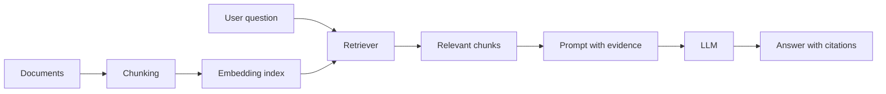

# RAG-1：RAG 基础认知：从“问答”到“检索增强生成”

## 学习目标

本阶段的目标不是马上接 AWS，而是先建立 RAG 的工程直觉：为什么企业文档问答不能只靠大模型记忆，为什么检索可以降低幻觉，为什么“能回答”不等于“可信地回答”。

完成后你应该能用自己的话解释：

- 闭卷生成和开卷生成的差异。
- RAG 如何把外部知识接入模型上下文。
- grounding、retrieval、citation 分别解决什么问题。
- RAG 适合哪些场景，不适合哪些场景。

## 核心理论

### 闭卷生成 vs 开卷生成

纯 LLM 问答可以理解为“闭卷考试”：模型只能依赖训练时学到的参数记忆和当前 prompt。它擅长通用知识、语言组织和推理，但对企业内部文档、最新政策、私有流程、实时数据天然不可靠。

RAG 是“开卷考试”：模型先从外部知识库检索相关材料，再基于这些材料生成回答。它不要求模型记住所有知识，而是把模型变成一个会阅读、归纳和表达的生成层。

### 幻觉来源

RAG 不是魔法，它只是减少某些类型的幻觉。常见幻觉来源包括：

- **知识缺失**：模型没有相关事实，只能猜。
- **知识过期**：模型知道的是旧版本。
- **上下文不足**：prompt 没提供足够证据。
- **检索错误**：RAG 找错了材料，模型基于错误上下文生成。
- **生成过度自信**：模型没有学会在证据不足时拒答。

所以 RAG 的质量不只取决于模型，还取决于文档质量、切分方式、检索策略、prompt 约束和评估体系。

### Grounding

Grounding 是让回答“扎根”到可验证证据里。一个 grounded answer 应该满足：

- 回答中的关键事实可以在检索材料里找到。
- 没有证据的内容不会被编造。
- 用户可以追溯答案来自哪些文档或片段。

Citation 是 grounding 的外显形式，但有引用不代表一定 grounded。引用必须真的支持答案。

## 关键概念

- **Query**：用户提出的问题。
- **Corpus**：可检索的文档集合。
- **Chunk**：文档切分后的片段，是检索的基本单位。
- **Embedding**：把文本映射成向量表示，用于语义检索。
- **Retriever**：根据 query 找相关 chunk 的组件。
- **Generator**：基于检索结果生成自然语言回答的模型。
- **Citation**：回答中指向来源文档或 chunk 的引用。
- **No-answer**：当知识库没有依据时，系统应该明确拒答或说明无法判断。

## 工程取舍

RAG 的核心取舍不是“要不要用大模型”，而是“知识应该存在哪里、如何被取出、如何被验证”。

- 如果知识稳定、通用、低风险，纯 LLM 可能足够。
- 如果知识私有、频繁变化、需要引用，RAG 更合适。
- 如果问题需要结构化精确查询，SQL/搜索系统可能比 RAG 更可靠。
- 如果答案必须百分百准确，RAG 仍需要人工审核或规则系统兜底。

## RAG 原理图

## 动手实验

准备 3 到 5 段你熟悉的短文档，例如公司制度、产品说明或课程笔记。针对同一组问题做两轮回答：

1. **纯 LLM 回答**：只把问题发给模型，不提供资料。
2. **RAG 思路回答**：先手动找出相关段落，再要求模型只根据段落回答。

记录对比：

- 哪些问题纯 LLM 会猜。
- 哪些问题有资料后更准确。
- 哪些问题即使有资料也答不好。
- 哪些回答需要明确说“不知道”。

## 验收标准

- 能解释 RAG 的五步链路：query、retrieve、augment、generate、cite。
- 能说出至少 3 种 RAG 失败模式。
- 能判断一个业务问题是否适合用 RAG。
- 完成一份纯 LLM vs RAG 的对比表。

## 阶段产物

- RAG 原理图。
- “什么时候需要 RAG”判断清单。
- 纯 LLM 与 RAG 对比实验记录。

## 复盘问题

- 如果检索结果错了，模型会发生什么？
- 如果知识库没有答案，系统应该如何回应？
- Citation 为什么不能自动代表答案可信？
- 哪些业务场景更适合数据库查询，而不是 RAG？
