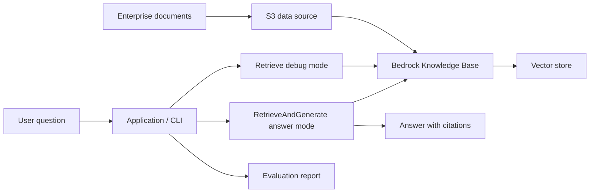

# RAG-9：综合项目：AWS 企业文档问答系统

## 学习目标

本阶段目标是把前 8 个阶段的理论和实验整合成一个可展示项目：AWS 企业文档问答系统。它不只是能回答问题，还要能展示架构、引用来源、质量评估、工程取舍和生产化思考。

完成后你应该拥有：

- 一个可运行或可演示的文档问答 Demo。
- 一份清晰 README，别人能理解系统如何工作。
- 一套测试问题集和质量评估结果。
- 一份架构取舍说明，解释托管方案和自定义方案的边界。

## 核心理论

### 架构决策

综合项目的重点不是堆功能，而是做出清楚的架构选择。你需要回答：

- 为什么选择 Bedrock Knowledge Bases 作为主线？
- 哪些能力交给托管服务？
- 哪些能力需要自己实现或补充？
- 什么情况下会切换到自定义 RAG pipeline？

一个可展示的项目应该让人看到你不仅会用服务，还理解服务背后的工程边界。

### 托管服务 vs 自建 Pipeline

Bedrock Knowledge Bases 适合作为第一版项目主线，因为它能快速完成 ingestion、embedding、向量存储集成、检索和生成。自定义 pipeline 适合作为对照，用来展示你理解解析、切分、检索和 prompt 的底层机制。

推荐项目结构：

- **主路径**：Bedrock Knowledge Bases 托管 RAG。
- **对照路径**：自定义最小 RAG pipeline。
- **评估路径**：同一问题集下比较检索、回答和 citation。

### 质量、成本、复杂度权衡

最终项目要明确说明：

- 更高 top-k 是否真的提升答案质量。
- rerank 或 hybrid search 是否值得增加成本。
- 哪些问题必须拒答。
- 哪些日志和指标用于监控质量。
- 哪些权限边界必须上线前完成。

## 关键概念

- **Capstone Project**：把理论、实验和工程产物整合成一个完整项目。
- **Managed RAG**：以 Bedrock Knowledge Bases 为主的托管式 RAG。
- **Custom Pipeline**：自定义解析、切分、检索和生成链路。
- **Evaluation Set**：用于稳定评估系统质量的测试问题集。
- **Architecture Decision**：解释为什么选择某种服务或实现方式。
- **Production Checklist**：上线前必须检查的权限、成本、监控和安全事项。

## 工程取舍

- Bedrock Knowledge Bases 适合作为主路径，因为它能快速形成稳定 Demo。
- 自定义 pipeline 适合作为对照路径，用来展示底层理解和扩展能力。
- CLI 或脚本比完整前端更适合作为第一版，因为重点是 RAG 能力和可复现性。
- 测试集和评估报告比单次演示更重要，因为它们能证明系统质量不是偶然的。

## 推荐系统能力

- 文档上传或导入到 S3。
- Knowledge Base ingestion。
- 用户提问。
- Retrieve 调试模式，展示命中 chunk。
- RetrieveAndGenerate 问答模式，展示答案和 citation。
- 测试问题批量评估。
- 无答案和低置信度兜底。
- 基础成本、权限和监控设计说明。

## 项目架构

## 动手实验

1. 准备 10 到 30 份示例企业文档，覆盖制度、产品、流程、FAQ、表格或版本说明。
2. 上传文档到 S3，并整理 prefix 和 metadata。
3. 创建 Bedrock Knowledge Base 并完成 ingestion。
4. 编写一个简单 CLI 或脚本，支持提问、展示答案、打印 citation。
5. 增加 Retrieve 调试模式，用于查看命中 chunk。
6. 准备至少 30 个测试问题，覆盖精确事实、跨文档、无答案和误导性问题。
7. 记录评估结果，区分检索错误、生成错误、引用错误和拒答错误。
8. 实现或保留一个自定义最小 RAG pipeline 作为对照。
9. 编写最终 README，展示架构、运行方式、评估结果和工程取舍。

## 验收标准

- 陌生人只看 README 能理解项目目标、架构和运行方式。
- Demo 能基于文档回答问题，并返回 citation。
- Retrieve 调试模式能展示检索命中的 chunk。
- 至少 30 个测试问题有评估记录。
- README 中说明托管 Knowledge Base 与自定义 pipeline 的差异。
- README 中包含权限、成本、监控、安全的生产化 checklist。

## 阶段产物

- 项目 README。
- 架构图。
- Demo 脚本或 CLI。
- 测试问题集。
- 质量评估表。
- 托管方案 vs 自定义方案对比。
- 生产化 checklist。

## 复盘问题

- 这个系统最容易失败的环节是什么？
- 如果用户质疑答案，citation 能否帮助解释？
- 如果文档规模扩大 100 倍，架构哪里需要调整？
- 哪些能力必须补齐后才能给真实用户使用？
- 你会如何向非技术用户解释这个系统的可靠性边界？
