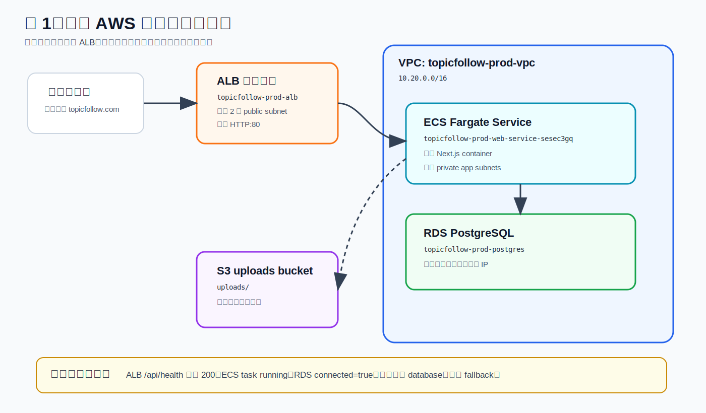
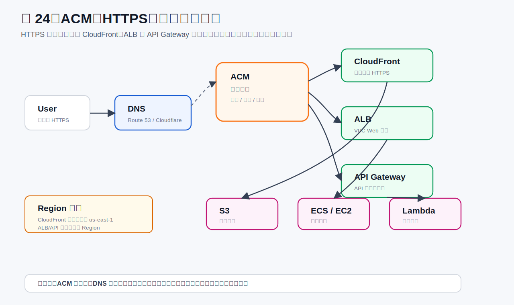
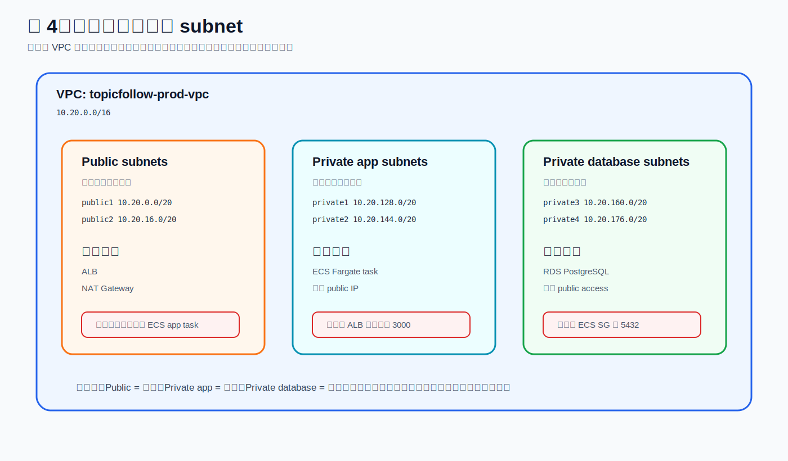
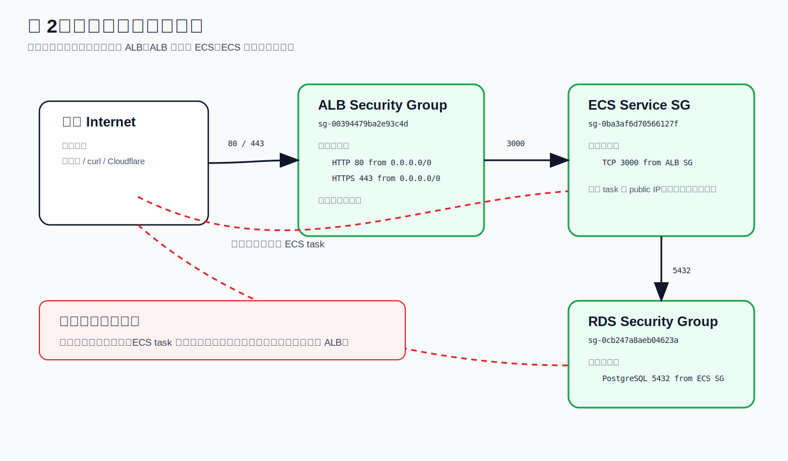
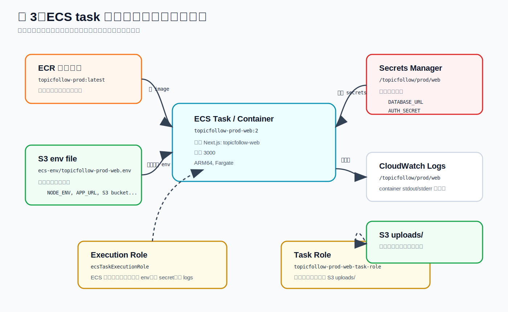
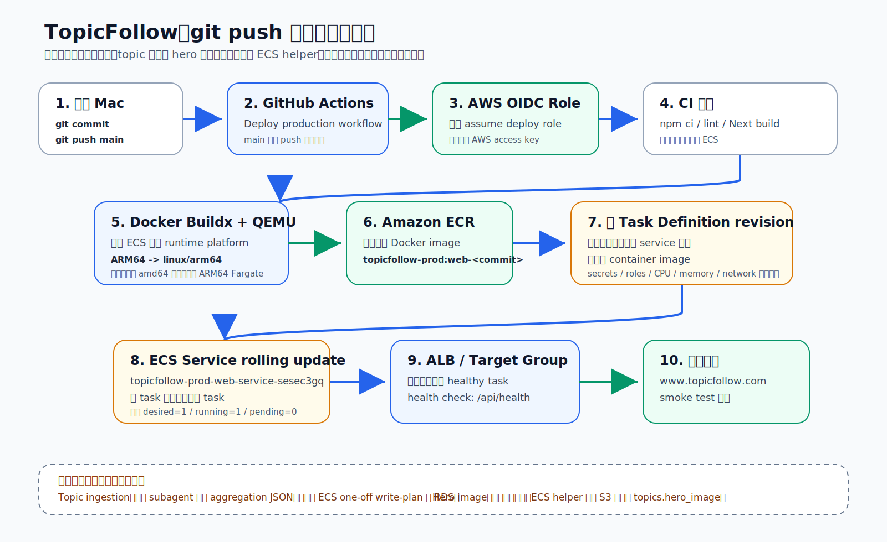
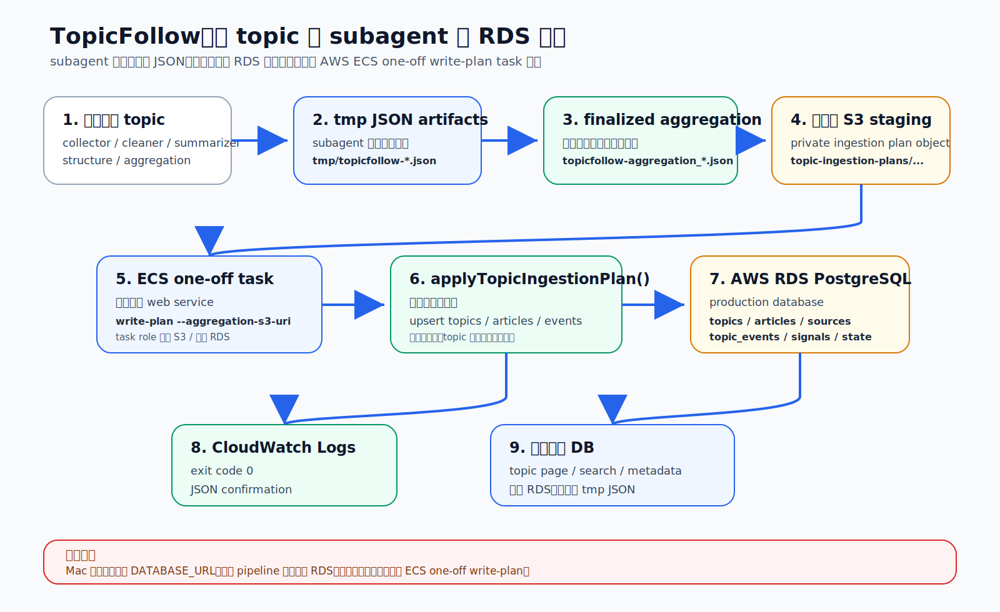
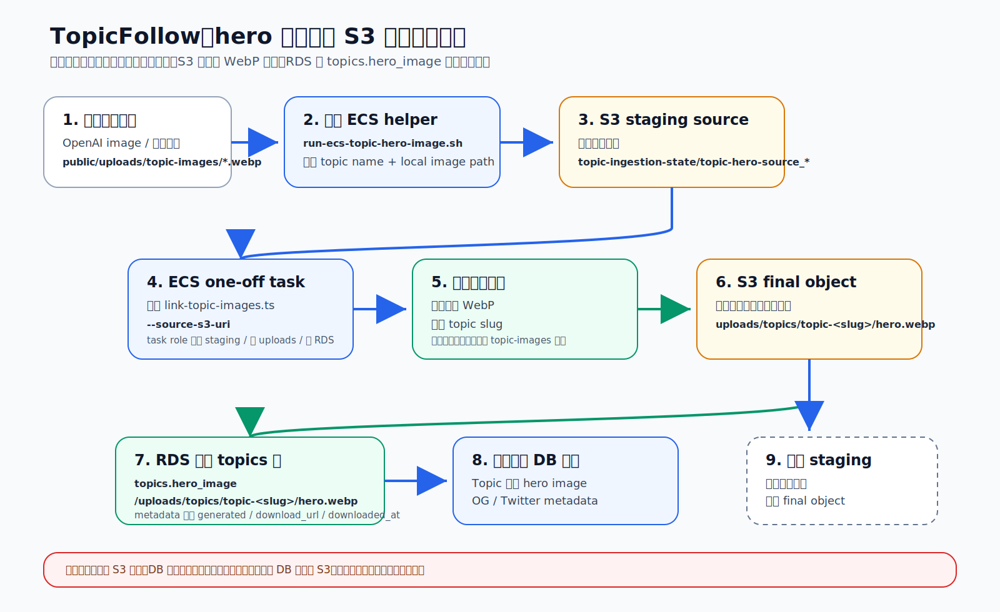

# TopicFollow AWS 生产架构

这篇只讲 TopicFollow 当前真实生产环境。它不是通用 AWS 服务大全，而是回答：用户访问网站、代码上线、新 topic 写库、hero 图片上传时，AWS 里到底发生了什么。

当前结论：

- 网站运行在 `AWS ECS Fargate`。
- 入口是 `Cloudflare Proxy -> AWS ALB -> ECS Task`。
- 业务数据在 `RDS PostgreSQL`。
- 上传文件和 hero 图片在 `S3 uploads bucket`。
- 普通代码上线走 `GitHub Actions -> ECR -> ECS Service`。
- topic 写库和 hero 图片更新走单独的 `ECS one-off task`，不跟随普通 `git push` 自动执行。
- 旧 Hetzner 服务器、SSH 上传、sudo/chmod、本地服务器 uploads 目录不再是生产链路。

## 一、用户访问网站这条线



真实请求路径：

```text
Browser
  -> Cloudflare DNS / Proxy
  -> AWS ALB 443 listener
  -> Target Group
  -> ECS Fargate Task
  -> RDS PostgreSQL / S3 uploads
```

核心分工：

| 组件 | 负责什么 | 不负责什么 |
| --- | --- | --- |
| Cloudflare | 域名 DNS、橙云代理、边缘 HTTPS、面向公网用户 | 不运行 Next.js，不保存 RDS 数据 |
| ALB | AWS 里的 HTTP/HTTPS 入口，把请求转给健康的 ECS task | 不运行应用代码，不保存图片 |
| Target Group | ALB 认识后端 task 的名单和健康检查规则 | 不是服务本身 |
| ECS Service | 长期维持指定数量的 ECS task，滚动替换新版本 | 不保存代码镜像 |
| ECS Task | 真正运行 Next.js container | 不直接暴露给公网 |
| RDS PostgreSQL | 保存 topic、article、event、source、search state 等关系数据 | 不保存图片二进制 |
| S3 uploads bucket | 保存上传文件、topic hero 图片、临时 ingestion artifacts | 不决定数据库里用哪张图 |

记忆句：公网只先进 Cloudflare 和 ALB；真正的应用和数据库都在 AWS 私有网络后面。

## 二、Cloudflare、ACM、ALB HTTPS 这条线



当前链路是：

```text
Browser -> Cloudflare -> AWS ALB -> ECS
```

这里有两段 HTTPS：

| 段落 | 谁提供证书 | 谁验证证书 |
| --- | --- | --- |
| Browser -> Cloudflare | Cloudflare 边缘证书 | 用户浏览器 |
| Cloudflare -> AWS ALB | AWS ACM 证书挂在 ALB 443 listener 上 | Cloudflare Full strict |

ACM 的角色：

- `ACM` 是 AWS 的证书管家，不是服务器，也不转发网站流量。
- ACM 通过 Cloudflare DNS 里的验证 CNAME 证明你控制 `topicfollow.com` 和 `www.topicfollow.com`。
- `_dd0e...`、`_ef69...` 这类 ACM 验证 CNAME 必须保持 `DNS only`，不要删，也不要开橙云。
- `topicfollow.com` 和 `www` 的访问 CNAME 可以保持 Cloudflare `Proxied`。
- ECS / Next.js 应用代码不需要自己处理 HTTPS 证书。

当前不需要 Route 53 或 CloudFront 才能让网站工作。Route 53 是 AWS DNS，CloudFront 是 AWS CDN；你的当前生产入口主要是 Cloudflare 和 ALB。

## 三、网络、子网和安全组



子网的用途：

| 子网类型 | 放什么 | 为什么 |
| --- | --- | --- |
| Public subnet | ALB | ALB 要接收公网入口流量 |
| Private app subnet | ECS Fargate task | 应用不直接暴露公网，只接 ALB 转发 |
| Private database subnet | RDS PostgreSQL | 数据库不应该有公网入口 |



安全组的核心规则：

```text
Internet / Cloudflare
  -> ALB Security Group: TCP 80/443
  -> ECS Service Security Group: TCP 3000 only from ALB SG
  -> RDS Security Group: TCP 5432 only from ECS SG
```

容易混的点：

- `Subnet` 是 IP 地址空间和路由位置，不是防火墙。
- `Security Group` 是实例/服务网卡级别的防火墙，管端口和来源。
- `Route Table` 决定路怎么走，`Security Group` 决定门能不能进。
- 公网不能直接连 ECS task，也不能直接连 RDS。

## 四、ECS task 启动时拿什么配置



ECS task 启动时会组合几类东西：

| 来源 | 放什么 | 谁使用 |
| --- | --- | --- |
| ECR | Docker image | ECS 平台拉镜像运行 container |
| Task Definition | CPU、内存、端口、container command、log config、role | ECS 平台 |
| S3 env file | 非敏感环境变量，例如 app URL、bucket 名 | ECS 注入到 container |
| Secrets Manager | `DATABASE_URL` 等敏感变量 | ECS 注入到 container |
| Task Role | 应用代码访问 S3、Secrets 等 AWS 资源的临时权限 | Next.js / helper 脚本 |
| CloudWatch Logs | container stdout/stderr | 运维排错 |

关键边界：

- `Task Definition` 是运行说明书，不是正在运行的容器。
- `Task` 才是运行中的 container 实例。
- `Service` 负责长期维持 task 数量和滚动更新。
- 本机 `.env` 不应该保存生产 `DATABASE_URL`。

## 五、代码上线这条线



代码上线流程：

```text
local git push main
  -> GitHub Actions
  -> AWS OIDC temporary deploy role
  -> npm lint / build
  -> Docker Buildx + QEMU
  -> push web-<commit> image to ECR
  -> register new ECS task definition revision
  -> update ECS service
  -> ALB target group health check
  -> www.topicfollow.com
```

这条线只负责网站代码上线：

- 它会替换 ECS task 使用的 container image。
- 它不会自动生成 topic。
- 它不会自动执行 `write-plan`。
- 它不会自动上传 hero 图片。
- 它不会把本机 JSON 写入生产 RDS。

部署后最小验证：

```text
https://www.topicfollow.com/api/health
```

应确认：

- HTTP 返回 `200`。
- health response 里 `database.connected=true`。
- ECS service running task count 正常。
- ALB target group targets healthy。

## 六、topic 内容写库这条线



topic pipeline 流程：

```text
collector / cleaner / summarizer / structure / aggregation
  -> tmp/topicfollow-*.json
  -> finalized aggregation JSON
  -> private S3 topic-ingestion-plans/
  -> ECS one-off task
  -> npm run topic:orchestrator -- write-plan
  -> applyTopicIngestionPlan()
  -> RDS PostgreSQL
```

关键理解：

- subagent 阶段只写本地 JSON artifact。
- `tmp/topicfollow-aggregation_*.json` 是“写库计划”，不是数据库本身。
- 真正写生产库的是 ECS one-off task 里的 `write-plan`。
- 生产写库使用 ECS task role 和 Secrets Manager 里的生产 `DATABASE_URL`。
- Mac 本机不放生产数据库连接，避免误写。

生产写库通常使用 helper：

```bash
bash scripts/prepare-topic-pipeline.sh full "<topic>" --mode auto
bash scripts/run-ecs-write-plan.sh "<topic>" "tmp/topicfollow-aggregation_<querySlug>.json"
```

写入 RDS 的主要表：

- `topics`
- `articles`
- `sources`
- `topic_events`
- `event_signals`
- `article_topics`
- `topic_search_state`
- `topic_research_state`

## 七、hero 图片这条线



hero 图片流程：

```text
local generated WebP
  -> run-ecs-topic-hero-image.sh
  -> S3 staging object
  -> ECS one-off task
  -> optimize / normalize WebP
  -> S3 final object
  -> update RDS topics.hero_image and metadata
  -> topic page / OG metadata use new image
  -> cleanup staging object
```

最终公开路径固定为：

```text
/uploads/topics/topic-<topic-slug>/hero.webp
```

真实 S3 object key 是：

```text
uploads/topics/topic-<topic-slug>/hero.webp
```

关键理解：

- 图片二进制在 S3。
- 图片路径在 RDS 的 `topics.hero_image`。
- 只上传 S3 不够，DB 不更新时网站不知道用哪张图。
- 只更新 DB 不够，S3 没有对象时页面会引用不存在的文件。
- 生产流程不再使用 SSH、sudo、chmod 或服务器本地 uploads 目录。

生产 hero 图片通常使用 helper：

```bash
bash scripts/prepare-topic-hero-image.sh "<topic>"
bash scripts/run-ecs-topic-hero-image.sh "<topic>" "public/uploads/topic-images/<topic-slug>.webp"
```

## 八、当前已经不在生产链路里的东西

| 旧东西 | 当前状态 |
| --- | --- |
| Hetzner app/server files | 不再承载 TopicFollow 生产网站 |
| Hetzner PostgreSQL | 不再作为 TopicFollow 生产数据库 |
| SSH 上传图片到服务器目录 | 已被 S3 + ECS helper 取代 |
| sudo/chmod/chown 修 uploads 目录 | 已被 S3 backend 取代 |
| 本机生产 `DATABASE_URL` | 不应配置 |
| Route 53 | 当前不是必需入口 |
| CloudFront | 当前不是必需入口 |

记忆句：现在 TopicFollow 的生产事实是 AWS ECS / RDS / S3，入口由 Cloudflare 和 ALB 串起来；写库和图片更新都通过 ECS one-off helper 执行。
